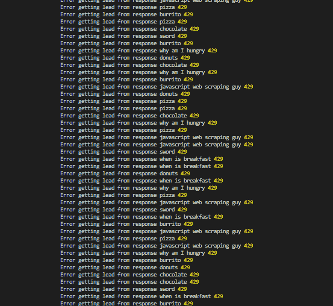
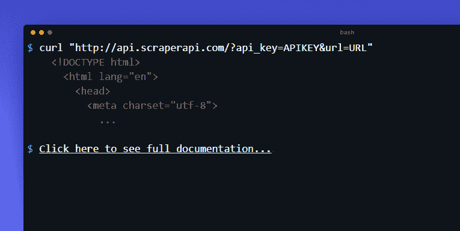
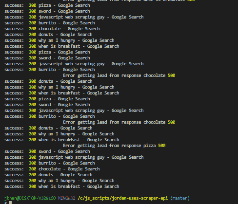
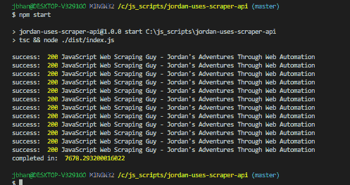
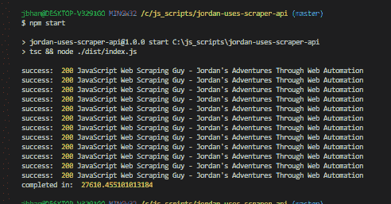
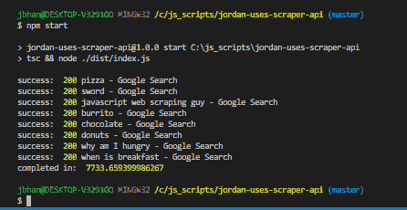

# 乔丹用的是刮刀

> 原文:[https://dev.to/aarmora/jordan-uses-scraperapi-4gnn](https://dev.to/aarmora/jordan-uses-scraperapi-4gnn)

*披露:我确实收到了每个使用我在这里提供的链接为 Scraper Api 付费的人的会员佣金。使用此促销代码还可享受 10%的折扣——刮 187707*

当我第一次开始网络抓取的时候，我记得我预计访问世界上的互联网会有很多困难。我记得一个客户让我抓取谷歌搜索结果，当我看到这违反了他们的服务条款时，我以为他们会采取严厉措施来阻止。我以为那些激烈的措施会是完全封锁我的 IP 地址。我特别记得我在想，如果我的 IP 地址被谷歌服务完全屏蔽，我的安卓手机将如何工作。

然后，当我进入抓取亚马逊时，我期待类似的事情。我甚至记得在[的一篇帖子](https://javascriptwebscrapingguy.com/jordan-mass-scrapes-amazon-for-potential-products-part-1-of-2/)中提到，我曾和妻子聊过，主要是开玩笑，关于被完全禁止使用亚马逊服务会是什么样子。

## [](#the-reality)现实

[T2】](https://i.giphy.com/media/l0MYMe3UJsn1zCIMg/giphy.gif)

现实是，没人想拦你。你是他们的顾客。开始阻止他们的客户是一件糟糕的事情。他们首先使用许多其他技术，比如 recaptchas 和超时请求。

有时这些事情会阻止你获得你想要的数据。谷歌在做这些事情上相当勤奋，所以我去故意触发他们的速率限制。见下文。

[](https://res.cloudinary.com/practicaldev/image/fetch/s--dfuCVzX2--/c_limit%2Cf_auto%2Cfl_progressive%2Cq_auto%2Cw_880/https://javascriptwebscrapingguy.com/wp-content/uploads/2019/09/image-1.png) 

<figcaption>429 状态意味着过多的请求。</figcaption>

## [](#scraper-api)刮刀 Api

[T2】](https://res.cloudinary.com/practicaldev/image/fetch/s--7kj2CpVk--/c_limit%2Cf_auto%2Cfl_progressive%2Cq_auto%2Cw_880/https://javascriptwebscrapingguy.com/wp-content/uploads/2019/09/image-8.png)

这里是 [Scraper Api](https://www.scraperapi.com/?fp_ref=javascriptwebscrapingguy) 发挥作用的地方。Scraper Api 是一个非常非常好的工具，可以为你处理所有的代理甚至验证码。它非常容易使用。你所要做的就是使用他们提供的 api 键和 url，并把你想要访问的 url 传递给它。然后它做剩下的。我使用了下面的请求，就在我得到 429 的上面的请求之后。你可以看到几乎所有的反应都是在事后 200 秒。

[](https://res.cloudinary.com/practicaldev/image/fetch/s--h7T0rn_J--/c_limit%2Cf_auto%2Cfl_progressive%2Cq_auto%2Cw_880/https://javascriptwebscrapingguy.com/wp-content/uploads/2019/09/image-2.png) 

<figcaption>好多了
</figcaption>

## [](#speed-test)速度测试

[](https://i.giphy.com/media/vxDbIL03WXg6f7tu0j/giphy.gif) 

<figcaption>这难道不是一张工整的 gif 吗？
</figcaption>

任何时候你在使用代理的时候，你都会遇到速度问题，使用 Scraper Api 也不例外。以下是使用和不使用 Scraper Api 的一些结果:

[](https://res.cloudinary.com/practicaldev/image/fetch/s--sL4j0dYR--/c_limit%2Cf_auto%2Cfl_progressive%2Cq_auto%2Cw_880/https://javascriptwebscrapingguy.com/wp-content/uploads/2019/09/image-3.png) 

<figcaption>无刮刀 Api</figcaption>

[](https://res.cloudinary.com/practicaldev/image/fetch/s--pabc9lQg--/c_limit%2Cf_auto%2Cfl_progressive%2Cq_auto%2Cw_880/https://javascriptwebscrapingguy.com/wp-content/uploads/2019/09/image-4.png) 

<figcaption>带刮刀 Api</figcaption>

[](https://res.cloudinary.com/practicaldev/image/fetch/s--8lw2RW-1--/c_limit%2Cf_auto%2Cfl_progressive%2Cq_auto%2Cw_880/https://javascriptwebscrapingguy.com/wp-content/uploads/2019/09/image-5.png) 

<figcaption>谷歌无刮刀 Api</figcaption>

[](https://res.cloudinary.com/practicaldev/image/fetch/s--pb5UQ45e--/c_limit%2Cf_auto%2Cfl_progressive%2Cq_auto%2Cw_880/https://javascriptwebscrapingguy.com/wp-content/uploads/2019/09/image-6.png) 

<figcaption>谷歌与刮刀 Api</figcaption>

正如你所看到的，当点击这个网站时，它比使用 Scraper Api 时要长四倍。谷歌要糟糕得多。我认为这主要是因为 Scraper Api 旋转代理大约 60 秒。因此，如果它遇到问题，它将开始轮换代理，直到成功。这意味着这些错误花费了整整 60 秒。哎哟。好消息是，Scraper Api 不会为任何失败的尝试买单。

## [](#using-scraper-api-in-practice)实践中使用 Scraper Api

[T2】](https://i.giphy.com/media/rNBOrAP6n3fe8/giphy.gif)

由于显著的速度冲击，我不得不推荐使用 Scraper Api，排在传统方法之后。这里有一个我认为好的代码如何与 Scraper Api 一起工作的例子:

```
const terms = [
    'pizza',
    'sword',
    'javascript web scraping guy',
    'burrito',
    'chocolate',
    'donuts',
    'why am I hungry',
    'when is breakfast'
];

// Scraper Api limits how many concurrent requests we have at once
const agent = new Agent({
    maxSockets: 25
});

scrape('pizza', agent);

function scrape(term: string, agent: Agent) {
    const url = `https://google.com/search?q=${term}`;
    const scraperApiUrl = `http://api.scraperapi.com?api_key=${process.env.apiKey}&url=`

    axios.get(url).then((response) => {
        const html = response.data.content ? response.data.content : response.data;
        const $ = cheerio.load(html);
        const title = $('title').text();
        console.log('Success: ', response ? response.status : 'no status', title);
    }, (error) => {
        if (error.response) {
            console.log(' Error getting response', term, error.response ? error.response.status : 'no response');
            if (error.response && error.response.status === 404) {
                return `404 for ${url}`;
            }
        }
        else if (error.request) {
            console.log(' Error getting request', term, error.request.message);
        }
        else {
            console.log(' Some other error', error.message);
        }

        // Use Scraper Api with maxSockets
        axios({
            url: scraperApiUrl + url,
            method: 'GET',
            httpAgent: agent,
            httpsAgent: agent
        }).then((response) => {
            const html = response.data.content ? response.data.content : response.data;
            const $ = cheerio.load(html);
            const title = $('title').text();
            console.log('Success: ', response ? response.status : 'no status', title);
        }, (error) => {
            console.log(`Failed getting ${url} with Scraper Api`, error);
        });
    });

} 
```

这里的主要要点是，如果发生错误，我们检查它是否是 404。404 更像是一个故意的错误，意味着这个页面实际上并不存在。为此我们不需要 Scraper Api。

如果不是 404，那么我们继续用 Scraper Api 再次尝试请求。 **Scraper Api 确实限制了一次允许并发请求的数量**。这就是代理的用武之地。在顶部，你可以看到我用有限数量的`maxSockets`创建了一个`new Agent`。 [Node.js 文档](https://nodejs.org/api/http.html#http_agent_maxsockets)声明这“决定了代理可以在每个原点打开多少个并发套接字”因此，您可以在这里管理您的并发请求，并防止 Scraper Api 在并发请求方面出现任何问题。

## [](#the-end)结束

所以，你有它。 [Scraper Api](https://www.scraperapi.com/?fp_ref=javascriptwebscrapingguy) 是你的刮削工具箱中一款功能强大、极其易用的工具。使用此促销代码可享受九折优惠-

scrap 187707。他们还有 1000 个免费 api 调用！

## [](#looking-for-business-leads)寻找商业线索？

使用在 javascriptwebscrapingguy.com 这里谈到的技术，我们已经能够推出一种获得令人敬畏的商业线索的方法。在[了解更多钴情报](https://cobaltintelligence.com)！