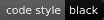

# 黑色 Python Python 代码格式使用黑色

> 原文：<https://dev.to/notsag/python-code-formatting-using-black-2fe1>

# 什么是黑色

官方的 Python 风格指南是 [PEP8](https://www.python.org/dev/peps/pep-0008/) 。根据 PEP8 的说法，像 [pycodestyle](https://github.com/PyCQA/pycodestyle) 或 [flake8](http://flake8.pycqa.org/en/latest/) 这样的 Linters 可以显示你的代码是否格式良好。

问题是这些工具只**报告问题**并让开发人员去解决它们！另一方面，[黑色](https://github.com/psf/black)不仅会报告错误，而且**会做出必要的改变**让你更有效率。

引用项目自述文件:

> Black 是不折不扣的 Python 代码格式化程序。通过使用它，您同意放弃对手写格式的细节的控制。作为回报，黑色给了你速度、确定性和摆脱 pycodestyle 对格式的困扰。你将节省时间和精力去做更重要的事情。

# 安装并使用黑色

Black 需要 Python 3.6.0+并使用 pip:
安装

```
pip install black 
```

<svg width="20px" height="20px" viewBox="0 0 24 24" class="highlight-action crayons-icon highlight-action--fullscreen-on"><title>Enter fullscreen mode</title></svg> <svg width="20px" height="20px" viewBox="0 0 24 24" class="highlight-action crayons-icon highlight-action--fullscreen-off"><title>Exit fullscreen mode</title></svg>

黑色没有被设计成高度可配置的，因此它很简单:

```
black <file or directory> 
```

<svg width="20px" height="20px" viewBox="0 0 24 24" class="highlight-action crayons-icon highlight-action--fullscreen-on"><title>Enter fullscreen mode</title></svg> <svg width="20px" height="20px" viewBox="0 0 24 24" class="highlight-action crayons-icon highlight-action--fullscreen-off"><title>Exit fullscreen mode</title></svg>

这将使用 PEP8 的子集 [Black codestyle](https://black.readthedocs.io/en/stable/the_black_code_style.html) 重新格式化您的代码(除了默认的行长度:Black 是 88，PEP8 是 79，如果对您有关系，请使用`black -l 79`)。

例如如果你写下下面夸张的`test.py` :

```
def add(
        a,  
        b   
    ):  
    return a+b 

def concatenate(
        s1, 
        s2  
    ):                                                                                                     
    return '{}+{}'.format(
        s1, 
        s2  
    )   

if __name__ == '__main__':
    print(
        add(
            2,  
            3   
            )   
    )   
    print(
        concatenate(
            'two',
            'three'
        )   
    ) 
```

<svg width="20px" height="20px" viewBox="0 0 24 24" class="highlight-action crayons-icon highlight-action--fullscreen-on"><title>Enter fullscreen mode</title></svg> <svg width="20px" height="20px" viewBox="0 0 24 24" class="highlight-action crayons-icon highlight-action--fullscreen-off"><title>Exit fullscreen mode</title></svg>

您可以使用`black test.py`将`test.py`更改为:

```
def add(a, b):
    return a + b

def concatenate(s1, s2):
    return "{}+{}".format(s1, s2)

if __name__ == "__main__":
    print(add(2, 3))
    print(concatenate("two", "three")) 
```

<svg width="20px" height="20px" viewBox="0 0 24 24" class="highlight-action crayons-icon highlight-action--fullscreen-on"><title>Enter fullscreen mode</title></svg> <svg width="20px" height="20px" viewBox="0 0 24 24" class="highlight-action crayons-icon highlight-action--fullscreen-off"><title>Exit fullscreen mode</title></svg>

# 编辑整合

黑色可用于许多编辑器，如 Vim、Emacs、VSCode、Atom...有一些有用的功能，如保存时运行黑色。

查看文档中支持的编辑器的完整列表以及如何配置。

# 版本控制集成

`black`命令也可以用作过磅器。在有多个参与者的共享存储库中，确保代码质量和一致性是很有用的。

使用
检查代码格式

```
black --check . 
```

<svg width="20px" height="20px" viewBox="0 0 24 24" class="highlight-action crayons-icon highlight-action--fullscreen-on"><title>Enter fullscreen mode</title></svg> <svg width="20px" height="20px" viewBox="0 0 24 24" class="highlight-action crayons-icon highlight-action--fullscreen-off"><title>Exit fullscreen mode</title></svg>

您也可以使用`--diff`选项:
来显示需要做什么

```
black --check --diff . 
```

<svg width="20px" height="20px" viewBox="0 0 24 24" class="highlight-action crayons-icon highlight-action--fullscreen-on"><title>Enter fullscreen mode</title></svg> <svg width="20px" height="20px" viewBox="0 0 24 24" class="highlight-action crayons-icon highlight-action--fullscreen-off"><title>Exit fullscreen mode</title></svg>

现在，您只需要将它作为一个步骤添加到您的 CI 配置中(就像您使用 flake8 一样)。

您还可以添加一个预提交挂钩，以确保您的提交不包含未格式化的代码:

*   安装预提交:

```
pip install pre-commit 
```

<svg width="20px" height="20px" viewBox="0 0 24 24" class="highlight-action crayons-icon highlight-action--fullscreen-on"><title>Enter fullscreen mode</title></svg> <svg width="20px" height="20px" viewBox="0 0 24 24" class="highlight-action crayons-icon highlight-action--fullscreen-off"><title>Exit fullscreen mode</title></svg>

*   将`.pre-commit-config.yaml`添加到您的项目中:

```
repos:
- repo: https://github.com/psf/black
  rev: stable
  hooks:
  - id: black
    language_version: python3.6 
```

<svg width="20px" height="20px" viewBox="0 0 24 24" class="highlight-action crayons-icon highlight-action--fullscreen-on"><title>Enter fullscreen mode</title></svg> <svg width="20px" height="20px" viewBox="0 0 24 24" class="highlight-action crayons-icon highlight-action--fullscreen-off"><title>Exit fullscreen mode</title></svg>

*   安装挂钩:

```
pre-commit install 
```

<svg width="20px" height="20px" viewBox="0 0 24 24" class="highlight-action crayons-icon highlight-action--fullscreen-on"><title>Enter fullscreen mode</title></svg> <svg width="20px" height="20px" viewBox="0 0 24 24" class="highlight-action crayons-icon highlight-action--fullscreen-off"><title>Exit fullscreen mode</title></svg>

现在，如果你试图提交一个错误格式的文件，你会得到一个错误:

```
git commit -m "test"                        
black....................................................................Failed
hookid: black

Files were modified by this hook. Additional output:

reformatted test.py

1 file reformatted. 
```

<svg width="20px" height="20px" viewBox="0 0 24 24" class="highlight-action crayons-icon highlight-action--fullscreen-on"><title>Enter fullscreen mode</title></svg> <svg width="20px" height="20px" viewBox="0 0 24 24" class="highlight-action crayons-icon highlight-action--fullscreen-off"><title>Exit fullscreen mode</title></svg>

# 宣扬黑色

如果你喜欢黑色，只需花几秒钟[在 github](https://github.com/psf/black) 上启动项目。

你也可以通过在你的 README.md:
[](https://github.com/psf/black) 
中添加徽章来表明你在你的项目中使用了 Black codestyle

```
[](https://github.com/psf/black) 
```

<svg width="20px" height="20px" viewBox="0 0 24 24" class="highlight-action crayons-icon highlight-action--fullscreen-on"><title>Enter fullscreen mode</title></svg> <svg width="20px" height="20px" viewBox="0 0 24 24" class="highlight-action crayons-icon highlight-action--fullscreen-off"><title>Exit fullscreen mode</title></svg>