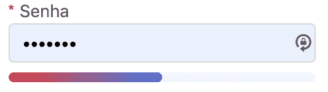

# [类型和技巧]自定义所需的 um 输入标签 do formik

> 原文:[https://dev . to/bastiani/types-and-tricks-customizando-um-input-label-required-do-formik-ogf](https://dev.to/bastiani/types-and-tricks-customizando-um-input-label-required-do-formik-ogf)

## [](#como-inserir-um-asterisco-no-label-de-um-custom-input-do-formik)如何在蚂蚁自定义输入标签中插入星号

哦，好吗？Bora 查看如何执行需要星号的批量自定义输入。
[](https://res.cloudinary.com/practicaldev/image/fetch/s--hByW3JId--/c_limit%2Cf_auto%2Cfl_progressive%2Cq_auto%2Cw_880/https://www.rafaelbastiani.com/static/required-label.png)
[【input formk】](https://github.com/Bastiani/churras-trinca-front/blob/master/src/components/Input/InputFormik.tsx)
[标签](https://github.com/Bastiani/churras-trinca-front/blob/master/src/components/Label/Label.tsx)

让我们看看一些代码:

```
const Label = ({ children, labelMsg, labelTop = true, name, formik }: IProps) =>
  labelTop ? (
    <ContentStyled isRequired={formik && isRequiredField(formik, name)}>
      <label htmlFor={name}>
        {labelMsg}
        {children}
      </label>
    </ContentStyled>
  ) : (
    <ContentStyled isRequired={formik && isRequiredField(formik, name)}>
      <LabelStyled label={labelMsg}>{children}</LabelStyled>
    </ContentStyled>
  ); 
```

`labelTop`定义`label`是站在`input`的顶端还是侧面。
现在让我们进入魔术，或者`isRequired`和`isRequiredField` :

```
export const ContentStyled = styled.div`${(props: IProps) => props.isRequired &&`label::before {
display: inline-block;
margin-right: 4px;
color: #f5222d;
font-size: 14px;
font-family: SimSun, sans-serif;
line-height: 1;
content: '\*';
}`}`; 
```

如上面的代码所示，我们有一个带有 props`isRequired`的 styled-component，然后在那里有插入“
”的 css，该星号位于“`label`的一侧。

```
const isRequiredField = ({ validationSchema }: any, name: string) => {
  try {
    const isRequired = validationSchema.fields[name]
      ? !!validationSchema.fields[name].tests.find(
          (test: any) => test.OPTIONS.name === 'required'
        ).OPTIONS.name
      : false;
    return isRequired;
  } catch (event) {
    return false;
  }
}; 
```

所以我们有通过蚁族的“`validationSchema`”来识别‘t0’是否必要的功能。

在此`InputFormik`中，我们仍按图进行密码验证:
[](https://res.cloudinary.com/practicaldev/image/fetch/s--elUCm1Mj--/c_limit%2Cf_auto%2Cfl_progressive%2Cq_auto%2Cw_880/https://www.rafaelbastiani.com/static/password-stronge.png)
[【斯特罗伦级】](https://res.cloudinary.com/practicaldev/image/fetch/s--elUCm1Mj--/c_limit%2Cf_auto%2Cfl_progressive%2Cq_auto%2Cw_880/https://www.rafaelbastiani.com/static/password-stronge.png)