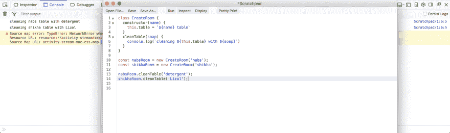
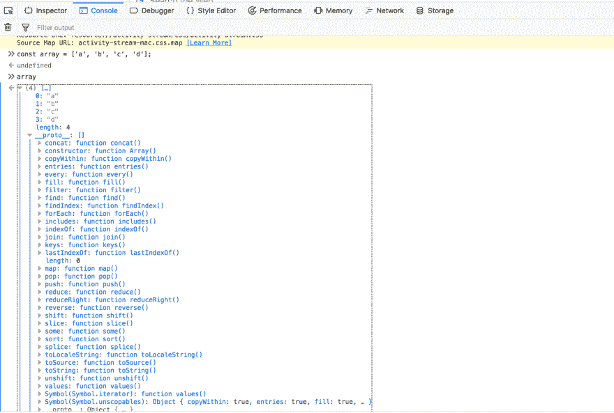
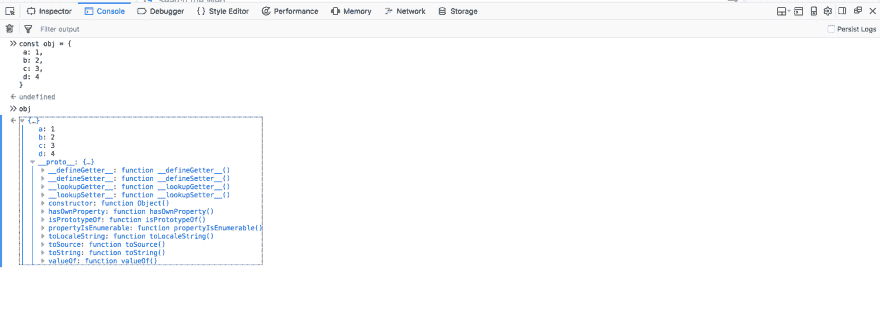
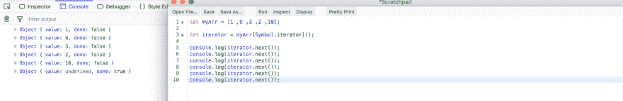
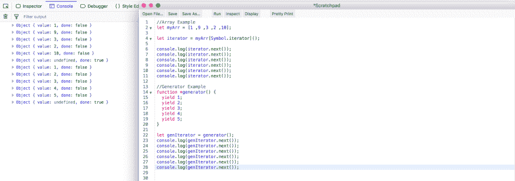
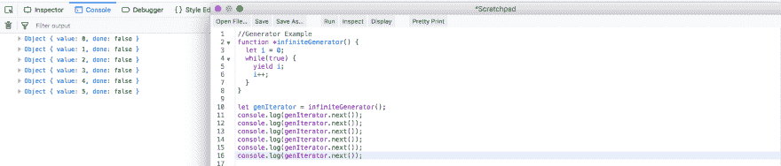

# 面试准备— ES6 问题-2

> 原文:[https://dev . to/nabe NDU 82/interview-preparation-es6-questions-2-3lb 3](https://dev.to/nabendu82/interview-preparation-es6-questions-2-3lb3)

欢迎来到本系列的第 6 部分。我们将在这里继续我们的 ES6 问题。

**问题 34-** *讲解 ES6 中的类？*
**答案-** 构造函数和 ES6 类都是一样的。ES6 类不过是构造函数的合成糖，内部行为完全相同。

考虑下面这个构造函数的例子。

[ ](https://res.cloudinary.com/practicaldev/image/fetch/s--80kZ_zc7--/c_limit%2Cf_auto%2Cfl_progressive%2Cq_auto%2Cw_880/https://cdn-images-1.medium.com/max/4000/1%2A6xlXzb5jsXesKMgOEupF9g.png) *构造函数*

同样可以用 ES6 类用构造函数写，但是完全一样。

[ ](https://res.cloudinary.com/practicaldev/image/fetch/s--zYmHldA---/c_limit%2Cf_auto%2Cfl_progressive%2Cq_auto%2Cw_880/https://cdn-images-1.medium.com/max/4000/1%2ACM20bv8PEa80lxdOMF70WQ.png) *是 6 班*

**问题 35-** *解释 ES6 中的子类和继承？*
**答案-** 子类和继承的概念就像 Java 和 C++等其他语言中的概念一样。

让我们考虑下面的例子。我们有一个父类“哺乳动物”和一个继承它的子类“蝙蝠”。注意，我们使用了“extends”关键字。现在我们使用“super()”方法来使用“Bat”中的“legs”和“name”变量。另外，请注意，我们可以使用 update“walk()”，并添加额外的功能。

```
class Mammal {
  constructor(_legs, _name="Nabendu") {
    this.legs = _legs;
    this.name = _name;    
  }
  walk() {
    return `${this.name} is walking`;
  }
}

class Bat extends Mammal {
    constructor(_legs, _name, _isVegetarian) {
      super(_legs, _name);
      this.isVegetarian = _isVegetarian;
  }
  fly() {
    return `${this.name} is flying`;
  }
  walk() {
    let eatable = this.isVegetarian ? 'carrot' : 'bug';
    return `${super.walk()} with a ${eatable}`;
  }
}

let fruitBat = new Bat(4,'Bond', true);
console.log(fruitBat.walk()); //Bond is walking with a carrot

let meatBat = new Bat(2, undefined, false);
console.log(meatBat.walk()); //Nabendu is walking with a bug 
```

**问题 36-** *解释 JavaScript 中的迭代器？*
**答案-** 最近 JavaScript 在数据类型中引入了**【symbol . iterator】**属性。这表明一个数据结构是否是可迭代的。这包括数组、字符串、映射、集合和节点列表。对象没有**【symbol . iterator】**属性。

如果我们检查一个数组的 ****proto**** ，可以找到**【symbol . iterator】**属性。

[ ](https://res.cloudinary.com/practicaldev/image/fetch/s--NSsEnJl9--/c_limit%2Cf_auto%2Cfl_progressive%2Cq_auto%2Cw_880/https://cdn-images-1.medium.com/max/4000/1%2ABZM2ej_tnboWHRYLkjJ9Vg.png) *可迭代数组*

但是对象却不是这样，因为它是不可迭代的。

[ ](https://res.cloudinary.com/practicaldev/image/fetch/s--47FjIfU---/c_limit%2Cf_auto%2Cfl_progressive%2Cq_auto%2Cw_880/https://cdn-images-1.medium.com/max/4000/1%2ADRcC_-_UnGjFjSk_zzi0tQ.png) *不可重复对象*

现在，**迭代器**是使用“Symbol.iterator”创建的，可以用来迭代所有具有**【symbol . iterator】**属性的数据结构。

让我们考虑下面的例子。这里我们用第 3 行的语法创建一个迭代器。现在我们可以使用“iterator.next()”迭代数组。每次运行都给出一个具有“值”和“完成”的对象，指定是否有元素。注意，在第五次运行后，我们得到的“值”为**未定义的**，而“完成”为**真的**。

[ ](https://res.cloudinary.com/practicaldev/image/fetch/s--fiKdrqeT--/c_limit%2Cf_auto%2Cfl_progressive%2Cq_auto%2Cw_880/https://cdn-images-1.medium.com/max/5760/1%2AKYSoxrDfS4OIWX3XoMuOJQ.png) *迭代器示例*

**问题 37-** *用 JavaScript 解释生成器？*
**答-** 生成器是一种特殊类型的函数，当我们使用迭代器对它进行迭代时，它会生成一些东西。它们不同于 array，因为它们没有预先设置值，而是根据请求生成值。

让我们看看下面的例子。生成器函数具有带“*”的特殊语法。此外，在生成器内部，我们有“yield”语句。每个“next()”都指向下一个 yield 语句。

[ ](https://res.cloudinary.com/practicaldev/image/fetch/s--yRLjNOdH--/c_limit%2Cf_auto%2Cfl_progressive%2Cq_auto%2Cw_880/https://cdn-images-1.medium.com/max/5760/1%2A3xPDe-qK7CZFmzjSviIDlQ.png) *发电机示例*

上面的例子没有显示生成器的任何优点，它和遍历一个数组是一样的。但是让我们看看下一个例子，在生成器中有一个无限的 while 循环。

先看这个正常函数。如果我们运行它，它将导致无限循环，并使您的浏览器崩溃。

```
//Normal Function
function normalInfinite() {
  let i = 0;
  while(true) {   
    console.log(i);
    i++;
  }
}

normalInfinite(); 
```

但是使用 generator 的同类型函数不会产生无限循环。它在每次调用 yield 时暂停，并在每次调用“next()”时生成下一个值“I”。

[ ](https://res.cloudinary.com/practicaldev/image/fetch/s--kpS9TPNR--/c_limit%2Cf_auto%2Cfl_progressive%2Cq_auto%2Cw_880/https://cdn-images-1.medium.com/max/5760/1%2AQnbUYUFGTZhULFBMfv1hVg.png) *发电机的效益*

**问题 38-** *解释 JavaScript 中的 async await？*
**答案-** Async await 基本上都是兜帽下的承诺。但是他们使得承诺的代码更容易实现。如果 promises 简化了回调的代码，那么 async await 简化了 promises 的代码。

让我们首先检查一个嵌套的 promise 示例。这里我们有三个返回承诺的函数- *cleanRoom，removeGarbage 和 winIcecream* 。现在，当 cleanRoom 函数运行并且 resolve 从 promise 返回时，立即。那么块将被运行。在。然后我们返回下一个 removeGarbage 和 in。那我们就把冰淇淋退回去。我们将消息从一个函数传递到另一个函数，所以它将被追加。

```
let cleanRoom = function() {
  return new Promise(function(resolve, reject) {
     resolve('Cleaned the room,');
  });
};

let removeGarbage = function(message) {
  return new Promise(function(resolve, reject) {
    resolve(message + ' removed Garbage,');
  });
};

let winIcecream = function(message) {
  return new Promise(function(resolve, reject) {
    resolve( message + ' won Icecream');
  });
};

cleanRoom().then(function(result){
                     return removeGarbage(result);
                    }).then(function(result){
                     return winIcecream(result);
                    }).then(function(result){
                     console.log(result + ' All Finished');
                    })
//Cleaned the room, removed Garbage, won Icecream All Finished 
```

我们将用 async await 重构代码。这里，不是三个函数，而是一个函数 *cleaningTheRoom* ，它前面有一个关键字“async”。这意味着该函数将有 await 语句。在“await”中，我们可以将承诺返回的值存储在一个变量中。这种类型的代码比 promise 干净得多。

```
const cleaningTheRoom = async() => {
  const cleanRoom = new Promise((resolve, reject) => { resolve('Cleaned the room,');});
  const removeGarbage = new Promise((resolve, reject) => { resolve('removed Garbage,');});
  const winIcecream = new Promise((resolve, reject) => { resolve(' won Icecream');});

  let roomCleaned = await cleanRoom;
  console.log(roomCleaned);

  let garbageRemoved = await removeGarbage;
  console.log(garbageRemoved);

  let icecreamWon = await winIcecream;
  console.log(icecreamWon);

}

cleaningTheRoom().then(() => console.log('All Finished '));

//Cleaned the room, removed Garbage, won Icecream All Finished 
```

同样的可以在 Promise.all 的帮助下进一步减少，只有所有的承诺都解决了才转到下一行。我们在这里也使用了数组析构。

```
const cleaningTheRoom = async() => {
  const cleanRoom = new Promise((resolve, reject) => { resolve('Cleaned the room,');});
  const removeGarbage = new Promise((resolve, reject) => { resolve('removed Garbage,');});
  const winIcecream = new Promise((resolve, reject) => { resolve(' won Icecream');});  

  let [roomCleaned, garbageRemoved, icecreamWon] = await Promise.all([cleanRoom, removeGarbage, winIcecream]);
  console.log(`${roomCleaned} ${garbageRemoved} ${icecreamWon}`)

}

cleaningTheRoom().then(() => console.log(' All Finished '));
//Cleaned the room, removed Garbage, won Icecream All Finished 
```

现在，我们在 async await from promises 中以不同的方式处理错误。请注意，在承诺中我们可以有一个“.catch”块捕获由于拒绝承诺而导致的错误。

在异步等待中，我们将等待包装在 try-catch 块中。

```
const cleaningTheRoom = async() => {
  const cleanRoom = new Promise((resolve, reject) => { reject('Room not cleaned,');});
  const removeGarbage = new Promise((resolve, reject) => { resolve('removed Garbage,');});
  const winIcecream = new Promise((resolve, reject) => { resolve(' won Icecream');});

  try {
      let roomCleaned = await cleanRoom;
      console.log(roomCleaned);

      let garbageRemoved = await removeGarbage;
      console.log(garbageRemoved);

      let icecreamWon = await winIcecream;
      console.log(icecreamWon);

  } catch(e) {
    console.log('Error in a promise ');
  }

}
cleaningTheRoom().then(() => console.log('All Finished '));

//Error in a promise All Finished 
```

本系列的第 6 部分和 ES6 问题到此结束。