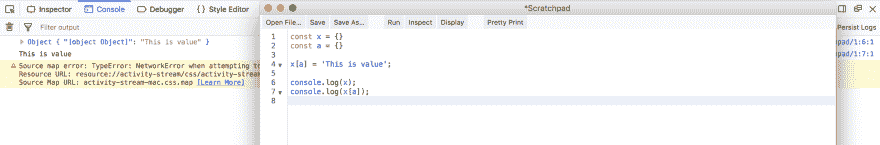
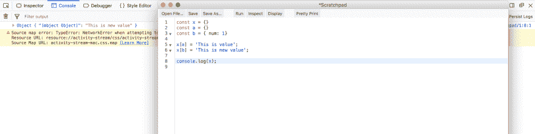
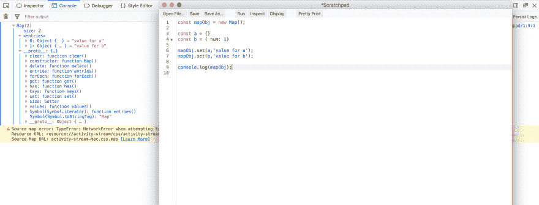
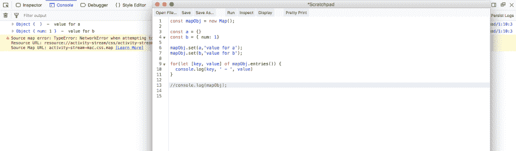
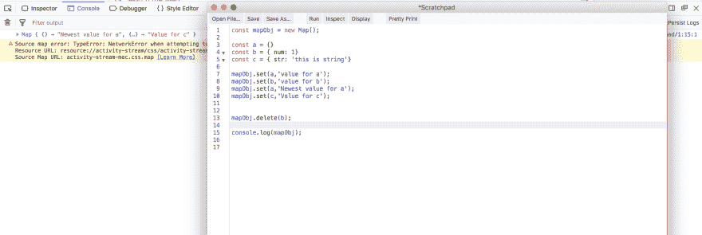
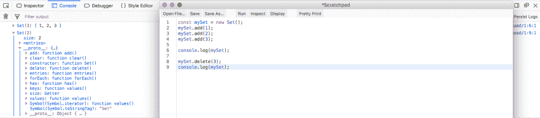
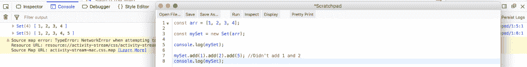
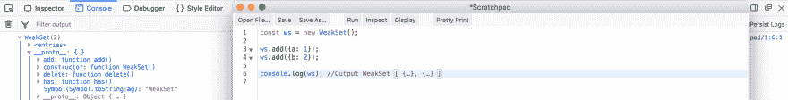
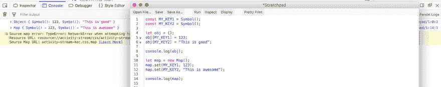

# 面试准备—ES6–1

> 原文:[https://dev.to/nabendu82/interview-preparation-es6-1-1o84](https://dev.to/nabendu82/interview-preparation-es6-1-1o84)

欢迎来到本系列的第 5 部分。我们将开始关于作为 ES6 的一部分发布的新功能的新问题。

**问题 27-** *什么是地图和 WeakMaps？*
**答-** *地图和 WeakMaps* 是 ES6 中引入的数据结构。它们类似于数据结构对象，但是映射的主要特征之一是我们可以将对象作为键。

先说对象的问题。在下面的例子中，我们有一个对象“x”和另一个对象“a”。现在我们使用“a”作为键，并将一个值推送到“x”。现在，如果我们控制台日志“x”，键显示为[object object]，但是我们也可以通过 x[a]提取它的值。

[ ](https://res.cloudinary.com/practicaldev/image/fetch/s--ddZs3rAZ--/c_limit%2Cf_auto%2Cfl_progressive%2Cq_auto%2Cw_880/https://cdn-images-1.medium.com/max/5760/1%2ATFNNHUXz28GE5T-e37wv5A.png) *问题与对象*

但是真正的问题发生在我们把另一个对象加到“x”作为键的时候。它覆盖了先前的对象。这是因为在 JavaScript 中我们只能有一个键作为对象。

[ ](https://res.cloudinary.com/practicaldev/image/fetch/s--8MTZeiZU--/c_limit%2Cf_auto%2Cfl_progressive%2Cq_auto%2Cw_880/https://cdn-images-1.medium.com/max/5760/1%2AXpdX3aumK4H70SeWJeRQDw.png) *实物问题*

现在我们来看看地图是如何帮助我们的。我们用新的关键字创建地图。此外，要添加到地图中，我们需要使用它的方法之一 **set** 。
在下面的例子中，对象“a”和“b”被成功添加为关键字。

> 注意， ****proto**** 对象包含 **Symbol.iterator** ，因此 for..of 循环可以像数组一样在循环中迭代。对于对象来说，情况并非如此。

[ ](https://res.cloudinary.com/practicaldev/image/fetch/s--931ItWak--/c_limit%2Cf_auto%2Cfl_progressive%2Cq_auto%2Cw_880/https://cdn-images-1.medium.com/max/5760/1%2AOWAomrBbjOfvomFVAOisTA.png) *济世地图*

我们使用内置方法条目()迭代 Map。它为 Map 中的每个元素返回一个[key，value]数组。因此，我们将其分解为[键，值]对。

[ ](https://res.cloudinary.com/practicaldev/image/fetch/s--2aMR2T3N--/c_limit%2Cf_auto%2Cfl_progressive%2Cq_auto%2Cw_880/https://cdn-images-1.medium.com/max/5760/1%2AOudmNaaCLLOj1W6_sRWmEg.png) *迭代地图*

如果我们在第 9 行中为“a”添加相同的对象作为 key，那么映射将覆盖 key 的旧值。另外，我们可以通过在 **delete** 方法中传递条目的键来删除条目。

[ ](https://res.cloudinary.com/practicaldev/image/fetch/s--ZN9yOaAN--/c_limit%2Cf_auto%2Cfl_progressive%2Cq_auto%2Cw_880/https://cdn-images-1.medium.com/max/5760/1%2AmlqNJP9_5FdBCkW_0CQu3g.png) *删除与*相同的关键解释

Map 有一个问题，那就是它持有 Map 的键，即使原始键被删除。这就是我们使用 **WeakMap** 的原因。因此，WeakMap 允许垃圾收集器工作，因为它持有对其键的弱引用，但 Maps 不允许垃圾收集器工作。

```
var k1 = {a: 1};
var k2 = {b: 2};

var map = new Map();
var wm = new WeakMap();

map.set(k1, 'k1 value');
wm.set(k2, 'k2 value');

k1 = null;
map.forEach(function (val, key) {
    console.log(key,' - ', val); // Object { a: 1 }  -  k1 value
});

k2 = null;
console.log(wm.get(k2)); // undefined 
```

另一个区别是 WeakMaps 的键只属于 Object 类型。原始数据类型(数字、字符串、布尔、符号)只能在地图中使用。

```
const m = new Map
m.set('a', 'b');

console.log(m); //Output - Map { a → "b" }

const w = new WeakMap;
w.set('a', 'b');

/*
Exception: TypeError: WeakMap key must be an object, got the string "a"
[@Scratchpad](http://twitter.com/Scratchpad)/1:7:1
*/ 
```

**问题 28-** *什么是集合和弱集合？*
**答-** 集合也是引用的数据类型，就像数组一样，但是关键的特点是我们不能保留重复的数据。简而言之，集合只不过是唯一的数组。

让我们考虑下面的例子。创建集合的方法是通过使用“new”关键字的构造函数。我们使用 add 方法向集合中添加值，使用 delete 方法从集合中删除值。

注意，它的 ****proto**** 对象像数组一样有 *Symbol.iterator* ，这意味着它是可迭代的。

[ ](https://res.cloudinary.com/practicaldev/image/fetch/s--wztlsB9h--/c_limit%2Cf_auto%2Cfl_progressive%2Cq_auto%2Cw_880/https://cdn-images-1.medium.com/max/5760/1%2A3aOoZlK1SKQsC9qP36I3tw.png) *设定创作*

还有另一种创建集合的方法。我们可以将一个 iterable like 数组传递给构造函数。另外，我们不能在集合中添加重复值。此外，我们可以在方法链格式中使用 add 向 Set 添加值。所有这些都显示在下面的例子中。

[ ](https://res.cloudinary.com/practicaldev/image/fetch/s--aDkgHpYw--/c_limit%2Cf_auto%2Cfl_progressive%2Cq_auto%2Cw_880/https://cdn-images-1.medium.com/max/5760/1%2AYOdkXu_pLvPO7CIgTCSAmQ.png) *禁止重复*

WeakSets 就像 WeakMaps，其中一个关键特征是我们不能将原始数据类型(数字、字符串、布尔、符号)作为它的项。所以，下面会抛出和报错。

```
const ws = new WeakSet();

ws.add(1);
/*
Exception: TypeError: WeakSet value must be an object, got the number 1
[@Scratchpad](http://twitter.com/Scratchpad)/1:3:1
*/ 
```

因此，我们将向 WeakSet 添加对象。另外，请注意，它的 **proto** 没有很多方法，并且它不是可迭代的。

[ ](https://res.cloudinary.com/practicaldev/image/fetch/s--Q2NXNOtj--/c_limit%2Cf_auto%2Cfl_progressive%2Cq_auto%2Cw_880/https://cdn-images-1.medium.com/max/5760/1%2APgs6B6OqMzC-6sbNAQphFg.png) * WeakSet 添加元素*

**问题 29-***JavaScript 中什么是符号原语类型？*
**答-** 符号是 ES6 中引入的新的原始数据类型。符号是唯一的不可变数据类型。它们是可以用作唯一 id 的令牌。两个符号永远不会相同，即使它们被声明为相同。考虑下面的例子。

```
let symbol1 = Symbol();
let symbol2 = Symbol();
console.log(symbol1 === symbol2); //Output - false 
```

我们也可以在 Symbol 的构造函数中放一些值，这有助于识别它。同样，类型 of 是**符号**

```
let symbol1 = Symbol('Symbol id: 1');

console.log(typeof symbol1); //Output - symbol 
```

我们不能直接将它连接到一个 Sting，它会抛出错误。

```
let symbol1 = Symbol('Symbol id: 1');

console.log('We are concatenating '+ symbol1)
/*
Exception: TypeError: can't convert symbol to string
[@Scratchpad](http://twitter.com/Scratchpad)/1:4:1
*/ 
```

所以，我们要把一个符号转换成如下的字符串。

```
let symbol1 = Symbol('Symbol id: 1');

console.log('We are concatenating - '+ symbol1.toString());
//Output - We are concatenating - Symbol(Symbol id: 1) 
```

符号的一个用例是用作唯一键。我们可以在只允许唯一键的对象和地图中非常有效地使用它们。

[ ](https://res.cloudinary.com/practicaldev/image/fetch/s--wTD_XB9I--/c_limit%2Cf_auto%2Cfl_progressive%2Cq_auto%2Cw_880/https://cdn-images-1.medium.com/max/5760/1%2AqlqHsUvLCzVqPFGogTYIXg.png) *唯一键*

**问题 30-***ES6 中的模板字符串是什么？*
**答案-** 模板字符串是 JavaScript 中编写字符串的新方式，在 ES6 中引入。我们现在可以使用反勾号(``)来编写字符串，它有一种特殊的方法来插入变量。

假设我们想在控制台中显示著名的粘合线。我们声明了一个变量名，并希望在其中显示它。

旧的 JavaScript 方式相当麻烦，我们必须使用许多+运算符来连接字符串，而对于反勾号，我们使用${}来插入变量名。

```
let name = "Bond";

let bondLine = "My name is " + name + ", James " + name;

console.log(bondLine); // My name is Bond, James Bond

let bondLineES6 = `My name is ${name}, James ${name}`;

console.log(bondLineES6); // My name is Bond, James Bond 
```

**问题 31-***ES6 中有哪些默认参数？*
**答-** 缺省参数就是参数，如果我们在函数中不给 argument 传递任何值，就会用到这些参数。

我们将看到在 ES6 之前，如果用户没有为参数提供值，我们将如何处理这种情况。因此，我们在函数“add”内部检查“a”是否有值，或者给它赋值 0。对“b”也是如此

```
var add = function(a, b){
  a = a || 0;
  b = b || 0;
  return a + b;  
}

//Passing no argument
console.log(add()); // 0

//Passing argument 'a'
console.log(add(1)); // 1

//Passing argument 'b'
console.log(add(undefined, 2)); // 2 
```

在 ES6 中，通过更改参数以包含默认值，也可以做到这一点。用 ES6 默认参数重写上述内容。

```
let add = (a=0, b=0) => {
  return a + b;  
}

//Passing no argument
console.log(add()); // 0

//Passing argument 'a'
console.log(add(1)); // 1

//Passing argument 'b'
console.log(add(undefined, 2)); // 2 
```

**问题 32-** *什么是 Spread 算子和 Rest 参数？*
**答案-** 就像加号(+)和减号(-)是运算符一样，spread(…)在 JavaScript 中也是运算符。基本上传播运营商按需传播。

当您使用 Spread 运算符传递参数时，它们被称为 Rest 参数。

考虑以下 **arrFunc** 的例子。我们可以向函数传递任意数量的参数，并使用 **…arr** 来获取它。现在在函数内部， **arr** 被转换成一个 and 数组。这个功能与 **arguments** object 非常相似。
现在看一下 **restFunc** ，这里我们使用 rest 参数来获取剩余的参数。我们可以得到参数 a，b，c，然后剩下的被转换成数组。

```
let arrFunc = (...arr) => {
  console.log(arr);
}

arrFunc(1, 2, 3, 4, 5); 
//Output - [ 1, 2, 3, 4, 5 ]

let restFunc = (a, b, c, ...n) => {
  console.log(`a, b, c are- ${a} ${b} ${c}`);  
  console.log(n);
}

restFunc(1, 2, 3, 4, 5, 9 , 8, 7); 
//Output - a, b, c are- 1 2 3
//[ 4, 5, 9, 8, 7 ] 
```

扩展运算符可以与函数参数分开使用，在数组操作中有一些非常有用用途。它们现在也可以用于对象。

假设我们想要将一个数组复制到另一个数组。现在你可以在问题中看到，当我们将变量 y 赋给 x 时，我们引用了它，对 y 的任何更改都会反映在 x 中。
在第一个解决方案中，我们使用新的 Javascript 方法 Object.assign()将“a”的所有内容复制到一个空数组中，然后将其赋给“b”。
但是更好更简单的解决方案是使用 Spread 操作符，我们将数组“c”展开，并将它的内容放在一个数组中。

```
//Problem
let x = [1, 2, 3, 4];
let y = x;
y.push(5);

console.log(y); // [ 1, 2, 3, 4, 5 ]
console.log(x); // [ 1, 2, 3, 4, 5 ]

//Solution
let a = [1, 2, 3, 4];
let b = Object.assign([], a);
b.push(9);

console.log(a); // [ 1, 2, 3, 4 ]
console.log(b); // [ 1, 2, 3, 4, 9 ]

//Solution with Spread
let c = [1, 2, 3, 4, 10];
let d = [...c];
d.push(13);

console.log(c); // [ 1, 2, 3, 4, 10 ]
console.log(d); // [ 1, 2, 3, 4, 10, 13 ] 
```

Spread 运算符的另一个用途是合并两个或多个数组，如下所示。

```
let x = [1, 2];
let a = [3, 4];
let c = [9, 10];
let d = [...x, ...a, ...c];

console.log(d); // [ 1, 2, 3, 4, 9, 10 ] 
```

另一种用法是，如果我们将一个数组传递给函数的参数或内置函数，它需要参数。考虑下面的例子。

```
let a = [1, 2, 3, 4];

//Passing array as arguments
let arrFunc = (...arr) => {
  console.log(arr);
}

arrFunc(a); //[1, 2, 3, 4]

//Using in inbuild functions
console.log(Math.min(...a)); // 1
console.log(Math.max(...a)); // 4
console.log(Math.hypot(...a)); // 5.477225575051661 
```

我们也可以在对象中使用 Spread 运算符。这实际上是用在反应堆的减速器中。因此，通过它我们可以进行克隆和合并，如下例所示。注意，在 mergedObj foo 中是“baz ”,因为对象不能有重复的键。

```
var obj1 = { foo: 'bar', x: 42 };
var obj2 = { foo: 'baz', y: 13 };

var clonedObj = { ...obj1 };
console.log(clonedObj); // Object { foo: "bar", x: 42 }

var mergedObj = { ...obj1, ...obj2 };
console.log(mergedObj); // Object { foo: "baz", x: 42, y: 13 } 
```

**问题 33-** *解释 ES6 中的解构？*
**答-** 用析构语法，可以从数组和对象中提取小片段。析构语法可用于变量声明或变量赋值。还可以通过使用嵌套析构语法来处理嵌套结构。

**对象析构**
考虑下面的例子。基本上，**你在赋值表达式**的左边使用一个对象字面量来进行对象析构。

```
const developer = {
    firstname: 'Nabendu',
    lastname: 'Biswas',
    country: 'India'
};

// Object Destructuring
const { firstname, lastname, country } = developer;

console.log(firstname, lastname, country); // Nabendu Biswas India 
```

**默认值**
你可以传递默认值给没有传递值的变量。

```
const person = {
    name: 'Nabendu Biswas',
    country: 'India'
};

// Assign default value of 25 to age if undefined
const { name, country, age = 25 } = person;

// Here I am using ES6 template literals
console.log(`I am ${name} from ${country} and I am ${age} years old.`);

// I am Nabendu Biswas from India and I am 25 years old. 
```

**嵌套对象析构**
如果有如下情况的嵌套对象，我们可以通过将它的值添加到另一个对象语法中来析构它

```
const student = {
    name: 'Hriday Biswas',
    age: 5,
    scores: {
        maths: 74,
        english: 63
    }
};

const { name, age, scores: {maths, english} } = student;

console.log(`${name} who is ${age} years old, scored ${maths} in Maths and ${english} in English.`);

// Hriday Biswas who is 5 years old, scored 74 in Maths and 63 in English. 
```

数组析构
它类似于对象析构，但这里你不是给键赋值，而是给任何变量赋值。

```
const rgb = [255, 200, 0];

// Array Destructuring
const [red, green, blue] = rgb;

console.log(`R: ${red}, G: ${green}, B: ${blue}`); 
// R: 255, G: 200, B: 0 
```

**跳过项目**
用逗号(，)省略项目可以跳过项目。

```
//Example 1
const rgb = [200, 255, 100];

// Skip the first two items
// Assign the only third item to the blue variable
const [,, blue] = rgb;

console.log(`Blue: ${blue}`); // Blue: 100

//Example 2
const hex = ['#fff', '#000', '#678'];

// Skip the first and last items
// Assign the only second item to the black variable
const [, black,] = hex;

console.log(`Black: ${black}`); // Black: #000 
```

**展开项目**
我们可以使用展开操作符(…)来捕捉剩余的项目，在此之前，先对一些项目进行析构。考虑下面的例子。

```
const rainbow = ['red', 'orange', 'yellow', 'green', 'blue', 'indigo', 'violet'];

// Assign the third items to yellow
// Assign the remaining items to otherColors variable using the spread operator(...)
const [,, yellow, ...otherColors] = rainbow;

console.log(otherColors); // [ "green", "blue", "indigo", "violet" ] 
```

**析构函数参数**
析构也可以应用在函数参数上，提取值并赋给局部变量。

```
const student1 = {
    name: 'Hriday Biswas',
    age: 5,
    scores: {
        maths: 74,
        english: 63,
        science: 85
    }
};

const student2 = {
    name: 'Ganavi',
    age: 6,
    scores: {
        english: 34,
        science: 54
    }
};

// Destructuring with default value for scores.maths
function displaySummary({name, age, scores: { maths = 10, english, science }}) {
    console.log('Hello, ' + name);
    console.log('Aged, ' + age);  
    console.log('Your Maths score is ' + maths);
    console.log('Your English score is ' + english);
    console.log('Your Science score is ' + science);
}

displaySummary(student1);
displaySummary(student2); 
```

本系列的第 5 部分到此结束。