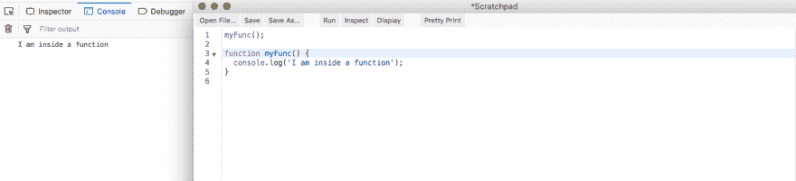
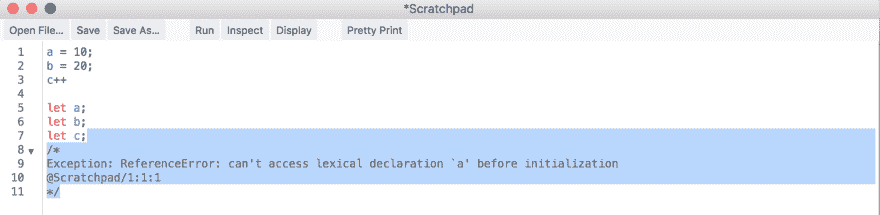
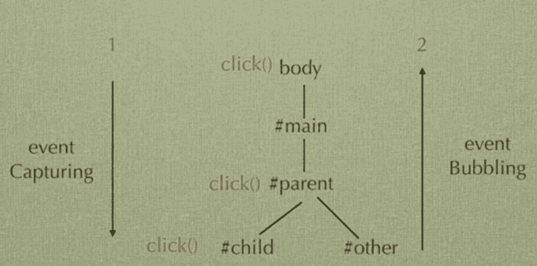
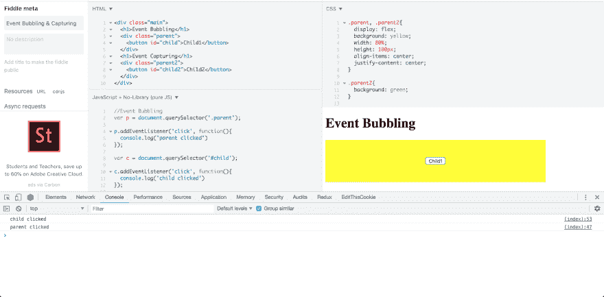
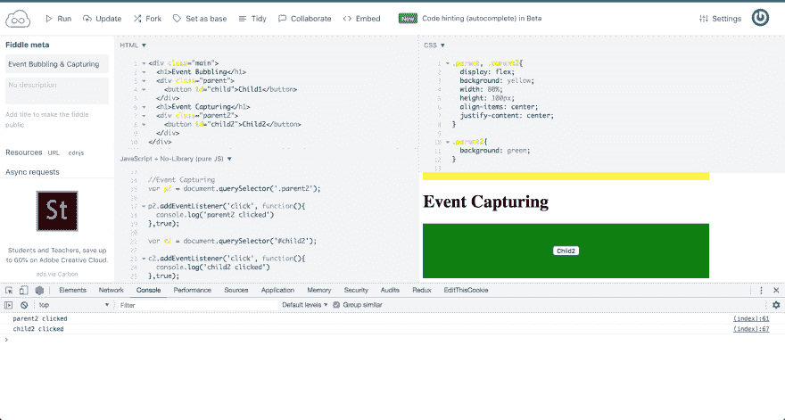
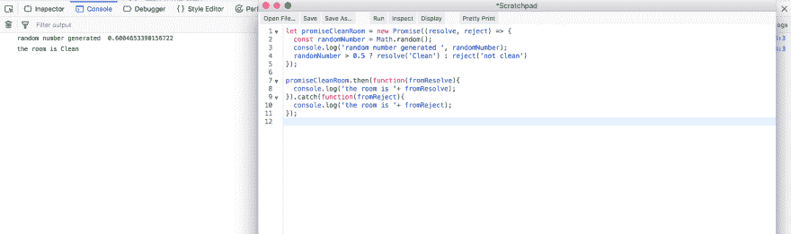
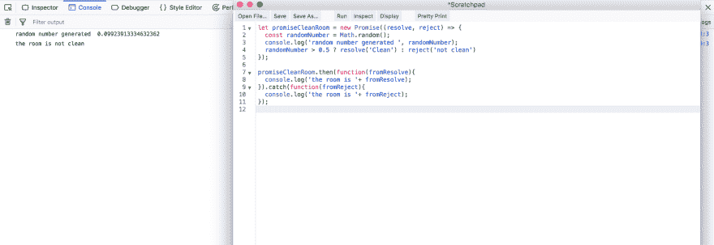

# 面试准备—基础 JavaScript-4

> 原文:[https://dev . to/nabe NDU 82/interview-preparation-basic-JavaScript-4-pm0](https://dev.to/nabendu82/interview-preparation-basic-javascript-4-pm0)

欢迎来到本系列的第 4 部分。让我们从我们离开的地方开始。

**问题 16-** *解释 JavaScript 中的提升概念？*
**答-** 托管意味着我们甚至可以在声明变量之前就使用它。当编译器运行并找到所有的 **var** 声明时，它会将它们移动到文件的顶部。

让我们考虑这个简单的例子。这里我们对 a、b 和 c 进行操作，而没有先声明它们。它们在第 5、6、7 行声明，但是解释器没有抛出运行时错误。因为变量在哪里声明并不重要。当编译器第一次通过时，它们总是被提升到顶部。

[ ](https://res.cloudinary.com/practicaldev/image/fetch/s--TiB91YMS--/c_limit%2Cf_auto%2Cfl_progressive%2Cq_auto%2Cw_880/https://cdn-images-1.medium.com/max/2568/1%2A9E8irSrE3mJMciEjmxFXYA.png) *吊装讲解*

对于*函数声明*也是如此，因为编译器也将函数声明视为变量声明，因为在 JS 中所有函数声明都是对象声明。

[](https://res.cloudinary.com/practicaldev/image/fetch/s--__8u97cD--/c_limit%2Cf_auto%2Cfl_progressive%2Cq_auto%2Cw_880/https://cdn-images-1.medium.com/max/2568/1%2A6caF8sTq_2M3mCtlfe9kXA.png)T3】功能声明

但是对于*函数表达式*来说就不一样了。让我们看看下面的例子。

[](https://res.cloudinary.com/practicaldev/image/fetch/s--0c6895aC--/c_limit%2Cf_auto%2Cfl_progressive%2Cq_auto%2Cw_880/https://cdn-images-1.medium.com/max/2000/1%2A2svjK3_pgjq2SInFIwl-0Q.png)T3】函数表达式

也不能在声明 let 变量之前使用它们。它将给出参考误差。

[ ](https://res.cloudinary.com/practicaldev/image/fetch/s--tThko_yT--/c_limit%2Cf_auto%2Cfl_progressive%2Cq_auto%2Cw_880/https://cdn-images-1.medium.com/max/3776/1%2Ag33HxeiUcvOlLxXym6SzXg.png) *让也给出错误*

**问题 17-***JavaScript 中什么是事件冒泡和捕获？*
**答案-** 事件冒泡是指网页中某个元素上发生事件时，会冒泡到顶部。意思是从父母到父母，一直到身体。

事件捕获是冒泡的反义词，这意味着当你点击父元素时，它会一直到子元素。

请注意，事件冒泡是浏览器的默认行为，必须启用事件捕获。

[ ](https://res.cloudinary.com/practicaldev/image/fetch/s--YoiuN6TX--/c_limit%2Cf_auto%2Cfl_progressive%2Cq_auto%2Cw_880/https://cdn-images-1.medium.com/max/3612/1%2At4u9BblKKAwBctR4jTUfXQ.png) **事件冒泡并捕获**

让我们通过一个例子来看看这两者。这里的同样是[。](http://jsfiddle.net/nabendu/kqhtsp7n/)

我们将首先看到**事件冒泡**。HTML 包含一个父元素，该元素包含一个名为 Child1 的子元素。当我们点击按钮时，首先显示子节点的控制台日志，然后显示父节点。

[ ](https://res.cloudinary.com/practicaldev/image/fetch/s--C2iC4Ezz--/c_limit%2Cf_auto%2Cfl_progressive%2Cq_auto%2Cw_880/https://cdn-images-1.medium.com/max/5760/1%2AIFmAIqQIWXRsAatyaHmitw.png) *事件冒泡*

我们现在将看到**事件捕获**。HTML 包含 parent2 元素，该元素包含名为 Child2 的子元素。当我们点击按钮时，首先显示父节点的控制台日志，然后显示子节点。注意，在 addEventListener 中，我们必须传递 true 值。

[ ](https://res.cloudinary.com/practicaldev/image/fetch/s--7Lq2y3ci--/c_limit%2Cf_auto%2Cfl_progressive%2Cq_auto%2Cw_880/https://cdn-images-1.medium.com/max/5760/1%2AwypO8Gxr0178rWyrEuBpvA.png) *事件捕捉*

**问题 18-** *什么是生活(立即调用函数表达式)？*
**答案-**life 是指同时被定义和调用的函数表达式。

让我们考虑下面的例子。如你所见，生命只不过是一个函数表达式，但它同时被定义和调用。

```
//Function expression
let funcE = function(x) {
  return x + 1;
}

funcE(2); //Outputs - 3

//IIFE
(function(x){
  return x + 1;
})(4);

//Outputs - 5 
```

**问题 19-***JavaScript 中的承诺是什么？*
**答案-**JavaScript 中的承诺就像现实生活中的承诺。你答应做某件事，然后就做了或者没做。在 JavaScript 中，承诺要么发送一个解决方案，要么拒绝。然后捕获承诺，如果发送了 resolve，则执行“Then”中的语句。但是如果 reject 被发送，则执行“catch”中的语句。

考虑下面的例子。在 promiseCleanRoom 中，我们生成一个介于 0 和 1 之间的随机数。如果数字大于 0.5，我们发送一个解决方案，否则我们发送一个拒绝。
视情况而定。然后执行或。执行 catch。

[ ](https://res.cloudinary.com/practicaldev/image/fetch/s--plO8ZLN5--/c_limit%2Cf_auto%2Cfl_progressive%2Cq_auto%2Cw_880/https://cdn-images-1.medium.com/max/5760/1%2AJW3OUbWRqURC2b7ayx1pew.png) *破案*

[ ](https://res.cloudinary.com/practicaldev/image/fetch/s--K4tv6rop--/c_limit%2Cf_auto%2Cfl_progressive%2Cq_auto%2Cw_880/https://cdn-images-1.medium.com/max/5760/1%2AazaldUIQlfo_KpJAkKHWew.png) *拒绝案*

REST 端点中的 API 调用经常使用承诺。像 axios 这样的 Fetch 函数或库返回一个 promise resolve 或 reject，然后我们需要一个。然后和。动作的 catch 块。

**问题 20-** *解释 JavaScript 中的嵌套承诺？*
**答案-** 嵌套承诺是承诺的集合，其中一个承诺的结果我们称之为另一个承诺。then 语句。这在实际应用中非常有用，从一个 API 端点获取的结果会导致将数据发送到另一个端点。
嵌套承诺也可以用回调函数来完成，但是代码很快就变得复杂了。

让我们看一个嵌套承诺的例子。这里我们有三个返回承诺的函数- *cleanRoom，removeGarbage 和 winIcecream* 。现在只有洁净室根据随机数返回 resolve()或 reject()。为了简单起见，另外两个函数只返回 resolve()。

现在，当 cleanRoom 函数运行并返回 resolve()时，立即执行。那么块将被运行，否则我们将转到。接住滑轮。在。然后我们返回下一个 removeGarbage 和 in。那我们就把冰淇淋退回去。我们将消息从一个函数传递到另一个函数，所以它将被追加。

```
let cleanRoom = function() {
  return new Promise(function(resolve, reject) {
    const randomNumber = Math.random();
    console.log('random number generated ', randomNumber);
    randomNumber > 0.5 ? resolve('Cleaned the room,') : reject('Too lazy to clean')

});
};

let removeGarbage = function(message) {
  return new Promise(function(resolve, reject) {
    resolve(message + ' removed Garbage,');
  });
};

let winIcecream = function(message) {
  return new Promise(function(resolve, reject) {
    resolve( message + ' won Icecream');
  });
};

cleanRoom().then(function(result){
 return removeGarbage(result);
}).then(function(result){
 return winIcecream(result);
}).then(function(result){
 console.log('All Finished - ' + result);
}).catch(function(res){
  console.log('Nothing Done, you are ' + res);
}) 
```

在运行代码并得到一个解决方案时，因为我们的随机数大于 0.5，所以我们得到下面的输出。

```
random number generated  0.5762584054959189
All Finished - Cleaned the room, removed Garbage, won Icecream 
```

在运行代码并得到一个拒绝，因为我们随机数小于 0.5，我们得到低于输出。

```
random number generated  0.16816251264259796 
Nothing Done, you are Too lazy to clean 
```

**问题 21-** *解释 JavaScript 中的回调函数？*
**答-** 在 JavaScript 中，你可以将函数传递给其他函数，也可以作为参数，以后再执行。这些被称为回调函数。

让我们看看下面的例子。这里我们用函数 x 作为参数调用函数 y，然后从函数 y 内部，在一些控制台日志之后调用它。

```
let x = function() {
  console.log('I am called from inside a function');
}

let y = function(callBack) {
  console.log('I am main function');
  callBack();
}

y(x);
//Output -
//I am main function
//I am called from inside a function 
```

当我们在函数中使用匿名函数调用回调函数时，如下面的代码所示。

```
//Callback as anonymous function
let calc = function(num1, num2, callback) {
  return callback(num1, num2);
}

console.log(calc(4, 2, function(a, b){
  return a - b;
}));
//Output - 2 
```

这种类型的代码实际上用于 JavaScript 中的 map、reduce 和 filter 的实现。

**问题 22-** *用普通 JavaScript 实现你版本的数组方法 forEach，map 和 filter？*
**答-** 我们可以通过回调来实现数组方法，这就是它在 JavaScript 引擎中的实现方式。

我们通过将回调附加到原型上来实现我们的版本，每个 JS 函数都可以使用这个回调。这里“this”等于数组。因此，我们使用传统的 for 循环对其进行迭代，并在每次迭代中调用回调函数。

```
Array.prototype.myEach = function(callback) {
    for (var i = 0; i < this.length; i++)
        callback(this[i], i, this);
};

//tests
var arr = ['Software Dev', 'Web Dev', 'FrontEnd Dev', 'BackEnd Dev'];

arr.myEach(function(word) {
    console.log(word);
});

//Output-
//Software Dev 
//Web Dev 
//FrontEnd Dev 
//BackEnd Dev 
```

我们正在实现 map，通过在我们的函数中创建一个空数组，然后在迭代中推送它。从 push 内部我们调用回调函数，所以当我们调用回调函数时，我们可以使用 Math.sqrt 之类的东西来更改单个项目。

```
Array.prototype.myMap = function(callback) {
    arr = [];
    for (var i = 0; i < this.length; i++)
        arr.push(callback(this[i], i, this));
    return arr;
};

//tests
var arrs = ['Software Dev', 'Web Dev', 'FrontEnd Dev'];
var numbers2 = [1, 4, 9];

var goodT = arrs.myMap(function(n) {
    return n;
});

var squareRoot = numbers2.myMap(function(num) {
    return Math.sqrt(num);
});

console.log(goodT); // [ 'Software Dev', 'Web Dev', 'FrontEnd Dev' ]
console.log(squareRoot); // [ 1, 2, 3 ] 
```

**filter**
我们也在实现 map，通过与 forEach 和 filter 相同的过程。但是正如我们所知，filter 遍历数组，并根据布尔表达式给出元素的子集。
在这里，当我们遍历数组并在 if 语句中调用回调函数时，根据它的传递情况将其推送到数组中。

```
Array.prototype.myFilter = function(callback) {
    arr = [];
    for (var i = 0; i < this.length; i++) {      
        if (callback(this[i], i, this))
          arr.push(this[i]);       
    }
    return arr;
};

//tests
var numbers = [1, 20, 30, 80, 2, 9, 3];
var newNum = numbers.myFilter(function(n) {
    return n <= 10;
});
console.log(newNum); // [ 1, 2, 9, 3 ] 
```

**问题 23-** *在香草 JavaScript 中实现你的数组方法版本一些，every 和 reduce？*
**答-** 我们将以实现 forEach、map 和 filter 的相同方式实现*some、every 和 reduce *。

如果数组的任何元素满足我们测试的条件，数组原型方法 some 返回 true。这里也像 filter 一样，我们将在每次迭代的 if 语句中检查回调。这将测试我们的条件，即使其中一个通过，我们也返回 true 并退出循环。如果迭代完成，这意味着没有一个元素满足条件，我们返回 false。

```
Array.prototype.mySome = function(callback) {
    for (var i = 0; i < this.length; i++) {
        if (callback(this[i], i, this))
            return true;
    }
    return false;
};

//tests
var passed = [12, 5, 8, 130, 44].mySome(function(element) {
    return (element >= 200);
});
console.log('some: ' + passed); //some: false

var passed = [12, 5, 8, 130, 44].mySome(function(element) {
    return (element >= 100);
});
console.log('some: ' + passed); //some: true 
```

**每一个**
都是一些的对立面。只有当每个元素都通过测试时，方法“every”才会返回 true。这里我们在 if 语句中做了一个小把戏。我们检查测试的反面，所以如果元素应该大于 10，我们检查小于 10。如果是这样，我们返回 false。如果我们遍历整个循环，意味着所有元素都满足条件，所以我们返回 true。

```
Array.prototype.myEvery = function(callback) {
    for (var i = 0; i < this.length; i++) {
        if (!callback(this[i], i, this))
            return false;
    }
    return true;
};

//tests
var passed = [12, 5, 8, 130, 44].myEvery(function(element) {
    return (element >= 10);
});
console.log(passed); // false
passed = [12, 54, 18, 130, 44].myEvery(function(element) {
    return (element >= 10);
});
console.log(passed); // true 
```

**reduce**
reduce 方法被认为是数组原型方法中最难掌握的。这是因为它的概念非常不同。它获取整个数组并遍历它，然后返回一个值。对一个数组的所有元素做加/乘/减是有用的，但比这更强大。为此，它有一个累加器，用于保存每次运行的数字。这个累加器将用迭代的当前值来操作。
现在，在我们的实现中，我们首先检查是否提供了累加器，否则将其设为未定义。现在，在循环内部，我们通过使用回调来更新累加器变量。

```
Array.prototype.myReduce = function(callback, initialVal) {
    var accumulator = (initialVal === undefined) ? undefined : initialVal;
    for (var i = 0; i < this.length; i++) {
        if (accumulator !== undefined)
            accumulator = callback.call(undefined, accumulator, this[i], i, this);
        else
            accumulator = this[i];
    }
    return accumulator;
};

//tests
var numbers3 = [20, 20, 2, 3];
var total = numbers3.myReduce(function(acc, curr) {
    return acc + curr;
}, 10);
console.log(total); // 55

total = numbers3.myReduce(function(acc, curr) {
    return acc + curr;
});
console.log(total); // 45

let obj = [{x: 1}, {x:2}, {x:3}];
let objTotal = obj.myReduce(function(acc, curr) {
    return acc + curr.x;
},0);
console.log(objTotal); //6 
```

**问题 24-** *用 currying 在 vanilla JavaScript 中实现 multiply(2)(3)(4)(10)？*
**答案-** 以哈斯凯尔·布鲁克斯·加里命名，Curry 是将一个函数分解成一系列带单个自变量的函数的过程。

这里有一个简单的例子，写一个简单的乘法函数，然后用 currying 函数。

```
//Normal multiply function
function mult(a, b, c, d) {
  return a * b * c * d;
}

//Currying multiply function
function multiply(a) {
  return (b) => {
    return (c) => {
      return (d) => {
        return a * b * c * d;
      }
    }
  }
}

console.log(mult(2, 3, 4 , 6));  //144
console.log(**multiply(2)(3)(4)(10)**); //240 
```

由于闭包，Currying 在 JavaScript 中工作。

**问题 25-** *解释 JavaScript 中的递归？*
**答案-** 递归简单来说就是函数调用自身。

让我们考虑下面这个简单的例子，把一系列数字相加。它将添加任何数字，直到 0。假设我们通过 3，那么 3+2+1 = 6。

```
function add(n) {
  if(n<=0)
    return 0;
  else
    return n + add(n-1);
}

console.log(add(3)); //6 
```

递归函数有两部分。一个是**终止条件**，另一个是**递归**本身。上例中 *If(n≤0)* 是终止条件*返回 n+add(n-1)；*是递归。终止条件非常重要，否则递归永远不会停止并进入无限循环。

递归的工作方式如下。它的工作方式类似于 loop，所以第一个调用会转到递归部分，给出“3 + add(2)”。现在将调用 add(2)，并将其扩展为“2 + add(1)”。
之后会调用 add(1)并展开成“1 + add(0)”。最后，add(0)将触发终止条件* If(n≤0)*，并产生 0。在这之后，所有的数都将被加上 3 + 2 + 1 + 0，得到 6。

```
add(3) => 3 + add(2)
          3 + 2 + add(1)
          3 + 2 + 1 + add(0)
          3 + 2 + 1 + 0 
          6 
```

**问题 26-** *解释 JavaScript 中的高阶函数？*
**答案-** 一个*高阶函数*是以一个或多个函数为自变量的函数。我们在 JavaScript 的很多地方使用它们，并且主要用作回调函数。

考虑一下这个简单的 JS 代码，它向一个按钮添加了一个事件监听器。这里，我们有一个回调函数 **proveIt** 。

```
<button id="clicker">So Clickable</button>

var proveIt = function() {
  alert("you triggered " + this.id);
};

document.getElementById("clicker").addEventListener("click", proveIt); 
```

这些回调通常被内联定义为匿名函数。所以，重构后的代码如下。

```
<button id="clicker">So Clickable</button>

document.getElementById("clicker").addEventListener("click", function() {
  alert("you triggered " + this.id);
}); 
```

数组方法 map()、filter()、reduce()、forEach()也是高阶函数。

```
const people = [
 { name: ‘John Doe’, age: 16 },
 { name: ‘Thomas Calls’, age: 19 },
 { name: ‘Liam Smith’, age: 20 },
 { name: ‘Jessy Pinkman’, age: 18 },
];

const peopleAbove18 = people.filter(person => person.age>=18); 
```

基本 JavaScript 面试问题的第 4 部分到此结束。这是基础 JavaScript 的最后一部分。