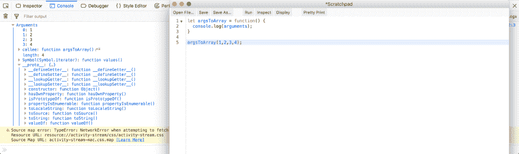
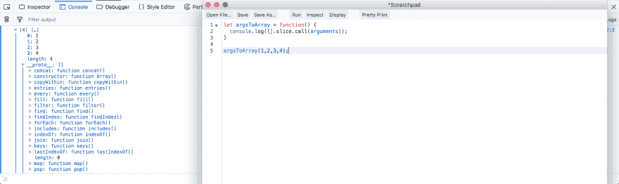
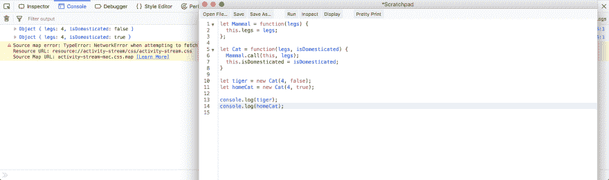
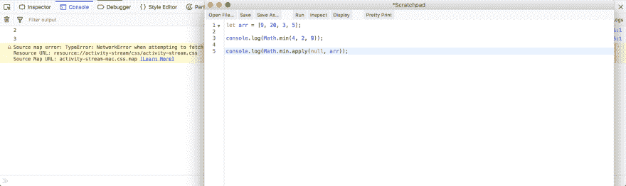

# 面试准备—基础 JavaScript-3

> 原文:[https://dev . to/nabe NDU 82/interview-preparation-basic-JavaScript-3-2370](https://dev.to/nabendu82/interview-preparation-basic-javascript-3-2370)

欢迎来到本系列的第 3 部分。让我们从我们离开的地方开始。

**问题 12-** *调用、绑定、应用有什么区别？*
**回答-** 调用、绑定、应用用于调用函数，带一些对象。你可以认为他们做了如下的事情。

[ ](https://res.cloudinary.com/practicaldev/image/fetch/s--P-PGG3gA--/c_limit%2Cf_auto%2Cfl_progressive%2Cq_auto%2Cw_880/https://cdn-images-1.medium.com/max/2820/1%2AmyxF889wodiwW4IGwlGMpA.png) *调用、绑定、应用*

### [](#call)谓

假设我们有一个名为 **obj** 的对象。它只有一个名为 **num** 的属性，其值为 3。让我们也做一个名为 **addNumbers** 的函数。

```
let obj = {num: 3};
let addNumbers = function(a, b, c){
  console.log(this);
  return this.num + a + b + c;
}; 
```

现在，在 **addNumbers** 中，我们有 this.num .但是我们如何将值 obj.num 传递给它呢？我们需要给它传递一个上下文，也就是“这个”的值。我们将通过传递第一个参数作为 obj 来实现我的**调用方法**，所以“this”现在是 obj。

[ ](https://res.cloudinary.com/practicaldev/image/fetch/s--v8WwCrsB--/c_limit%2Cf_auto%2Cfl_progressive%2Cq_auto%2Cw_880/https://cdn-images-1.medium.com/max/3200/1%2A7BYGsC-Zs5_7D_QPn4Y6YQ.png) *谓解释*

### [](#apply)适用

它完全类似于 call，但唯一的区别是我们可以将 array 作为第二个参数传递。我们也将使用相同的应用代码。

```
let obj = {num: 3};
let addNumbers = function(a, b, c){
  console.log(this);
  return this.num + a + b + c;
}; 
```

但是现在我们有了一个数组，作为第二个参数传递。

[ ](https://res.cloudinary.com/practicaldev/image/fetch/s--S9bpsv8r--/c_limit%2Cf_auto%2Cfl_progressive%2Cq_auto%2Cw_880/https://cdn-images-1.medium.com/max/3200/1%2AyY063Cwsj0GFYZFxZzf7xw.png) *适用解释*

### [](#bind)绑定

绑定的工作方式与调用和应用稍有不同。它通过返回函数的副本来工作。因此，我们将使用相同的代码。

```
let obj = {num: 3};
let addNumbers = function(a, b, c){
  console.log(this);
  return this.num + a + b + c;
}; 
```

我们将在 **bindFunc** 中获取返回的函数，然后在下一行执行它。

[ ](https://res.cloudinary.com/practicaldev/image/fetch/s--_Lbv6MqA--/c_limit%2Cf_auto%2Cfl_progressive%2Cq_auto%2Cw_880/https://cdn-images-1.medium.com/max/3200/1%2ADs82F6hGoLWbrawtPozE9A.png) *捆绑解释*

**问题 13-** *讲一些调用、绑定、应用的实际应用？*
**答案-** 我们可以用**调用**把一个数组像 object 一样变成 array。这通常是必需的，因为数组有许多方法，如 map、reduce、filter，这是操纵数据所必需的。例如将**参数的**数组像对象一样转换成数组。

考虑下面的例子，其中我们控制台日志参数。如果我们在开发控制台中展开它，它会显示其 not 和 array，并且它的 ****proto**** 没有 array 功能。

[ ](https://res.cloudinary.com/practicaldev/image/fetch/s--i9r71TvV--/c_limit%2Cf_auto%2Cfl_progressive%2Cq_auto%2Cw_880/https://cdn-images-1.medium.com/max/5760/1%2AYd2uLTnBxVoR-yV5h0Ri4w.png) *论据对象*

现在要转换它，我们将采用一个空数组，并使用它的切片方法。然后通过 call 调用它，通过传递参数对象。现在它被转换成数组， ****proto**** 拥有所有数组功能。

[ ](https://res.cloudinary.com/practicaldev/image/fetch/s--P1lz_Udd--/c_limit%2Cf_auto%2Cfl_progressive%2Cq_auto%2Cw_880/https://cdn-images-1.medium.com/max/5760/1%2A1akr5aWwZU4vw6DWaFxCEQ.png) *将自变量对象转换为数组*

**调用**的第二个应用是在继承中，使用构造函数。使用 ES6 类，我们可以在子类中使用 super()，但是使用传统的继承是做不到的。

考虑下面的例子。这里在 Cat 函数中，我们用 Cat 的“this”调用它的父哺乳动物。

[](https://res.cloudinary.com/practicaldev/image/fetch/s--o21m86W_--/c_limit%2Cf_auto%2Cfl_progressive%2Cq_auto%2Cw_880/https://cdn-images-1.medium.com/max/5760/1%2AcnW6mepj7GeqJKtzb118BQ.png)** *调用* *在继承中*

**apply** 的一个实际用途是将一个数组传递给一个函数，该函数只需要参数。

考虑一下 **Math.min** 的情况，它给出了传递的参数的最小值。所以，现在要传递一个数组，如下面的代码所示，我们通过 apply 来转换它。注意，第一个参数为 null，因为我们没有为“this”绑定传递任何对象。

[ ](https://res.cloudinary.com/practicaldev/image/fetch/s--1aHnlngn--/c_limit%2Cf_auto%2Cfl_progressive%2Cq_auto%2Cw_880/https://cdn-images-1.medium.com/max/5760/1%2AmBt2KX2IwSL-k0a1fElKug.png) *在数学中应用使用. min*

**绑定**的一个实际用途是在**反应**的时候。在 React 中，每当我们从 render()调用一个函数时，我们都必须在构造函数中绑定它的“this”。

考虑下面的代码。我们将事件处理程序的“this”绑定到构造函数中的组件实例，我们可以将它作为回调来传递，而不用担心它会丢失上下文。

```
class Foo extends React.Component{
  constructor( props ){
    super( props );
    this.state = {
      text: ''
    }

this.handleChange = this.handleChange.bind(this);
  }

handleChange(event){
    this.setState({
      text: event.target.value
    })
  }

render(){
    return (
      <input type="text" value={this.state.text}
      onChange={this.handleChange} />
    );
  }
}

ReactDOM.render(
  <Foo />,
  document.getElementById("app")
); 
```

**注意**:以上场景的细节在我的文章《*在 JavaScript 中揭秘这个*》[这里](https://dev.to/nabendu82/demystifying-this-in-javascript-and-react-4d9p)中。

**问题 14-** *如何从数组中删除重复项？*
**回答-** 从一个数组中删除重复项有很多不同的方法。

### [](#solution-1)方案 1

我们可以创建另一个空数组，然后遍历原始数组。然后我们将检查新数组是否包含原始数组中的当前元素。如果它不在那里，那么我们将推动它。

```
let arr = [1, 2, 3, 5, 1 ,2 ,5];

let b = [];
for(let i=0; i<arr.length; i++) {
  if(!b.includes(arr[i]))
    b.push(arr[i]);
}

console.log(b); 
//Output - [1, 2, 3, 5] 
```

### [](#solution-2)方案二

我们可以用 for..of 循环迭代原始数组，并将其作为 *element: true* 存储在一个对象中。然后我们可以通过 Object.keys(obj)得到数组

```
let arr = [1, 2, 3, 5, 1 ,2 ,5];

let obj = {};

for(let i of arr) {
  obj[i] = true;
}

console.log(obj); // { 1: true, 2: true, 3: true, 5: true }

console.log(Object.keys(obj));
//Output- [ "1", "2", "3", "5" ] 
```

### [](#solution-3)方案三

我们可以使用新的 ES6 数据结构 *Set* 。它们具有只存储唯一值的属性。但它返回的是集合，而不是数组。所以，为了把它转换成一个数组，我们使用了 Spread 运算符

```
let arr = [1, 2, 3, 5, 1 ,2 ,5];

console.log(new Set(arr)); //Set(4) [ 1, 2, 3, 5 ]

console.log([... new Set(arr)]);
//Output - Array(4) [ 1, 2, 3, 5 ] 
```

**问题 15-** *有什么区别..赞成和反对..循环的？*
**答案-***为..in* 循环用于迭代一个对象的属性。在 JavaScript 中，数组也是对象，字符串中的每个字符都有一个索引。所以，我们也可以用它们来迭代数组和字符串。

```
//Object example
const obj = {
 a: 1,
 b: 2,
 c: 3,
 d: 4
}

for (const key in obj) {
 console.log( obj[key] )
}
// Output: 1 2 3 4

//Array example
const array = ['a', 'b', 'c', 'd'];

for (const index in array) {
 console.log(array[index])
}
// Output: a b c d

//String example
const string = 'Web Developer';

for (const index in string) {
    console.log(string[index])
}
//Output: W e b D e v e l o p e r 
```

*为..循环是在 ES6 中引入的，用于迭代具有**【符号.迭代器】**属性的对象。这包括数组、字符串和节点列表。它们不能用于迭代不可迭代的对象。*

如果我们检查一个数组的 ****proto**** ，可以找到**【symbol . iterator】**属性。

[![**[Symbol.iterator] in array**](img/b6c09204cdc131337b556c3749616934.png)](https://res.cloudinary.com/practicaldev/image/fetch/s--eS-PUeav--/c_limit%2Cf_auto%2Cfl_progressive%2Cq_auto%2Cw_880/https://cdn-images-1.medium.com/max/4220/1%2AB3nxBaIy3mWSfJt-t8-R5A.png)***【symbol . iterator】数组***

但是对象却不是这样，因为它是不可迭代的。

[![No [Symbol.iterator] in object](img/991c49c9b43d9c20f077d9b08685d6a4.png) ](https://res.cloudinary.com/practicaldev/image/fetch/s--PsICsnrH--/c_limit%2Cf_auto%2Cfl_progressive%2Cq_auto%2Cw_880/https://cdn-images-1.medium.com/max/5760/1%2AjajWuOTeffrt8UQ0Y_voZQ.png) *对象*中没有【符号.迭代器】

```
//Array example
const array = ['a', 'b', 'c', 'd'];

for (const item of array) {
 console.log(item)
}
// Output: a b c d

//String example
const string = 'Web Developer';

for (const character of string) {
 console.log(character)
}
//Output: W e b D e v e l o p e r

//NodeList example
const elements = document.querySelectorAll('.foo');

for (const element of elements) {
    element.addEventListener('click', doSomething);
} 
```

基本 JavaScript 面试问题的第 3 部分到此结束。