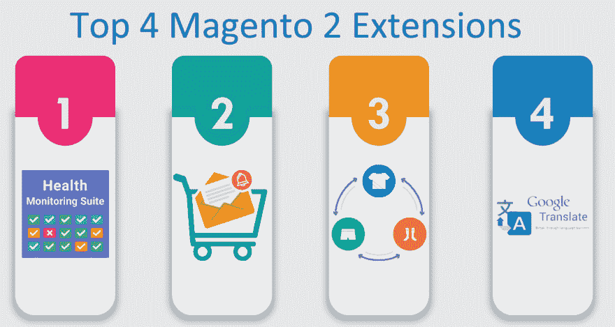

# 探索 4 个令人兴奋的 Magento 2 新扩展

> 原文:[https://dev . to/Ethan Millar/4-new-and-exciting-magento-2-extensions-to-explore-319k](https://dev.to/ethanmillar/4-new-and-exciting-magento-2-extensions-to-explore-319k)

Magento 是最先进和最受欢迎的电子商务平台之一，被许多公司使用。Magento 2 并不被特定规模的公司或初创公司使用，而是被各种不同形状和规模的公司使用。因此，Magento 2 的升级方式可以满足各种规模和各种类型的业务需求。有几个新的和令人兴奋的功能和扩展被添加到 Magento 2，以使其成为企业主的最爱。在本文中，我们将讨论几个最新的和最流行的 Magento 2 扩展。

[T2】](https://res.cloudinary.com/practicaldev/image/fetch/s--DAJgsdep--/c_limit%2Cf_auto%2Cfl_progressive%2Cq_auto%2Cw_880/https://i.imgur.com/Z4olatt.jpg)

下面列出了一些你可以用于你的电子商务网站的 Magento 2 扩展:

**1。健康和性能监控扩展**

Magento 2 健康和性能监控扩展被企业用来监控和评估许多事情。该套件自动监控在线站点的代码和配置修改。如果修改对主要商店指标产生不利影响，该套件会让企业所有者知道。如果对站点做了任何修改，或者站点开始运行缓慢，这个扩展会立即让用户知道。此外，如果 Magento 2 网站有任何错误，那么在这个套件的帮助下，企业可以很快得到报告。

**2。产品捆绑折扣**

某些产品或一套产品可以成捆或成捆出售。此外，创建捆绑包是吸引客户方便地购买更多产品的好方法。此外，购买捆绑产品节省了用户的时间，有时也节省了金钱，因为大多数捆绑产品更具成本效益。借助这种产品捆绑折扣扩展，网站所有者可以以尽可能好的价格出售一批产品，从而增加销售机会。在这个扩展的帮助下，网站所有者可以为捆绑销售的产品设置甚至固定某个百分比的折扣。同时，电子商务网站所有者还可以执行特定的促销列表页面，这是专门为捆绑产品设计的。

**3。谷歌翻译扩展**

大多数 Magento 2 站点使用的最流行的扩展之一是 Google Translator。这是一个专门为 Magento 2 电子商务网站设计的特殊扩展。在 Magento 扩展的帮助下，电子商务网站被翻译成 50 多种不同的语言。对于拥有喜欢探索不同语言的电子商务网站的国际用户的全球企业来说，这是一个很好的扩展。这不仅是一个有用的，但也是非常重要的电子商务网站谁想要扩大其全球影响力的扩展。

**4。废弃的购物车扩展**

废弃购物车扩展是为电子商务网站开发的，用于说服用户完成交易过程。在这个扩展的帮助下，电子商务所有者可以很容易地将临时访客转化为固定客户。公司可以计划和执行电子邮件营销策略，将用户转化为忠诚的客户。如果定期保留邮件被发送给那些在购物车中添加了一些东西的人，那么完成支付过程的几率会更高。

Magento 网站开发公司开发了大量的 Magento 2 扩展，让 Magento 2 网站对商家和用户都更好。因此，确保你为你的电子商务商店选择最好的 Magento 2 扩展。

你可能喜欢看[Magento 网站的小安全缺陷会产生什么影响？](https://www.sooperarticles.com/technology-articles/software-articles/what-impact-minor-security-flaws-magento-website-1732946.html)