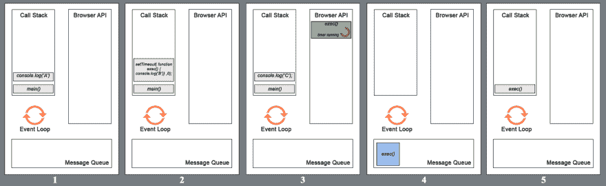
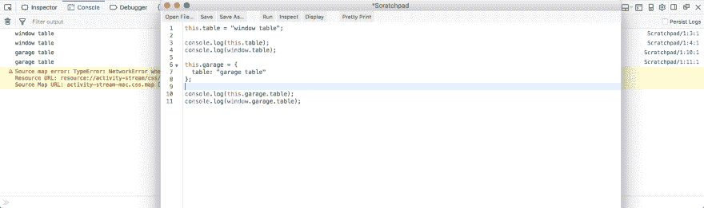
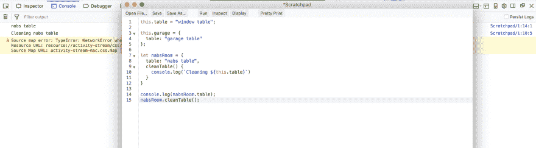
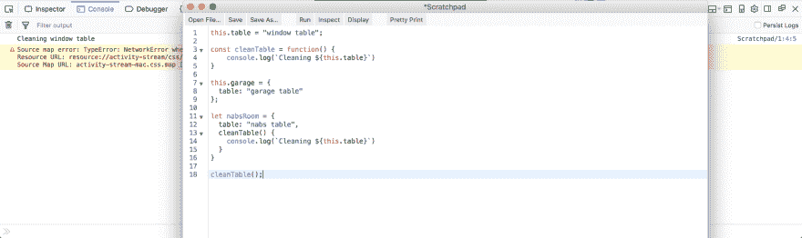
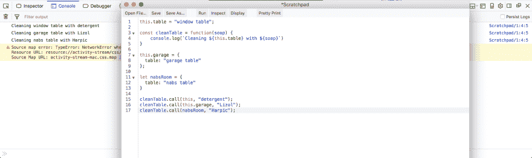
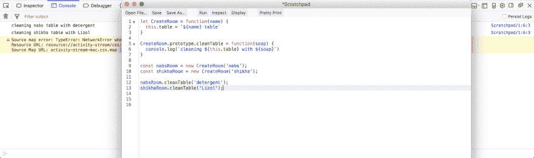
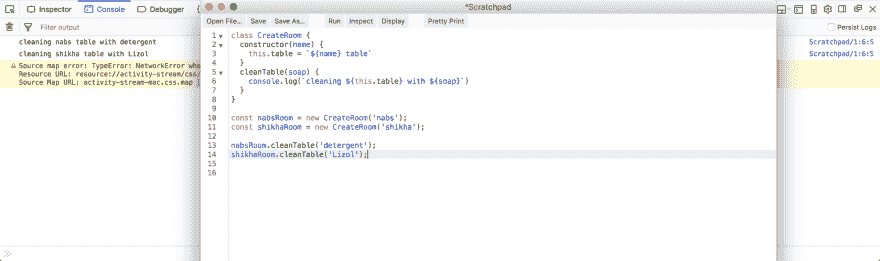

# 面试准备—基础 JavaScript-2

> 原文：<https://dev.to/nabendu82/interview-preparation-basic-javascript-2-5ac2>

欢迎来到本系列的第 2 部分。让我们从我们离开的地方开始。

**问题 4-** *函数声明和函数表达式有什么区别？*
**答案-** 函数声明和大多数语言一样是定义函数，但函数表达式是给变量赋一个匿名函数。

考虑下面的例子。我们甚至可以在定义函数声明之前就调用它，但是函数表达式就不一样了，它会给出引用错误。

```
funcD(); //Output - Function declaration
funcE(); //Reference error

function funcD() {
  console.log('Function declaration');
}

let funcE = function() {
  console.log('Function expression');  
};

/*
Exception: ReferenceError: can't access lexical declaration `funcE' before initialization
[@Scratchpad](http://twitter.com/Scratchpad)/1:2:1
*/ 
```

**注**:关于作用域和闭包的详细解释可以在我的博客[这里](https://dev.to/nabendu82/ydkjs-scopes-and-closures-part2-9ej)找到。

**问题 5-***JavaScript 是同步的还是异步的，什么是事件循环？*
**答案-** JavaScript 是一种同步、单线程语言。JavaScript 的异步行为(setTimeout、callbacks、promises)不是 JavaScript 本身的一部分，而是建立在浏览器中的 JavaScript 语言之上，并通过浏览器 API 进行访问。

> 现在，浏览器有一个调用栈，浏览器 API 和消息队列，它们的处理顺序被称为事件循环。

考虑下面的代码。它输出一个 C B，即使 B 的设置时间为 0ms。

```
function main(){
  console.log('A');
  setTimeout(
    function(){ console.log('B'); }
  ,0);
 console.log('C');
}
main();

//Output
// A
// C
// B 
```

要了解这一点，我们必须看到执行过程中的内部工作。main()被推入调用堆栈，然后控制台记录一个。然后它被弹出，setTimeout 被推入调用堆栈。现在 setTimeout()使用浏览器 API，所以它被推到那里，控制台日志 C 被推到调用堆栈中。即使有 0 毫秒的延迟，setTimeout 的 exec()也必须进入消息队列。
main()的所有语句运行完，调用栈为空之后，那么只有来自消息队列的 exec()可以被推送到调用栈。

[ ](https://res.cloudinary.com/practicaldev/image/fetch/s--p6NQlpZM--/c_limit%2Cf_auto%2Cfl_progressive%2Cq_auto%2Cw_880/https://cdn-images-1.medium.com/max/4000/1%2AC2h8JNq3f3FfBcfs5umqiw.png) *执行期间的内心工作*

这就是整个事件循环在浏览器中的工作方式，并且执行像 setTimeout 或任何 API 调用这样的异步调用。

**注** : *这个回答受[菲利普·罗伯茨](http://latentflip.com/)关于 [JS 事件循环](https://www.youtube.com/watch?v=8aGhZQkoFbQ)的谈话影响很大。*

**问题 6-** *下面的输出会是什么？*

```
console.log('A');
setTimeout(
    function(){ console.log('B'); }
,0);
console.log('C'); 
```

**回答-** 其输出将为 C B。由于问题 5 中所示的事件循环概念，即使 0ms 的 setTimeout 也将最后调用。

**问题 7-** *什么是闭包，我们如何使用它？*
**答-** 闭包基本上是一个内部函数，存储外部函数中存储的变量的作用域信息。

考虑下面的代码。变量 **b** 在外部函数 ie 中有一个范围，从第 4 行到第 10 行。所以，在第 13 行当我们调用外部函数时，它可以访问 b 的值，但是在第 14 行没有外部函数。

那么，innerFn()如何访问 b 的值呢？这就是闭包的 JS 特性发挥作用的地方。当在第 6 行创建 var inner 时，JS 引擎不仅存储函数对象信息，还存储它的作用域信息。*所以，它在内部函数对象里面存储了一个变量**b *的作用域。
现在你在哪里调用 inner 已经不重要了，不管是在这个文件中还是在某个第三方文件中。它会一直记住 a 和 b 的值，就像拍了快照一样。

[ ](https://res.cloudinary.com/practicaldev/image/fetch/s--AuJ4S3aA--/c_limit%2Cf_auto%2Cfl_progressive%2Cq_auto%2Cw_880/https://cdn-images-1.medium.com/max/2574/1%2AkcjnRBznI0PqW5wel1RjOQ.png) *封号进场*

**注**:你可以在这里找到我的文章[中关于闭包的详细解释。](https://dev.to/nabendu82/ydkjs-scopes-and-closures-part5-554p)

**问题 8-** *解释 JavaScript 中的“this”关键字？*
**回答-**JavaScript“this”关键字简单来说就是如果你在一个作用域或者函数或者对象里面，“this”就是你所在的那个作用域/函数/对象。我们可以在各种上下文中使用“this”。让我们过一遍。

### “此”在全局范围内

如下例所示，当我们在全局范围内使用它时，它也可以通过窗口引用。

[ ](https://res.cloudinary.com/practicaldev/image/fetch/s--fVvkI9Th--/c_limit%2Cf_auto%2Cfl_progressive%2Cq_auto%2Cw_880/https://cdn-images-1.medium.com/max/5760/1%2AIhq38LBZRKRQv4y1QtRDdA.png) *【这个】在全局范围内*

### “这个”里面有一个方法

让我们有一个私有对象 **nabsRoom** 并在其中有一个函数 **cleanTable** ()。函数中的“this”指的是对象 nabsRoom 中的表。

[ ](https://res.cloudinary.com/practicaldev/image/fetch/s--1Q-_6hrX--/c_limit%2Cf_auto%2Cfl_progressive%2Cq_auto%2Cw_880/https://cdn-images-1.medium.com/max/5756/1%2Asbulk-LwyBAjTz9zPo8jDA.png) *【本】里面一个方法*

### “这个”里面有一个函数

现在，如果我们有一个名为 cleanTable()的函数，那么“this”指的是窗口

[ ](https://res.cloudinary.com/practicaldev/image/fetch/s--Ny1Dqucn--/c_limit%2Cf_auto%2Cfl_progressive%2Cq_auto%2Cw_880/https://cdn-images-1.medium.com/max/5760/1%2ATpBI4a2DjuaDkQj5aZ2ayw.png) *【本】里面一个函数*

**问题 9-** *解释调用方法中的“本”关键字？*
**答-** 调用方法用于调用一个函数，带有一些对象，在这种情况下“这个”是针对那个对象的。我们也可以传递一些参数给它。

[ ](https://res.cloudinary.com/practicaldev/image/fetch/s--l7uKOB8a--/c_limit%2Cf_auto%2Cfl_progressive%2Cq_auto%2Cw_880/https://cdn-images-1.medium.com/max/5760/1%2AkENdlsGg4HBff4iwD0w7uA.png) **【本】关键字中的调用方法**

**问题 10-** *下面的代码有哪些不同的方法可以访问“this”内部函数？*

```
const cleanTable = function(soap) {
  const innerFunc = function(_soap) {
    console.log(`Cleaning ${this.table} with ${_soap}`)      
  }
  innerFunc(soap);
}

let nabsRoom = {
  table: "nabs table"
}

cleanTable.call(nabsRoom, "Harpic"); 
//Output - Cleaning undefined with Harpic 
```

**答案-**inner func()内部访问“this”有四种解决方案。

### 方案 1

在 cleanTable()中使用“that”变量来访问 innerFunc()中的“this”。基本上“那个”只不过是外在的“这个”。

```
const cleanTable = function(soap) {
  let that = this;
  const innerFunc = function(_soap) {    
    console.log(`Cleaning ${that.table} with ${_soap}`)      
  }
  innerFunc(soap);
}

let nabsRoom = {
  table: "nabs table"
}

cleanTable.call(nabsRoom, "Harpic");
//Output - Cleaning nabs table with Harpic 
```

### 方案二

使用 call 方法在 innerFunc()内部使用外部的“this”。

```
const cleanTable = function(soap) {
  const innerFunc = function(_soap) {    
    console.log(`Cleaning ${this.table} with ${_soap}`)      
  }
  innerFunc.call(this, soap);
}

let nabsRoom = {
  table: "nabs table"
}

cleanTable.call(nabsRoom, "Harpic");
//Output - Cleaning nabs table with Harpic 
```

### 方案三

使用 bind 方法在 innerFunc()内部使用外部的“this”。

```
const cleanTable = function(soap) {
  const innerFunc = function(_soap) {    
    console.log(`Cleaning ${this.table} with ${_soap}`)      
  }
  innerFunc.bind(this)(soap);
}

let nabsRoom = {
  table: "nabs table"
}

cleanTable.call(nabsRoom, "Harpic");
//Output - Cleaning nabs table with Harpic 
```

### 方案 4

在 innerFunc 中使用 arrow 函数。箭头函数对“this”有特殊的含义，它从封闭范围中获取“this”的值，在这种情况下非常有用。

```
const cleanTable = function(soap) {
  const innerFunc = (_soap) => {    
    console.log(`Cleaning ${this.table} with ${_soap}`)      
  }
  innerFunc(soap);
}

let nabsRoom = {
  table: "nabs table"
}

cleanTable.call(nabsRoom, "Harpic");
//Output - Cleaning nabs table with Harpic 
```

**问题 11-** *解释一下构造函数或者 ES6 类里面的“this”关键字？*
**答案-** 构造函数和 ES6 类都是一样的。ES6 类不过是构造函数的合成糖，内部行为完全相同。

两者中的“this”是用 new 关键字创建变量的实例。

考虑下面的例子。这里“this”是 cleanTable()中的 *nabsRoom* 或 *shikhaRoom* ，这取决于它是从哪个地方被调用的。

[ ](https://res.cloudinary.com/practicaldev/image/fetch/s--nmrW-jDp--/c_limit%2Cf_auto%2Cfl_progressive%2Cq_auto%2Cw_880/https://cdn-images-1.medium.com/max/5760/1%2Ascd13W_p5fbaMQsh2KSlBA.png) **【本】里面有一个构造函数**

同样可以用 ES6 类的构造函数来写，但是完全一样，“this”也是同样的意思。

[ ](https://res.cloudinary.com/practicaldev/image/fetch/s--RQg5ePtO--/c_limit%2Cf_auto%2Cfl_progressive%2Cq_auto%2Cw_880/https://cdn-images-1.medium.com/max/5760/1%2AhdaFBMSIZXHVE1f9c0aGaA.png) **【这】里面一个 ES6 级**

基本 JavaScript 面试问题的第 2 部分到此结束。