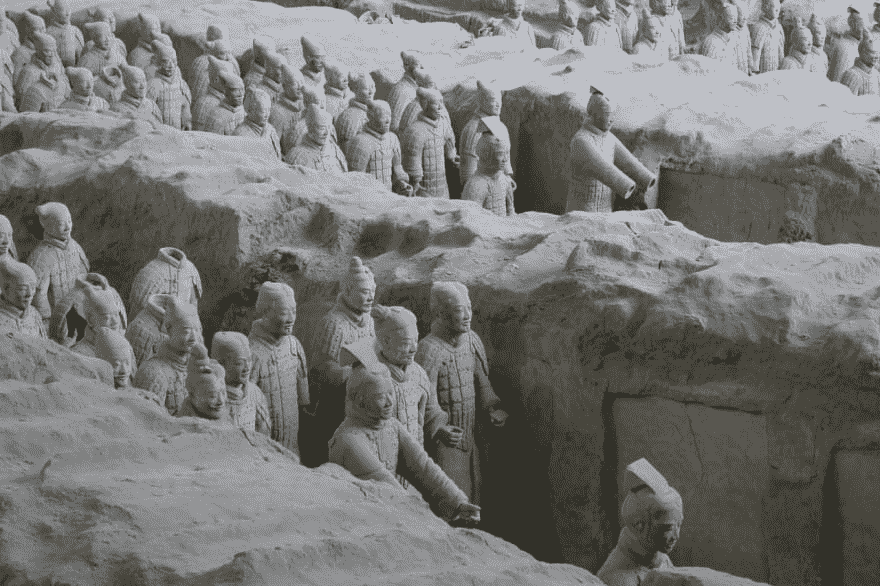
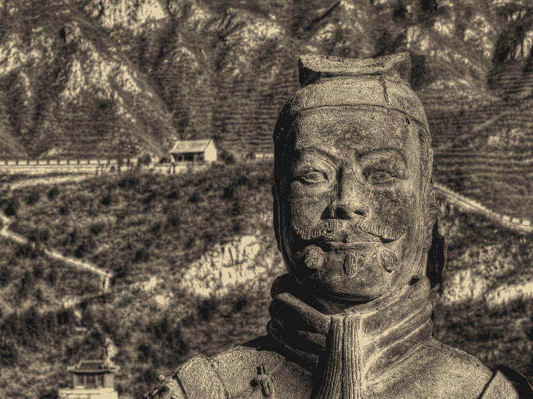

# 项目管理的艺术——第一部分

> 原文：<https://dev.to/2nit/the-art-of-project-management-4ed2>

## 简介

《孙子兵法》是早已闻名的东亚古代战争指南。它包含了关于如何应对即将到来的战争，如何对敌人进行侦察，如何将敌人的弱点转化为我们的优势，如何管理军队，以及如何在大规模军事行动中取得成功的复杂建议。“好吧，但是这一切和项目管理有什么关系呢？”——你可能会问。嗯，很多。项目经理就像军队的指挥官一样，应该能够正确地设定初始概念，选择调整后的战略和战术，估计可用资源，明智地管理这些资源，实现先前设定的目标，收集信息，并认识到计划过程中的风险。对于你们中的一些人来说，这听起来很容易，但肯定会很棘手——对于一个大规模的项目来说，这变得更加困难，因为这些需要更多的关注。但是 TAoW 中给出的一些建议是有用的，即使你领导的项目不是很大。

这篇文章是我对 TAoW 的解释，它涉及到对 web 或移动应用程序进行有效的项目管理的比较。我很确定你的观点和对 TAoW 的接受可能会有很大的不同，这就是为什么我邀请你在评论区讨论这个话题。

那么，让我们跳到第一章！

## 初步估算-项目概念

赢了一场战役的将军会在他打仗的神庙里做很多计算。战败的将军事先很少计算。因此，许多计算导致胜利，很少计算导致失败:更何况根本没有计算！正是通过对这一点的注意，我可以预见谁有可能赢或输。”

根据 TAoW 的说法，为战争做准备是在没有混乱、随意或不安全的情况下进入冲突的最佳方式。许多不同的因素在每场战斗中都至关重要，并可能压倒胜利的天平。对于每一个指挥官来说，事先了解这些因素是非常重要的——在战争开始后，再去调查这些因素可能已经太晚了。我们可以看到这与管理项目有明显的相似之处。当我们知道有“战争”的可能性(在我们的例子中，一个新的项目)即将到来时，我们应该做好准备，并且我们应该熟悉所有那些可能以这样或那样的方式对我们的项目产生影响的因素。但是我们如何定义它们呢？陶认为，在追求成功的过程中，五个要素非常重要:道德法则、天、地、指挥官、方法和可能有用的纪律。让我们再多谈谈他们中的每一个。

道德法则因素负责意愿，即下属表现出对其统治者的服从。根据道德法则，那些下属是否会无动于衷地追随他。为此，统治者必须表现出他是称职的、可靠的，当然也是值得信赖的，从而赢得他们的信任。在被统治者(你的团队成员)和他们的统治者(你，作为项目经理)之间达成完全一致总是执行任何复杂动作的一个很好的起点。最好的方法就是，简单地说，练习。当我们和我们的团队处于待命状态时，我们必须完全清楚应该采取什么行动，按照什么顺序，如果没有事先培训，这几乎是不可能的。但是在没有新项目的情况下如何训练呢？嗯，有一些可能性。在我们公司，我们以学习为目的开始我们的项目(然而，假设这个项目可能在未来为我们和其他人带来更多切实的利益)。这是一个 web 应用程序的项目，负责足球(如果你是美国人，足球；) )我们城市的球场。我们的目标是让居民更容易获得这些场地，并让预订体育设施的整个过程更有组织性。我们对待这个项目就像对待任何“真正的”项目一样。我们已经设计了基本的功能，为大部分功能准备了模型，创建了文档，并开始着手工作。协调起来有点困难，因为没有一个永久的开发团队在这个项目上工作——那些有空闲时间的人加入进来，而那些在“真正的”项目中被赋予新任务的人离开了这个项目。但是我们获得了一些经验，学会了如何有效地组织自己——我们的实践得到了回报。

孙子描述的天意味着昼夜、时间、季节和天气的循环——所有的环境因素。在我们的例子中，季节可能会对像夏季这样的事情做出反应，当很多人想去度假时，开发项目的时间可能会放缓。同样的情况也可能发生在冬季假期，尤其是考虑到圣诞节和新年前夕(或者不同的假期，取决于地区)。所有这些都会在很大程度上影响我们的估计，所以记住这一点很重要。与《孙子兵法》中的天堂相关的另一个关键因素是昼夜循环。你的团队成员不一定要在同一个地方工作，他们可以分散在世界各地。这就是为什么你必须准备好协调他们的工作，同时记住不同的时区，这可能不是一件容易的事情。当然，作为一名项目经理，这些考虑因素对你来说并不总是一样的，但是了解你周围的环境、局限性并对将要发生的事情做出某些预测的能力是极其重要的。

《陶》第一章提到的地，指的是距离，可能决定成败的不同地形。谢天谢地，作为项目经理，我们不必研究地形学，但我们必须意识到在我们的项目中应该使用什么样的技术，以及由此带来的好处和风险。就像一个好的指挥官应该预测行进通过狭窄的通道、陡峭的山丘或发霉的沼泽将如何影响他的军队的机动性和安全性一样，你应该预测选择的技术-指定的“路径”-将如何影响项目的维护或其扩展。

指挥官因素代表了领导者的所有特征，这使得下属很容易委托管理-他的智慧，诚实，严格。当一个指挥官能够展示他们时，不难相信他有能力带领他人走向成功。值得注意的是，智慧和真诚被认为比其他中国基本美德更重要，而勇敢和严格正在取代正直的心灵和自尊，自制。这意味着，作为项目经理，我们应该特别强调对我们可用信息的正确解释，对当前事态的可靠评估，诚信，同时，对所遇到的情况采取某种坚定的方法，无论是有利的还是不利的。

方法和纪律指的是对现有人力资源、层级和结构、工具和适当环境的适当管理。这真的很简单——就像管理军队一样，你必须管理你从事项目的团队:确定分配给每个成员的指挥链和职责，同时提供你的团队成员能够专注于他们的目标而不受任何干扰所需的一切——这就是原因。

“因此，战争的艺术是由五个不变的因素决定的，当一个人试图确定战场上的条件时，应该考虑到这五个因素。”

这五个因素是做好准备的支柱，但是请记住，在大规模行动开始之前，有可能收集到比这些因素所涵盖的更多的信息。这一信息或其他情况的发生应导致相应地调整我们的操作方法，甚至独立于所采用的规则。

好的，由于 TAoW 的帮助，我们认识到确定这些重要的支柱并根据这些支柱调整我们的计划是至关重要的。这似乎说起来容易做起来难。但是不要担心——在识别上面提到的一些支柱的过程中，有很多很多工具是有价值的。其中一个是创建 BPMN 图，描述应用程序中将要发生的过程和下面的整个逻辑。你可以把它们看作是战略地图，在计划你军队的下一步行动时很有帮助。这些图表(或地图)应该可以帮助你设定方向，规划资源管理，并指出在你的下属实现既定目标的过程中可能出现的困难。你还可以将你的 BPMN 图与应用程序的实体模型配对，甚至使用 GraphQL Editor 之类的工具(我前段时间写了一篇关于它的帖子，你可以在这里阅读-它甚至与我之前提到的我们公司的培训项目有关)。有了这些的合力，你可以在你的项目中实现你、你的团队成员和你的客户之间的某种程度的透明，如果没有这些工具，这是极难实现的。你的一个团队成员不确定事情应该如何运作？好的，这里有一个解释它的图表。您的客户很难确定某样东西应该是什么样子？好的，没问题——有一个模型，这是我们之前同意的。构建图表和模型将帮助您预测潜在的困难，所选技术的影响。他们将帮助你为你的项目选择正确的“道路”。

使用这样的工具来构建你的应用程序的流程和外观是非常简单的，使用它们可以消除很多可能发生的重大或次要问题。这种方法也将在项目实现的下一阶段为您节省大量潜在的压力。所以在这种情况下，贡献小利润大。我是说巨大。

因此，我们已经讨论了定义通向成功的准备的五个支柱，以及如何将书中提到的这些支柱转化为现实生活中的项目。我们能从 TAoW 的第一章中提取出更多的东西来帮助我们在开始一个新项目时更有自知之明吗？我会说“是”，这就是为什么:陶第一章的以下部分建议识别敌人的弱点并加以利用。当我们，项目经理，正在着手一个新项目时，并没有真正的“敌人”。但是，我们仍然可以从这个建议中获益良多。只要想想所有不可预见的情况，意想不到的问题，缺乏资金，缺乏时间和开发一个新项目的所有其他负面因素，并试图将所有这些视为一个整体-这是我们真正的敌人。这些因素造就了他。我们的工作是调查这些问题并解决它们(或者更好——防止它们发生),而不是利用它们。通过良好的管理来击败这个敌人将允许你创造一种状态，当你的团队成员 100%确定他们在做什么以及他们为什么这么做的时候。相信我，一旦你经历了那种状态，你就再也不想回去了。

这是该系列的第一篇文章。我希望至少你们中的一些人会喜欢它，并且你们中的一些人会在评论区对它发表意见:)。谢谢！