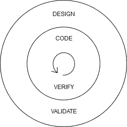
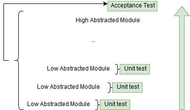
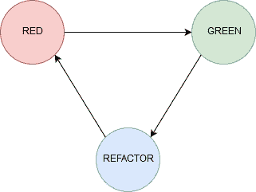
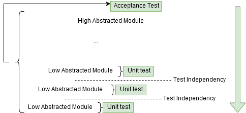
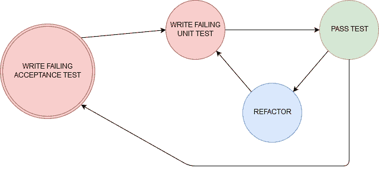

# TDD:正确的道路

> 原文:[https://dev.to/jmir17/tdd-the-right-path-4gk4](https://dev.to/jmir17/tdd-the-right-path-4gk4)

TDD:基于快速迭代和持续重构的软件过程。

[T2】](https://res.cloudinary.com/practicaldev/image/fetch/s--p8JfasBC--/c_limit%2Cf_auto%2Cfl_progressive%2Cq_auto%2Cw_880/https://thepracticaldev.s3.amazonaws.com/i/un1ec9abn9oj0nrhyvl5.png)

**什么是 TDD？**
TDD 代表测试驱动开发，你可能已经知道了，它是一个软件开发过程，要求在编写代码之前编写测试来验证代码。获得系统状态的直接反馈是极限编程(XP)的核心实践之一。

**为什么要写测试？**
如果你千里迢迢来到这里，那是因为你已经意识到，在试图保证代码正常工作时，手工测试一段代码是没有用的。如果在您的组织中，您有足够的人手动测试代码来保证某些东西，这在经济上是不可行的，此外，您的生命周期中有一个阶段会减慢整个项目，并且不可能加速。

在任何情况下，我说的是去除 QA 团队，我只是说自动化所有重复但必要的测试，这些测试是安全发布系统新特性所需要的。QA 团队应该存在，但只是在开发人员工作管道之外。

当所有的代码都受到测试的保护时，更改代码的恐惧就消失了。程序员总是希望改进代码，但通常他们害怕做出改变并破坏整个事情。当测试立即告诉我们是否有什么东西被破坏了，从那恢复或者仅仅回滚更改就成为了提高代码质量的关键工具。可读性、可维护性和灵活性是测试附带的属性。测试还记录了如何使用你的系统，用代码语言！

是什么带来了我在编写测试后无法得到的 TDD？
只是通过先写测试，帮助你写更少耦合的代码，并且它也强迫你设计可以被测试的代码。

只要 TDD 的主要特征是持续重构，开发人员就很容易增加可读性，也很容易学习这种语言，因为现在，他们有了一个安全的平台来尝试更复杂但也更有利可图的实现。同样，随着时间的推移，开发人员会为更多的单元测试更换调试器。

这种实践的另一个关键特征是增量迭代，从最简单的实现转移到所需的全部功能，防止程序员过度设计解决方案，并导致采用简单设计，另一种核心 XP 实践。同样，增量迭代减少了代码重复。

当在代码之后编写测试时，测试会适应已经编写好的代码，而不是反过来。出于同样的原因，它经常导致有偏见的验证。

### **两种方法**

虽然有类似的过程，像 ATDD，EDD，BDD，...明确地进行 TDD 有两种主要方式，一种是由内向外，另一种是由外向内。
***剧透预警:**没有一个比另一个好。*

**TDD Inside-out 又名古典主义者又名芝加哥学派**
这种技术包括开始实现低级模块，并从那里转移到高级模块。没有设计决策是预先制定的，设计是在持续重构阶段的帮助下慢慢发现的。

[T2】](https://res.cloudinary.com/practicaldev/image/fetch/s--cC2Uk-E8--/c_limit%2Cf_auto%2Cfl_progressive%2Cq_auto%2Cw_880/https://thepracticaldev.s3.amazonaws.com/i/fd1jzs9arsj10qp72o09.png)

为了达到预期的效果，这种技术细化了工作流程，从而变得更加有效。这很容易理解，但执行起来却不那么容易。

[T2】](https://res.cloudinary.com/practicaldev/image/fetch/s--GpFqn9r4--/c_limit%2Cf_auto%2Cfl_progressive%2Cq_auto%2Cw_880/https://thepracticaldev.s3.amazonaws.com/i/qpopp79w2z8fvqpt9qlz.png)

该技术包括首先编写一个失败的测试，实现代码以使测试通过，然后重构生成的代码，这种重构可以针对生产代码或测试。极其重要的是，我们只重构绿色(通过)测试的代码，而不是在失败阶段。在 refactor face 中，不能添加新的功能，而是要通过覆盖所有必需功能的新测试。

这种技术鼓励开发人员一点一点地实现代码，它被称为*“小步”*。为此，当开始编写代码以通过测试时，实现应该是这样的:
**1。-** 假实现 *-硬编码值-*
**2。-** 明显实现 *-简单语句-*
**3。-** 带下一个测试的三角测量 *-添加逻辑以概括代码-*

另一方面，这种技术开始测试和实现较高层次的模块，并从那里转移到较低层次的模块。这种方法着重于满足接受标准，并交付用户真正需要的东西。它需要一些前期设计，尽管如此，它不必完全详细。我们将对其进行迭代和调整。

[T2】](https://res.cloudinary.com/practicaldev/image/fetch/s--zStgI8Yr--/c_limit%2Cf_auto%2Cfl_progressive%2Cq_auto%2Cw_880/https://thepracticaldev.s3.amazonaws.com/i/qoqi6vn05fhpj1lfogug.png)

由外向内技术引入了双环测试概念。它包括首先为正确的原因编写一个失败的验收测试，然后把它留在那里。然后，为高级模块编写一个失败的单元测试，模拟低级模块。编写代码，并重构所有这些新代码。一旦模块被正确实现，验收测试应该通过。在不同级别的模块之间使用模拟来保持测试的独立性是很重要的。

[T2】](https://res.cloudinary.com/practicaldev/image/fetch/s--tA4EaCK4--/c_limit%2Cf_auto%2Cfl_progressive%2Cq_auto%2Cw_880/https://thepracticaldev.s3.amazonaws.com/i/ewzca20r6rktnksgvceu.png)

使用这种技术，更高和中间的模块使用 mocks 进行测试，这有利于系统的文档化和测试的速度。一个问题是这些测试的可维护性，当设计改变时，所有带有模拟的测试都应该更新以与新的设计保持一致。这可能太昂贵了，但是一旦系统的功能被验收测试很好地覆盖，我们就不能删除一些单元测试吗？

**TDD 学习曲线**
像任何其他练习一样，在有效使用它之前，它需要一些时间来适当地学习它，就像任何其他技术一样。或者，如果你走进一家音乐商店，买了一把吉他或一架钢琴，你会在同一天演奏任何一首歌曲吗？即使你事先知道所有的音乐理论也不行。那么，是什么让你认为在你尝试 TDD 的第一天，你不会挣扎呢？

**结论**
TDD 已经证明了它的好处，使用实践回报真的很快。作为一名软件工程师，你必须明白，你所做的每一个决定，都有它的风险，它的好处和它的不便，每一个问题都必须进行不同的评估。关于 TDD，我建议你学习两种技术，不要只坚持其中一种。不必非要选一个或另一个来解决所有问题，用更适合的那个。猜猜看，如果有意义的话，你甚至可以在同一个项目中组合它们，或者根本不使用它们中的任何一个。