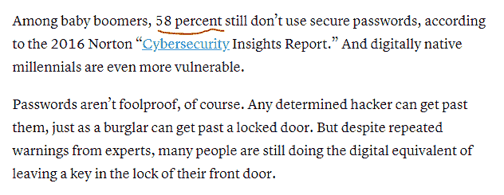
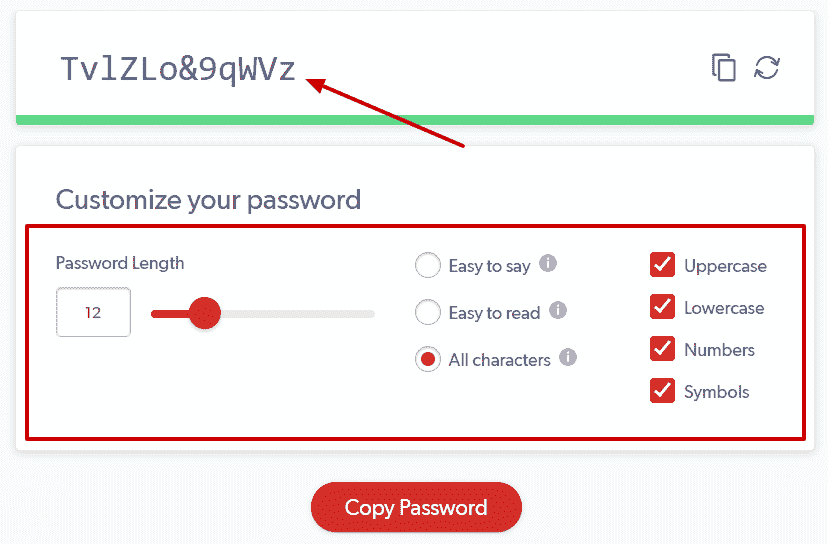
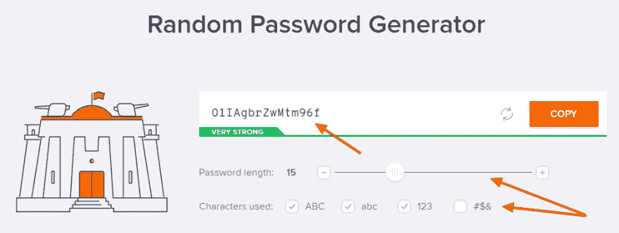

# 可笑的简单方法来改善和保护您的密码

> 原文:[https://dev . to/anemnavinrao/rally-simple-ways-to-improve-and-protect-your-passwords-23gb](https://dev.to/anemnavinrao/ridiculously-simple-ways-to-improve-and-protect-your-passwords-23gb)

说到保护你的在线方式，当然密码是第一层。

账户可以是你存储所有敏感数据的任何地方。

**可能是，**

1.  在线银行账户访问
2.  社交账户(个人信息存储在哪里)
3.  或者有些也可以存储，可能是保护谷歌电子表格的密码。

什么不是，它可能是任何事，任何事。我们在网上创建的所有账户在某种程度上都是珍贵的。

## 管理密码有多难

我知道当你不得不记住所有的密码时，这可能是真的令人挠头。当你在互联网上有很多账户时，这可能会变得更加乏味。

此外，我们不能对所有帐户使用相同的密码。所有的鸡蛋放在同一个篮子里对于[保证数据安全](https://techibhai.com/keep-data-safe/)没有意义。

:D 没有出路了吗

你这么认为。没有。对于每一件事情，总有一个解决方法。你需要表现得聪明点。

在此之前，让我问一个问题，你真的在使用安全密码吗？

我说的安全密码，并不是指你的名字、生日、个人识别卡、车辆名称等。这些更容易记住，但很容易被了解你的人猜对。即使一个不知名的人也能知道你在做一些研究。

## 如何创建强密码？

研究表明，超过 58%的网民根本不使用强密码。

[T2】](https://res.cloudinary.com/practicaldev/image/fetch/s--JC3vg1XB--/c_limit%2Cf_auto%2Cfl_progressive%2Cq_auto%2Cw_880/https://thepracticaldev.s3.amazonaws.com/i/ox124aw4ibxlm4diny5w.PNG)

网上有很多工具，可以非常有效地完成这项工作，并生成非常强的密码供猜测。

**很少有人是，**

1.  末次通过发生器
2.  Avast 随机密码生成器

这里是由最后一关
 生成的密码

另一个是 Avast 密码生成器

[T2】](https://res.cloudinary.com/practicaldev/image/fetch/s--69aOcD8I--/c_limit%2Cf_auto%2Cfl_progressive%2Cq_auto%2Cw_880/https://thepracticaldev.s3.amazonaws.com/i/r1jqg0876us9as64yb47.png)

所以，你已经看到了生成的密码，有人很难猜到。您可以自定义密码，使其更长，以获得更好的保护。

我所有的账户都用这个。甚至我在 WordPress 网站上也用这个来使它更安全。毕竟， [WordPress Security](https://www.questioncage.com/wordpress-security/) 对任何网站所有者来说都很重要，因为它是开源软件。

嗯，你一定想知道这些密码对你自己来说更难记住。使用密码管理器。

## 使用密码管理器

我同意这可能很困难。这就是像最后一关这样的服务出现的地方。它会记住你在网上使用的所有密码。它只是作为你的私人助理。

你只需要安装他们的扩展，几乎可以在所有的浏览器上使用。

## 使用双因素身份验证

人们经常创建一个强密码，却忘记添加双因素身份验证。这很简单。

事实上，所有服务都为其客户提供了双因素身份认证。你可能已经注意到了，在 Gmail 里，托管公司什么的。

什么都有。甚至你可以为 WordPress 尝试这种[双因素认证，为什么不增加一层额外的保护呢。](https://www.questioncage.com/wordpress-two-factor-authentication/)

怎么会？

基本上 [2 因素认证](https://searchsecurity.techtarget.com/definition/two-factor-authentication)的意思是，可能把你的账户和你的便携设备如手机连接起来。

这意味着，即使有人猜出了你的密码，你也会在手机上收到通知，要求你进行身份验证。这让你的生活更加美好，不是吗？

## 不要点击任何链接

您可能会收到大量网络钓鱼电子邮件和信息。记住所有的链接都不值得点击。在那边要非常小心。

我也收到了很多电子邮件，这些邮件往往是通过银行发送的，让我知道要采取这个行动来重置你的密码。不要点击那些。

调查并注意链接是否完全相同。

## 使用更新的软件和应用

最后但同样重要的是，始终使用更新的软件来获得更好的在线保护。每当您收到软件或应用程序更新的通知时。动手吧。

从安全的角度来看，这对你有好处。所有的错误都被修复了，开发人员经常修复的是安全错误，以避免任何注入。