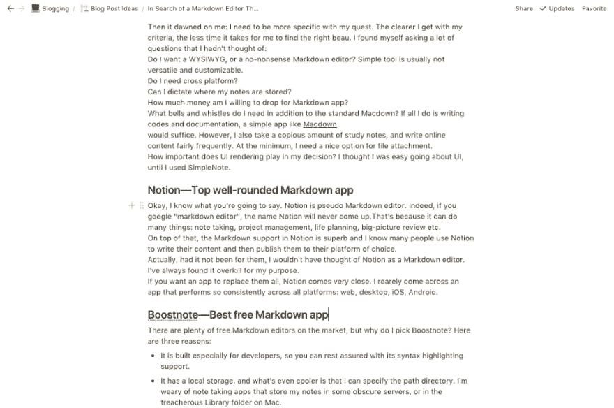
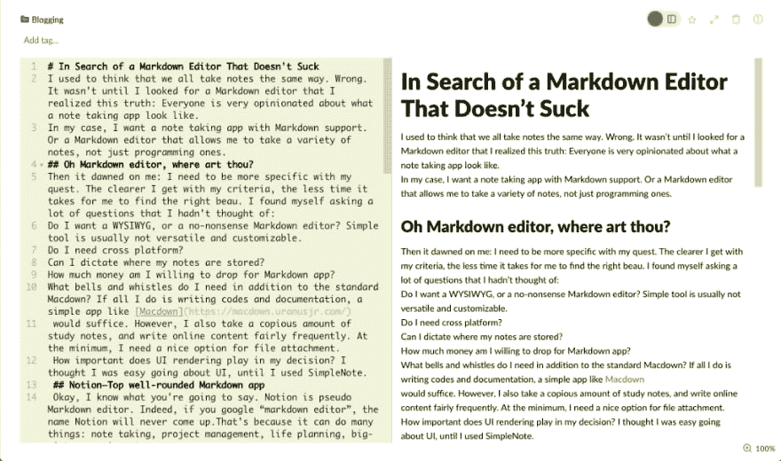
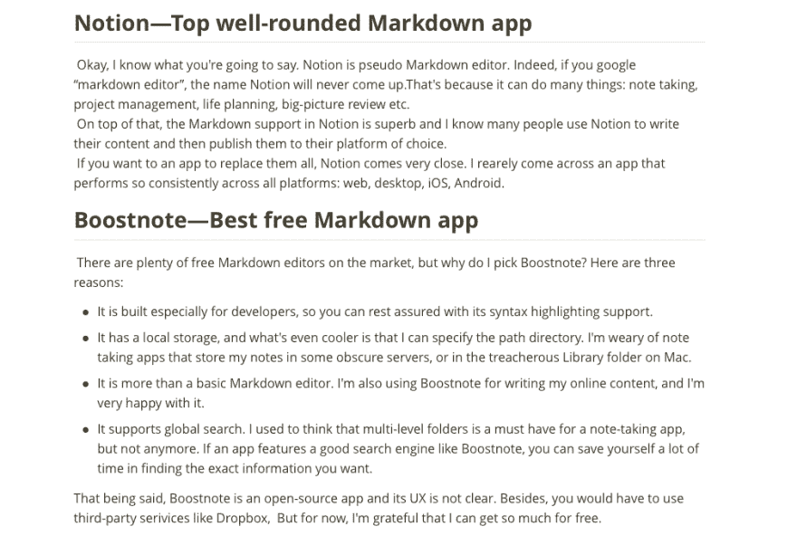

# 寻找有能力的减价编辑

> 原文:[https://dev . to/bytrangle/in-search-of-a-competent-markdown-editor-49eg](https://dev.to/bytrangle/in-search-of-a-competent-markdown-editor-49eg)

* * *

你有没有梦想过用更少的时间写出更多的内容？解决方案之一是降价编辑器。让我们找到最适合你的。

我过去认为我们都用同样的方式记笔记。不对。直到我找了一个 Markdown 编辑器，我才明白这个道理:每个人都非常固执地认为笔记应用应该是什么样子。

就我而言，我想要一个支持降价的笔记应用程序。或者一个 Markdown 编辑器，允许我做各种笔记，而不仅仅是编程笔记。

## 哦 Markdown 编辑，你在哪里？

在我令人生畏的寻找过程中，我意识到我不够具体。我对自己的标准越清楚，找到合适男友的时间就越少。我发现自己问了很多我没有想过的问题:

我想要一个所见即所得，还是一个严肃的降价编辑器？简单的工具通常不具有通用性和可定制性。

我需要跨平台吗？

我可以决定我的笔记存储在哪里吗？

我愿意为 Markdown app 花多少钱？

除了标准的降价支持，我还需要什么功能？如果我所做的只是编写代码和文档，一个简单的应用程序，如 [Macdown](https://macdown.uranusjr.com/) 就足够了。

然而，我也做了大量的学习笔记，并且相当频繁地在网上写内容。至少，我需要一个很好的文件附件选项。

UI 渲染对我的决策有多重要？在我使用 SimpleNote 之前，我一直认为我很容易使用 UI。

这个列表还可以继续下去，但下面是我的选择，以防你对使用什么样的 Markdown 编辑器感到困惑。

### 概念—顶级全面降价编辑器

好吧，我知道你要说什么。[概念](http://notion.so/)是伪降价编辑器。事实上，如果你用谷歌搜索“markdown editor”，这个名字永远不会出现。这是因为它可以做很多事情:记笔记、项目管理、人生规划、宏观回顾等等。

[T2】](https://res.cloudinary.com/practicaldev/image/fetch/s--2EvHukX3--/c_limit%2Cf_auto%2Cfl_progressive%2Cq_auto%2Cw_880/https://cdn-images-1.medium.com/max/1024/1%2At7GEgZpZndmLFbTQPzE-PQ.png)

但真正让天平向概念倾斜的是它对降价的支持是极好的。不要被它所见即所得的界面所迷惑。你不用离开键盘就可以写下你所有的内容。

我知道许多人使用概念来编写他们的内容，然后发布到他们选择的平台上。事实上，如果没有他们，我不会想到作为一个降价编辑的想法。我一直觉得这对于我的目标来说有点过了。

如果你想要一个应用程序来取代它们，那么 idea 就非常接近了。我最近遇到一个应用程序，它在所有平台上都表现得如此一致:web、桌面、iOS、Android。

### Boostnote —最佳免费降价编辑器

[T2】](https://res.cloudinary.com/practicaldev/image/fetch/s--igg8OjIi--/c_limit%2Cf_auto%2Cfl_progressive%2Cq_auto%2Cw_880/https://cdn-images-1.medium.com/max/1024/1%2A2cn_YQ26TXtGAme4Pg9eUA.png)

市场上有很多免费的 Markdown 编辑器，但我为什么要选择 [Boostnote](https://boostnote.io/) ？这里有四个原因:

*   它是专门为开发人员构建的，因此您可以选择许多语法突出显示的主题。
*   它有一个本地存储，更酷的是我可以指定路径目录。我厌倦了笔记应用程序，它们把我的笔记存储在一些不知名的服务器上，或者存储在 Mac 上危险的图书馆文件夹中。
*   它不仅仅是一个基本的降价编辑器。我也在用 Boostnote 写我的在线内容，我对此非常满意。
*   它支持全局搜索。我曾经认为多级文件夹是笔记应用程序的必备组件，但现在不是了。如果一个应用有一个好的搜索引擎，比如 Boostnote，你可以节省很多时间来找到你想要的信息。

也就是说， [Boostnote](https://boostnote.io/) 是一款开源应用，其 UX 尚不清楚。此外，你还必须使用 Dropbox 等第三方服务进行同步。但是 Typora 也不提供同步功能，所以 Boostnote 的制作者们没有什么可感到羞耻的。

现在，我很感激我能从一个免费的应用程序中得到这么多，感谢一群慷慨的开发者。

### Typora —最佳所见即所得降价编辑器

Typora 是一个最小的，不受干扰的 Macdown 编辑器。如果你是作家、记者、学生等，我毫不怀疑你会喜欢 Typora。

[T2】](https://res.cloudinary.com/practicaldev/image/fetch/s--THEfpQQW--/c_limit%2Cf_auto%2Cfl_progressive%2Cq_auto%2Cw_880/https://cdn-images-1.medium.com/max/1010/1%2AljifcDHU1qlns9l28C6XuQ.png)

您像往常一样编写 Markdown，当您离开当前行时，Typora 会呈现您的输入。Typora 没有我不喜欢的地方，但我犹豫是否要承诺，因为我知道它仍然是一个测试版，未来的定价模式还没有定论。

在花了几个小时探索和测试 markdown 编辑器之后，我想起了这个古老的智慧:

## 最好你认识的魔鬼。

这是我在研究、探索和测试 Markdown 编辑器上花费了大量非生产性的时间后意识到的。这还不是全部。

如果你想充分利用一个应用程序，你需要花时间学习它的快捷方式，并根据你的喜好进行配置，这样它就变得自动化了。

那么，你最喜欢的 Markdown 编辑器是什么？我不会被另一个闪亮的应用程序分心，但我喜欢听你的想法。