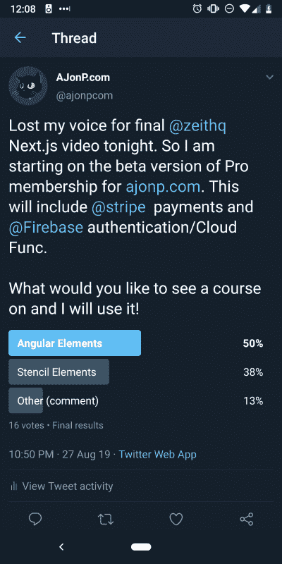

# 向静态站点添加角度组件

> 原文：<https://dev.to/codingcatdev/adding-angular-components-to-your-static-site-43jk>

# 给静态站点添加动态特性。

这是一个由多个部分组成的系列，涵盖了我目前在 https://ajonp.com 网站上使用的所有不同类型的 Web 组件。我只是想展示如何在较高的水平上使用它们。

Max 的帖子激发了我分享更多的想法:

[](/ionic) [## 为什么我们使用 Web 组件

### 爱奥尼亚 7 月 8 日 1911 分钟最大林奇读数

#webcomponents #shadowdom #ionicframework #stencil](/ionic/why-we-use-web-components-2c1i)

## 为什么有角分量

我需要增加对 https://AJonP.com 的付款，这样我们就可以开始支持更长的课程教程。所以我在 Twitter 上发起了一个投票，看看我们应该用什么来构建 web 组件。

[](https://res.cloudinary.com/practicaldev/image/fetch/s--NL5O2WVs--/c_limit%2Cf_auto%2Cfl_progressive%2Cq_auto%2Cw_880/https://res.cloudinary.com/ajonp/image/upload/h_800%2Cq_auto/v1568114418/ajonp-ajonp-com/blog/xfjzcgib93wjghj5a5a6.webp)

### 演示

[https://www.youtube.com/embed/iyvVtOsMThI](https://www.youtube.com/embed/iyvVtOsMThI)

我计划分享一个关于如何构建所有这些的更深入的课程！现在，我认为看着这一切发生会很酷。请注意，在站点加载后，Firebase 会启动并检查您是否是专业会员，然后使用理解用户状态的 webcomponent 动态隐藏项目。最棒的是，我有很多已经创建好的有棱角的物品，我不需要重新发明轮子！

### 谢谢

我要感谢谁教会了我这些？杰夫·德莱尼在 https://fireship.io/courses/stripe-payments/[的](https://fireship.io/courses/stripe-payments/)

## 允许用户

使用`<ajonp-allow-if>`环绕任何元素，然后在该组件中使用 display none，这很简单。

### 不再有广告

例如，当用户注册成为 AJonP 的`Pro`会员时，他们将不再看到广告。

为此我可以只包我的雨果 Go Partial:

```
<ajonp-allow-if level="not-user">
  <ion-row>
    <ion-col text-center>
      <div class="ajonp-hide-lg-down">
        <!-- /21838128745/ajonp_new -->
        <div id="div-gpt-ad-xxxxxxxxxxxxxx-0" style="width: 970px; height: 90px; margin: auto;">
          <script>
            googletag.cmd.push(function () {
              googletag.display('div-gpt-ad-xxxxxxxxxxxxxx-0');
            });
          </script>
        </div>
      </div>
    </ion-col>
  </ion-row>
</ajonp-allow-if> 
```

<svg width="20px" height="20px" viewBox="0 0 24 24" class="highlight-action crayons-icon highlight-action--fullscreen-on"><title>Enter fullscreen mode</title></svg> <svg width="20px" height="20px" viewBox="0 0 24 24" class="highlight-action crayons-icon highlight-action--fullscreen-off"><title>Exit fullscreen mode</title></svg>

## 有棱角的零件

### 模板

模板非常简单，Angular 要么显示组件，要么根据`*ngIf`删除它。

```
<div *ngIf="allowed"><slot></slot></div>

<div *ngIf="!allowed"><slot name="falsey"></slot></div> 
```

<svg width="20px" height="20px" viewBox="0 0 24 24" class="highlight-action crayons-icon highlight-action--fullscreen-on"><title>Enter fullscreen mode</title></svg> <svg width="20px" height="20px" viewBox="0 0 24 24" class="highlight-action crayons-icon highlight-action--fullscreen-off"><title>Exit fullscreen mode</title></svg>

### 角分量

一些需要注意的是`@Input`装饰。这允许您将所有这些不同的项目作为属性传递给`ajonp-allow-if`组件。在上面的例子中，我将`level="not-user"`传递给`@Input level`装饰者。

使用 Angular 的美妙之处在于，您可以获得标准 Angular 组件通常会获得的所有良好的依赖注入！

```
import { Component, ViewEncapsulation, ChangeDetectorRef, Input, AfterViewInit, ElementRef } from '@angular/core';
import { AuthService } from '../../core/services/auth.service';

@Component({
  templateUrl: './allow-if.component.html',
  encapsulation: ViewEncapsulation.ShadowDom
})
export class AllowIfComponent implements AfterViewInit {

  @Input() selector;
  @Input() level: 'pro' | 'user' | 'not-pro' | 'not-user' | 'not-user-not-pro';
  @Input() reverse = false;
  @Input() product;

  constructor(
    private cd: ChangeDetectorRef,
    public auth: AuthService,
    private el: ElementRef,
  ) { }

  ngAfterViewInit() {
    this.el.nativeElement.style.visibility = 'visible';
  }

  get allowed() {
    const u = this.auth.userDoc;
    const products = u && u.products && Object.keys(u.products);

    // Handle Product
    if (products && products.includes(this.product)) {
      return true;
    }

    // Handle Level
    switch (this.level) {
      case 'user':
        return u;

      case 'pro':
        return u && u.is_pro;

      case 'not-pro':
        return u && !u.is_pro;

      case 'not-user':
        return !u;

      case 'not-user-not-pro':
        return !u || !u.is_pro;

      default:
        return false;
    }
  }

} 
```

<svg width="20px" height="20px" viewBox="0 0 24 24" class="highlight-action crayons-icon highlight-action--fullscreen-on"><title>Enter fullscreen mode</title></svg> <svg width="20px" height="20px" viewBox="0 0 24 24" class="highlight-action crayons-icon highlight-action--fullscreen-off"><title>Exit fullscreen mode</title></svg>

### 认证服务

在这里，您可以看到我正在利用完整的 firebase 库进行身份验证，这很棒！

```
import { Injectable, ApplicationRef } from '@angular/core';
import * as firebase from 'firebase/app';
import { user } from 'rxfire/auth';
import { docData } from 'rxfire/firestore';

import { Observable, of } from 'rxjs';
import { switchMap, take, tap, isEmpty } from 'rxjs/operators';

import { AjonpUser } from '../models/ajonp-user';
import { AngularfirebaseService } from './angularfirebase.service';

@Injectable({
  providedIn: 'root'
})
export class AuthService {

  authClient = firebase.auth();

  user$: Observable<any>;
  userDoc$: Observable<any>;

  user;
  userDoc;

  constructor(private app: ApplicationRef, private db: AngularfirebaseService) {
    // Why service subsciptions? Maintain state between route changes with change detection.
    this.user$ = user(this.authClient)
      .pipe(tap(u => {
        this.user = u;
        this.app.tick();
      }));

    this.userDoc$ = this.getUserDoc$('users').pipe(tap(u => {
      this.userDoc = u;
      this.app.tick();
    }));

    this.userDoc$.pipe(take(1)).subscribe((u: AjonpUser) => {
      if (u && Object.keys(u).length) {
        const ajonpUser: AjonpUser = { uid: u.uid };
        this.updateUserData(ajonpUser).catch(error => {
          console.log(error);
        });
      } else {
        if (this.user && Object.keys(this.user).length) {
          const data: AjonpUser = {
            uid: this.user.uid,
            email: this.user.email,
            emailVerified: this.user.emailVerified,
            displayName: this.user.displayName || this.user.email || this.user.phoneNumber,
            phoneNumber: this.user.phoneNumber,
            photoURL: this.user.photoURL,
            roles: {
              subscriber: true
            }
          };
          this.setUserData(data).catch(error => {
            console.log(error);
          });
        }
      }
    });

    this.user$.subscribe();
    this.userDoc$.subscribe();
  }

  getUserDoc$(col) {
    return user(this.authClient).pipe(
      switchMap(u => {
        return u ? docData(firebase.firestore().doc(`${col}/${(u as any).uid}`)) : of(null);
      })
    );
  }

  ///// Role-based Authorization //////

  canCreate(u: AjonpUser): boolean {
    const allowed = ['admin', 'editor'];
    return this.checkAuthorization(u, allowed);
  }

  canDelete(u: AjonpUser): boolean {
    const allowed = ['admin'];
    return this.checkAuthorization(u, allowed);
  }

  canEdit(u: AjonpUser): boolean {
    const allowed = ['admin', 'editor'];
    return this.checkAuthorization(u, allowed);
  }

  canRead(u: AjonpUser): boolean {
    const allowed = ['admin', 'editor', 'subscriber'];
    return this.checkAuthorization(u, allowed);
  }

  // determines if user has matching role
  private checkAuthorization(u: AjonpUser, allowedRoles: string[]): boolean {
    if (!u) {
      return false;
    }
    for (const role of allowedRoles) {
      if (u.roles[role]) {
        return true;
      }
    }
    return false;
  }

  public setUserData(u: AjonpUser) {
    return this.db.set(`users/${u.uid}`, u);
  }

  // Sets user data to firestore after succesful signin
  private updateUserData(u: AjonpUser) {
    return this.db.update(`users/${u.uid}`, u);
  }
  signOut() {
    this.authClient.signOut();
    location.href = '/pro';
  }
} 
```

<svg width="20px" height="20px" viewBox="0 0 24 24" class="highlight-action crayons-icon highlight-action--fullscreen-on"><title>Enter fullscreen mode</title></svg> <svg width="20px" height="20px" viewBox="0 0 24 24" class="highlight-action crayons-icon highlight-action--fullscreen-off"><title>Exit fullscreen mode</title></svg>

## 最好的部分

现在我可以把我多年来创建的每一个组件都拿出来，并开始在网站上快速使用它们！

让我知道你的想法！