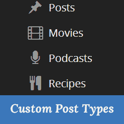

# Wordpress 概念:文章类型，最基本的东西

> 原文:[https://dev . to/a mirition/WordPress-concepts-post-types-the-most-basic-things-2bn 1](https://dev.to/amirition/wordpress-concepts-post-types-the-most-basic-things-2bn1)

Wordpress 最初是作为博客平台出现的。这意味着你可以用 Wordpress 做的最基本的事情就是发表文章。作为开发人员，您可能知道，这些帖子存储在数据库中。他们有标题、内容、一些标签、特色图片，所有这些都存储在数据库的 **wp_posts** 中。(然而，`wp`前缀可能是其他的东西)
如果您在数据库中查看这个表，一些值得注意的列是:

*   **ID:** 哪个是这个表的主键，也是你识别一个帖子的主要东西。
*   **post_author:** 是创建这篇文章的用户(或被指定为这篇文章的作者)的 ID
*   **帖子 _ 标题**
*   **帖子 _ 内容**
*   **post_name:** 这个字段与 title 不同，它实际上是 title 的 slug
*   **帖子类型:**该字段定义帖子类型，并为 amdin 中的每个帖子类型创建单独的菜单。

这些文章是 Wordpress 中的标准文章类型。例如，页面和附件也是自定义帖子类型。你可以在此链接阅读更多关于 Wordpress 默认自定义文章类型的信息。

#### 何时和如何？

CPT 是一个容易理解的概念。更重要的是怎么用，什么时候用？也许告诉你一些可以用 CPT 的案例更好:

*   你想创建一些与文章功能相同的内容，但不是文章:这可以是作品集、电影、收据、证明等。
*   您的内容与帖子不太相似，但也没有大到为其创建另一个表的程度。

为了让你知道如何创建 CPT，首先，你必须知道什么时候你应该运行你的代码，这就是所谓的动作过滤器。所以正如你在 [WordPress 开发者文档](https://developer.wordpress.org/reference/functions/register_post_type/)的例子中看到的，你可以在`init`动作中运行这段代码。这里有完整的参数列表，如果你正在开发一个主题，你可以把代码放在函数文件中。