# 通过 Azure Active Directory 使用 Spring Security

> 原文:[https://dev . to/azure/using-spring-security-with-azure-active-directory-MGA](https://dev.to/azure/using-spring-security-with-azure-active-directory-mga)

## [](#why-use-active-directory)为什么要使用 Active Directory？

老实说， [Active Directory](https://azure.microsoft.com/en-us/services/active-directory/?WT.mc_id=devto-blog-judubois) 现在并不“酷”。人们把它看得很复杂，这是真的——但安全是一件复杂的事情！它没有像 Red Hat 的 Keycloak 这样的新产品的宣传，即使两者经常用于相同的目标，至少在 Spring Boot:使用 OpenID Connect 保护商业应用程序。

然而，Active Directory 有一个非常好的特性:您的公司可能已经安装了它，并且可能已经为它付费了(提示:对于一个安全产品，如果您想要支持和最新的补丁，您最好付费——这就是为什么我总是建议为 Keycloak 付费！).官方数据显示，85%的财富 500 强公司都在使用 Active Directory，事实上(非官方数据！)经[这位聪明的黑客](https://www.shawntabrizi.com/aad/does-company-x-have-an-azure-active-directory-tenant/)证实。

因此，用 Active Directory 保护 Spring Boot 应用程序很有意义:

*   它可能已经在您的公司中安装、验证和保护
*   您将可以访问您公司的正式员工名单:无需创建新用户，处理丢失的密码，使旧员工无效...
*   它是高度安全的:你将有 2 个因素认证，等等，一切都包括在内

但是还有最后一个原因:免费！嗯，不完全免费，但如果你看一下定价模型，就会发现有一个非常慷慨的免费层。所以你可以把它用于开发或者你的创业想法，而不需要支付任何费用。

## [](#the-azure-spring-boot-starter-for-active-directory)面向 Active Directory 的 Azure Spring Boot 首发

令人欣慰的是，Azure 工程团队正在为 Azure Active Directory 提供一个 Spring Boot 启动器，可在[https://github . com/Microsoft/Azure-spring-boot/tree/master/Azure-spring-boot-starters/Azure-Active-Directory-spring-boot-Starter](https://github.com/microsoft/azure-spring-boot/tree/master/azure-spring-boot-starters/azure-active-directory-spring-boot-starter)获得。有两个官方教程可用:

*   官方教程[可在这里](https://docs.microsoft.com/en-us/java/azure/spring-framework/configure-spring-boot-starter-java-app-with-azure-active-directory?view=azure-java-stable/?WT.mc_id=devto-blog-judubois)获得。
*   在[项目 GitHub 资源库](https://github.com/microsoft/azure-spring-boot/tree/master/azure-spring-boot-starters/azure-active-directory-spring-boot-starter)中也有一个教程，它是随着代码一起更新的:这一个与最新版本的代码一起工作，没有官方的详细。

在我写这篇文章的时候，它们都有点过时了，因为更新它们是我的工作，所以我首先写这篇博客来收集反馈:

*   我们将使用 Spring Boot (2.1.8，在撰写本文的几个小时前发布)和 Azure Spring Boot 启动器(2.1.7)的最新和最好的版本
*   我们将使用新的活动目录用户界面:这是一个很大的问题，因为目前所有可用的截图都来自旧的用户界面，所以你很难找到任何东西

请不要犹豫给这篇博文添加评论，这样我可以清理一切，并创建一个令人敬畏的*官方*教程！

## [](#the-sample-project)样本项目

我们在这里做的示例项目可以在[https://github.com/jdubois/spring-active-directory](https://github.com/jdubois/spring-active-directory)获得，所以如果你想看真正的代码并测试它，它都在那里。

这是一个用 [Spring Initializr](https://start.spring.io/) 生成的 Spring Boot 项目，因为我想有一些非常简单的东西。它使用以下重要组件:

*   弹簧网
*   OAuth2 客户端，它临时包含了 Spring 安全性
*   Azure 支持
*   Spring Data JPA 和 MySQL，所以我们可以在未来构建一个“真正的”应用程序

[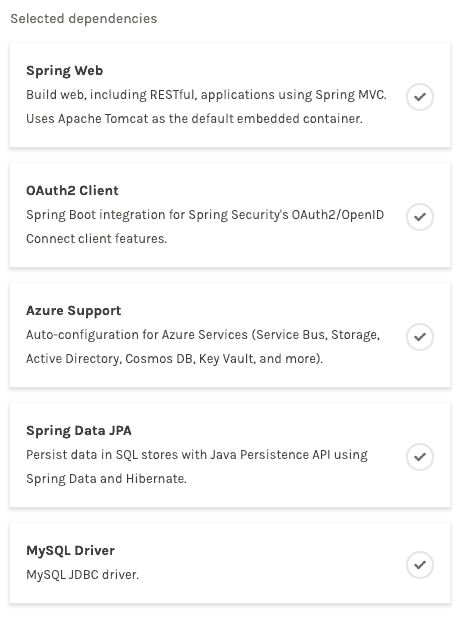T2】](https://res.cloudinary.com/practicaldev/image/fetch/s--xIua7vqP--/c_limit%2Cf_auto%2Cfl_progressive%2Cq_auto%2Cw_880/https://thepracticaldev.s3.amazonaws.com/i/cmizty0ph6d01msg3ddj.png)

## [](#configuring-active-directory)配置活动目录

现在是这个帖子的棘手部分！配置 Active Directory 很复杂，所以我们将一步一步来，并提供屏幕截图。

### [](#create-your-own-tenant)创建自己的租户

Active Directory 提供了[租户](https://docs.microsoft.com/en-us/azure/active-directory/develop/quickstart-create-new-tenant/?WT.mc_id=devto-blog-judubois)，它们基本上是您可以使用的实例。有两种类型的实例:工作和学校(我将在这里使用)，以及社交帐户(称为“Azure Active Directory B2C”)。

如前所述，有一个慷慨的免费层，因此您可以创建自己的租户，而无需支付任何费用:

*   前往 Azure 门户网站
*   选择“所有资源”，寻找“Azure 活动目录”并点击“创建”
*   填写您的组织的名称，域名和国家，你就完成了！

[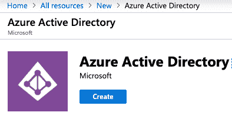T2】](https://res.cloudinary.com/practicaldev/image/fetch/s--QwA6B4Ag--/c_limit%2Cf_auto%2Cfl_progressive%2Cq_auto%2Cw_880/https://thepracticaldev.s3.amazonaws.com/i/z51edjpgzvu10ikwvwtt.png)

### [](#accessing-your-active-directory-tenant)访问您的活动目录租户

现在，您可以通过单击顶部菜单上的“目录+订阅”图标切换到您的 Active Directory 租户:

[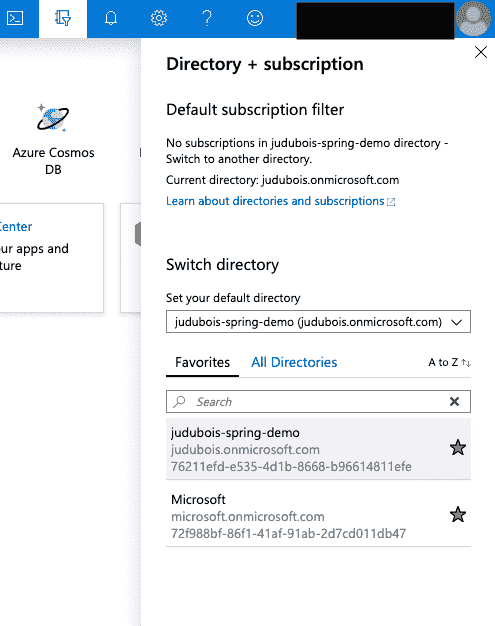T2】](https://res.cloudinary.com/practicaldev/image/fetch/s--SJKKgT_D--/c_limit%2Cf_auto%2Cfl_progressive%2Cq_auto%2Cw_880/https://thepracticaldev.s3.amazonaws.com/i/uvb2scptgotjq5q29dnd.png)

### [](#configuring-your-tenant)配置您的租户

一旦您切换到您的租户，选择“活动目录”，现在您就可以用完全管理权限对其进行配置。以下是要做的重要事情。

#### [](#click-on-app-registrations-and-create-a-new-registration)点击“应用注册”并创建新的注册:

[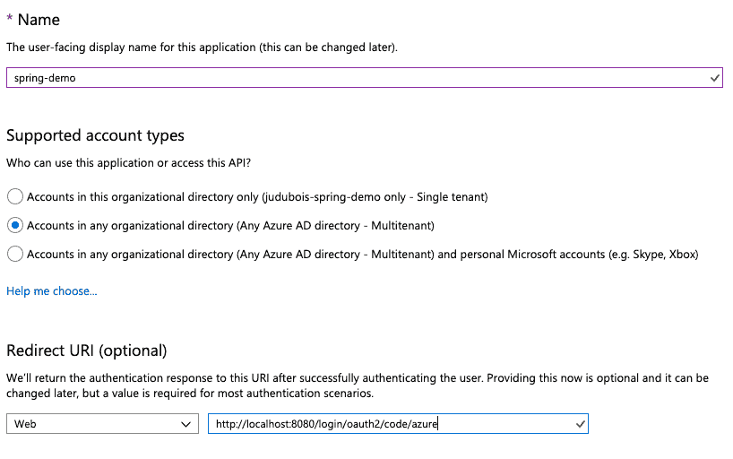T2】](https://res.cloudinary.com/practicaldev/image/fetch/s--0gueytTE--/c_limit%2Cf_auto%2Cfl_progressive%2Cq_auto%2Cw_880/https://thepracticaldev.s3.amazonaws.com/i/5doi2l51he34plbrcfw1.png)

请注意:

*   账户类型必须为“多租户”。当前的 Spring Boot 启动器不能与单租户一起工作，这是目前正在解决的一个问题。
*   重定向 URI 必须是“[http://localhost:8080/log in/oauth 2/code/azure](http://localhost:8080/login/oauth2/code/azure)”。当然，您可以用自己的域替换“localhost:8080 ”,但是后缀是默认的，将由 Spring Boot 启动器配置，如果这些 URI 不匹配，您将无法登录。

#### [](#select-the-registered-application)选择注册的应用程序

*   在“概述”中，请注意“应用程序(客户端)id”，这是 Spring Security 中使用的“客户端 id”，以及“目录(租户)ID”，这将是 Spring Security 的“租户 ID”。
*   选择“身份验证”，在 Web“平台配置”中，勾选“隐式授权”(“访问令牌”和“身份令牌”)
    [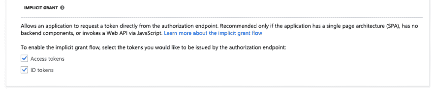](https://res.cloudinary.com/practicaldev/image/fetch/s--1LFjFygf--/c_limit%2Cf_auto%2Cfl_progressive%2Cq_auto%2Cw_880/https://thepracticaldev.s3.amazonaws.com/i/mma3d7s5yhntyzol65ay.png) 下的两个选项

*   点击“证书和秘密”，创建一个新的客户端秘密，这将是 Spring Security 的“客户端秘密”

[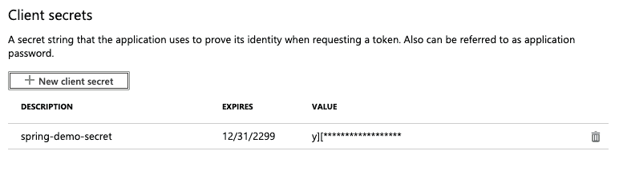T2】](https://res.cloudinary.com/practicaldev/image/fetch/s--WHodHljT--/c_limit%2Cf_auto%2Cfl_progressive%2Cq_auto%2Cw_880/https://thepracticaldev.s3.amazonaws.com/i/8ugdj0p6s5du4eo2gm9q.png)

*   点击“API 权限”，在“Microsoft Graph”下，给你的应用程序“目录”。AccessAsUser . All "和"用户。读取”权限
*   点击页面底部的“授予管理员许可”按钮

[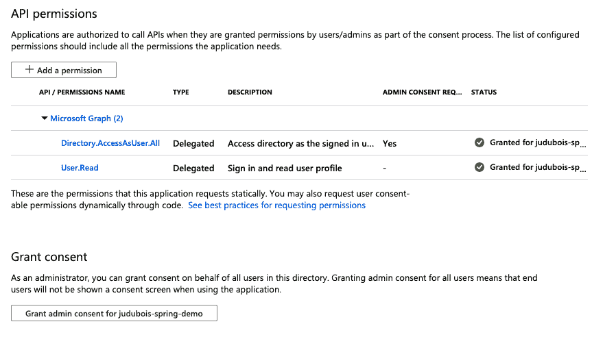T2】](https://res.cloudinary.com/practicaldev/image/fetch/s--T7YrwPzP--/c_limit%2Cf_auto%2Cfl_progressive%2Cq_auto%2Cw_880/https://thepracticaldev.s3.amazonaws.com/i/qjj2cxyox3gbvne7if2k.png)

#### [](#go-back-to-your-active-directory-tenant-and-click-on-user-settings)返回您的活动目录租户，点击“用户设置”

在“管理终端用户如何启动和查看他们的应用程序”下，验证“用户可以同意代表他们访问公司数据的应用程序”设置为“是”(这在默认情况下应该是好的)。

[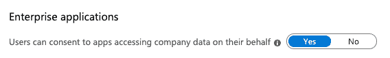T2】](https://res.cloudinary.com/practicaldev/image/fetch/s--2RO-ZEeR--/c_limit%2Cf_auto%2Cfl_progressive%2Cq_auto%2Cw_880/https://thepracticaldev.s3.amazonaws.com/i/1w7wwmfzcuduxt8nlfre.png)

#### [](#create-users-and-groups)创建用户和组

仍然在您的 Active Directory 租户中，选择“Groups”并创建一个新组，例如“group1”。

[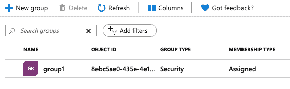T2】](https://res.cloudinary.com/practicaldev/image/fetch/s--Zx1b-3IV--/c_limit%2Cf_auto%2Cfl_progressive%2Cq_auto%2Cw_880/https://thepracticaldev.s3.amazonaws.com/i/22t20mkzckj0xy06q8do.png)

现在选择“Users”，创建一个新用户，并为该用户分配我们刚刚创建的“group1”组。

[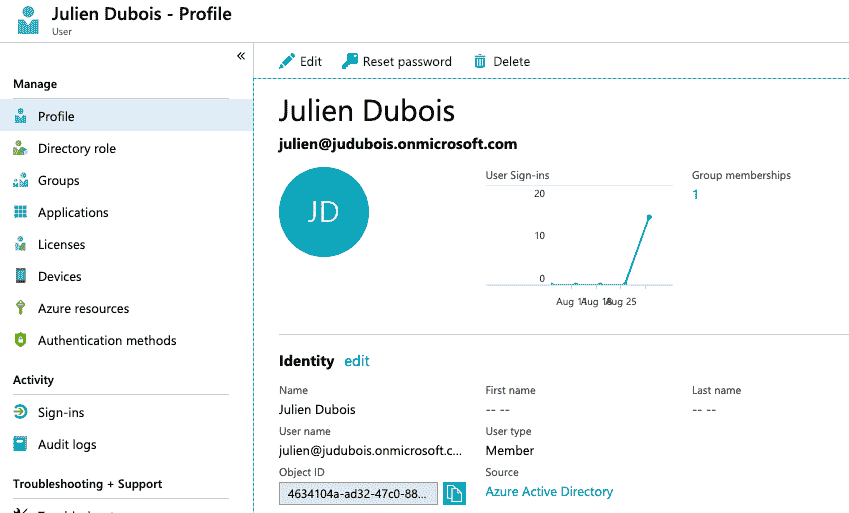T2】](https://res.cloudinary.com/practicaldev/image/fetch/s--1LHy2_hs--/c_limit%2Cf_auto%2Cfl_progressive%2Cq_auto%2Cw_880/https://thepracticaldev.s3.amazonaws.com/i/8cjaaw8v1ov812408cdr.png)

## [](#configure-the-spring-boot-application)配置 Spring Boot 应用

现在，让我们在 Spring Boot 应用程序中使用这个新用户配置的租户。

在`pom.xml`文件中，添加`azure-active-directory-spring-boot-starter` :

```
 <dependency>
            <groupId>com.microsoft.azure</groupId>
            <artifactId>azure-active-directory-spring-boot-starter</artifactId>
        </dependency> 
```

在您的`application.yml`文件中(或者如果您不喜欢 YAML，在`application.properties`文件中)，配置以下属性。请注意，当我们在 Active Directory 租户中注册应用程序时，我们获得了 3 个必需的值。

```
azure:
  activedirectory:
    tenant-id: <tenant-id>
    active-directory-groups: group1, group2

spring:
  security:
    oauth2:
      client:
        registration:
          azure:
            client-id: <client-id>
            client-secret: <client-secret> 
```

我们现在需要配置我们的 Spring Boot 应用程序来使用活动目录。创建一个新的`SecurityConfiguration`类:

```
@EnableWebSecurity
public class SecurityConfiguration extends WebSecurityConfigurerAdapter {

    private final OAuth2UserService<OidcUserRequest, OidcUser> oidcUserService;

    public SecurityConfiguration(OAuth2UserService<OidcUserRequest, OidcUser> oidcUserService) {
        this.oidcUserService = oidcUserService;
    }

    @Override
    protected void configure(HttpSecurity http) throws Exception {
        http
                .authorizeRequests()
                .anyRequest().authenticated()
                .and()
                .oauth2Login()
                .userInfoEndpoint()
                .oidcUserService(oidcUserService);
    }
} 
```

这种配置要求每个请求都是安全的，因此当用户试图连接时，会将他重定向到 Active Directory。

## [](#running-everything)运行一切

运行 Spring Boot 应用程序时，我们建议您添加一个具有以下配置的`src/main/resources/logback-spring.xmllogback-spring.xml`文件，以便更好地理解您可能会遇到的问题:

```
<?xml version="1.0" encoding="UTF-8"?>
<!DOCTYPE configuration>

<configuration scan="true">
    <include resource="org/springframework/boot/logging/logback/base.xml"/>

    <logger name="org.springframework.security" level="DEBUG"/>
    <logger name="com.microsoft" level="DEBUG"/>
    <logger name="com.example" level="DEBUG"/>

</configuration> 
```

现在，如果您运行该应用程序，在 [http://localhost:8080](http://localhost:8080) 上访问它应该会将您指向 Active Directory，在那里您可以使用我们之前刚刚创建的用户对其进行签名:

[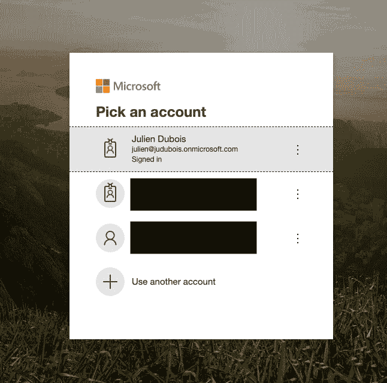T2】](https://res.cloudinary.com/practicaldev/image/fetch/s--bPifxBt5--/c_limit%2Cf_auto%2Cfl_progressive%2Cq_auto%2Cw_880/https://thepracticaldev.s3.amazonaws.com/i/5f8dsl9e2p7wzs2684oz.png)

## [](#testing-the-security)测试安全性

为了知道一切是否正确，包括我们的用户是否真的获得了我们之前配置的“group1”角色，让我们添加一个名为`AccountRessource` :
的特定 Spring MVC 控制器

```
package com.example.demo;

import org.springframework.security.core.Authentication;
import org.springframework.security.core.context.SecurityContextHolder;
import org.springframework.web.bind.annotation.GetMapping;
import org.springframework.web.bind.annotation.RestController;

@RestController
public class AccountResource {

    @GetMapping("/account")
    public Authentication getAccount() {
        return SecurityContextHolder.getContext().getAuthentication();
    }
} 
```

访问[http://localhost:8080/account](http://localhost:8080/account)现在应该会给你所有用户的安全信息，包括他的角色！恭喜您，您已经使用 Active Directory 保护了您的 Spring Boot 应用程序！