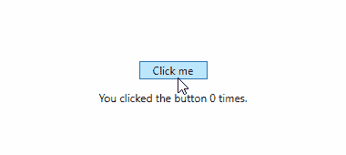

# C#数据绑定:在 WPF 应用程序中使用 INotifyPropertyChanged

> 原文:[https://dev . to/bradwell sb/c-data-binding-using-inotifypropertychanged-in-wpf-apps-j96](https://dev.to/bradwellsb/c-data-binding-using-inotifypropertychanged-in-wpf-apps-j96)

[来源](https://wellsb.com/csharp/advanced/wpf-data-binding-csharp-inotifypropertychanged/)

了解如何使用 INotifyPropertyChanged 接口将 WPF 应用程序中的 UI 控件绑定到 C#代码中的属性。

## [](#c-data-binding)C#数据绑定

在之前的教程中，您学习了[如何创建一个事件处理程序](https://wellsb.com/csharp/advanced/csharp-event-handler-example/)并将其附加到一个事件上，比如点击一个按钮。例如，您学习了如何在用户点击按钮时使用`statusLabel.Content = "You clicked the button!";`来改变标签的内容。

假设，您希望程序在每次触发事件时显示不同的字符串，例如按钮被点击的次数。首先，您需要一个事件处理程序来增加代码中某个计数器变量的值。然后，您需要确保 UI 被重新绘制，以便变量的新值正确地显示在屏幕上。

您可能想创建一个类似于下面的事件处理程序:

```
public int Counter;

private void Button_Click(object sender, RoutedEventArgs e)
{
    Counter++;
    countLabel.Content = $"You clicked the button {Counter} times.";
} 
```

这段代码可以工作，每次单击按钮时，应用程序都会用新的计数更新标签内容，但这不是推荐的做法。随着您的项目越来越高级，每次引发事件时都必须不断地重新定义 UI 元素的内容是很乏味的(而且是资源密集型的)。

相反，最好将正在更改的属性直接绑定到 UI 控件，这样前端用户界面将自动适应对属性值所做的后端更改。这就是所谓的数据绑定，它是 UI 应用程序开发的重要组成部分。

## [](#wpf-binding-with-xaml)WPF 与 XAML 的结合

从新的 WPF 应用程序开始，通过修改 MainWindow.xaml 文件创建一个带有单个按钮和标签的用户界面。

```
<Grid>
    <Button x:Name="myButton" Content="Click me" HorizontalAlignment="Center" Margin="0,0,0,0" VerticalAlignment="Center" Width="75" Click="Button_Click"/>
    <Label x:Name="counterLabel" Content="{Binding Counter}" Margin="0,60,0,0" HorizontalAlignment="Center" VerticalAlignment="Center"/>
</Grid> 
```

标签的内容属性应该如下所示:`Content="{Binding Counter}"`。这将把这个标签控件(名为 **counterLabel** )的内容绑定到某个名为 **Counter** 的 C#属性。

要使绑定工作，首先需要定义**计数器**属性，然后配置程序在属性值改变时通知 UI。首先创建一个包含名为**计数器**的公共属性的类。

```
public class CountModel
{
    private int _counter;

    public int Counter
    {
        get { return _counter; }
        set
        {
            _counter = value;
        }
    }
} 
```

在这个类中，我们定义了一个私有的**_ 计数器**整数和一个公共的**计数器**属性。记住，C#是区分大小写的语言，所以 MainWindow.xaml 中定义的标签被绑定到公共属性 **Counter** 。使用`get`和`set`访问器来公开和访问它。私有字段只是保存公共属性的值。

## [](#implementing-inotifypropertychanged)实现 INotifyPropertyChanged

现在您已经定义了计数器属性，您需要通知 UI 该属性已经被更改。为此，您的类需要实现`INotifyPropertyChanged`接口。将第 31 行改为:

```
public class CountModel : INotifyPropertyChanged 
```

`INotifyPropertyChanged`位于`System.ComponentModel`名称空间中，因此您需要通过一个`using`指令来添加名称空间。

```
using System.ComponentModel; 
```

回想一下，当你[了解到委托](https://wellsb.com/csharp/advanced/how-to-use-delegates-in-csharp/)时，委托可以在事件处理中将值传递给 UI 线程。要实现`INotifyPropertyChanged`接口，您必须将`PropertyChangedEventHandler`委托注册为一个事件。

```
public event PropertyChangedEventHandler PropertyChanged; 
```

最后，创建一个名为`OnPropertyChanged()`的方法，每当计数器**的值**改变时，这个方法就会触发。

```
public class CountModel : INotifyPropertyChanged //using System.ComponentModel;
{
    private int _counter;

    public int Counter
    {
        get { return _counter; }
        set
        {
            _counter = value;
            OnPropertyChanged(nameof(Counter));
        }
    }

    public event PropertyChangedEventHandler PropertyChanged;

    protected void OnPropertyChanged(string propertyName)
    {

    }
} 
```

通过调用`set`访问器中的`OnPropertyChanged()`方法，可以确保每次属性改变时都会引发该事件。`OnPropertyChanged()`方法应该接收被更改属性的名称作为参数。这应该对应于绑定到 UI 控件`{Binding Counter}`的属性的名称。41 行相当于`OnPropertyChanged("Counter");`。

最后写`OnPropertyChanged()`方法。当引发`PropertyChanged`事件时，该方法将实例化一个包含已更改属性名称的对象，以便 UI 控件可以连接到适当的属性。

```
protected void OnPropertyChanged(string propertyName)
{
    if (PropertyChanged != null)
    {
        PropertyChanged(this, new PropertyChangedEventArgs(propertyName));
    }
} 
```

现在，程序将监听对**计数器**属性的更改，当这些更改发生时，UI 将自动更新以反映这些更改。

## [](#improving-the-code)提高代码

为了减少调用`OnPropertyChanged()`方法时输入错误的可能性，使用`System.Runtime.CompilerServices`名称空间的`CallerMemberName`类可能会有好处。在这种情况下，可以调用`OnPropertyChanged()`而不传递任何属性。只需按如下方式更改方法定义。

```
protected void OnPropertyChanged([CallerMemberName] string propertyName = "") 
```

注意，为了使用`CallerMemberName`，您需要添加一个`using System.Runtime.CompilerServices;`指令并为`propertyName`参数定义一个默认值。

您可以通过用空条件成员访问操作符`?.`(也称为 Elvis 操作符)替换 *if not null* 条件来简化`OnPropertyChanged()`方法。一旦确定委托不为空，`?.`操作符就会调用委托。

```
protected void OnPropertyChanged([CallerMemberName] string propertyName = "")
{
    PropertyChanged?.Invoke(this, new PropertyChangedEventArgs(propertyName));
} 
```

## [](#final-bits)最终位

最后，在`public partial class MainWindow`中创建一个`CountModel`对象的实例，但是不包含任何子类。您将使用这个对象的名称来设置来自 XAML 文件的**反标签**的`DataContext`属性。

```
public partial class MainWindow : Window
{
    CountModel countModel = new CountModel();
    public MainWindow()
    {
        InitializeComponent();
        counterLabel.DataContext = countModel;
    }
... 
```

下面是您完成的代码应该是什么样子的:

```
using System;
using System.Collections.Generic;
using System.ComponentModel;
using System.Runtime.CompilerServices;
using System.Windows;

namespace DataBinding
{
    public partial class MainWindow : Window
    {
        CountModel countModel = new CountModel();
        public MainWindow()
        {
            InitializeComponent();
            counterLabel.DataContext = countModel;
        }

        public class CountModel : INotifyPropertyChanged
        {
            private int _counter;

            public int Counter
            {
                get { return _counter; }
                set
                {
                    _counter = value;
                    OnPropertyChanged();
                }
            }

            public event PropertyChangedEventHandler PropertyChanged;

            protected void OnPropertyChanged([CallerMemberName] string propertyName = "")
            {
                PropertyChanged?.Invoke(this, new PropertyChangedEventArgs(propertyName));
            }
        }

        private void Button_Click(object sender, RoutedEventArgs e)
        {
            countModel.Counter++;
        }
    }
} 
```

## [](#formatting-ui-controls)格式化 UI 控件

目前，这款应用相当无趣。标签会显示一个数字，并且每次单击按钮都会增加该数字。幸运的是，有一种方法可以将 UI 控件绑定到 changing counter 属性，然后格式化标签显示的字符串。

```
<Label x:Name="counterLabel" Content="{Binding Counter}" ContentStringFormat="You clicked the button {0} times." Margin="0,60,0,0" HorizontalAlignment="Center" VerticalAlignment="Center"/> 
```

现在，标签显示一个格式化的字符串，该字符串包含一个计数器，该计数器自动响应对 C#属性的更改。每次引发按钮单击事件时，属性都会递增。当引发属性更改事件时，用户界面会得到通知，标签也会更新。

[T2】](https://res.cloudinary.com/practicaldev/image/fetch/s--WnAODqIM--/c_limit%2Cf_auto%2Cfl_progressive%2Cq_66%2Cw_880/https://wellsb.com/csharp/wp-content/uploads/sites/2/2019/09/wpf-data-binding-min.gif)

您可以像对 C#字符串使用[复合格式](https://wellsb.com/csharp/beginners/csharp-string-interpolation-vs-composite-formatting/)一样使用`ContentStringFormat`属性。在上面的例子中，您创建了一个格式化的字符串，它在期望的位置`{0}`替换绑定的参数。它也可以用来格式化一个变量，显示为一种货币`{0:C}`或一个带有指定小数点位数的数字`{0:N2}`。

如果用 TextBlock 代替标签，就用`StringFormat`代替`ContentStringFormat`。下面是一个例子:

```
<TextBlock x:Name="counterTextBlock" Text="{Binding Counter, StringFormat='You clicked the button {0} times.'}" Margin="0,120,0,0" HorizontalAlignment="Center" VerticalAlignment="Center"/> 
```

## [](#the-bottom-line)底线

将前端视图控件元素正确绑定到后端模型中的变量和属性是 C#应用程序开发的重要部分。本教程中的例子遵循了 WPF 应用程序开发的 MVVM 模式，但其原理与 ASP.NET web 开发的 MVC 模式相似。在本教程中，您了解了在 C#中绑定数据的概念。您学习了如何将 XAML 元素绑定到 C#类属性，以及如何设置结果字符串的格式以显示在您的应用程序中。评论是开放的，你可以有任何问题。

[来源](https://wellsb.com/csharp/advanced/wpf-data-binding-csharp-inotifypropertychanged/)