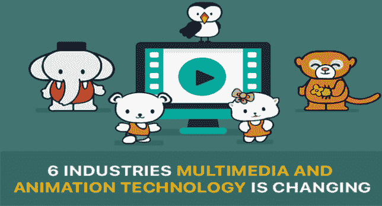

# 6 个行业多媒体和动画技术正在发生变化

> 原文：<https://dev.to/oliviab15089179/6-industries-multimedia-and-animation-technology-is-changing-2611>

多媒体，尤其是动画，已经在我们的日常生活中占据了一个非常特殊的位置，而我们甚至没有意识到这一点。

无论是通过石器时代洞穴中的标记，还是跨越三千年的皮影戏，抑或是从 17 世纪开始的魔法灯笼，动画一直以这样或那样的形式成为丰富多彩的世界历史的一部分。

我们已经走过了漫长的道路，从洞穴中的标记发展到数字形式，现在进入全息摄影(全息图的投影，肉眼可见的物体的 3D 视图)。

多媒体包含了所有能迅速吸引人们注意力的元素。这种诱惑的力量促进了在许多专业领域的应用。动画已经成为一种元素，它不仅被用作一种表现工具，而且已经完整地帮助这些领域发展并简化了该领域的许多方面。

让我们评价一下[动画和多媒体](https://www.goodfirms.co/animation-multimedia)已经扎根的几个产业:

**1)。教育:**粉笔、黑色记号笔和白板长期以来主导着学习、发展和课堂。在书籍的帮助下，有时还有投影幻灯片，学习缺乏通过 2D 媒介对物体的适当可视化。然而，随着采用多媒体内容编写的培训模块被接受，这一不足之处也得到克服。随着虚拟现实的出现和动画的加入，模拟训练已经发展到一个非常先进的阶段。这种互动模块为学习提供了一个新的层面。

**2)。广告:动画是现代广告的核心。事实证明，基于产品的动画在视觉上很吸引人，也很有利可图。通过创意动画广告展示价值观和身份非常有效，在电视和互联网上效果很好，深受观众喜爱。像许多世界知名品牌一样，将一个动画角色或吉祥物联系在一起可以增加辨识度。观众对 Cel 动画在广告中的使用有很好的认知，这也产生了持久的影响。**

**3)。娱乐:**动画的一个重要用途是在娱乐业。动画是在电影上讲故事的有用工具，让创作者用想象力创造奇迹，变出一个看起来几乎不可思议的虚幻世界。随着对 CGI 和 VFX 电影的喜爱，动画已经与电影产业密不可分。许多创作者还制作了有趣的片头字幕，以增加电影的吸引力和整体介绍。

**4)。游戏:**动画是电子游戏的灵魂，是游戏的基础。与电影不同，动画不仅是必需的，而且是视频游戏的核心。由于动画的交互性，它需要在游戏中达到最高的质量。动画的执行和质量直接影响到一款视频游戏的成功。令人震惊的视觉效果是成功的视频游戏的关键因素之一，因为人们更倾向于审美愉悦的游戏。

**5)。营销:**动画为营销活动带来了创造力和想象力，并有助于以非常逼真的方式展示产品。在营销中使用动画不仅可以增强视觉吸引力，还可以刺激情绪，有助于吸引观众。一个制作得当的视频和一个互动的动画可以成倍地增加一个品牌的观众。在用户在社交媒体上分享大量内容的数字世界中，一个迷人的促销动画可以为品牌创造奇迹。

**要了解更多信息，请阅读:[你需要使用讲解视频的 9 个有力理由](https://www.itechfy.com/marketing/9-powerful-reasons-you-need-to-use-explainer-videos/)**

**6)。建筑和工程:**从在 3D 动画模型中表现建筑师对结构的看法到工程师设计机器部件，动画已经证明它的应用不仅仅是准备刺激的内容，而且在这些领域非常有益。动画提供了建筑项目及其周围环境的真实视图，甚至在施工开始之前。类似地，机械产品的装配、配置、操作模式和机器部件的工作也通过动画来表示。

多媒体和动画已经成为我们生活中不可或缺的一部分，我们甚至不能开始定义没有它的生活，更不用说体验它了。顶尖的多媒体和动画公司[帮助品牌开发吸引人的内容](https://www.digitaledge.org/4-killer-ways-to-grow-your-business-with-animation/),这些内容可以在视觉上丰富观众的体验，同时直接甚至潜意识地传递核心信息。不管是哪一个行业，熟练地使用多媒体将会获得更多的关注，给公司带来更多的品牌意识。你身边合适的创意动画师会帮助你将你的想象可视化到数字屏幕上。

请点击此处找到本文[的原始来源](https://tweakyourbiz.com/technology/technology-trends/multimedia-animation)