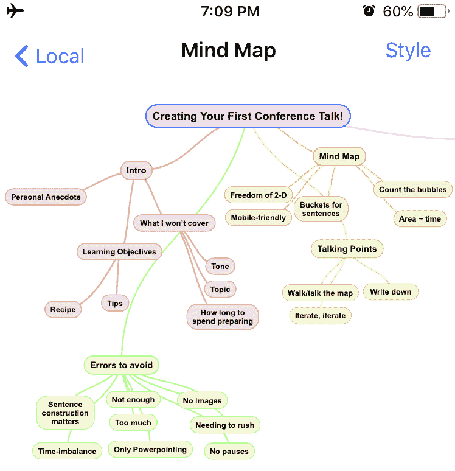
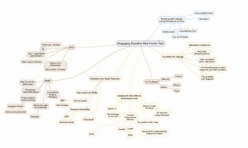

# 如何在你的第一次会议演讲中生存下来

> 原文:[https://dev . to/dean ius/how-to-survive-your ' s first-conference-talk-1 bpk](https://dev.to/deanius/how-to-survive-your-first-conference-talk-1bpk)

# 如何度过你的第一次会议演讲

[T2】](https://res.cloudinary.com/practicaldev/image/fetch/s--sZqvKf_i--/c_limit%2Cf_auto%2Cfl_progressive%2Cq_auto%2Cw_880/https://s3.amazonaws.com/www.deanius.com/freakout-cat.jpg)

这些听起来熟悉吗？

*   你选择了一个看起来有有趣的人和主题的会议。
*   你写了 1 个(或更多)关于你想分享或了解的东西的提议。
*   令你惊讶的是，你被选中出席会议！
*   现在，那种沮丧的感觉- *哦，糟糕，我怎么才能摆脱这一切呢？*

当我得知我将在 [RxJS Live](https://rxjs.live) 发表演讲，并且只有 3 天时间来充实演讲内容时，我很兴奋，但也很焦虑。但是当我成功的时候，我意识到我需要和其他可能有类似需求的人分享。

如果你是一个喜欢遵循食谱的人，我会推荐一个你可以使用的食谱。这是我所遵循的过程的理想化版本。我遵循一个过程，因为没有时间可以浪费。我认为它帮助我创造了一个演讲:

*   组织
*   节奏很快
*   能够被清楚地说出来

有些事情，我不会在这篇文章中涉及，但是:

*   准备工作的每一部分要花多少时间
*   你的主题是什么，或者有多深
*   如何有效地使用声音和肢体语言

但是我会检查你需要做的准备的每一部分，并在每一部分给你留下一些简单、容易的收获。

另外，如果你想向比我更擅长此道的人学习，我可以推荐贾斯汀·瑟尔斯的《精心策划会议演讲》。

现在，让我们开始吧！

* * *

# 思维导图吧

你需要做的第一件事是决定你要覆盖什么，不要覆盖什么。亲爱的演讲者，对你来说最大的风险是对材料的过度投入。我发现组织可能的主题的最好的思考工具是思维导图。正确使用的话，它会很快，很有趣，让你知道什么时候你已经够了，或者太多了。

思维导图是你有机构建的主题的二维布局。思维导图实际上有一个具体的定义，有基于神经科学的规则和明确的好处，你可以在[思维导图书](https://www.amazon.com/Mind-Map-Book-Thinking-Potential/dp/0452273226/ref=asc_df_0452273226/?tag=hyprod-20&linkCode=df0&hvadid=312562231174&hvpos=1o1&hvnetw=g&hvrand=3402376297543394140&hvpone=&hvptwo=&hvqmt=&hvdev=c&hvdvcmdl=&hvlocint=&hvlocphy=9021565&hvtargid=pla-434642348396&psc=1)中读到。但是现在，使用任何便携式工具——铅笔&纸，或者非常棒的 SimpleMind 应用程序。我怎么推荐 [SimpleMind](https://simplemind.eu) 都不为过——它很直观，不碍事，允许我在旅途中和飞行模式下编辑！下面是这篇博文的思维导图:

[T2】](https://res.cloudinary.com/practicaldev/image/fetch/s--j-MG54KG--/c_limit%2Cf_auto%2Cfl_progressive%2Cq_auto%2Cw_880/https://s3.amazonaws.com/www.deanius.com/mind-map-talk.png)

思维导图的建议:

做什么:

*   充分利用以任何顺序添加主题的自由
*   保持对气泡(“主题”)的描述简短
*   创建主题的邻域(“主题组”)
*   实际上身体上*在*周围走动，大声说话，好像在演讲，但没有压力。很好玩！:)

不要做什么:

*   准确决定每个主题的内容
*   沉迷于图像或工作
*   让压力在成品上累积

一个好的经验法则是，在你必须填满的每分钟时间里，在你的思维导图上有**一个主题。就我而言，我讲了 30 分钟。这是我给的演讲地图的一张故意模糊的图片，所以你可以看到它的形状和结构:**

[T2】](https://res.cloudinary.com/practicaldev/image/fetch/s--iDnddEDW--/c_limit%2Cf_auto%2Cfl_progressive%2Cq_auto%2Cw_880/https://s3.amazonaws.com/www.deanius.com/mm-blur.jpg)

每个区域的视觉权重显示了你的演讲的各个部分是否大致平衡。需要 3-6 个主题来创建一个令人难忘的[故事——介绍、阐述和解决的弧线](https://en.wikipedia.org/wiki/Story_arc)。因此，大约 5-6 个主题可以给人一种进步的感觉，而不会使事情变得繁琐。太小了，一个话题群就会被遗忘，所以每一个都需要骨头上有点肉。许多令人难忘的歌曲都有那么多部分——几节、合唱、一个桥段。如果每个话题组都像甲壳虫乐队的歌曲一样令人难忘，那就没问题了:)

你的思维导图做完了吗？太好了！现在，我们需要按照统一的顺序排列主题，并允许平稳过渡。这非常重要，所以让我们开始吧..

* * *

# 叙述-主题顺序

二维头脑风暴很有趣，但是你的演讲必须是线性的。因此，现在您必须确定一个订单，并迭代它，直到它是平滑的。

你要做的是，通过你的思维导图说话，针对每个话题至少说几句你想说的话。你可以随心所欲地多次这样做，根据需要完善你的思维导图。最好现在就调试主题顺序，而不是在一个顺序中开始构建。

SimpleMind 在这方面胜出，它能够将你的思维导图转化为一个大纲。您可以对这个大纲进行重新排序，并且仍然保持思维导图的精确视觉分组！同样，从这篇文章的思维导图来看:

[T2】](https://res.cloudinary.com/practicaldev/image/fetch/s--DtLyD-Nb--/c_limit%2Cf_auto%2Cfl_progressive%2Cq_auto%2Cw_880/https://s3.amazonaws.com/www.deanius.com/mm-outline.jpg)

围绕你的思维导图谈论几次，从一个话题到另一个话题，直到你每次都达到相同的顺序。这可能需要多个会话才能做到这一点，没关系！在它还不稳定的时候继续前进将会是灾难性的，会耗费你没有的时间。写你的叙事和选择图像是所有剩下的事情，这可以在枪口下完成，但大规模的重新排序不能！

只有准备好了，才开始写你的谈话要点。

* * *

# 叙述-谈话要点

既然主题顺序已经确定，你应该开始写下你在浏览地图时想到的那些话题。一般来说，你会一直说下去，但在整个过程中会有停顿。这意味着每个主题都需要单词，当然，单词在句子中会更好！所以你要写句子——每个话题大约 5 个。

这方面的经验法则是:

**每题最多 5 句，每句话 15-20 个单词！**

这些数字是有原因的。但是先别担心这个。现在，你的目标只是捕捉那些决定主题顺序的想法。写出每个句子的过程会对你有很大帮助。你越能准确地用词，你听起来就越专业，越优雅。也许你现在没有时间，但至少试着创造感觉正确的句子，并且是真正的你。基于每分钟 120-150 个单词的语速，5 个 15-20 个单词的句子，给你的单词预算留有余地，你可以把它变成停顿，或者在以后即兴发挥。

现在开始吧！

做什么:

*   重新走一遍你的思维导图，写下帮助你确定主题顺序的句子
*   使用文本编辑器，保持句子足够短，这样它们就能占据一行。

不要做什么:

*   题目顺序不扎实的时候再写你的句子。
*   将这些文字以项目符号的形式展示在幻灯片上(将它们保存在演示者笔记中，或者放在一个单独的应用程序中，如文本编辑器)

* * *

# 视觉效果/幻灯片

[T2】](https://res.cloudinary.com/practicaldev/image/fetch/s--IPBM1niJ--/c_limit%2Cf_auto%2Cfl_progressive%2Cq_auto%2Cw_880/https://images.unsplash.com/photo-1542050939822-419d5716b8b3%3Fixlib%3Drb-1.2.1%26ixid%3DeyJhcHBfaWQiOjEyMDd9%26auto%3Dformat%26fit%3Dcrop%26w%3D2550%26q%3D80)

恭喜你-你在最后冲刺阶段！在我 30 分钟的演讲中，我花了两天时间做了前面的步骤，在运输途中，排队等候——任何我能做的地方。这最后一步是我在会议第一天后的两个半小时内完成的，也是我继续会议的前一天。寻找/制作图像和迷因，选择道具——我觉得这很有趣。是手掌因为兴奋而开始出汗的地方，而不仅仅是神经！

从每个主题组开始，大声练习每个主题的句子，问问自己你的听众应该看到什么。这些方法中的每一种以及其他方法都可以考虑:

*   孤独的形象
*   要点
*   代码示例
*   观众示范或投票

有 30 个或更多的主题，你的听众需要多样化:每个主题都不能以同样的方式表达！你的内容，以及你准备的时间，将决定你要展示或播放的内容。但是，多样化会让事情变得更令人难忘。在你努力工作之后，你最不希望的事情就是你的信息被遗忘。

做什么:

*   完成后，用图片讨论每个主题组。
*   用一个秒表，用准确的单词和视觉支持来记录每一部分的时间，以验证它仍然与故事情节相吻合
*   练习！练习！

不要做什么:

*   如果你时间紧迫，尝试一个全新的演示软件。
*   得到一个大主意来增加或重写超过 1%
*   抓狂然后取消整件事(真的吗？)

记住**为什么**这件事对你这么重要。

记住**你喜欢这个话题的什么**。

记住**你多么**想为你的观众做得更好。

最后，他们不会评判你的幻灯片，甚至不会评判你。他们想达到一个新的理解水平，感觉更聪明，更开明，更有意识。你只能尽力而为。但是你在那里是有原因的，一旦你到了这一步，你就真的无能为力了。所以请相信——一旦你准备好了这些，你就会坠入宇宙。你能行的！(让我知道进展如何)

[T2】](https://res.cloudinary.com/practicaldev/image/fetch/s--dilA4Tp3--/c_limit%2Cf_auto%2Cfl_progressive%2Cq_auto%2Cw_880/https://s3.amazonaws.com/www.deanius.com/family.jpg)