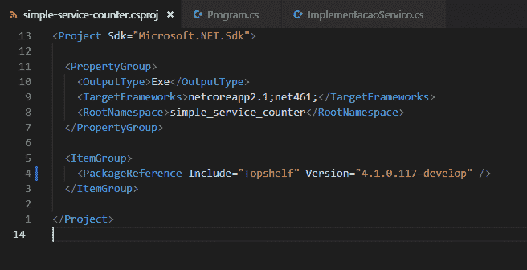
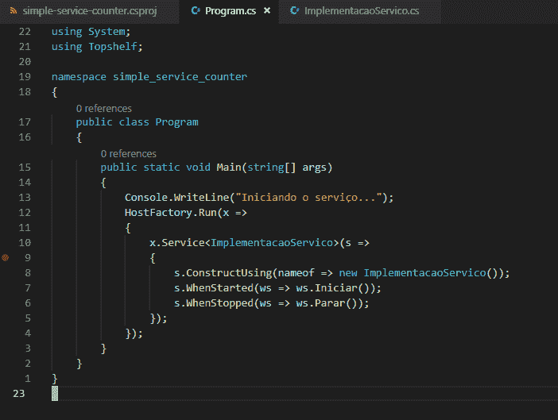
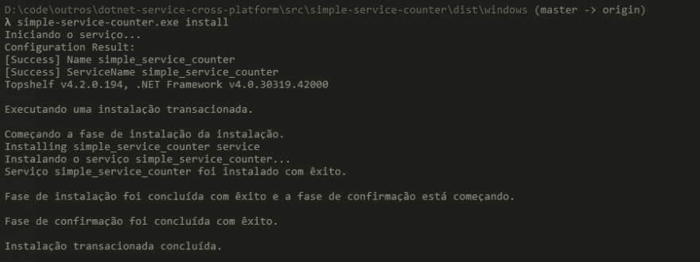
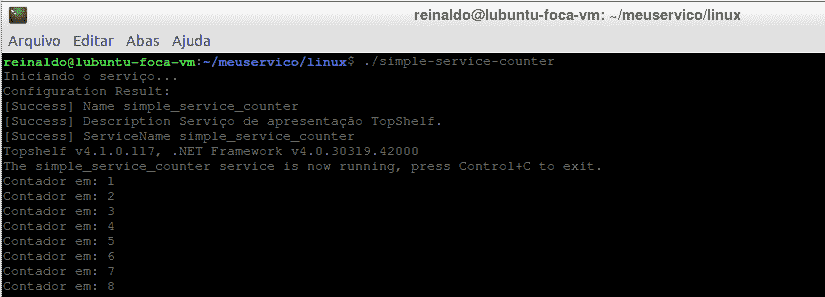
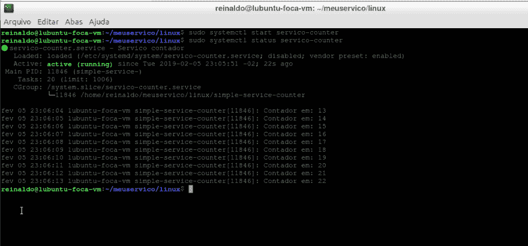

# 是否可以生成 Windows/Linux com .Net 服务？

> [https://dev . to/reinaldous Coelho/da-generar-servicio-windows-com-net-5g 2m；](https://dev.to/reinaldocoelho/da-pra-gerar-servico-windows-linux-com-net-5g2m)

最近，我需要维护一个 Windows 服务代码，该代码也可以作为 Linux 上的服务运行。

通过研究一些可能性，我发现最优雅的方法是利用相同的 dotnetcore 项目来生成 Windows 服务或允许在 Linux 上将其配置为服务的 CLI。

接下来，我将解释我使用 topshelf 库并为每个平台生成一个汇编所执行的所有步骤。

GitHub 上提供了以下所有代码:

*   [点网-服务-跨平台](https://github.com/reinaldocoelho/dotnet-service-cross-platform)

## 什么是 topshelf 图书馆

[【top help】](http://topshelf-project.com/)是一个旨在简化和组织生成 Windows 服务的过程的图书馆。

从 4.1 版开始，它支持标准“**”net standard 2.0“**”使我们能够编译 FullFramework 和 dotnetcore 的项目。

目前，它的工作方式如下:使用 topshelf 库创建控制台应用程序；它会自动了解一些命令，例如执行 Windows 服务安装的命令。如果您未输入 topshelf 所需的任何参数，则应用程序将作为控制台运行，从而使我们能够完成我们所期望的操作。

## 创建通用代码

通用代码将是 dotnetcore 中的控制台项目(在本例中使用 2.1 版)，我将在其中添加 topshelf 库的依赖项。

创建项目的初始命令序列为:

```
c:\code\simple-service-counter> dotnet new console 
```

Enter fullscreen mode Exit fullscreen mode

接下来我们添加了对 topshelf 的引用:

```
c:\code\simple-service-counter > dotnet add package Topshelf --version 4.1.0.177-develop 
```

Enter fullscreen mode Exit fullscreen mode

接下来，我们将调整设计以支持多个框架，从而使我们的构建能够针对这两个平台进行编译。

[](https://res.cloudinary.com/practicaldev/image/fetch/s--S-Gor4ki--/c_limit%2Cf_auto%2Cfl_progressive%2Cq_auto%2Cw_880/https://raw.githubusercontent.com/reinaldocoelho/dev.to/master/blog-posts/da-pra-gerar-servico-windows-linux-com-dotnet/assets/image1.png)

我们将创建一个类(“T0”)来实现 service . cs，该类将成为我们的服务代码。我们的服务将是一个简单的计数器，但你可以实施你需要的。

[.")](https://res.cloudinary.com/practicaldev/image/fetch/s--zle8cX_k--/c_limit%2Cf_auto%2Cfl_progressive%2Cq_auto%2Cw_880/https://raw.githubusercontent.com/reinaldocoelho/dev.to/master/blog-posts/da-pra-gerar-servico-windows-linux-com-dotnet/assets/image2.png)

接下来，我们将配置 console 项目的初始类以使用 topshelf 并调用我们的逻辑。

[](https://res.cloudinary.com/practicaldev/image/fetch/s--DRRe_fY_--/c_limit%2Cf_auto%2Cfl_progressive%2Cq_auto%2Cw_880/https://raw.githubusercontent.com/reinaldocoelho/dev.to/master/blog-posts/da-pra-gerar-servico-windows-linux-com-dotnet/assets/image3.png)

很好，只需几步，您就可以运行您的项目，以验证它是否像普通控制台一样工作。

运行下面的命令以查看您的服务作为控制台运行:

```
c:\code\simple-service-counter > dotnet run --framework net461 (ou netcoreapp2.1) 
```

Enter fullscreen mode Exit fullscreen mode

如果一切都是正确的，你应该有这样的结果:

[](https://res.cloudinary.com/practicaldev/image/fetch/s--yWyXZu04--/c_limit%2Cf_auto%2Cfl_progressive%2Cq_auto%2Cw_880/https://raw.githubusercontent.com/reinaldocoelho/dev.to/master/blog-posts/da-pra-gerar-servico-windows-linux-com-dotnet/assets/image4.png)

你还好吗？接下来，我们将在 Windows 上生成并安装该服务，然后在 Linux 上进行安装。

## 公共场所没有窗户

首先，我们将发布指向 4.6.1 框架的服务，该框架允许我们在 windows 上安装该服务。

运行以下命令以生成发布:

```
c:\code\simple-service-counter > dotnet publish simple-service-counter.csproj -c Release -f net461 -o dist\windows --self-contained 
```

Enter fullscreen mode Exit fullscreen mode

现在，我们将在 windows 上安装它，方法是:浏览到项目文件夹中的“”文件夹，然后键入:

```
c:\code\simple-service-counter\dist\windows > simple-service-counter.exe install 
```

Enter fullscreen mode Exit fullscreen mode

您必须具有以下输出:

[](https://res.cloudinary.com/practicaldev/image/fetch/s--gMI7QWc7--/c_limit%2Cf_auto%2Cfl_progressive%2Cq_auto%2Cw_880/https://raw.githubusercontent.com/reinaldocoelho/dev.to/master/blog-posts/da-pra-gerar-servico-windows-linux-com-dotnet/assets/image5.png)

如果打开 Windows 服务管理器，则可以启动和停止服务。

[.")](https://res.cloudinary.com/practicaldev/image/fetch/s--MVsYA_m9--/c_limit%2Cf_auto%2Cfl_progressive%2Cq_auto%2Cw_880/https://raw.githubusercontent.com/reinaldocoelho/dev.to/master/blog-posts/da-pra-gerar-servico-windows-linux-com-dotnet/assets/image6.png)

要删除服务，只需键入:

```
c:\code\simple-service-counter\dist\windows > simple-service-counter.exe uninstall 
```

Enter fullscreen mode Exit fullscreen mode

法希尔内。

## public Ando e instalando no Linux

对于 Linux，我们将使用 dotnetcore 2.1 进行发布，而对于 Linux，我们将使用“**self-contained”**选项进行发布(这将导致发布具有所有依赖项，包括框架，从而避免在 Linux 上安装该框架)。

要生成发布，请运行命令:

```
c:\code\simple-service-counter > dotnet publish simple-service-counter.csproj -c Release -f netcoreapp2.1 -o dist\linux -r linux-x64 --self-contained 
```

Enter fullscreen mode Exit fullscreen mode

现在，我们将压缩项目发布到的文件夹☆t0☆dist \ linux☆t1☆并将该文件夹带到运行 Linux 的服务器(或 VM)(我的 Lubuntu 18.10 案例)。

请注意，压缩文件大小约为 30MB。这是因为它将所有依赖项(包括框架)组合在一起。

将压缩文件复制到 Linux 计算机。(使用 scp 程序或任何其他功能进行复制。)。

在 Linux 上，使用命令“
”解压缩该文件

```
$ unzip <arquivo>.zip -d ~/meuservico 
```

Enter fullscreen mode Exit fullscreen mode

接下来，我们需要授予可执行程序执行权限，然后进入文件所在的文件夹并将权限更改为:

```
$ chmod 755 simple-service-counter 
```

Enter fullscreen mode Exit fullscreen mode

我们现在可以测试我们的控制台是否仅仅通过在 Shell 中运行它来工作:

```
$ ./simple-service-counter 
```

Enter fullscreen mode Exit fullscreen mode

请注意，程序控制台输出按预期工作。

[](https://res.cloudinary.com/practicaldev/image/fetch/s--CnIjF1L6--/c_limit%2Cf_auto%2Cfl_progressive%2Cq_auto%2Cw_880/https://raw.githubusercontent.com/reinaldocoelho/dev.to/master/blog-posts/da-pra-gerar-servico-windows-linux-com-dotnet/assets/image7.png)

我们现在需要使它成为一项服务，可以按照*系统*的标准启动和停止，就是按照以下步骤进行:

1.  在【*/etc/system/system/service-counter . service】*中建立组态档，内容如下:

```
[Unit]
Description=Servico contador
After=network.target
[Service]
User=root
Restart=on-failure
Type=exec
ExecStart=/<LOCAL>/meuservico/linux/simple-service-counter
[Install]
WantedBy=multi-user.target 
```

Enter fullscreen mode Exit fullscreen mode

1.  通过执行以下操作启动服务:

```
$ sudo systemctl start servico-counter 
```

Enter fullscreen mode Exit fullscreen mode

1.  使用以下命令检查服务状态以验证服务是否正在运行:

```
$ sudo systemctl status servico-counter 
```

Enter fullscreen mode Exit fullscreen mode

如果您满意，此检查将显示以下输出:

[](https://res.cloudinary.com/practicaldev/image/fetch/s--U3lKQC57--/c_limit%2Cf_auto%2Cfl_progressive%2Cq_auto%2Cw_880/https://raw.githubusercontent.com/reinaldocoelho/dev.to/master/blog-posts/da-pra-gerar-servico-windows-linux-com-dotnet/assets/image8.png)

1.  如果需要，可以使用以下命令将引导设置为启动:

```
$ sudo systemctl enable servico-counter 
```

Enter fullscreen mode Exit fullscreen mode

1.  我们也可以用命令阻止它:

```
$ sudo systemctl stop servico-counter 
```

Enter fullscreen mode Exit fullscreen mode

1.  要删除服务，只需删除文件，然后删除应用程序文件夹。

simpletambémné！！！

## 结论

正如我们看到的，创建一个框架非常简单，这样我们就可以在 windows 和 Linux 之间提供服务，同时为两者保留一个源代码。

我希望这篇文章有所帮助，以后我能产生更多。

你有什么建议、建议、批评或怀疑，可以寄给我。

非常感谢你。

## 不重要

在我使用的所有 topshelf 后续版本中，我发现的一个问题是，topshelf 中的某些内容不再允许作为 Linux 控制台运行:-)。

我在 ponto 项目中打开了一个问题来验证这一点，或者我们理解为什么停下来:
[【topoom # 513】](https://github.com/Topshelf/Topshelf/issues/513)