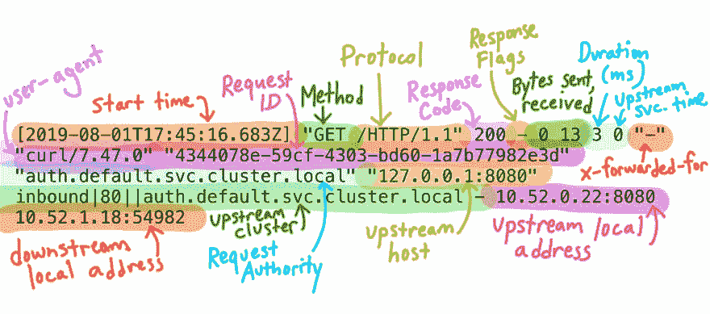

# Engarde:像冠军一样解析 Envoy 和 istio-proxy 日志

> 原文:[https://dev . to/nitishm/engarde-parse-envoy-and-istio-proxy-logs-like-a-champ-219m](https://dev.to/nitishm/engarde-parse-envoy-and-istio-proxy-logs-like-a-champ-219m)

# [](#envoy-proxy)特使代理

[T2】](https://res.cloudinary.com/practicaldev/image/fetch/s--GHmMN7-S--/c_limit%2Cf_auto%2Cfl_progressive%2Cq_auto%2Cw_880/https://raw.githubusercontent.com/envoyproxy/artwork/master/PNG/Envoy_Logo_Final_PANTONE.png)

[Envoy](https://www.envoyproxy.io/) 是一款现代、高性能、小尺寸的开源边缘和服务代理，专为云原生应用而设计。最初是在 Lyft 编写和部署的，Envoy 已经成为各种服务网格的首选代理，包括更受欢迎的 Istio 服务网格。

# [](#istio-service-mesh)Istio 服务网格

由谷歌、IBM 和 Lyft 合作开发的, [Istio](https://istio.io/) 是一个开源服务网格，它允许您连接、监控和保护部署在内部、云中或与 Kubernetes 等编排平台一起部署的微服务。

Istio 使用 Envoy sidecar proxies(又名 istio-proxy)作为其数据平面。在 Kubernetes 中，这些代理被部署为所有参与 pod 中的 sidecar(手动或自动使用 sidecar 注入),并被编程为通过 iptable 重定向拦截所有入站和出站流量。

# [](#envoy-access-logs)特使访问日志

特使代理提供了一种可配置的访问日志记录机制。这些访问日志提供了大量信息，可用于解决问题。

大多数特使代理部署使用默认的日志格式，如下所示，

```
[%START_TIME%] "%REQ(:METHOD)% %REQ(X-ENVOY-ORIGINAL-PATH?:PATH)% %PROTOCOL%"
%RESPONSE_CODE% %RESPONSE_FLAGS% %BYTES_RECEIVED% %BYTES_SENT% %DURATION%
%RESP(X-ENVOY-UPSTREAM-SERVICE-TIME)% "%REQ(X-FORWARDED-FOR)%" "%REQ(USER-AGENT)%"
"%REQ(X-REQUEST-ID)%" "%REQ(:AUTHORITY)%" "%UPSTREAM_HOST%"\n 
```

这将产生如下日志行，

```
[2016-04-15T20:17:00.310Z] "POST /api/v1/locations HTTP/2" 204 - 154 0 226 100 "10.0.35.28"
"nsq2http" "cc21d9b0-cf5c-432b-8c7e-98aeb7988cd2" "locations" "tcp://10.0.2.1:80" 
```

这些日志，即使是默认格式的，**也包含了许多有用的信息**，这些信息在调试 L4-L7 代理的问题时会派上用场。

谷歌的 Meghan O'Keefe 最近发了一条推文，为默认特使日志中的每个字段提供了一个非常直观的表示(如下所示)。

> 梅根·奥基夫@ askmeegs你有没有看过 Istio 的代理日志，心想:😱？
> 
> 这些是 [@EnvoyProxy](https://twitter.com/EnvoyProxy) 访问日志，包含很多有用的信息！[envoyproxy.io/docs/envoy/lat…](https://t.co/SbV75hDrON)2019 年 8 月 20:43 分- 01 分[](https://twitter.com/intent/tweet?in_reply_to=1157029140693995521)[](https://twitter.com/intent/retweet?tweet_id=1157029140693995521)30[](https://twitter.com/intent/like?tweet_id=1157029140693995521)100

除了推文之外，Richard Li(首席执行官，Datawire -给你带来大使的家伙)的这篇名为**“了解特使代理 HTTP 访问日志”**的[中型](https://medium.com/understanding-envoy-proxy-and-ambassador-http-access-logs-fee7802a2ec5)博客提供了关于默认格式日志的每个字段的更多详细信息。

如果你曾经像我一样处理过这些日志，你就会知道当这些行以光速滚动时，手动搜索每个字段是多么困难，尤其是在一个繁忙的网络中。

* * *

为了解决这个问题，并使这些神秘的日志行更有意义，我创建了一个开源工具，我想把它展示给社区。

# [](#introducing-engarde)介绍[恩加德](https://github.com/nitishm/engarde)

*(Envoy + On Gaurd = Engarde...得到它😉？？Bah neverming，我试过)*
Engarde 是一个用 Go 编写的开源实用程序，有开源 [grok](//github.com/vjeantet/grok) 包的(大量)帮助，它允许你像冠军一样解析 envoy 访问日志。此外，Engarde 还支持 istio-proxy 使用的默认格式(如下所示)。

```
[%START_TIME%] \"%REQ(:METHOD)% %REQ(X-ENVOY-ORIGINAL-PATH?:PATH)% %PROTOCOL%\" %RESPONSE_CODE% %RESPONSE_FLAGS% \"%DYNAMIC_METADATA(istio.mixer:status)%\" %BYTES_RECEIVED% %BYTES_SENT% %DURATION% %RESP(X-ENVOY-UPSTREAM-SERVICE-TIME)% \"%REQ(X-FORWARDED-FOR)%\" \"%REQ(USER-AGENT)%\" \"%REQ(X-REQUEST-ID)%\" \"%REQ(:AUTHORITY)%\" \"%UPSTREAM_HOST%\" %UPSTREAM_CLUSTER% %UPSTREAM_LOCAL_ADDRESS% %DOWNSTREAM_LOCAL_ADDRESS% %DOWNSTREAM_REMOTE_ADDRESS% %REQUESTED_SERVER_NAME%\n 
```

Engarde 通过 STDIN 逐行读取 envoy 日志，将它们整理成 JSON 对象以增强可读性，并最终通过 STDOUT 将它们输出回终端。

## Engarde 入门

要开始使用恩加尔德，只需访问[https://github.com/nitishm/engarde](https://github.com/nitishm/engarde)，并遵循`README`中提供的说明。

## [](#sample)样品

**特使默认格式**

```
echo '[2016-04-15T20:17:00.310Z] "POST /api/v1/locations HTTP/2" 204 - 154 0 226 100 "10.0.35.28" "nsq2http" "cc21d9b0-cf5c-432b-8c7e-98aeb7988cd2" "locations" "tcp://10.0.2.1:80"' | engarde | jq 
```

```
{  "authority":  "locations",  "bytes_received":  "154",  "bytes_sent":  "0",  "duration":  "226",  "method":  "POST",  "protocol":  "HTTP/2",  "request_id":  "cc21d9b0-cf5c-432b-8c7e-98aeb7988cd2",  "response_flags":  "-",  "status_code":  "204",  "timestamp":  "2016-04-15T20:17:00.310Z",  "upstream_service":  "tcp://10.0.2.1:80",  "upstream_service_time":  "100",  "uri_path":  "/api/v1/locations",  "user_agent":  "nsq2http",  "original_message":  "[2016-04-15T20:17:00.310Z] \"POST /api/v1/locations HTTP/2\" 204 - 154 0 226 100 \"10.0.35.28\"  \"nsq2http\"  \"cc21d9b0-cf5c-432b-8c7e-98aeb7988cd2\"  \"locations\"  \"tcp://10.0.2.1:80\""  } 
```

**Istio-proxy 默认格式**

```
kubectl logs -f foo-app-1 -c istio-proxy | engarde --use-istio | jq 
```

```
{  "authority":  "hello-world",  "bytes_received":  "148",  "bytes_sent":  "171",  "duration":  "4",  "method":  "GET",  "protocol":  "HTTP/1.1",  "request_id":  "c0ce81db-4f5a-9134-8a5c-f8c076c91652",  "response_flags":  "-",  "status_code":  "200",  "timestamp":  "2019-09-03T05:37:41.341Z",  "upstream_service":  "192.168.89.50:9001",  "upstream_service_time":  "3",  "upstream_cluster":  "outbound|80||hello-world.default.svc.cluster.local",  "upstream_local":  "-",  "downstream_local":  "10.97.86.53:80",  "downstream_remote":  "192.168.167.113:39953",  "uri_path":  "/index",  "user_agent":  "-",  "mixer_status":  "-",  "original_message":  "[2019-09-03T05:37:41.341Z] \"GET /index HTTP/1.1\" 200 - \"-\" 148 171 4 3 \"-\"  \"-\"  \"c0ce81db-4f5a-9134-8a5c-f8c076c91652\"  \"hello-world\"  \"192.168.89.50:9001\" outbound|80||hello-world.default.svc.cluster.local - 10.97.86.53:80 192.168.167.113:39953 -"  } 
```

恩加德的真正力量只有和`jq`结合才能被驾驭。

# 【jq+作弊

`jq`是一个轻量级且灵活的命令行 JSON 处理器。`jq`就像是 JSON 数据的`sed`——你可以用它来分割、过滤、映射和转换结构化数据，就像 sed、awk、grep 和 friends 让你处理文本一样容易。

如上面的例子所示，最基本的，pretty 将 JSON 字符串打印成终端可读的对象。然而，`jq`的能力要大得多。

因为这篇博客是关于`Engarde`的，所以我不会深入探究`jq`的能力(它很容易提供一个自己的帖子)。
相反，让我们看看如何使用`jq`通过`status_code`过滤特使访问日志，并只将字段的子集输出到 STDOUT，

```
kubectl logs -f foo-app-1 -c istio-proxy | engarde --use-istio | jq -c 'select( .status_code = 200) | {log: .original_message, URI: .uri_path, UpstreamCluster: .upstream_cluster}' | jq 
```

```
{  "log":  "[2019-09-06T19:11:40.645Z] \"GET /v1/health/service/xyz?index=0&wait=10s HTTP/1.1\" 500 - \"-\" 0 23 0 0 \"-\"  \"Python-urllib/2.7\"  \"83484d3a-fedb-96f5-a653-1c38fa1ac2e4\"  \"10.15.12.33:8500\"  \"10.15.12.33:8500\" PassthroughCluster - 10.15.12.33:8500 192.168.89.3:34780 -",  "URI":  "/v1/health/foobar",  "UpstreamCluster":  "PassthroughCluster"  }  {  "log":  "[2019-09-06T19:11:42.218Z] \"GET /metrics HTTP/1.1\" 200 - \"-\" 0 0 1 0 \"-\"  \"Prometheus/2.9.1\"  \"e8810c98-9e10-9b2c-837e-987ec3ed3614\"  \"192.168.89.3:9001\"  \"127.0.0.1:9001\" inbound|80|foo-worker|hello-world.foo-namespace.svc.cluster.local - 192.168.89.3:9001 192.168.167.109:53458 -",  "URI":  "/metrics",  "UpstreamCluster":  "inbound|80|foo-worker|hello-world.foo-namespace.svc.cluster.local"  }  {  "log":  "[2019-09-06T19:11:47.218Z] \"GET /metrics HTTP/1.1\" 200 - \"-\" 0 0 1 0 \"-\"  \"Prometheus/2.9.1\"  \"f4cd2b2b-7202-9823-a8cd-7a150c6b5c4a\"  \"192.168.89.3:9001\"  \"127.0.0.1:9001\" inbound|80|foo-worker|hello-world.foo-namespace.svc.cluster.local - 192.168.89.3:9001 192.168.167.109:53458 -",  "URI":  "/metrics",  "UpstreamCluster":  "inbound|80|foo-worker|hello-world.foo-namespace.svc.cluster.local"  }  ...  ... 
```

# [](#fin)鳍

请随意分享一些反馈，可以直接分享，也可以通过在 [Github](https://github.com/nitishm) 上发表一个问题来分享。很想听听你对它的看法，以及你是否希望看到任何改进。

别忘了在 GitHub 上⭐这个项目，并在[https://github.com/nitishm](https://github.com/nitishm)关注我。