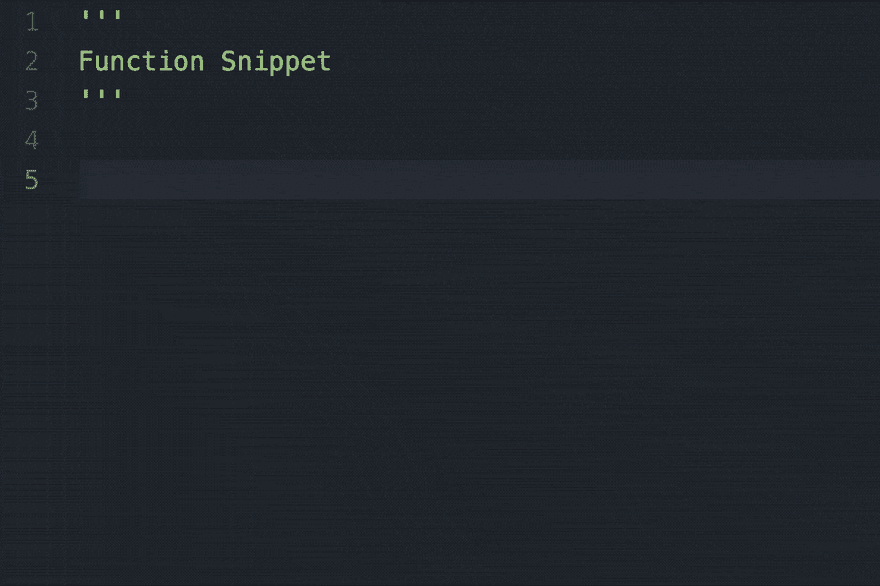
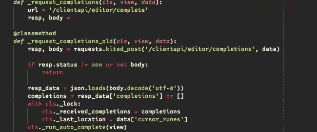

# Kite 宣布 Python 的智能片段

> 原文:[https://dev . to/kite/kite-announces-intelligent-snippets-for-python-13i 0](https://dev.to/kite/kite-announces-intelligent-snippets-for-python-13i0)

我们很高兴与您分享智能片段，这是我们的最新功能，旨在使您的完成体验更加无缝。Kite 的智能代码片段允许您在键入时生成上下文相关的代码片段，从而轻松完成复杂的多标记语句。典型的代码片段必须提前手动定义，而 Kite 的智能代码片段是基于 Kite 在代码库中找到的代码模式实时生成的。

## TL；速度三角形定位法(dead reckoning)

*   智能片段在最新版本的 Kite (20190905.0)中为我们支持的所有编辑器提供支持:Atom、PyCharm/IntelliJ、Sublime Text、VS Code 和 Vim。
*   支持全局和局部函数。
*   当用智能代码片段调用函数时，用户只需要一半的击键次数。
*   参观 kite.com/download 安装风筝。

## 开发者每日调用数十亿个函数

开发人员每天编写大约 15 亿个函数调用，其中许多是重复的。过去，如果开发人员不记得函数的签名，他们会引用文档或复制粘贴的代码片段。我们认识到这是次优的，并构建了 Kite 的智能片段作为在 Python 中调用函数的更快的解决方案。

## 传统片段的问题

*片段*是可以插入代码缓冲区的代码片段，然后可以立即编辑。传统上，代码片段是由开发人员提前手动定义的。它们是静态的，不能随着开发人员代码的变化而改变。结果，代码片段被限制为简单的代码模式。

例如，下面的视频显示了一个开发人员使用一个代码片段来插入函数定义的结构，然后填充函数的其余部分。
[T3】](https://res.cloudinary.com/practicaldev/image/fetch/s--VVGr3yVH--/c_limit%2Cf_auto%2Cfl_progressive%2Cq_66%2Cw_880/https://thepracticaldev.s3.amazonaws.com/i/4svc2jhrw83ebpnq5y69.gif)

Kite 的智能 Snippets 引擎基于您正在使用的代码动态生成代码片段，从而使代码片段更加强大。当你写代码时，Kite 会自动检测你代码库中常用的模式，并给出相关的模式建议。

前往 kite.com 尝试展示我们新功能的互动游乐场。如果你用的是台式电脑，点击“让我试试打字”来接管演示循环(移动用户，你可以看到循环，但你必须移动到桌面来测试它。)

## 我们如何构建智能片段

智能片段建立在 Kite 完成体验核心的代码引擎上。Kite 首先索引你的代码库，学习函数是如何被普遍使用的。然后，当你调用一个函数时，Kite 会为这个函数建议一些代码片段来轻松地完成它。Kite 的自动补全功能仍然会建议每个参数都补全。

智能片段不仅节省你的按键；它们还减少了您需要查找文档以获得所需呼叫模式的次数。

## 智能片段支持全局和局部功能

下面的视频展示了一个开发人员使用智能代码片段快速调用请求

智能代码片段也可以处理你自己定义的函数，比如下面的视频:

## 智能片段的未来

我们相信智能片段将成为开发者与未来人工智能编码工具互动的基石。我们已经开始使用智能片段来帮助开发人员编写函数调用，但我们看到它们很快会有更广泛的用途。例如，智能片段对于编写 try/except 块或单元测试用例可能很有用。我们期待着将这项技术立即应用到更多的用例中。

## 今年剩下的时间里会发生什么

我们有更多令人兴奋的项目正在进行中:我们正在利用最新的研究成果，使我们的机器学习模型更加智能。我们正在构建新的编辑器集成。另外，还有几个项目我们还不能告诉你。敬请期待！