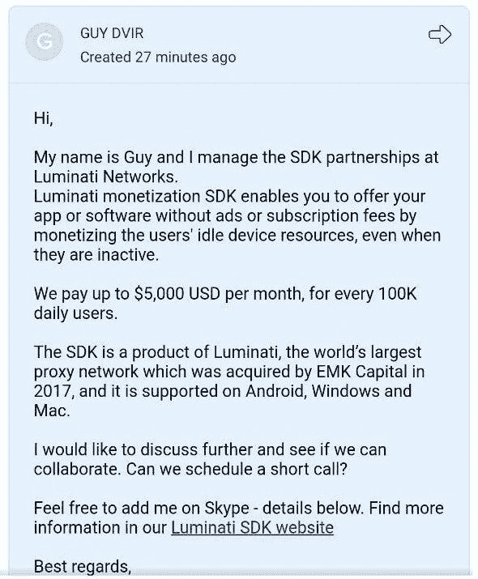
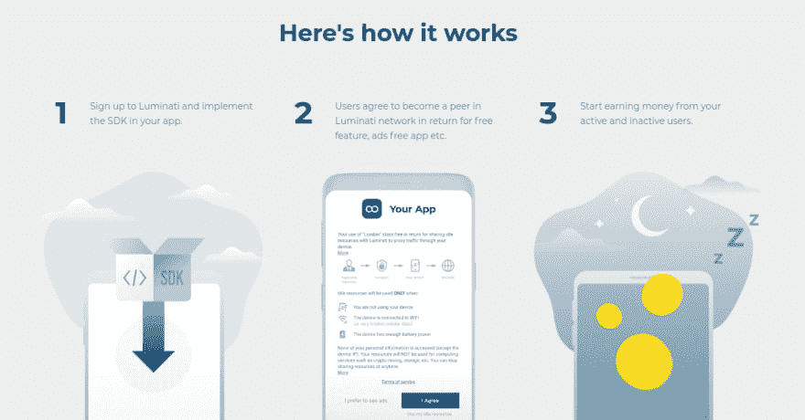
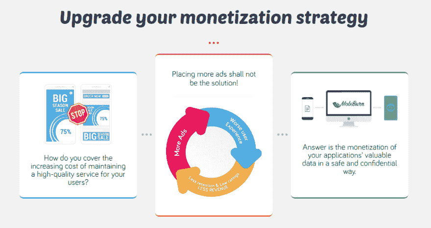
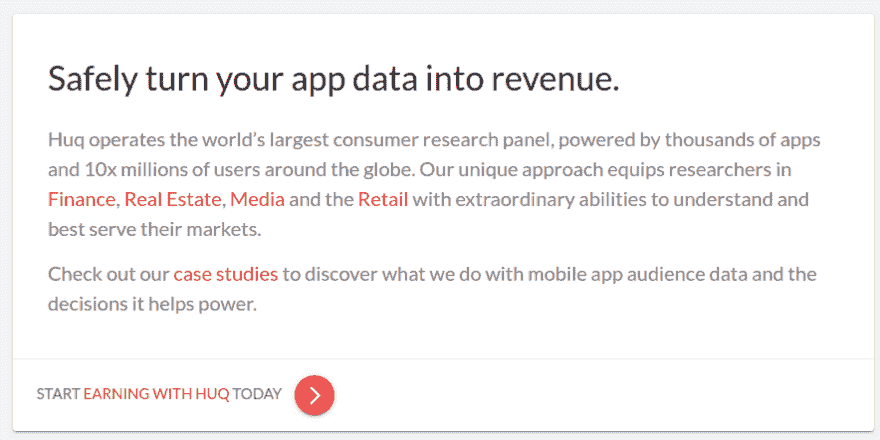
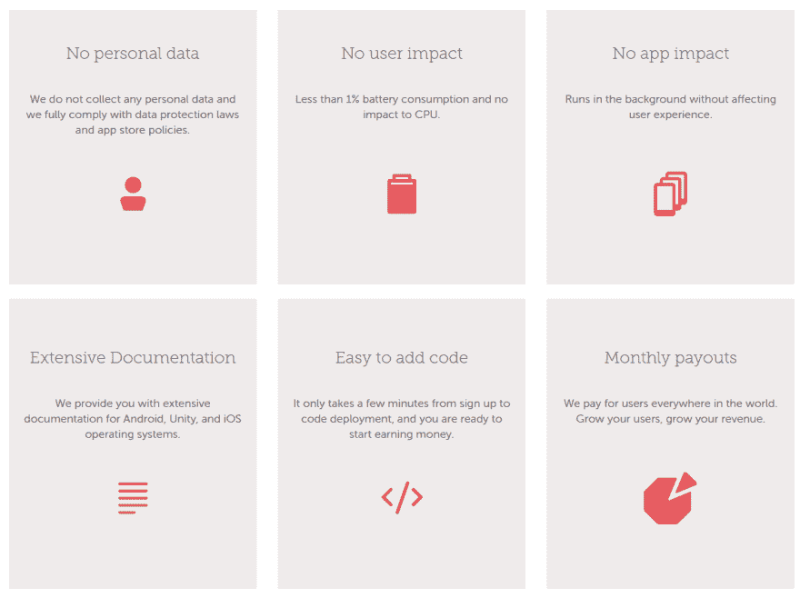

# 快速浏览“无广告”移动货币化平台

> 原文:[https://dev . to/deletescape/a-quick-look-at-ad-free-mobile-monetary-platforms-20ao](https://dev.to/deletescape/a-quick-look-at-ad-free-mobile-monetization-platforms-20ao)

如果你是一名移动开发者，你很可能收到过来自货币化平台的电子邮件，所有这些邮件都至少做出了一个令人难以置信的声明。其中一些特别有趣，因为他们声称无需使用任何广告就能让你的应用程序赚钱(每月收入高达$$$美元)。我希望你们大多数人会忽略这些电子邮件，但是我这次决定更深入地挖掘一下“无广告”货币化的世界。不言而喻，我今天要看的大多数服务在某种程度上都是可疑的，你通常应该避免使用它们。

<figure>

[T2】](https://res.cloudinary.com/practicaldev/image/fetch/s--kzOIHipQ--/c_limit%2Cf_auto%2Cfl_progressive%2Cq_auto%2Cw_880/https://deletescape.ch/asseimg/luminati-email.jpg)

<figcaption>This sounds pretty promising (until you actually do the math).</figcaption>

</figure>

## 卢米娜蒂

Luminati 是运营流行的代理 VPN 服务 [Hola VPN](https://hola.org/) 的公司，该服务出人意料地免费。当你稍微研究一下 Hola 是如何工作的，你很快就会发现他们的 VPN 实际上是使用他们用户的互联网连接来代理他们的流量。作为 Hola 的用户，其他 Hola 用户通过您的连接访问互联网，Luminati 的付费客户也是如此。他们收集了大量的原始 IP 地址，可以方便地抓取网站，而无需查看任何验证码，也不会受到速度限制。Luminati SDK 允许您的用户成为 Luminati 网络的一部分，作为回报，他们可以在您的应用中获得额外的功能。

<figure>

[T2】](https://res.cloudinary.com/practicaldev/image/fetch/s--jgfWUaIg--/c_limit%2Cf_auto%2Cfl_progressive%2Cq_auto%2Cw_880/https://deletescape.ch/asseimg/luminati-how-it-works.png)

<figcaption>Well I don't see anything wrong with this?</figcaption>

</figure>

结论:Luminati 实际上是在向用户出售互联网连接。

## MobKnow / MobiBurn

MobKnow 和 MobiBurn 非常相似，它们直接告诉你它们正在收集用户数据。MobKnow 没有具体说明这些数据将用于什么目的，MobiBurn 则吹嘘他们如何帮助建立受众数据用于营销目的。最重要的是，也不清楚这些解决方案实际上有多真实，MobiBurn 网站上链接的合作伙伴似乎都没有实际使用他们的 SDK。

<figure>

[T2】](https://res.cloudinary.com/practicaldev/image/fetch/s--5Mgdqgup--/c_limit%2Cf_auto%2Cfl_progressive%2Cq_auto%2Cw_880/https://deletescape.ch/asseimg/mobiburn.png)

<figcaption>MobiBurn shall not be the solution either!</figcaption>

</figure>

**结论:你真的想直接出售你用户的数据吗？哦，冒着这些 SDK 实际上是恶意软件的风险？**

## Huq

Huq 类似于 MobKnow，它收集用户数据，然后卖给投资者、政府和研究人员。Huq 专注于地理和行为数据，以了解消费者在现实世界中的行为。因为这个列表中的所有其他提供商都在大谈隐私以及他们有多爱隐私，我们都知道这是一个谎言，它存在的唯一原因是安慰他们自己和考虑集成他们的 SDK 的开发者。嘿，至少他们看起来真的存在！

<figure>

[T2】](https://res.cloudinary.com/practicaldev/image/fetch/s--3M0Z8ZdU--/c_limit%2Cf_auto%2Cfl_progressive%2Cq_auto%2Cw_880/https://deletescape.ch/asseimg/huq.png)

<figcaption>It's sellout time baby</figcaption>

</figure>

**结论:没错，让我们卖掉公司，让一些大数据公司变得非常富有，让政府非常高兴！**

## 监护

Tutela 从世界各地收集网络和设备数据，以收集关于网络覆盖和世界范围内速度的数据。这些数据随后被电信公司用来在有需求的地方改进他们的网络服务。我没想到自己今天会这么说，但 Tutela 实际上似乎相对还好。我个人不会使用它，但在众多解决方案中，它似乎是最不具侵入性的解决方案，实际上可能会被很好地使用。

<figure>

[T2】](https://res.cloudinary.com/practicaldev/image/fetch/s--p8WeeLjB--/c_limit%2Cf_auto%2Cfl_progressive%2Cq_auto%2Cw_880/https://deletescape.ch/asseimg/tutela.png)

<figcaption>Obviously the exact same claims as always</figcaption>

</figure>

**结论:最好的，虽然我还是不会用它**

## 结论

在考虑用户隐私和信任的同时，通过(适度的)广告和 iap 将你的应用货币化仍然是将你的移动应用货币化的最佳方式。你也不会利用这些平台中的任何一个变得富有，它们都支付相对较低的费率，并且可能通过收集的数据赚得更多。总而言之，软件货币化往往是黑幕作为一个整体，保持安全，让您的用户安全！

> 感谢 HrX 的封面图片。