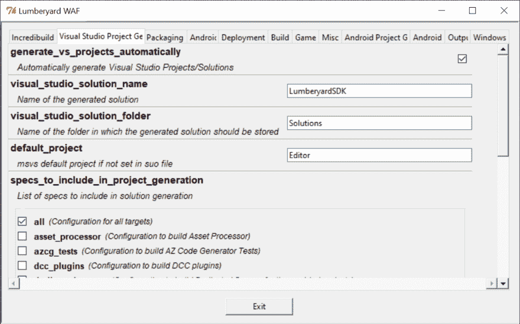
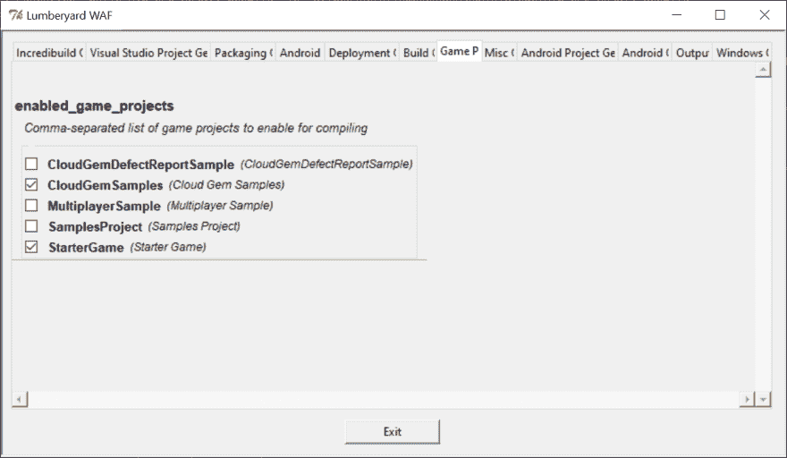
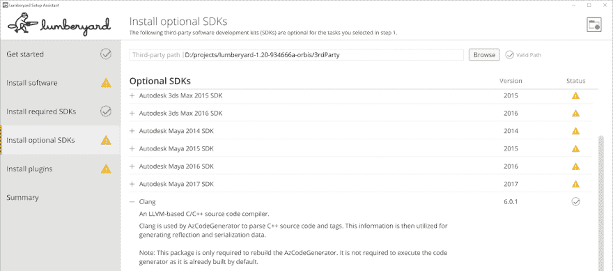
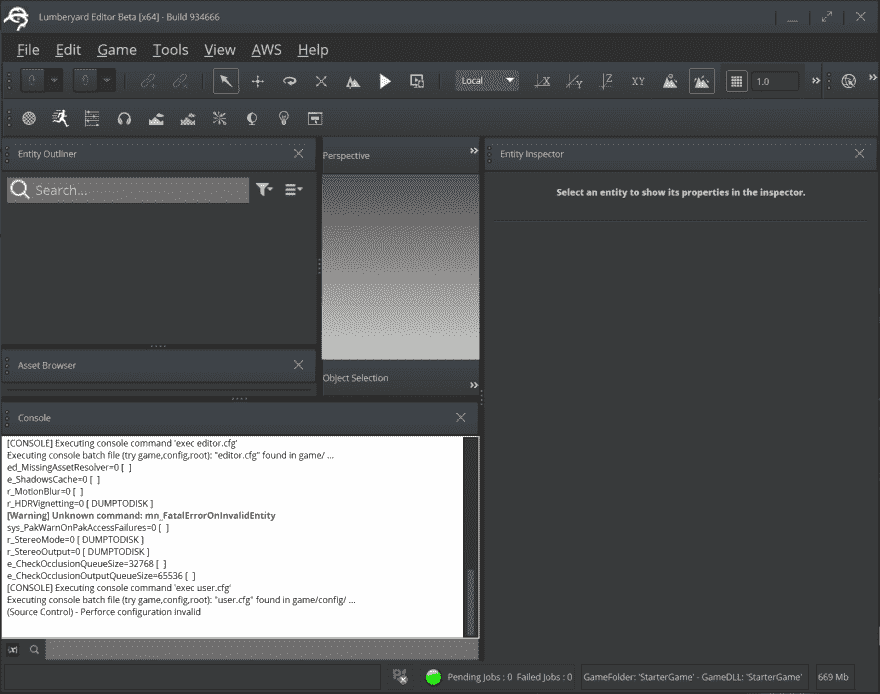
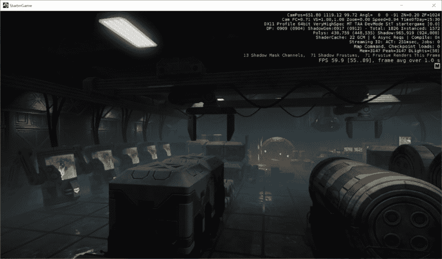

# 亚马逊贮木场简介

> 原文：<https://dev.to/jeikabu/amazon-lumberyard-intro-3c25>

几年前，我们与 [CryEngine](https://www.cryengine.com) 合作，最近我们开始与它的后代[亚马逊木材场](https://aws.amazon.com/lumberyard/)合作。这两个游戏引擎源于相同的代码库，但自亚马逊在 2015 年收购源代码以来，它们已经发生了显著的分歧。

在这里，我们将看看做的基本工作-让它建立和运行。如果你是有创造性/艺术性的人，并且对白盒级别或按摩材料更感兴趣，可以在他们各自的开发门户、YouTube 等网站上查看一些优秀的资源。

## Git 开始了

首先，确保你满足了[贮木场的硬件需求](https://docs.aws.amazon.com/lumberyard/latest/userguide/setting-up-system-requirements.html#required-hardware-for-lumberyard) :

```
3GHz minimum quad-core processor
8 GB RAM minimum
2 GB minimum DirectX 11 or later compatible video card
NVIDIA driver version 368.81 or AMD driver version 16.15.2211 graphics card
60 GB minimum of free disk space

To compile builds:
14 GB RAM minimum 
```

<svg width="20px" height="20px" viewBox="0 0 24 24" class="highlight-action crayons-icon highlight-action--fullscreen-on"><title>Enter fullscreen mode</title></svg> <svg width="20px" height="20px" viewBox="0 0 24 24" class="highlight-action crayons-icon highlight-action--fullscreen-off"><title>Exit fullscreen mode</title></svg>

除了[下载安装程序](https://aws.amazon.com/lumberyard/)(其中也包含源代码)，你可以从 github:
拉取

```
git  clone  https://github.com/aws/lumberyard  cd  lumberyard  ./git_bootstrap.exe 
```

<svg width="20px" height="20px" viewBox="0 0 24 24" class="highlight-action crayons-icon highlight-action--fullscreen-on"><title>Enter fullscreen mode</title></svg> <svg width="20px" height="20px" viewBox="0 0 24 24" class="highlight-action crayons-icon highlight-action--fullscreen-off"><title>Exit fullscreen mode</title></svg>

如果`git_bootstrap`因为某种原因不起作用(对我来说不起作用):

1.  通过其他方式下载`bootstrap_config.json`中指定的 zip 文件
2.  解压缩到存储库根目录
3.  运行`./SetupAssistant.bat`

**重要**:你需要很大的磁盘空间。大约 30GB 用于源代码、必需的 SDK 和示例。另外 50GB 用于构建游戏、编辑器和工具的配置。

## 配置

伐木场通过`dev/lmbr_waf.bat`使用[晶片](https://waf.io/)建造系统。

用户指南包含了一个命令列表，但是要开始使用，你需要:

```
# Detailed commands and options  ./lmbr_waf.bat  --help  # Just list of commands  ./lmbr_waf.bat  --list  # GUI configuration  ./lmbr_waf.bat  show_option_dialog 
```

<svg width="20px" height="20px" viewBox="0 0 24 24" class="highlight-action crayons-icon highlight-action--fullscreen-on"><title>Enter fullscreen mode</title></svg> <svg width="20px" height="20px" viewBox="0 0 24 24" class="highlight-action crayons-icon highlight-action--fullscreen-off"><title>Exit fullscreen mode</title></svg>

`show_option_dialog`展示了一堆不同的选项，但也许最重要的是 **Visual Studio 项目生成器**和**游戏项目**:

| VS 项目 Gen | 游戏项目 |
| --- | --- |
|  |  |

如果你不想使用 janky Tkinter UI，你也可以手动编辑`dev/_WAF_/user_settings.options`，然后运行`lmbr_waf configure`。

## 建筑

Waf 命令遵循`(build|clean|package|deploy)_platform[_arch]_toolchain_configuration`的格式。比如:

```
./lmbr_waf.bat  build_win_x64_vs2017_profile 
```

<svg width="20px" height="20px" viewBox="0 0 24 24" class="highlight-action crayons-icon highlight-action--fullscreen-on"><title>Enter fullscreen mode</title></svg> <svg width="20px" height="20px" viewBox="0 0 24 24" class="highlight-action crayons-icon highlight-action--fullscreen-off"><title>Exit fullscreen mode</title></svg>

**NB** :如果你没有 [Incredibuild](https://www.incredibuild.com) 你会看到很长的构建时间；在 12 核 i9/64 GB/SSD 上运行 35 分钟。

“规格”是项目的预定义子集:“所有”就是一切，“游戏”、“工具”等等。它们在`dev/_WAF_/specs/`中定义，在 Visual Studio 中显示为**解决方案配置**。您可以从命令行构建一个规范:

```
./lmbr_waf.bat  <command>  -p  <spec>  # Build engine and editor  ./lmbr_waf.bat  build_win_x64_vs2017_profile  -p  engine_and_editor  # Build game(s) and engine  ./lmbr_waf.bat  build_win_x64_vs2017_profile  -p  game_and_engine 
```

<svg width="20px" height="20px" viewBox="0 0 24 24" class="highlight-action crayons-icon highlight-action--fullscreen-on"><title>Enter fullscreen mode</title></svg> <svg width="20px" height="20px" viewBox="0 0 24 24" class="highlight-action crayons-icon highlight-action--fullscreen-off"><title>Exit fullscreen mode</title></svg>

### 常见问题

如果你用的是 Visual Studio 2017 的最新版本，waf 可能会抱怨[它找不到 Visual Studio](https://forums.awsgametech.com/t/visual-studio-2017-compile-problems/6794) 。在`show_option_dialog`中，将**窗口选项> win_vs2017_vswhere_args** 改为:

```
-version [15.7.27703.2035,16] 
```

<svg width="20px" height="20px" viewBox="0 0 24 24" class="highlight-action crayons-icon highlight-action--fullscreen-on"><title>Enter fullscreen mode</title></svg> <svg width="20px" height="20px" viewBox="0 0 24 24" class="highlight-action crayons-icon highlight-action--fullscreen-off"><title>Exit fullscreen mode</title></svg>

或者，在`dev/_WAF_/usersettings.options` :

```
# OLD
;win_vs2017_vswhere_args = -version [15.7.27703.2035,15.9.28307.665]
# NEW
win_vs2017_vswhere_args = -version [15.7.27703.2035,16] 
```

<svg width="20px" height="20px" viewBox="0 0 24 24" class="highlight-action crayons-icon highlight-action--fullscreen-on"><title>Enter fullscreen mode</title></svg> <svg width="20px" height="20px" viewBox="0 0 24 24" class="highlight-action crayons-icon highlight-action--fullscreen-off"><title>Exit fullscreen mode</title></svg>

**重要**:不要*不要*在版本数组中插入一个空格(即`[15.7.27703.2035, 16]`)。它将无法找到 Visual Studio 安装。`dev\Tools\build\waf-1.7.13\lmbrwaflib\mscv_helper.py`中的第 795-796 行是错误的。

如果失败，看起来无害的`unable to find QT` :

```
[SETTINGS] msvs_version = 15 (default 14)
[SETTINGS] win_vs2017_vswhere_args = -version [15.7.27703.2035, 16] (default -version [15.7.27703.2035,15.9.28307.665]) [SETTINGS] specs_to_include_in_project_generation = all,game_and_engine,engine_and_editor,game (default all, game, game_and_engine)
[SETTINGS] Target Output folder (win_x64_vs2017/profile): Bin64vc141
[WARNING] Incredibuild disabled by build option
unable to find QT
unable to find QT
Traceback (most recent call last):
<SNIP>
  File "Tools\build\waf-1.7.13\lmbrwaflib\cry_utils.py", line 872, in add_compiler_dependency
    if os.path.isabs( self.env['CC'] ):
  File "D:\projects\lumberyard\dev\Tools\Python\2.7.12\windows\lib\ntpath.py", line 59, in isabs
    return s != '' and s[:1] in '/\\'
TypeError: 'in <string>' requires string as left operand, not list 
```

<svg width="20px" height="20px" viewBox="0 0 24 24" class="highlight-action crayons-icon highlight-action--fullscreen-on"><title>Enter fullscreen mode</title></svg> <svg width="20px" height="20px" viewBox="0 0 24 24" class="highlight-action crayons-icon highlight-action--fullscreen-off"><title>Exit fullscreen mode</title></svg>

这可能是以下几个问题中的任何一个:

1.  缺少一个或多个 [Visual Studio 要求](https://docs.aws.amazon.com/lumberyard/latest/userguide/setting-up-system-requirements.html#required-developer-tools-for-lumberyard)
2.  可能还需要 MFC(论坛帖子 [#1](https://forums.awsgametech.com/t/building-project-failed-error-executing-waf/4868) 、 [#2](https://forums.awsgametech.com/t/visual-studio-2017-compile-problems/6794) )
3.  检测 Visual Studio 时出现问题，检查`lmbr_waf configure`的输出以获取线索

如果您得到以下一系列错误，请尝试重新运行`lmbr_waf configure` :

```
ObjectStream.cpp
XXX\dev\Code\Framework\AzCore\AzCore/XML/rapidxml.h(20): fatal error C1083: Cannot open include file: 'rapidxml/rapidxml.h': No such file or directory
compression.cpp
XXX\dev\Code\Framework\AzCore\AzCore\Compression\compression.cpp(24): fatal error C1083: Cannot open include file: 'zlib.h': No such file or directory
ScriptContextDebug.cpp
XXX\dev\Code\Framework\AzCore\AzCore/Script/lua/lua.h(16): fatal error C1083: Cannot open include file: 'Lua/lua.h': No such file or directory
ScriptPropertyTable.cpp
XXX\dev\Code\Framework\AzCore\AzCore\Script\ScriptPropertyTable.cpp(20): fatal error C1083: Cannot open include file: 'Lua/lualib.h': No such file or directory 
```

<svg width="20px" height="20px" viewBox="0 0 24 24" class="highlight-action crayons-icon highlight-action--fullscreen-on"><title>Enter fullscreen mode</title></svg> <svg width="20px" height="20px" viewBox="0 0 24 24" class="highlight-action crayons-icon highlight-action--fullscreen-off"><title>Exit fullscreen mode</title></svg>

如果你得到一个类似于
的错误

```
[2585/8092] pch_msvc (win_x64_vs2017|profile): Code\Tools\AzCodeGenerator\AZCodeGenerator\precompiled.cpp -> BinTemp\win_x64_vs2017_profile\Code\Tools\AzCodeGenerator\AZCodeGenerator\precompiled.4870660.obj BinTemp\win_x64_vs2017_profile\Code\Tools\AzCodeGenerator\AZCodeGenerator\precompiled.4870660.pch
precompiled.cpp
XXX\dev\code\tools\azcodegenerator\azcodegenerator\precompiled.h(31): fatal error C1083: Cannot open include file: 'clang/AST/Stmt.h': No such file or directory 
```

<svg width="20px" height="20px" viewBox="0 0 24 24" class="highlight-action crayons-icon highlight-action--fullscreen-on"><title>Enter fullscreen mode</title></svg> <svg width="20px" height="20px" viewBox="0 0 24 24" class="highlight-action crayons-icon highlight-action--fullscreen-off"><title>Exit fullscreen mode</title></svg>

可能是可选 SDK 的问题: [](https://res.cloudinary.com/practicaldev/image/fetch/s--MQxFxPV9--/c_limit%2Cf_auto%2Cfl_progressive%2Cq_auto%2Cw_880/https://rendered-obsolete.github.io/assets/lmbr_setup_clang.png)

要么安装它，要么像`-p engine_and_editor`一样构建一个不同的规范。

## 跑步

如果你建立了一个编辑器规范，你可以运行`dev\Bin64vc141\Editor.exe`来启动关卡编辑器:

[](https://res.cloudinary.com/practicaldev/image/fetch/s--p_j4qKXh--/c_limit%2Cf_auto%2Cfl_progressive%2Cq_auto%2Cw_880/https://rendered-obsolete.github.io/assets/lmbr_editor.png)

根据您启用的游戏项目，如果您创建了一个游戏规范，您可以运行一个或多个`dev\Bin64vc141\<game>Launcher.exe`。

第一次启动时，您应该看到关于[资产处理器](https://docs.aws.amazon.com/lumberyard/latest/userguide/asset-pipeline-processor.html) :

[](https://res.cloudinary.com/practicaldev/image/fetch/s--rSNIQgMt--/c_limit%2Cf_auto%2Cfl_progressive%2Cq_auto%2Cw_880/https://rendered-obsolete.github.io/assets/lmbr_assetproc_notify.png) 的通知

资产处理器负责准备供引擎运行时使用的资产。这包括:处理 [FBX](https://en.wikipedia.org/wiki/FBX) 文件、 [DXT](https://en.wikipedia.org/wiki/S3_Texture_Compression) / [等](https://en.wikipedia.org/wiki/Ericsson_Texture_Compression)纹理压缩等等。当我们调查资产管道和发布打包时，我们将更多地了解这一点。

这是 startergamelauncher . exe:

[](https://res.cloudinary.com/practicaldev/image/fetch/s--pObGlQCC--/c_limit%2Cf_auto%2Cfl_progressive%2Cq_auto%2Cw_880/https://rendered-obsolete.github.io/assets/lmbr_starter_game.png)

如果它不会马上看起来像这样，不要感到惊讶。右上角调试文本的第六行显示了关于“ShaderCache”的信息。在这种情况下:

*   22“GCM”代表*全局缓存缺失*(即缺失着色器)
*   6 个未完成的异步请求
*   编译已启用

同样，当我们查看资产管道时，我们会涉及这一点，但这都是关于为游戏客户端编译着色器的[远程着色器编译器](https://docs.aws.amazon.com/lumberyard/latest/userguide/mat-shaders-custom-dev-remote-compiler.html)。如果你等一两分钟，东西会正确显示。如果不起作用，运行`.\Tools\CrySCompileServer\x64\profile\CrySCompileServer_vc141x64.exe`(使用“all”规范启用)。