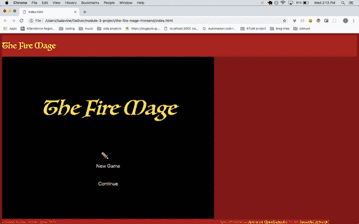

# 帮助我(正确地)开源我的普通 JavaScript 游戏引擎！

> 原文:[https://dev . to/isalevine/help-me-open-source-my-vanilla-js-game-engine-1fp 4](https://dev.to/isalevine/help-me-open-source-my-vanilla-js-game-engine-1fp4)

# [火法师:一款香草 JS 游戏引擎](https://github.com/isalevine/the-fire-mage-frontend)

 
*游戏引擎在运转，与概念验证游戏[【火法师】](https://the-fire-mage.herokuapp.com)*

几个月前，[我写了一篇关于用普通 JavaScript](https://dev.to/isalevine/how-i-accidentally-made-a-game-engine-from-scratch-with-vanilla-js-4m80) (用 Ruby on Rails 后端)制作视频游戏引擎的文章，作为 bootcamp 项目的一部分。从那以后，[我已经在 Heroku](https://the-fire-mage.herokuapp.com/) 上部署了引擎的工作演示，并且一直在清理代码。但从长远来看，我的目标是让这个项目成为一个开源项目——现在，我向你们，我亲爱的 Dev.to 社区求助，请你们帮助我实现这个目标！

在这篇文章中，我想回顾一下我在代码库上所做的一些工作，我认为需要做些什么来使它适当地开源(特别是 re: documentation)，并寻求对这个过程中要涵盖/包含/做的其他事情的反馈。

目前，我只是专注于重构和记录前端回购。

我很想听听你的经验，分享关于做一个好的开源项目的资源，所以请在评论中贡献吧！:)

# 我在做什么

1.  我终于为一个开源项目做出了贡献！特别感谢[布列塔尼·沃克](https://dev.to/brittanyrw)的精彩项目[表情屏幕](https://github.com/brittanyrw/emojiscreen)，它帮助我获得了第一个开源回购请求！在她的博客上阅读更多关于这个项目的信息。

2.  **我开始做[目标笔记](https://github.com/isalevine/the-fire-mage-frontend/blob/master/REFACTOR_NOTES.md)，一个[变更日志](https://github.com/isalevine/the-fire-mage-frontend/blob/master/CHANGELOG.md)，一个[投稿指南](https://github.com/isalevine/the-fire-mage-frontend/blob/master/CONTRIBUTION_GUIDE.md)。我知道好的开源项目必须具备这三个要素！然而，我知道我有很多工作要做，编辑/清理笔记，以及最终确定变更日志和贡献指南的风格。**

3.  我开始重构代码，遵循容器组件风格的模式。受我的一些 React 项目的文件结构的启发，我开始对代码库进行的第一次更改是将类移动到它们自己的文件中，并开始创建容器来呈现它们——本质上将它们视为组件！这对于用类和助手方法分解超长文件有很大的帮助，但是也很难管理必要的导入。*我很乐意得到社区对这个总体策略的反馈，或者关于设计项目文件结构的反馈！*

4.  我为前端的 GitHub repo 创建了一些初始问题。我挑选了几个目前引擎最突出的问题，并提出了几个 GitHub 问题，以帮助引导贡献者解决这些问题。然而，我可以从*选择关注哪些问题和*如何组织 GitHub 问题来帮助贡献者这两方面得到建议！**

5.  我已经部署了一个引擎的工作演示！ 我要继续恬不知耻地堵这个，就这么处理吧。(或者直接去玩吧！)< 3

# 我想完成的事情

1.  我希望代码足够模块化，可以方便地重复使用来制作新的视频游戏。目前，该引擎或多或少与它的概念验证游戏一起被硬编码，因此将代码分成更小的、可重用的部分是重中之重——最终，如何加载/运行脚本来初始化游戏场景。

2.  我想将游戏引擎的所有前端代码完全保留在普通的 JavaScript 中，并根据最佳实践来编写/重构。这个项目开始时是一个苦行僧式的探索，深入研究香草 JavaScript 的 DOM 操作，尽管从那以后我学到了很多，但我仍然对编写香草 JS 感兴趣！

3.  我想改进界面，让它感觉像玩魔兽争霸 2 这样的即时战略游戏，这是它的主要灵感。这包括使页面/游戏容器的界面更像电脑游戏，添加文件和帮助菜单，显示更多游戏内的文本和艺术，并最终添加音乐和声音效果。

4.  我想熟悉开源项目的社区工作！我知道我还有很多东西要学，这个精彩的社区已经证明了它是一个获得许多友好智慧的好地方。< 3

# 我现在想要的帮助

1.  我需要关于贡献指南、变更日志和 GitHub 问题的内容和结构的帮助！你见过的最好的例子和格式是什么？你认为每部电影中必须包含哪些*？*

**   我想得到一些关于开源项目的建议。我没有考虑哪些事情？当你创建第一个开源项目时，你希望你已经知道了什么？

    *   我希望得到关于如何就高级目标展开讨论的指导。一个例子是我目前正在重构的组件容器模式——在向主组件提交任何更改之前，我该如何提出建议并获得反馈？

    *   游戏测试！我希望有更多的人玩(和破坏)引擎。:)* 

 *# 火系法师的链接

1.  **GitHub 上的前端回购:**https://github.com/isalevine/the-fire-mage-frontend T2
2.  Heroku 上的前端演示:【https://the-fire-mage.herokuapp.com/ T2】
3.  **前端自述:**[https://github . com/isalevine/the-fire-mage-Frontend/blob/master/Readme . MD](https://github.com/isalevine/the-fire-mage-frontend/blob/master/README.md)
4.  **前端重构笔记/目标:**[https://github . com/isalevine/the-fire-mage-Frontend/blob/master/REFACTOR _ Notes . MD](https://github.com/isalevine/the-fire-mage-frontend/blob/master/REFACTOR_NOTES.md)
5.  **前端 Changelog(草案):**[https://github . com/isalevine/the-fire-mage-Frontend/blob/master/Changelog . MD](https://github.com/isalevine/the-fire-mage-frontend/blob/master/CHANGELOG.md)
6.  **前端投稿指南(草案):**[https://github . com/isalevine/the-fire-mage-Frontend/blob/master/Contribution _ Guide . MD](https://github.com/isalevine/the-fire-mage-frontend/blob/master/CONTRIBUTION_GUIDE.md)
7.  **GitHub 上的后端回购:**【https://github.com/isalevine/the-fire-mage-backend T2】

感谢 Dev.to 社区！<3*