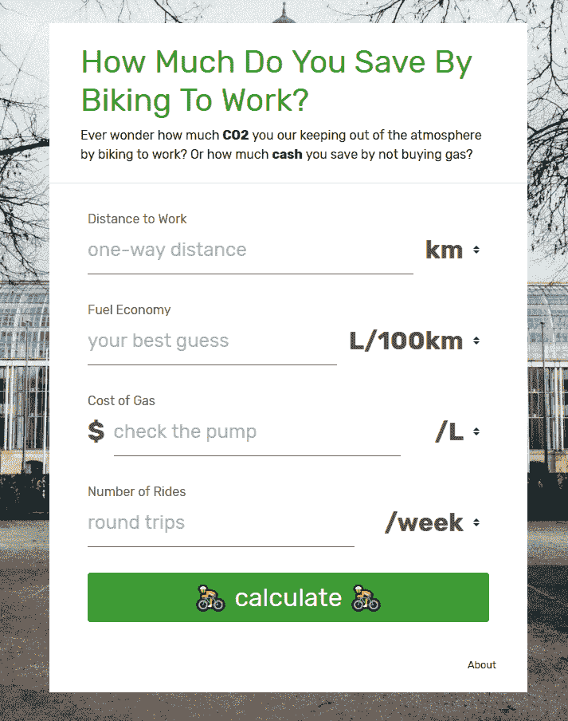

# 骑自行车，Javascript 和拯救地球

> 原文:[https://dev . to/ohryan/cycling-JavaScript-and-saving-the-planet-58ca](https://dev.to/ohryan/cycling-javascript-and-saving-the-planet-58ca)

几周前，我买了一辆普通的公路车，打算骑车去上班。我完全被迷住了！可能上瘾了？我想我终于明白了。

我骑自行车上班的主要原因是增加我每周的运动量，但我意识到把车留在家里有一些明显的副作用。通过燃烧更少的汽油，我显然节省了一些钱，也减少了空气中的碳含量。

与此同时，我一直在寻找一个很好的实用方法来提升我的 vue.js 技能。所以我挑战自己，在 vue.js 中开发了一个简单的工具来帮助我量化油箱里还剩多少二氧化碳和钱包里还剩多少钱。

结果[biketoworkcalculator.com](https://biketoworkcalculator.com)

[T2】](https://biketoworkcalculator.com)

这是一个非常简单的工具，可以让你粗略地计算骑自行车所节省的二氧化碳和美元。你自己去看看吧。

事实上，我很惊讶，每周只骑一天自行车就能在一个月内为我节省大约 10 美元的汽油费。

* * *

如果你想看看代码或纠正我的数学或其他什么，它在 github 上:[https://github.com/ohryan/biketoworkcalculator](https://github.com/ohryan/biketoworkcalculator)

哦，如果你喜欢骑自行车，那就跟着我一起骑 [Strava](https://www.strava.com/athletes/41148252) 。

骑自行车、Javascript 和拯救地球的帖子最先出现在 T2 的 ohryan.ca 网站上。