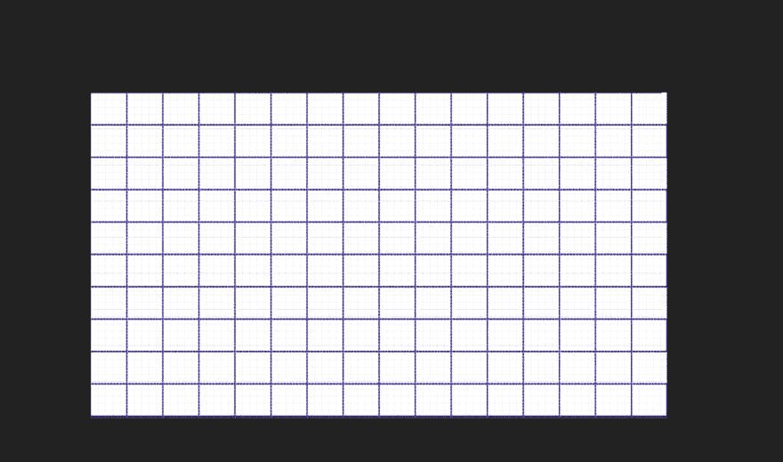
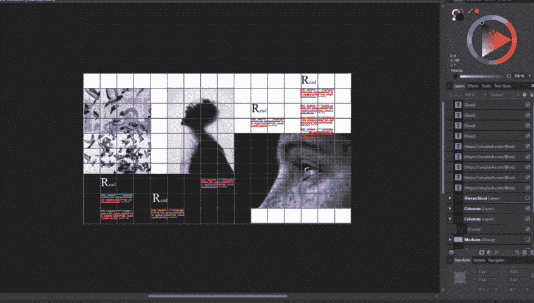

# 将图形设计网格转换为 CSS 网格

> 原文:[https://dev . to/ryanallmad/translating-the-graphic-design-grid-to-CSS-grid-3lco](https://dev.to/ryanallmad/translating-the-graphic-design-grid-to-css-grid-3lco)

将图形设计网格转换为 CSS 网格

这篇文章有学习 CSS 网格的参考，但并不打算教你所有关于 CSS 网格的知识。

这篇文章提到了图形设计网格，但并不打算教你所有关于图形设计网格的知识。

在这篇文章中，我将向你展示如何从你的图形插画应用程序中提取一个设计，并使用 CSS Grid 将其转化为网页。

在之前的一篇文章中，我讨论了图形设计中经典网格原则的基础，以及如何使用这些原则来设计你的网页。在那篇文章中，我使用 Flex-Box 将内容与“流线”对齐。从那以后，我发现了一个更强大的网页设计工具，你可能听说过(否则你为什么在这里？)叫做 CSS 网格。对于那些不熟悉 CSS 网格的人来说，它非常棒，简单明了。诚然，开始似乎有点复杂，但一旦你学会了，你就永远不会回头。如果你正在寻找好的参考资料，我强烈推荐以下内容:[新的网页布局标准:CSS 网格，Flexbox 和 box 对齐，由瑞秋安德鲁](https://www.smashingmagazine.com/2016/11/css-grids-flexbox-box-alignment-new-layout-standard/) & [CSS 窍门 CSS 网格完全指南。](https://css-tricks.com/snippets/css/complete-guide-grid/)

先说我们的图形编辑器，我用 Affinity Designer，很多用 Sketch 或者 Adobe Illustrator，真的没关系。我们的目标是创建一个网格，所以从创建一个艺术板开始。我首先创建了一个默认网站像素比例的模板艺术板(如果你的应用程序中没有任何默认模板，只需创建一个 1300 像素宽 1000 像素高的艺术板，只要它模仿桌面屏幕，它真的可以是任何东西)。然后我画了一条线，并按照默认的网格线作为我的指导，复制粘贴在艺术板上。我横向和纵向做了这个。我最终得到了 16 列 10 行。

[T2】](https://res.cloudinary.com/practicaldev/image/fetch/s--eYDzGXYs--/c_limit%2Cf_auto%2Cfl_progressive%2Cq_auto%2Cw_880/https://thepracticaldev.s3.amazonaws.com/i/kxnql6je4m9ymybtvtbj.PNG)

从这里，我需要看到我的行的一般像素高度，以便稍后在我的 css 网格中使用。它几乎是 100 像素，所以我四舍五入。我只是把这个录下来以备后用。

然后，我就开始做设计了。我想做一些“类似印刷品”的东西，因为这似乎是最近的时尚。这也是一种很好的设计，向您展示使用 CSS Grid 将打印样式的设计转化为网页是多么容易。下面是我用图形编辑器设计的。我将在这里用一个简短的列表来总结平面设计网格，如果你看我的图片，你会发现它遵循了这些准则。如果你想了解更多关于[图形设计网格的知识，这里有一篇很好的文章。](https://vanseodesign.com/web-design/grid-anatomy/)

*   保持你的内容(文本框，图片，标题)在你的行列线内
*   对齐你的元素，让眼睛跟随，所以第一个文本块和第四个文本块在同一行(流线)开始

[T2】](https://res.cloudinary.com/practicaldev/image/fetch/s--YDzrfkxO--/c_limit%2Cf_auto%2Cfl_progressive%2Cq_auto%2Cw_880/https://i0.wp.com/allmaddesigns.com/wp-content/uploads/2019/09/illustration-grid-content.png%3Fresize%3D1024%252C582%26ssl%3D1)

现在…我们翻译

所以在我用网格设计的图形设计原则创造了我的设计之后；是时候用 CSS Grid 构建我的虚拟网格了。下面是我设计的代码笔:

在 codepen 上点击这里查看:[https://codepen.io/all-mad-designs/pen/ExYQQLQ](https://codepen.io/all-mad-designs/pen/ExYQQLQ)

需要注意的主要问题是，我在这里的大部分工作都依赖于“初始”或默认的网格值。我在这个设计中没有使用任何框对齐属性(例如；justify-items，或者 align-items)，事实上我真的没有做那么多。我首先将 html 标记设置为

```
box-sizing:border-box;
```

so that the initial values for box-alignment would work as I expected. Then, I created my virtual grid, just like I did in my Editor (Illustrator App), and I already knew how many columns I needed and how large my rows should be.

我的身体标签上有

```
class=”container”
```

, that’s because you have to set a container to display: grid; the container element which uses the display value of grid is your virtual column grid, and the child elements of the container are position-able within that grid. It’s a lot easier than it sounds, check it out:

```
.container {
  width:100%;
  display:grid;
  grid-template-columns: repeat(16, 1fr [col-start]);
  grid-template-rows: repeat(10, 100px [row-start]);
  background:#fff;
}
```

以上是我的容器值，注意我是如何将 grid-template-columns 属性设置为重复 16 次的(这个数字听起来熟悉吗？)具有 1fr 大小属性的 16 列，这意味着总容器大小的 1 个分数。因此，我的列将自动调整大小，我不必使用绝对值。

```
.img-one {
  grid-column:1/ span 4;
  grid-row: 2/ span 6;
}
.img-two {
  grid-column: 6/ span 4;
    grid-row: 2/ span 6;
}
.img-three {
  grid-column: 10/span 7;
  grid-row: 7/ span 6;
  background: #000;
}
```

现在，上面的样式是我的容器的子元素，我所要做的就是排列它们，在我的图形编辑器(Illustrator 应用程序)上计算行数，以匹配我的容器变成的“虚拟网格”。因此

```
.img-one
```

begins on the column line 1 (the edge of our window) and it spans 4 columns, it also starts on row 2 and spans 6 rows. If you are checking this out on codepen, check out how

```
img-one
```

is not first in the source order (yeah you can do whatever you want source order be damned, probably think about it though since you want your design to be accessible), but it’s still pretty cool. Just to re-iterate,

```
img-two
```

starts on column line 6 and also spans 4 columns the row starts at 2 and spans 6 rows, and finally

```
img-three
```

begins on column line 10 and spans 7 columns, it also begins on row 7 and spans 6 rows.

我们遵循这种模式，通过放置我们的文本块，将我们的网格从我们的 illustrator 应用程序(编辑器)模拟到我们用容器元素创建的“虚拟网格”中。请注意，放置在黑色页脚元素上的文本块添加了 z 索引属性。在我看来，当您的设计以 CSS Grid 作为布局标准时，z-index 的分层会得到简化。

```
.text-block-one {
  grid-column:2/ span 2;
  grid-row: 8/ span 4;
  color:#fff;
  z-index:2;
}
.text-block-two {
  grid-column:5/ span 2;
  grid-row: 9/ span 4;
  color:#fff;
  z-index:2;
}
.text-block-four {
  grid-column:8/ span 2;
  grid-row: 8/ span 4;
  color:#fff;
  z-index:2;
}
.text-block-three {
    grid-column:11/ span 2;
  grid-row: 3/ span 4;
}
.text-block-five {
      grid-column:14/ span 2;
    grid-row: 1/ span 4;
}
footer {
  grid-column:1/ span 9;
  grid-row: 7/ span 7;
  background:#000;
}
```

CSS Grid 的美妙之处在于它真正简化了布局和分层，并且可以很好地从设计转换到开发。我们最终得到了一个非常漂亮的设计，看起来和我们的插图非常相似。也许我们可以使用背景图像来更好地控制高度和宽度，也许我们可以改变媒体查询对这些的影响，但总而言之，我们在很短的时间内完成了这项工作，我们的结果比使用 flexbox 或浮动布局更接近我们的计划。