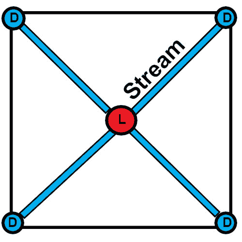
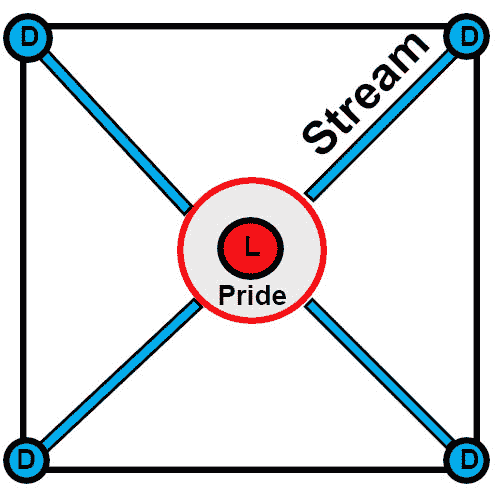

# 你应该保持作为开发领导者的自豪感吗？

> 原文:[https://dev . to/robertjwozniak/should-you-keep you-pride-as-a-development-lead-n1i](https://dev.to/robertjwozniak/should-you-keep-your-pride-as-a-development-lead-n1i)

[T2】](https://res.cloudinary.com/practicaldev/image/fetch/s--7POKEQ4W--/c_limit%2Cf_auto%2Cfl_progressive%2Cq_auto%2Cw_880/https://thepracticaldev.s3.amazonaws.com/i/fm4cxnqk7quyi3qff4u4.jpg)

### 1。标题介绍

我们都是人；我们生来都有不同的性格，这些性格在我们一生中不断演变。有趣的事实是，我们都有许多共同的行为方面。其中之一就是骄傲。骄傲有两种，好的和坏的。在这篇文章中，我将谈论伴随着公司头衔和权力而来的自豪感。骄傲自大，保持高高在上的感觉到底公平不公平？出于一种邪恶的骄傲感，维基百科是这样解释的:

这可能意味着某人不尊重他人的所作所为；只尊重他或她所做的。被描述为骄傲的人可能是傲慢的。这个词在谚语中的意思是:“骄者必败。”

让我们一起通过分析骄傲的一个行为方面来找出答案。

### 2。成为销售线索…

我想分析成为领导者的部分。有趣的是，有多少处于中高层的开发人员被提升到领导职位，却变得不可接近、小气或势利。以前，他们是友好的开发者，喜欢讨论，分享知识，承认错误，最重要的是，从错误中学习。我想谈谈那些改变了并以这种方式行事的人。

许多认识他们的人，在他们获得职业发展的机会之前，会嗅到他们的行为开始发生了一点变化，毫无疑问，他们肯定会找到理由来证明这一点。被提拔到领导岗位很难；这是巨大的成功和进步。同时，一种负担和一种不适应环境的感觉，这种环境曾经对你另眼相看。

能力不足的问题取决于你的工作对象。有某些类型的人会很快嫉妒他们获得晋升，也有一些人会更尊重他们，并与他们分享喜悦。他们的工作生活可能会变得不同，他们必须习惯这一点，因为这与他们获得晋升前不一样了。

### 3。你成了领导，当有人向你挑战时…

当我第一次成为领导者，开始拥有团队，开始自己交付项目时，我很自豪。它就在里面，深深地留在我的脑海里。没有人能对我的解决方案提出不同的意见和更好的建议，因为我是领导，没有人有比我更好的想法。这是令人信服的，我甚至敢于证明我的解决方案，即使有人有更好的。我这样过了一个月，日复一日，但在某个时刻，我意识到这是一列不知开往何处的火车。

当你失败时，生活是艰难的，我就是这样对待它的。当有人有更好的主意时，我的感觉是——我失败了。当然，我没有任何领导经验，而且我仍在学习如何与团队中想法比我更有说服力的人打交道。几周后，我开始注意到我有些不对劲。

当有人提出一个极好的想法时，每个人都很兴奋，但我不像其他人那样兴奋。我开始担心了。我在分析自己的行为，观察自己。不久之后，我意识到我缺少了一个重要的部分——团队合作和快乐。在这一点上，我开始打破我的障碍，让墙上的洞看到合作的光芒。这是惊人的，聪明的，充满想法的讨论，并承认别人的意见比我的好，我们应该执行它。此外，提到的改进不仅仅是关键，它还是结果、团队士气和信任的关键。

最后，你必须明白一个简单的事实——你不应该认为你是领导者，因为你是最好的，没有人比你更好。如果你是领导者，骄傲是不对的——作为这艘船的船长，你依赖于他人和他们的能力。你在那里是为了让他们比你更好——这就是对优秀领导者的描述。

### 4。骄傲如何降低团队士气和信任？

所以你是骄傲的领导者，你不能接受别人提出比你更好的想法。当你每天都这样做的时候，一些事情会发生，一周又一周。你的团队成员不会感受到也看不到任何委托，这意味着你不需要他们的帮助，你也不想依赖他们。现在，要问的一个重要问题是——如果他们所有的想法都被压制并扔进垃圾箱，他们如何被激励？这在一段时间内不会被注意到，但是在一段特定的时间后，你会开始看到关系水平的下降。

作为一名领导者，你要在你和团队成员之间建立一种关系，如果你不依赖他们，合作的背景就会变得灰暗，这意味着——没有信任，没有关系，记住，尊重程度也会开始下降。如果你和你的团队之间完全没有联系，你怎么能和他们一起工作呢？记住，通过与他们互动，你不会失去任何东西，相反，你会收获很多。

开发人员喜欢挑战，接受他们的想法，讨论他们，这将激励他们，向他们展示你的关心，只要你正确和小心地培养他们，这将产生有利可图的作物。

### 5。合作的矩形流

我想向你介绍“合作的矩形流”这是当你的团队向你传达一连串想法时，我所看到的过程。请看下面的第一张图片:

[T2】](https://res.cloudinary.com/practicaldev/image/fetch/s--vJxuMVWE--/c_limit%2Cf_auto%2Cfl_progressive%2Cq_auto%2Cw_880/https://thepracticaldev.s3.amazonaws.com/i/lbwr5s70e1282wsyuzj0.jpg)

第一张图片代表了流程的基础，以及当您成为销售线索时，流程是如何开始的。如你所见，你在中间，用一个红点表示。在你周围的矩形中，你可以看到蓝点，代表开发者试图向你发送他们想法的语音流。

[T2】](https://res.cloudinary.com/practicaldev/image/fetch/s--mGHXp5F5--/c_limit%2Cf_auto%2Cfl_progressive%2Cq_auto%2Cw_880/https://thepracticaldev.s3.amazonaws.com/i/oww3xggekpoa256zup4e.jpg)

第二张图片代表当你的骄傲战胜你的队友时会发生什么。

[T2】](https://res.cloudinary.com/practicaldev/image/fetch/s--38X0HT1w--/c_limit%2Cf_auto%2Cfl_progressive%2Cq_auto%2Cw_880/https://thepracticaldev.s3.amazonaws.com/i/zybvmnpkdoeg3nvprr2k.jpg)

第三张图片代表了当你压抑自己的骄傲，让想法和讨论自由流动时会发生什么。另外，这应该给你一个重要的提示，你看到你的团队在第三张图片中开始发送多少个流了吗？为什么？

### 6。临终遗言

我真的希望在读完这篇文章后，你对骄傲的领导者以及它给你的团队带来的后果有了自己的看法。如果你认为还有其他重要的事情需要提及，请在评论中告诉我。

感谢您阅读文章。