# Gmail API 及其文档的初学者指南

> 原文：<https://dev.to/banjoanton/a-beginner-s-guide-to-the-gmail-api-and-its-documentation-4bm0>

编程的一个关键部分是与不同的应用程序编程接口(API)进行通信的能力。如果你访问 [Google API Explorer](https://cloud.google.com/monitoring/api/apis-explorer) ，你会发现一个庞大的 API 库，包括所有知名的应用程序，如 Gmail、Drive 和 Calendar。简单地说，API 允许您通过 HTTP 请求向服务获取或发送数据。

这些 API 的用法和文档一开始可能有点复杂，但是一旦你学会了，你就能把你的知识应用到大多数 Google 应用程序中。

我决定写一本如何使用和理解 Gmail API 的初学者指南。该指南是基于文档的，这意味着您将学习寻找什么以及如何阅读它，而不仅仅是复制代码。由于大多数其他 Google API 参考文档都是相似的，一旦你知道如何真正阅读这些文档，你就会发现适应它们要容易得多。这将允许你写自己的代码，并真正理解你在做什么。

本指南中使用了 Python 3，但是在其他语言中的用法应该也很相似。

## 快速入门

谷歌通常会提供一个快速入门指南来简化授权。本指南将使用快速入门指南中的授权，这意味着它会有一些限制，但对于我们的目的来说已经足够了。获得 API 密匙的另一种方法是创建一个新项目，这有点复杂。

Python 快速入门指南可以通过这个链接访问[，但是我将继续向您展示这里的一切是如何完成的。](https://developers.google.com/gmail/api/quickstart/python)

这是快速入门的样子:

[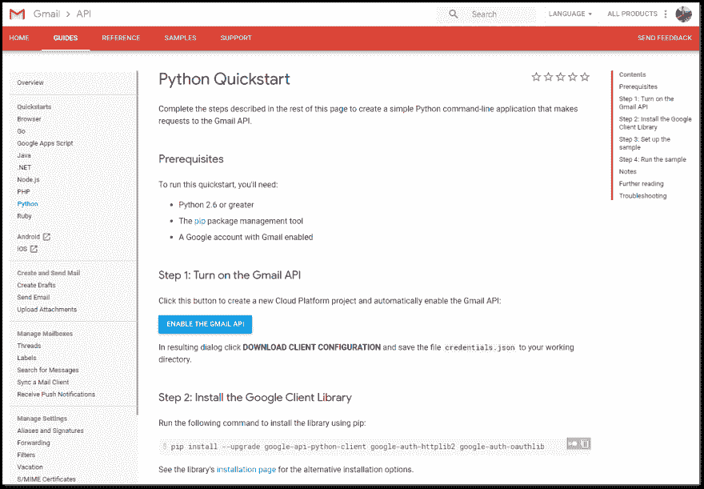](https://res.cloudinary.com/practicaldev/image/fetch/s--ZWT_F_eB--/c_limit%2Cf_auto%2Cfl_progressive%2Cq_auto%2Cw_880/https://cdn-images-1.medium.com/max/2788/1%2AZM4CSq5j9b7kNr7ZCnhGwQ.png)

## 打开 Gmail API

第一步是启用 API 并下载在我们的项目中使用的凭证。按下“启用 Gmail API”* *按钮，我们将打开一个新窗口，显示我们的凭据。

[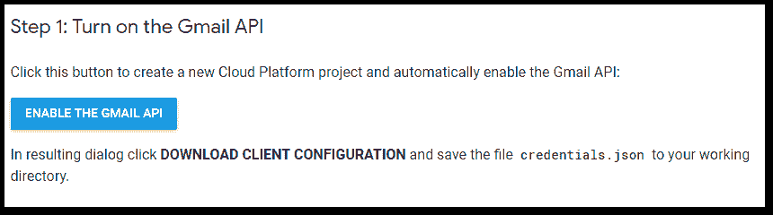](https://res.cloudinary.com/practicaldev/image/fetch/s--l6G9oWjk--/c_limit%2Cf_auto%2Cfl_progressive%2Cq_auto%2Cw_880/https://cdn-images-1.medium.com/max/2000/1%2AzdsZCQWFkIXWjdbrq5-DHg.png)

将显示我们的客户 ID 和客户密码。选择要下载的客户端配置。将保存一个名为 credentials.json 的文件。我们将把它保存到代码所在的文件夹中。

[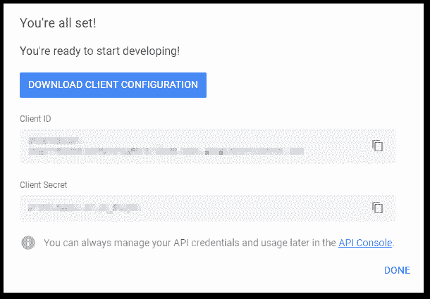](https://res.cloudinary.com/practicaldev/image/fetch/s--sTyOlLjZ--/c_limit%2Cf_auto%2Cfl_progressive%2Cq_auto%2Cw_880/https://cdn-images-1.medium.com/max/2000/1%2A4Ve-ijpUOxE6J1Y9ThepdA.png)

## 安装库

[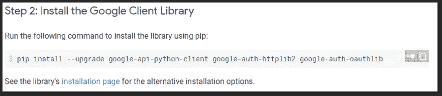](https://res.cloudinary.com/practicaldev/image/fetch/s--ETaDUWUV--/c_limit%2Cf_auto%2Cfl_progressive%2Cq_auto%2Cw_880/https://cdn-images-1.medium.com/max/2000/1%2AGPmZbjJSEtQGtw84EdMAcg.png)

安装所需的库是通过 Google 提供的一个简单的 pip 命令完成的。我也把它贴在了下面。我建议在虚拟环境中做这件事。但是，这不在本指南中介绍。

```
pip install — upgrade google-api-python-client google-auth-httplib2 google-auth-oauthlib 
```

Enter fullscreen mode Exit fullscreen mode

## 首次运行—允许访问

在我们继续遵循指南之前，我们需要允许我们的脚本访问 Gmail API。让我们从制作实际的脚本开始。

创建一个*。项目目录中的 py* 文件(与 credentials.json 所在的目录相同)。为了方便起见，我们姑且称之为 gmail.py。

将示例代码从 Python 快速入门复制到 gmail.py * *文件中。暂时忽略代码，稍后我们将深入研究它。我们只需要在第一次运行时允许访问——它也将为以后的所有运行保存。

像平常一样运行这个文件，你就可以在网络浏览器中登录你的谷歌账户了。

```
python gmail.py 
```

Enter fullscreen mode Exit fullscreen mode

登录您的帐户。将显示一条警告，说明该应用程序未经验证。由于我们使用快速入门方法，我们的应用程序尚未通过验证。现在只需点击图片上显示的链接继续并允许访问。

[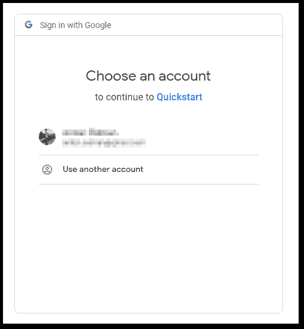](https://res.cloudinary.com/practicaldev/image/fetch/s--r_hr1ZrG--/c_limit%2Cf_auto%2Cfl_progressive%2Cq_auto%2Cw_880/https://cdn-images-1.medium.com/max/2000/1%2AG-MWaFDYhIQ1573iRCGwtg.png)

[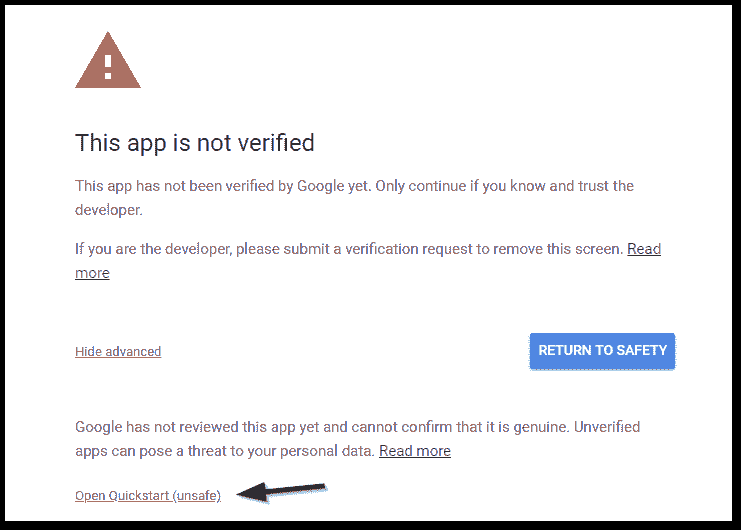](https://res.cloudinary.com/practicaldev/image/fetch/s--DcDwBTW4--/c_limit%2Cf_auto%2Cfl_progressive%2Cq_auto%2Cw_880/https://cdn-images-1.medium.com/max/2000/1%2AbS5oC8evV6jqKNFtwnTmvw.png)

[](https://res.cloudinary.com/practicaldev/image/fetch/s--8-9w_2nL--/c_limit%2Cf_auto%2Cfl_progressive%2Cq_auto%2Cw_880/https://cdn-images-1.medium.com/max/2000/1%2A2wqor9ubBbVY1eevIOdddQ.png)

## 理解代码

示例代码一开始可能看起来让人不知所措，但是我将把它分成更小的部分以保持简单。到最后，你会发现其实并没有那么难。

### **导入和范围**

[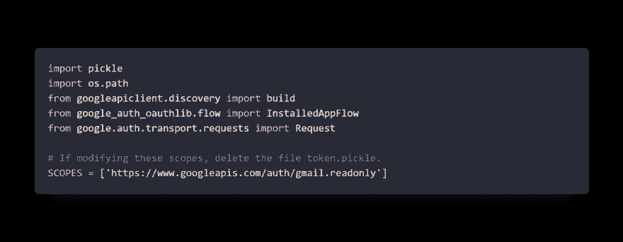](https://res.cloudinary.com/practicaldev/image/fetch/s--5sINwLFd--/c_limit%2Cf_auto%2Cfl_progressive%2Cq_auto%2Cw_880/https://cdn-images-1.medium.com/max/3332/1%2ADaHBPVvcjHKHZcCKePZ6ww.png)

与任何其他 Python 脚本一样，我们将从导入开始。大多数导入用于 credentials.json 文件的授权。所有这些都是默认提供的，所以我们不需要做任何改变。

然而，范围是最重要的部分。这个变量稍后会被修改，但是现在，我们将满足于提供的默认范围。

这意味着它将允许我们访问 gmail.readonly 范围内的数据。还有更多的范围，这允许我们对 Gmail API 进行一系列的操作和请求。其他一些请求需要其他作用域。

稍后，我们将添加另一个作用域来使用其他功能。

### **国书**

[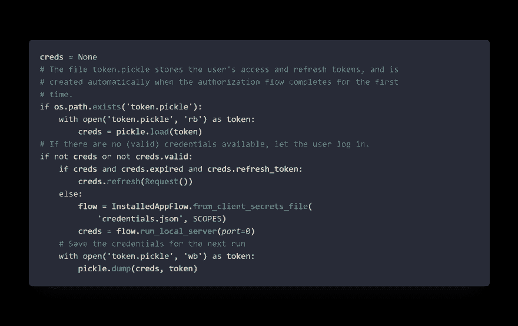](https://res.cloudinary.com/practicaldev/image/fetch/s--4z9kMwwo--/c_limit%2Cf_auto%2Cfl_progressive%2Cq_auto%2Cw_880/https://cdn-images-1.medium.com/max/3332/1%2A_d1IOUoZlQpTSGrCtJ8hsA.png)

授权可能是对脚本的最高级部分。我们现在不会深入讨论这个问题，因为它已经被配置为开箱即用。

这是获取您从 credentials.json 下载的凭证的部分。这是在您第一次允许访问您的帐户时创建的文件。如果文件已经存在，它会从中获取凭证，这意味着您不必多次允许访问。

如果 token.pickle 文件不存在，它将从您的 credentials.json 文件加载凭证。这需要您允许通过 web 浏览器访问，就像您之前所做的那样。

在这两种情况下，凭据都保存在 creds 变量中供以后使用。

### **API**

[](https://res.cloudinary.com/practicaldev/image/fetch/s--57Tz3aCs--/c_limit%2Cf_auto%2Cfl_progressive%2Cq_auto%2Cw_880/https://cdn-images-1.medium.com/max/3332/1%2AFGXnbjWbRSYwinAkXhavDg.png)

这是脚本有趣的部分:从 Gmail API 获取数据的部分。如你所见，它实际上并没有那么先进。这是我们将深入探讨的部分。

该服务是使用先前导入的构建函数构建的。我们之前得到的凭证作为参数传递给它。

然后，服务用于获取授权帐户的所有 Gmail 标签。数据被保存到结果变量中。

最后一行将所有标签保存到 labels 变量中。它们被格式化为列表，因此如果列表为空，则指定默认值([])。

本指南的下一部分将查看文档来理解这一点。

### **结果**

[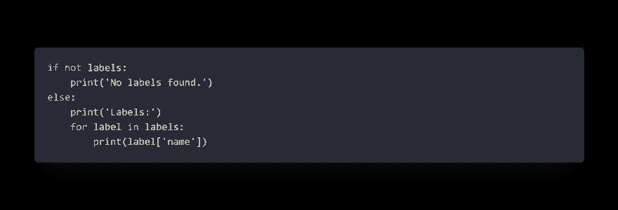](https://res.cloudinary.com/practicaldev/image/fetch/s--DLxFJpTq--/c_limit%2Cf_auto%2Cfl_progressive%2Cq_auto%2Cw_880/https://cdn-images-1.medium.com/max/3332/1%2Al2mDGxSl5GlFyvJ_6pJyeA.png)

最后，打印标签名称(如果有)。

## 理解文档

这就是快速入门示例代码。但是，不看文档没有太大意义。这一部分将向您展示如何真正理解代码中所写的内容，以及如何使用文档来编写自己的代码。

首先，让我们转到“参考”* * * *选项卡以访问文档。

[](https://res.cloudinary.com/practicaldev/image/fetch/s--iPOvVOAJ--/c_limit%2Cf_auto%2Cfl_progressive%2Cq_auto%2Cw_880/https://cdn-images-1.medium.com/max/2000/1%2AcKX-uX8EnrqbFIhZhJ91Lg.png)

左侧显示了一个大的摘要菜单。它包含了很多信息，但在接下来的步骤中会非常有用。

当我们使用标签时，让我们选择 Users.labels 部分和 Overview 部分来获得关于标签的一些基本信息。

[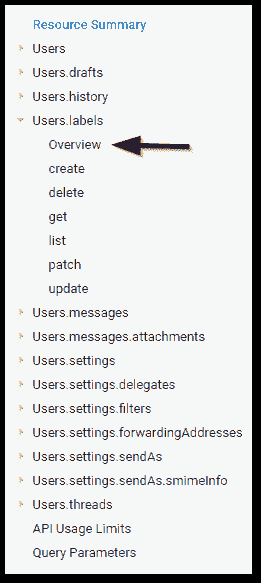](https://res.cloudinary.com/practicaldev/image/fetch/s--qakEtkdD--/c_limit%2Cf_auto%2Cfl_progressive%2Cq_auto%2Cw_880/https://cdn-images-1.medium.com/max/2000/1%2AL-0XnE0WLYAXeGioiY1vig.png)

迎接我们的是这个屏幕:

[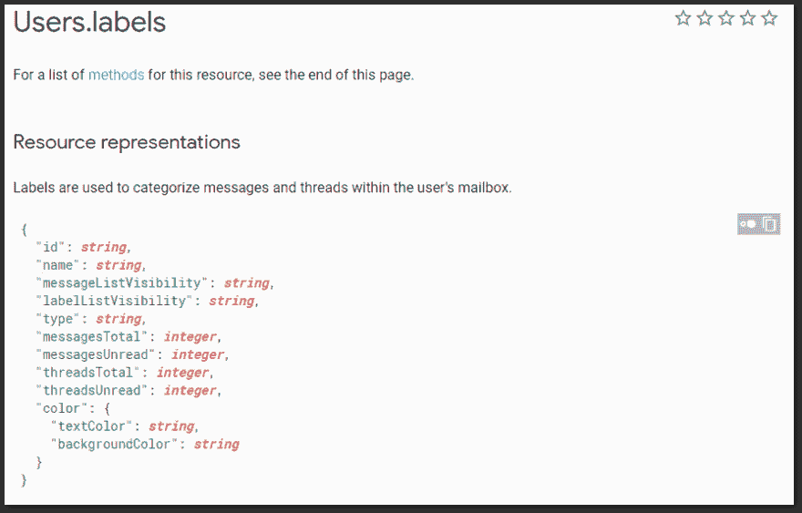](https://res.cloudinary.com/practicaldev/image/fetch/s--jsL20-kL--/c_limit%2Cf_auto%2Cfl_progressive%2Cq_auto%2Cw_880/https://cdn-images-1.medium.com/max/2000/1%2A4bfXKfw7KX1W_GkZJwj3vw.png)

说明方法列表以及标签的*资源表示** * * *位于页面末尾的文本。信息通常以 JSON 的形式发送，像 Python 中的字典一样处理。

这是我们获取的每个标签包含的信息。如果我们继续向下滚动，应该会看到一个表，其中提供了字典中每个属性的信息。

[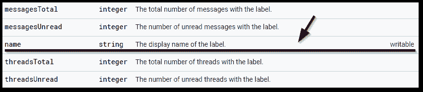](https://res.cloudinary.com/practicaldev/image/fetch/s--Xq3lS3c2--/c_limit%2Cf_auto%2Cfl_progressive%2Cq_auto%2Cw_880/https://cdn-images-1.medium.com/max/2000/1%2A9YXrKqRLQdCmMyCFkX2Olw.png)

我突出显示了名称部分，因为我们以前使用过它。我们在之前打印标签时访问了标签的名称。像这样:

[](https://res.cloudinary.com/practicaldev/image/fetch/s--F_aRBLyr--/c_limit%2Cf_auto%2Cfl_progressive%2Cq_auto%2Cw_880/https://cdn-images-1.medium.com/max/3332/1%2AcSISXp-VSOnfK3I1iI5OdQ.png)

在这种情况下，标签是一个字典，我们访问其中的 name 属性。我们可以访问上面提到的任何其他属性，但是现在，name 就可以了。

需要注意的是，name 是一个字符串，但是有些值可能是整数。在文档中很容易找到。

如果我们继续向下滚动到页面的底部，我们会看到所有的方法。提供了每种方法的简短描述，以及指向文档的超链接。

[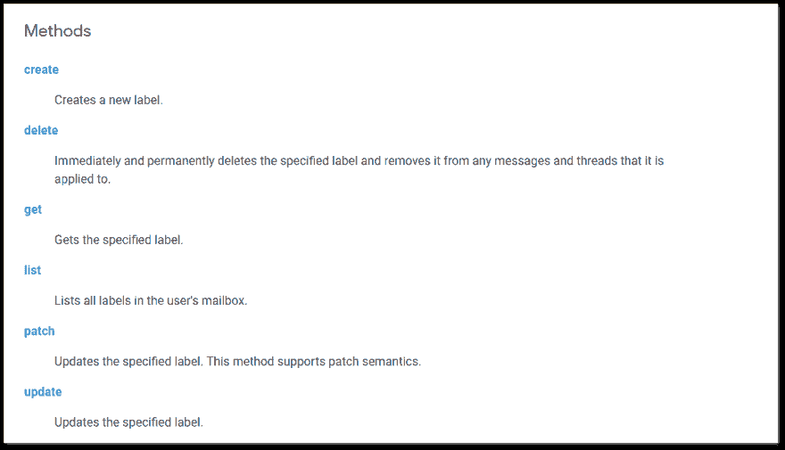](https://res.cloudinary.com/practicaldev/image/fetch/s--0q_aSaG5--/c_limit%2Cf_auto%2Cfl_progressive%2Cq_auto%2Cw_880/https://cdn-images-1.medium.com/max/2064/1%2A9fiTsokRfDRgpO9JpcgEbw.png)

根据你想做的事情，你会使用不同的方法。快速入门示例使用 list 方法获取 Gmail 帐户上的所有标签。如果我们想要创建一个新的标签，我们将使用 create 方法，我们将在后面实际操作。

如果我们回到顶部，看看左边的概述，您会看到每个方法都有自己的菜单按钮。

[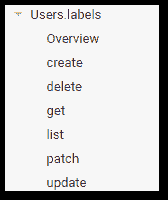](https://res.cloudinary.com/practicaldev/image/fetch/s--urPc3ohy--/c_limit%2Cf_auto%2Cfl_progressive%2Cq_auto%2Cw_880/https://cdn-images-1.medium.com/max/2000/1%2A-L0nw6sol46cDfw5CfOJhA.png)

### **列表法**

让我们仔细看看 list 方法，我们以前通过单击菜单栏上的 list 来使用它。

[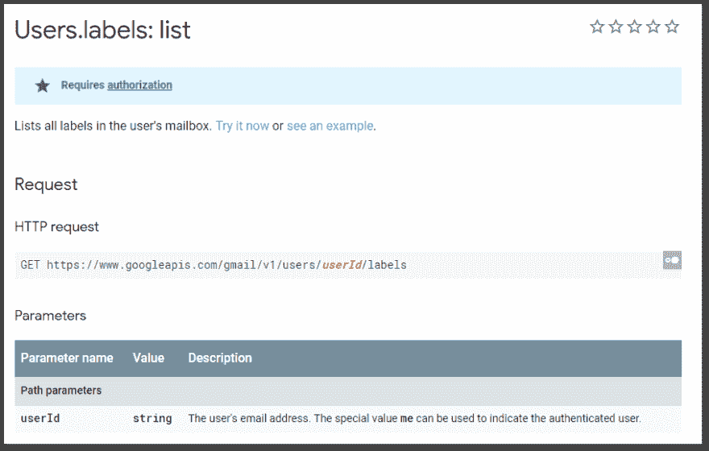](https://res.cloudinary.com/practicaldev/image/fetch/s--Bw-uo7BR--/c_limit%2Cf_auto%2Cfl_progressive%2Cq_auto%2Cw_880/https://cdn-images-1.medium.com/max/2000/1%2ALNvvhombnBYy1EfrZGvMOQ.png)

这提供了很多有用的信息。首先，向标签 URL 发送一个 HTTP GET 请求来获取所有标签:

```
https://www.googleapis.com/gmail/v1/users/userId/labels 
```

Enter fullscreen mode Exit fullscreen mode

例如，我们可以使用 Python 中的 requests 库来手动完成这项工作。然而，在本指南中，我们将使用提供的 Google 库。

需要授权，但我们之前已经处理了这部分。

最后，同样重要的是，我们可以传递给 list 方法的参数。如您所见，userId 是我们唯一可以传递的。

userId 是代表用户电子邮件地址的字符串。取而代之，可以使用值 me 来指示经过认证的用户。我们实际上在示例代码中使用了 me 值。

我们将很快对此进行深入研究，但是首先，我们将通读 list 方法文档的其他部分。

### **授权和范围**

[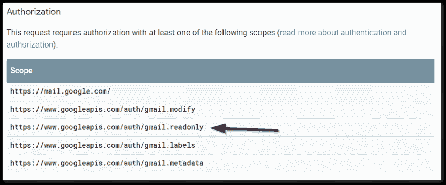](https://res.cloudinary.com/practicaldev/image/fetch/s--cEgyxd2O--/c_limit%2Cf_auto%2Cfl_progressive%2Cq_auto%2Cw_880/https://cdn-images-1.medium.com/max/2000/1%2ALtM3AI9S7ROYG7-dFy1yuA.png)

范围可能听起来很熟悉，这是因为我们之前简单地提到过它。若要访问 list 方法，至少需要一个提供的范围。

如您所见，我们已经在代码顶部添加了 gmail.readonly 范围。

[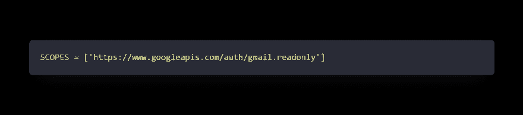](https://res.cloudinary.com/practicaldev/image/fetch/s--INqS_OJ9--/c_limit%2Cf_auto%2Cfl_progressive%2Cq_auto%2Cw_880/https://cdn-images-1.medium.com/max/3332/1%2AQiNaL9tlnQUZGV03vhK3tw.png)

### **回应**

[](https://res.cloudinary.com/practicaldev/image/fetch/s--IUlN7XxD--/c_limit%2Cf_auto%2Cfl_progressive%2Cq_auto%2Cw_880/https://cdn-images-1.medium.com/max/2000/1%2A8ScFzWLx1vzS73TBLVkDUg.png)

最后一部分向我们展示了成功的请求将返回什么:JSON 格式的主体。所有标签都存储为一个列表，可以使用 labels 键访问该列表。基本上是这样:

```
list_of_labels = response["labels"] 
```

Enter fullscreen mode Exit fullscreen mode

就像在 Python 中使用普通字典一样。

## 制作列表请求

现在我们已经从文档中收集了更多的信息，让我们回头看看代码的 API 部分。

首先，服务是用我们的凭证构建的。这只是用于发出请求的基础(使用我们之前看到的方法)。

[](https://res.cloudinary.com/practicaldev/image/fetch/s--7hGf4Lce--/c_limit%2Cf_auto%2Cfl_progressive%2Cq_auto%2Cw_880/https://cdn-images-1.medium.com/max/3332/1%2AX_MsWsepVs5Y51nPLlDqnw.png)

接下来，我们实际上使用 list 方法通过这段代码发出请求。一旦我们浏览了文档，现在看起来可能会更熟悉一些。

[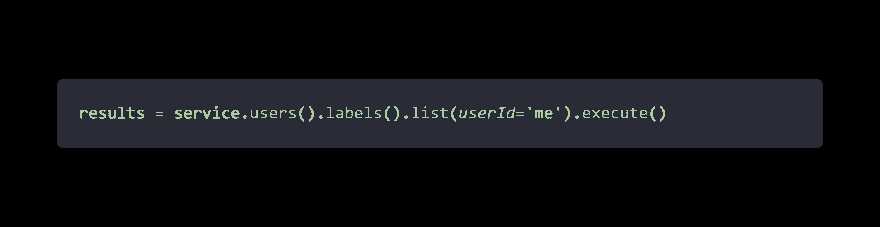](https://res.cloudinary.com/practicaldev/image/fetch/s--dpG6r8pO--/c_limit%2Cf_auto%2Cfl_progressive%2Cq_auto%2Cw_880/https://cdn-images-1.medium.com/max/2856/1%2A91CEaMVUGVNuAnxWns-pVQ.png)

为了更容易地向您展示语法是如何构建的，我用颜色编码了代码和菜单，以向您展示 API 是如何工作的。

[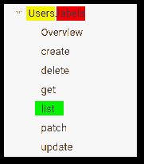](https://res.cloudinary.com/practicaldev/image/fetch/s--pye1pYQa--/c_limit%2Cf_auto%2Cfl_progressive%2Cq_auto%2Cw_880/https://cdn-images-1.medium.com/max/2000/1%2AW_C0IJhZpD8fsUIPOZvQ0Q.png)

[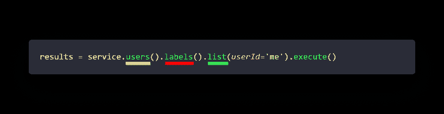](https://res.cloudinary.com/practicaldev/image/fetch/s--lHSCjkdS--/c_limit%2Cf_auto%2Cfl_progressive%2Cq_auto%2Cw_880/https://cdn-images-1.medium.com/max/2856/1%2AyWPFL2hijRc_ms7Wg_vUgw.png)

我们从服务变量开始。通过简单地遵循树状结构，一个方法接一个方法，我们将最终到达列表方法。

让我们仔细看看 list 方法，尤其是我们熟悉的 userId 参数，它将我作为一个参数传递。

[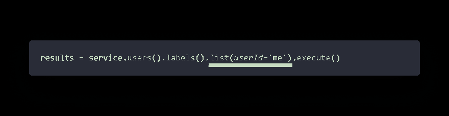](https://res.cloudinary.com/practicaldev/image/fetch/s--KjtEm189--/c_limit%2Cf_auto%2Cfl_progressive%2Cq_auto%2Cw_880/https://cdn-images-1.medium.com/max/2856/1%2AKojfZwqfQdWnNnJEI2yVNw.png)

如果我们向上滚动到列表方法文档的顶部，我们将看到我们前面谈到的参数的摘要。指定了 userId 参数，以防我们不知道它是什么。

[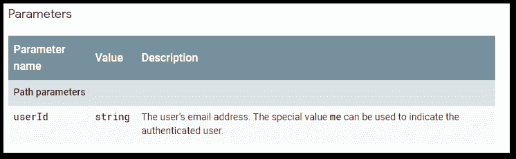](https://res.cloudinary.com/practicaldev/image/fetch/s--hgtr6INW--/c_limit%2Cf_auto%2Cfl_progressive%2Cq_auto%2Cw_880/https://cdn-images-1.medium.com/max/2000/1%2AchQYaFuL3HKx57PNTXrOQA.png)

我们只是将它作为参数传递给代码中的 list 方法。

您可能还记得，根据文档的响应部分，请求应该返回一个字典。我们将它存储在结果变量中。

[](https://res.cloudinary.com/practicaldev/image/fetch/s--IUlN7XxD--/c_limit%2Cf_auto%2Cfl_progressive%2Cq_auto%2Cw_880/https://cdn-images-1.medium.com/max/2000/1%2A8ScFzWLx1vzS73TBLVkDUg.png)

为了访问标签，我们使用。获取字典的方法。我们传递的第一个参数是我们想要获取的内容的名称(标签)，第二个参数是如果它没有找到任何具有该名称的内容时我们返回的内容。

[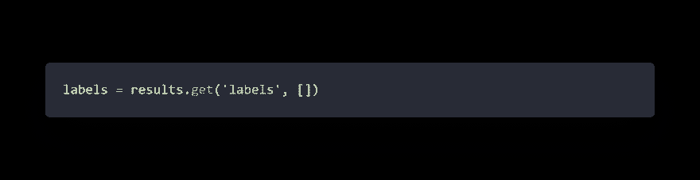](https://res.cloudinary.com/practicaldev/image/fetch/s--wNlwU-7c--/c_limit%2Cf_auto%2Cfl_progressive%2Cq_auto%2Cw_880/https://cdn-images-1.medium.com/max/2856/1%2A1RHuCGcDTHA9hseyiNH-rw.png)

如果没有名为 labels 的键，将返回一个空列表。

这就是阅读文档的基本方式，也是 list 方法的工作方式。让我们试着按照 API 文档从头开始做些别的事情。

## 创建新标签

让我们利用新发现的知识，做一些新的事情，从零开始(几乎)。

从文档中删除所有与 API 相关的代码。只保留导入、范围和凭证处理。我们将尝试通过 API 创建一个新标签。

[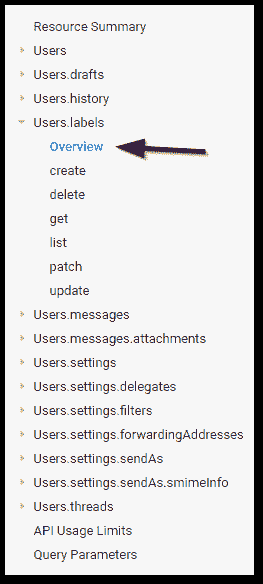](https://res.cloudinary.com/practicaldev/image/fetch/s--5_DxFIv_--/c_limit%2Cf_auto%2Cfl_progressive%2Cq_auto%2Cw_880/https://cdn-images-1.medium.com/max/2000/1%2AN0qMsmZcIJGvxrZ-z3JaEw.png)

让我们转到标签的概述页面。向下滚动到方法，看看我们需要使用哪一个来创建我们自己的方法。

[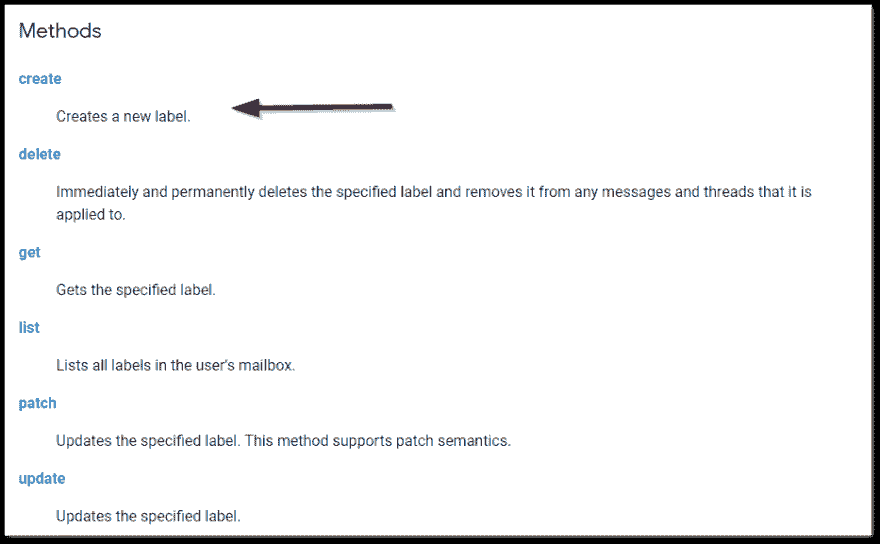](https://res.cloudinary.com/practicaldev/image/fetch/s--YaDrH183--/c_limit%2Cf_auto%2Cfl_progressive%2Cq_auto%2Cw_880/https://cdn-images-1.medium.com/max/2000/1%2AWxk5gAfa3DMuE7sNHE_J6g.png)

[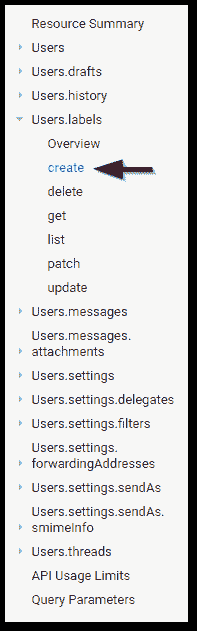](https://res.cloudinary.com/practicaldev/image/fetch/s--LR2UN-OG--/c_limit%2Cf_auto%2Cfl_progressive%2Cq_auto%2Cw_880/https://cdn-images-1.medium.com/max/2000/1%2A46D2EVnXysPTradWR9Qonw.png)

您可能已经注意到，我们将使用一个名为 create 的方法。去那个方法的文档看看我们需要什么。

让我们从授权和范围开始。

[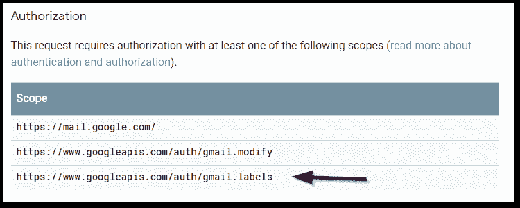](https://res.cloudinary.com/practicaldev/image/fetch/s--m_pOaaYv--/c_limit%2Cf_auto%2Cfl_progressive%2Cq_auto%2Cw_880/https://cdn-images-1.medium.com/max/2000/1%2AaUKVTjr-6qcJa56xk3CEdw.png)

如您所见，我们至少需要三个现有范围中的一个。然而，我们的代码中没有任何一个。让我们添加 gmail.labels 范围。

[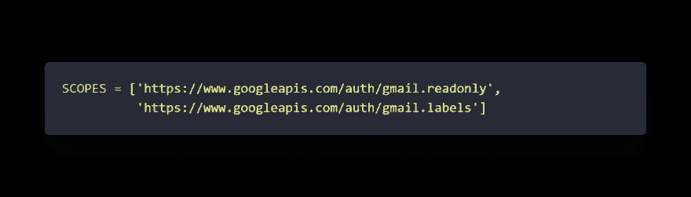](https://res.cloudinary.com/practicaldev/image/fetch/s--wy07PEjz--/c_limit%2Cf_auto%2Cfl_progressive%2Cq_auto%2Cw_880/https://cdn-images-1.medium.com/max/2856/1%2A1nqtecorR_PVjfMnc0j7og.png)

SCOPES 变量接受一个列表，这意味着我们可以简单地用逗号分隔来添加新的范围。

由于旧的授权存储在 token.pickle 文件中(并且只要该文件存在就用于授权)，我们需要删除它并使用新的范围重新创建它。

使用 python gmail.py 再次运行 Python 应用程序进行重新授权，但是，可以看到一个微小的变化:

[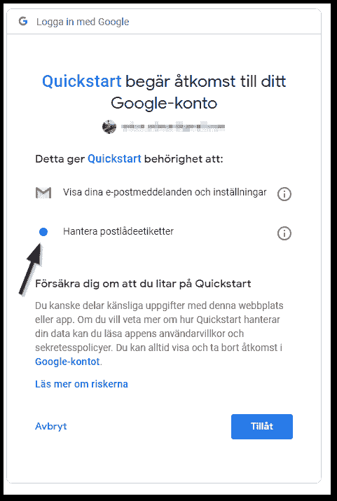](https://res.cloudinary.com/practicaldev/image/fetch/s--PMFddZWD--/c_limit%2Cf_auto%2Cfl_progressive%2Cq_auto%2Cw_880/https://cdn-images-1.medium.com/max/2000/1%2Ads0-62GI7iv5MqduIsYKyg.png)

添加了新的依赖项。由于瑞典语的原因，你可能不理解，但它基本上说的是“处理标签”所以新的作用域给我们的应用程序增加了一个新的依赖项。

### 代码

如果我们看一下 create 方法文档的顶部，我们可以看到它与 list 方法非常相似。它需要授权，发出 HTTP POST 请求，并且需要一个 userId 参数。

[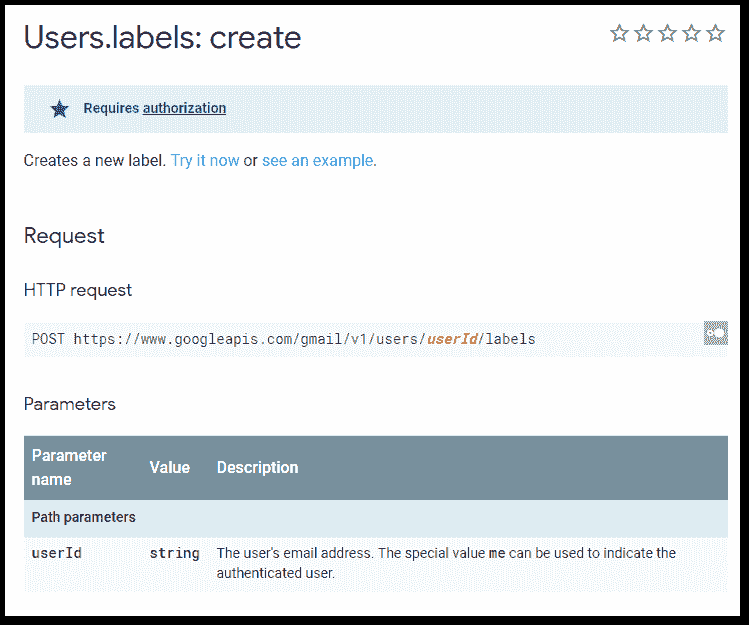](https://res.cloudinary.com/practicaldev/image/fetch/s--q8vURlkp--/c_limit%2Cf_auto%2Cfl_progressive%2Cq_auto%2Cw_880/https://cdn-images-1.medium.com/max/2000/1%2AlRRp4YiL4av0dNzJ4Gb3RQ.png)

但是我们需要在请求中传递实际的标签。如果我们向下滚动到请求体，我们将看到如何做到这一点。

[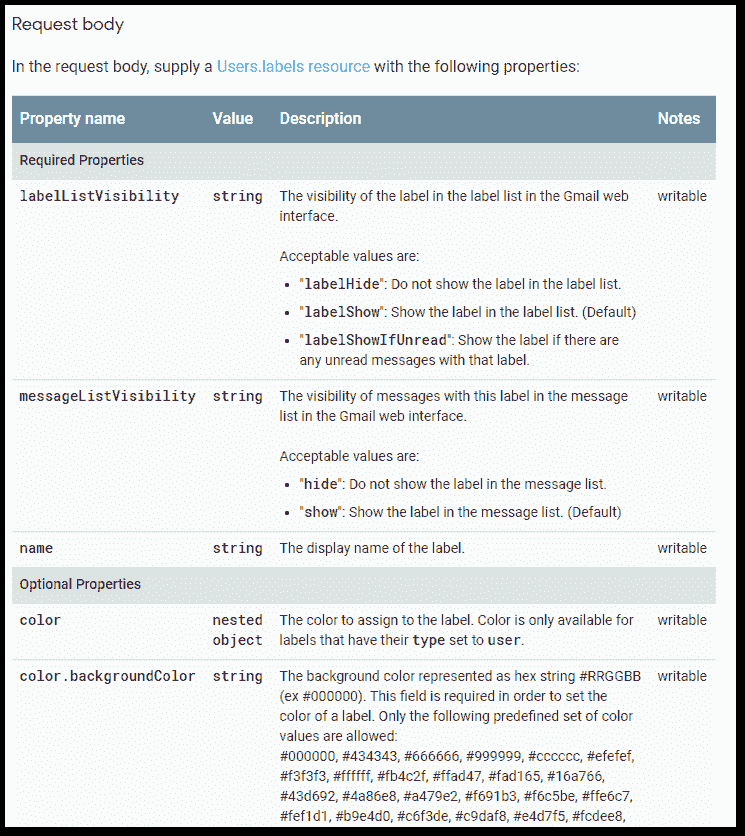](https://res.cloudinary.com/practicaldev/image/fetch/s--qmG70oit--/c_limit%2Cf_auto%2Cfl_progressive%2Cq_auto%2Cw_880/https://cdn-images-1.medium.com/max/2000/1%2Acf-bScqmtyapkFk9qQutyA.png)

在我们的请求正文中，应该有一个至少具有以下属性的标签来创建标签:

*   标签可视性

*   邮件列表可见性

*   名字

您可以在文档中了解它们应该属于哪种类型，以及它们是什么。

就像我们在字典中接收数据一样，数据应该作为字典发送。

### 创建标签

[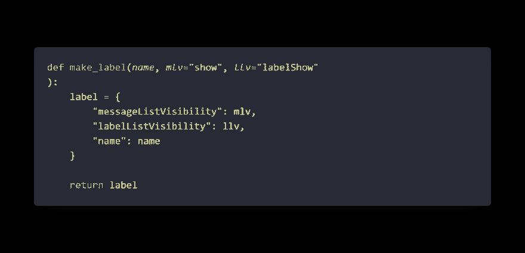](https://res.cloudinary.com/practicaldev/image/fetch/s--7l7TD_2j--/c_limit%2Cf_auto%2Cfl_progressive%2Cq_auto%2Cw_880/https://cdn-images-1.medium.com/max/2856/1%2AS7NYvPMJnEvrerP45au8RQ.png)

这是一个创建标签的简单函数。它需要一个名称和另外两个可选参数。如果未指定，show 和 labelShow 将用作默认值。

标签被创建为字典，然后被返回。

[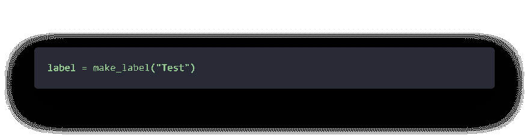](https://res.cloudinary.com/practicaldev/image/fetch/s---ZfY6aYo--/c_limit%2Cf_auto%2Cfl_progressive%2Cq_auto%2Cw_880/https://cdn-images-1.medium.com/max/2856/1%2AZVo9q8H4Ttqjyw-On-rWWQ.png)

要创建名为 Test 的标签，我们将使用上面的语法。

### 向 API 发出请求

是时候向 API 发出实际请求，并将我们的标签传递到我们的 Gmail 帐户了。让我们遵循和上次一样的程序。

我对 create 方法的路径进行了颜色编码。

[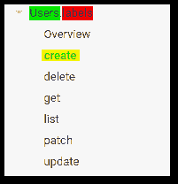](https://res.cloudinary.com/practicaldev/image/fetch/s--HYEOqp-z--/c_limit%2Cf_auto%2Cfl_progressive%2Cq_auto%2Cw_880/https://cdn-images-1.medium.com/max/2000/1%2AZDrK7YXkrOQEmZ4wnA3Bgg.png)

与我们上次的 API 调用相比，我们没有太大的变化。我们从之前创建的 service 开始，添加每个方法，直到到达 create 方法。然而，我们在这方面还没有完全完成。

[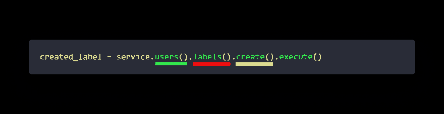](https://res.cloudinary.com/practicaldev/image/fetch/s--k3yarlUV--/c_limit%2Cf_auto%2Cfl_progressive%2Cq_auto%2Cw_880/https://cdn-images-1.medium.com/max/2856/1%2AX4AvizoiMDFJ21bVKDOkIQ.png)

如果我们滚动到文档的 Parameters * * * *部分，我们会看到我们需要将 userId 作为参数传递，就像我们的最后一个调用一样。

[](https://res.cloudinary.com/practicaldev/image/fetch/s--hgtr6INW--/c_limit%2Cf_auto%2Cfl_progressive%2Cq_auto%2Cw_880/https://cdn-images-1.medium.com/max/2000/1%2AchQYaFuL3HKx57PNTXrOQA.png)

让我们再次使用我，就像文档建议的那样。

[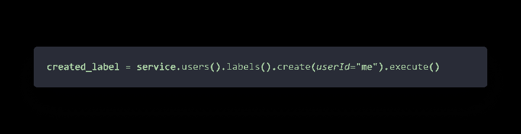](https://res.cloudinary.com/practicaldev/image/fetch/s--fuERPwPH--/c_limit%2Cf_auto%2Cfl_progressive%2Cq_auto%2Cw_880/https://cdn-images-1.medium.com/max/2856/1%2Ashmtm6JubEoLe8c7SMs0Zg.png)

我们仍然缺少一些东西:实际的标签。我们还需要在请求中传递标签。让我们再次向下滚动到请求正文。

[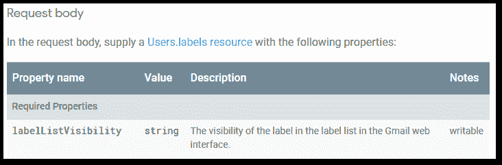](https://res.cloudinary.com/practicaldev/image/fetch/s--WlSYcvKK--/c_limit%2Cf_auto%2Cfl_progressive%2Cq_auto%2Cw_880/https://cdn-images-1.medium.com/max/2000/1%2AAuhg-AF_hvawmH2T-rte6w.png)

我们已经创建了具有所有必需属性的标签，所以我们需要在请求体中传递它。这可以通过向创建方法添加另一个名为 body 的参数来实现。

让我们在其中传递我们的标签对象。

[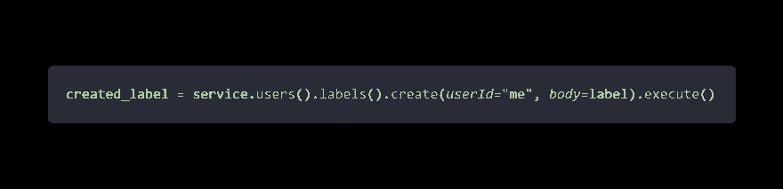](https://res.cloudinary.com/practicaldev/image/fetch/s--jfq51VC---/c_limit%2Cf_auto%2Cfl_progressive%2Cq_auto%2Cw_880/https://cdn-images-1.medium.com/max/3044/1%2AjLcsDZFcRFP6UtyMwhPl2A.png)

实际的调用已经完成，但是为了添加一些错误检查，让我们将它包装到一个 try/except 语句中。

[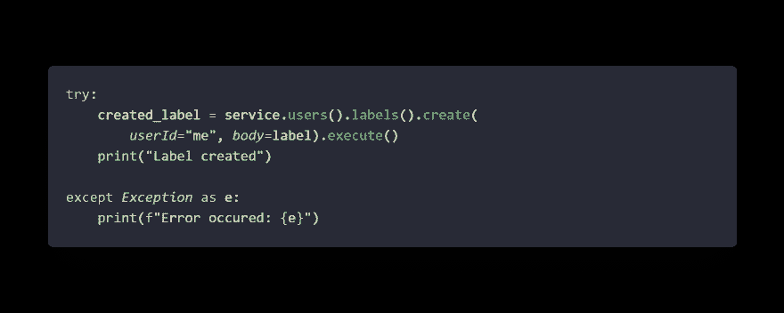](https://res.cloudinary.com/practicaldev/image/fetch/s--1Yacprkf--/c_limit%2Cf_auto%2Cfl_progressive%2Cq_auto%2Cw_880/https://cdn-images-1.medium.com/max/3044/1%2AMr1KQMjm0ltujEAow6eA5g.png)

如果出现问题，错误消息将会打印在我们的控制台上。如果一切按计划进行，标签创建将被打印(并且标签将被创建)。

因此，让我们回头看看我们为创建新的 API 请求而创建的代码部分:

[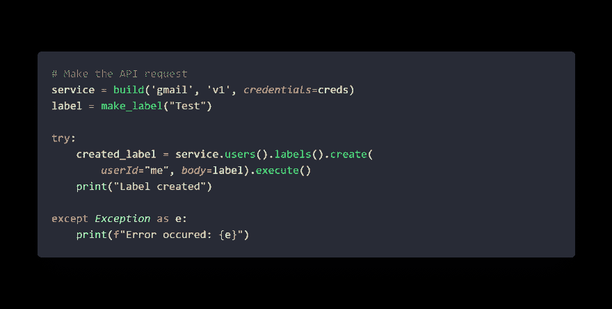](https://res.cloudinary.com/practicaldev/image/fetch/s--kECHK4I0--/c_limit%2Cf_auto%2Cfl_progressive%2Cq_auto%2Cw_880/https://cdn-images-1.medium.com/max/3044/1%2AcsDxXfIBHowGghU2BG-DUw.png)

API 处理实际上并不困难。实际的获取并不需要很多行代码——棘手的部分是授权，我们甚至不需要自己处理。

如果我们用 python gmail.py 保存并运行代码，应该会在我们的 gmail 帐户中创建一个新标签。

[](https://res.cloudinary.com/practicaldev/image/fetch/s--_NheKOh8--/c_limit%2Cf_auto%2Cfl_progressive%2Cq_auto%2Cw_880/https://cdn-images-1.medium.com/max/2000/1%2AesN51KWw8J7-nkiZJXkhzw.png)

## **搞定了！**

我们成功地从零开始对 Gmail 进行了 API 调用，并创建了自己的标签。同样的基本原则也适用于 Gmail API 和其他 Google APIs 中的大多数其他方法。

请随意尝试提出其他要求，以便掌握诀窍。最好的学习方法是练习。一旦你开始理解文档，创建你自己的调用并不困难。

尝试创建自己的邮件草稿，或者基于查询获取所有收件箱邮件——所有内容都在文档中指定。

如果你想看看我们例子的最终结果，我已经在 GitHub 上提供了完整的代码。祝你的项目好运，编码愉快！