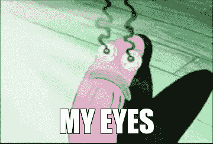

# 背痛，眼睛疲劳，结束游戏！

> 原文：<https://dev.to/schmowser/back-pain-eye-strain-end-game-217i>

这是九个月前的我:

我睡了几个小时后醒来，看不清对面的墙。好像半个房间都是蒸汽浴室。我的右眼视力变得模糊——医生证实:虹膜发炎。

我被打昏了几天，该死的逃避任何屏幕时间——没有编码，没有视频。只有在这些时刻，一个人才会珍惜我们在炫目的屏幕和太高的桌子前度过的无忧无虑的健康时光，配备畸形的鼠标和奇怪的椅子，被美味但肮脏的食物削弱，睡得很久。

虽然我们不是在建筑工地工作(或者我们是？)，我们需要照顾好自己的身心。在这篇文章中，我只想分享我是如何学会在开发者的生活中生存下来的。

(如果你不想看，可以看看下面的视频！)

* * *

# 背痛&脖子痛

巴黎圣母院的驼背很容易成为开发商！难道他的姿势不是在尖叫加班蹲在 MacBook 上把那个功能放进下一个版本吗？我确实有那种感觉。

有时候，我们太热衷于自己的激情，以至于不愿意离开工作场所。几乎立刻我们就无精打采地进入一个尴尬的位置，不知何故在那个位置保持了几个小时。对你的肌肉来说，最糟糕的情况可能就是长时间不动，迫使你自己进入一个进化绝对没有让我们准备好的位置。

几个月后，我患上了严重的背痛。伸长脖子也很不舒服。具有讽刺意味的是，我认识到治疗背痛的最好方法就是运动。所以，我继续走。转身。和拉伸。一步一步来，直到一切变得可控。

但是预防更好！我现在努力尝试至少每小时在办公室走动一次。这可以通过一些小事来实现，比如用玻璃杯喝水，而不是手边有一壶水(所以你必须不时走到饮水机旁)。当你实际上不得不站起来拿饮料时，即使只是把杯子放在窗边也能给你一点甜蜜的体操。我因在工作时跳奇怪的小舞来放松身体而出名。

拜托，拜托，拜托让你的雇主(或者你自己)给你弄个可调桌椅！这些因素对于背部保持舒适健康的姿势至关重要。你的显示器的高度对我的颈部疼痛也有很大影响。实际上太高了，我不自然地伸长了脖子。经验法则:*屏幕顶部应该与眼睛平齐！*

你会在这个视频中找到更多的技巧。没有一大堆纸解决不了的问题！🤣

[https://www.youtube.com/embed/F8_ME4VwTiw](https://www.youtube.com/embed/F8_ME4VwTiw)

# 腕管综合征

一旦我摆脱了背痛，又有一种感觉等待着我。打字或使用鼠标在我的前臂内点燃了一把火，就好像我的肌腱被细小的针代替了一样。你好，*腕管综合症*，我的老朋友？

幸好没有！但我并不热衷于走这条路。在我的上一份工作中，我通过将我的手臂放入某种由纸板制成的 DIY 夹板中来解决这个问题。这一次，我试图解决原因，而不是症状:只要你没有使用符合人体工程学的垂直鼠标，你就在转动和扭曲你的前臂和手腕，这样你的肌腱就会不断过度拉伸。我没有考虑过使用垂直鼠标，所以我必须弄清楚我是哪种“鼠标抓手”:

*   *手掌抓握* -将整只手放在鼠标上，从而手指被锁定。通常，整个手掌都放在鼠标上。
*   爪握 -类似，而食指和中指是弯曲并向上收拢的-看起来像猫的爪子。手掌不再放在鼠标上，手指可以稍微移动。
*   *指尖握持*——只有指尖接触鼠标，没有其他。运动不需要任何手腕运动。

最后两个是值得追求的目标！尝试做所有涉及前臂和肘部的鼠标动作，而不仅仅是手腕。它会使已经拉伸的肌腱拉伤。(注意不要用肩膀。)这就是新到的可调节桌椅发挥作用的地方。如果手和键盘之间的角度太大，你会拉伸你的肌腱。如果角度太低，会有锁住手臂和手腕的危险。

而打字呢？事实上，我正试图用我的手在键盘上徘徊来打字。不要把手放在键盘上。它们只会卡在那里，迫使你一直用手腕工作。我知道。要记住的东西很多。用下面的视频将这一切形象化，有望消除任何疑虑！

[https://www.youtube.com/embed/vG_3bS3ftVM](https://www.youtube.com/embed/vG_3bS3ftVM)

# 眼睛疲劳

回到我潮湿的眼睛。

我从中学到了什么？显然，我太专注于我面前的大矩形。随着时间的推移，我的眼睛变干了。我根本没有给他们放松的机会。

首先:到屏幕的距离。如果你用笔记本电脑工作，准备一个支架和一个蓝牙键盘，在你和机器之间留出一些空间！许多人也喜欢 20-20-20 法则(即:每 20 分钟看 20 英尺外的东西至少 20 秒)。除了不知道一尺是多少之外，很容易忘记。我也不喜欢设置闹钟，因为它会让我脱离常规。

我喜欢把放松眼睛和前面提到的散步结合起来。理想的情况是，到外面或阳台散步，以聚焦远处的事物。真正有帮助的是得到一个靠窗的座位。只是检查所有的噪音来自哪里或外面的天气提醒我把我的眼睛放在地平线上！

或者像植物一样浇灌你的眼睛。从那以后，我总是在书桌旁的抽屉里放眼药水。以备急用。否则，我会往脸上泼水，闭上眼睛，揉揉眼睛。这样我们就再也不会有那种红眼了！

[https://www.youtube.com/embed/wyVc37ykstU](https://www.youtube.com/embed/wyVc37ykstU)

# 噪音

幸运的是，我目前的环境还算安静。但我也经历过集中注意力和屏蔽对话或机器噪音变得非常困难的空间。那么，该怎么办呢？买贵的降噪耳机？它们可以过滤掉你周围的一些声音和频率，效果惊人。音乐呢？当然，如果你不加大音量的话，那肯定是肯定的——这实际上会让*你*成为一个噪音污染者！

最后，我带着耳机走了。他们甚至为你提供了一个工具来阻止经常入侵者打断你的工作流程。这可以向外界发出信号，表明你现在正处于区域 T1。你得到了安宁。

谨慎听下面的视频。讽刺的是，它有一个奇怪的音频混合。😆

[https://www.youtube.com/embed/z4Da0kuYnMI](https://www.youtube.com/embed/z4Da0kuYnMI)

# 睡眠

现在，我们都知道睡眠不足是多么不健康。所以，我在这里留下的视频只是你如何发现你是否被剥夺了睡眠。

我无法告诉你什么是完美的睡眠时间。睡眠一直都很有个性。然而，入睡需要更多的研究。例如，在床上看书比查看 dev.to(或任何其他网站)更有助于你更快入睡😉)在你的手机上。

哦，不要把你最喜欢的歌作为早上的闹钟。🙈

[https://www.youtube.com/embed/0HxvEcvfbho](https://www.youtube.com/embed/0HxvEcvfbho)

# 营养&运动

那都是关于你在工作中所做的事情。不要告诉我我在空闲时间要做的事情！我不会。每个人都知道我们 T2 应该吃什么。以及我们*应该*锻炼多少。当然，锻炼有益于我的背部健康。但是我注意到的最明显的变化是我的精神状态的改善。坚持 30 分钟跑步，你可以消除所有关于工作的想法。减少甜食和油腻的食物也稳定了我的情绪。但是这将开辟一个全新的自我保健领域:如何不沮丧或精神错乱。

显然，你可以训练你的肠道向大脑发出信号，告诉它想要什么食物。如果你感兴趣，看看这个视频吧！

[https://www.youtube.com/embed/VzPD009qTN4](https://www.youtube.com/embed/VzPD009qTN4)

* * *

我也远非完美。我发现自己在漫长的一天工作后无精打采或不做运动。见鬼，我晚上 11 点写这篇文章，我明天早上 6 点就得起床！

但和往常一样，我们只是需要不断提醒自己手中的东西。我们需要多谈谈这个。同事，雇主，网络。因为在所有的工作完成后，所有的笔记本电脑关闭，所有的拉请求合并，我们回家。我们工作的唯一遗迹应该是伟大的用户体验，而不是我们身体的疼痛！

* * *

TL；博士:

*   调整你的设备！
*   紧张不好！
*   休息一下！
*   睡觉！
*   说说吧！