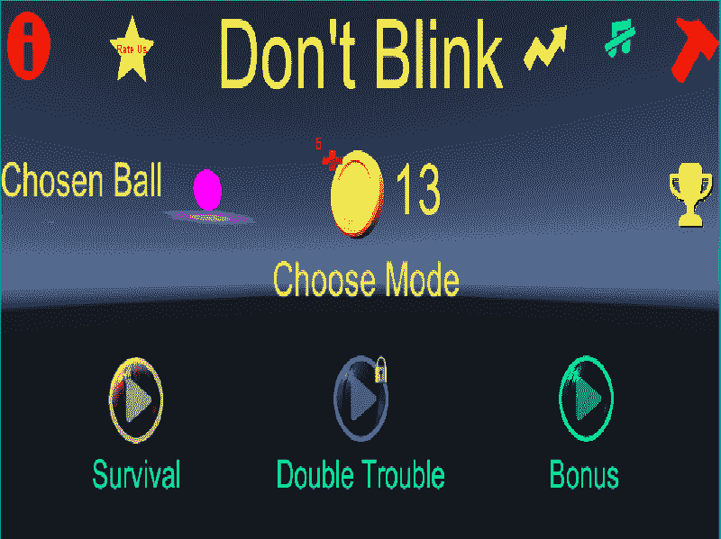
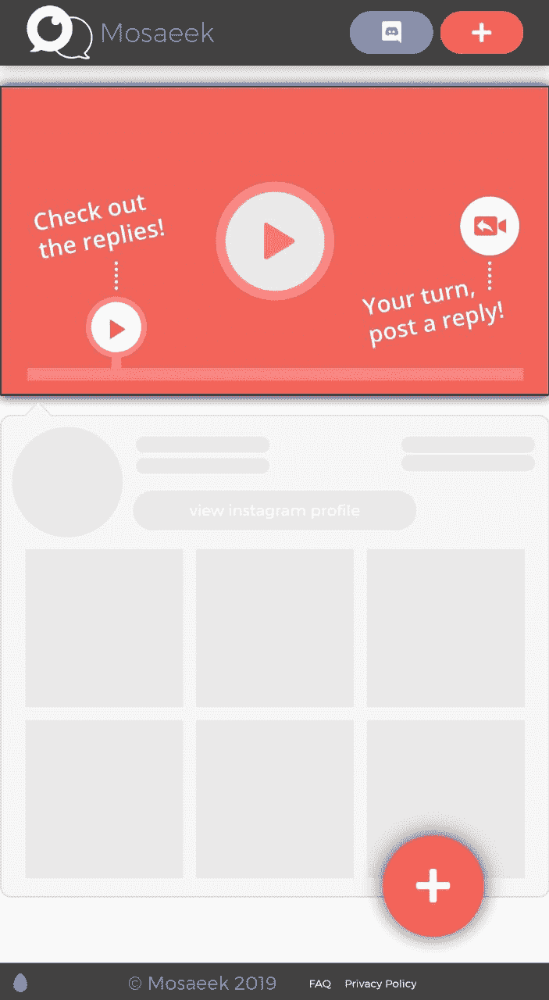

# 10 个你不知道的可以让你在家快速致富的爱好

> 原文:[https://dev . to/Hussein _ cheayto/10-hospities-you-don-know-can-make-you-rich-fast-from home-1gb](https://dev.to/hussein_cheayto/10-hobbies-you-don-t-know-that-can-make-you-rich-fast-from-home-1hgb)

你曾经梦想过有六位数的收入吗？这篇文章将向你介绍十大爱好，如果认真对待，可以让你快速致富。最棒的是你可以在家做！天气不好或感觉疲劳时，无需外出，您需要的只是一台笔记本电脑和高速互联网。

无论你是想还清学生贷款，辞掉朝九晚五的工作，还是为未来建立基金，找到一份最好的兼职都是实现你目标的好方法。兼职是兼职职位，为在职者提供了在全职工作的同时赚取额外收入的灵活性。

重要的是要明白这不是一夜之间发生的。你所需要的是耐心和永不放弃。坚持是关键。

以下是我推荐的几大爱好:

### **1-写入**

There are many different fields when it comes to writing. In this article, I will only focus on blogging and publishing your own ebooks.

如果你不确定什么是博客，博客是一种在线表达你的想法和教导的方式。你可以使用像 [WordPress](https://www.wordpress.org) 这样的平台来拥有一个自托管的博客。你可以用它来推广你的服务——辅导、自由写作、Pinterest 管理等。–您可以利用它来增加您的受众、品牌和收入。
我个人使用 Wordpress 来管理我自己的[博客](https://husseincheayto.com/#blog)。

如果你是博客新手，我建议你开始使用免费的博客托管网站，如 [Dev](https://www.Dev.to) 或 [Medium](https://www.medium.com) 。

电子书只是在线出版的书籍。想象一下，这就像在网飞上播放一个节目，或者在亚马逊上购买一部电影的电子版。电子书是真实书籍的数字副本。你可以在你的 Kindle、笔记本电脑、手机或任何联网设备上阅读它们。

为什么是电子书？

作家们发现他们可以通过自助出版电子书赚更多的钱。传统出版又慢又难，而且佣金少得可怜。

电子书很容易出版，任何人都可以做。任何人都可以从电子书开始，打印纸质副本，并录制音频版本，而无需离开您的房间。

你可以在[亚马逊](https://kdp.amazon.com/en_US/)、[巴恩斯&诺布尔](https://press.barnesandnoble.com/)、 [Leanpub](https://leanpub.com/) 等上百个平台上免费出版自己的书。

我建议花些钱在封面设计上，或者请个编辑来让你的电子书更有吸引力、更专业。你可以设定自己的定价，并通过任何你想要的渠道进行营销。

### **2-编码**

With the limitless free sources on Youtube, Udemy, Lynda, etc... Anyone can learn how to code without a degree and make a great amount of side income. The hard part is to choose your niche. You can become an [Android](https://developer.android.com/), [IOS](https://developer.apple.com/library/archive/referencelibrary/GettingStarted/DevelopiOSAppsSwift/), [website](https://www.w3schools.com/whatis/), [game](https://unity.com/), software developer or any type of programming. The second step is to pick your favorite language. In fact, each and every programming field have many languages. For example, you can build a website with Python, Node.js, or PHP...

这不是一件容易的事情，如果你想成功，你需要成为一个充满激情的开发者。我既是程序员，又是博主。在我看来，写博客比编程容易得多，但我更喜欢编码，因为它很有挑战性。

下载并尝试我的游戏[“不要眨眼”](https://play.google.com/store/apps/details?id=com.AtomicGameStudio.DontBlink)，它在 google play 商店的“顶级独立精选”中有特色。

[T2】](https://res.cloudinary.com/practicaldev/image/fetch/s--LsgI1SGl--/c_limit%2Cf_auto%2Cfl_progressive%2Cq_auto%2Cw_880/https://thepracticaldev.s3.amazonaws.com/i/zvnp6ktovcuwuh48hm7u.jpg)

**相关文章:** [10 人跟随在没有学位的情况下获得游戏开发工作](https://dev.to/hussein_cheayto/10-people-to-follow-to-land-a-job-in-game-development-without-a-degree-4lo)

### **3-文案**

Recently, I've learned about copywriting. Dan Lok -King of high ticket sales- describes copywriting as "closing in print", which essentially means to use written words to generate leads and sales. It is a high-income skill, used often by introverts, to start and enhance or extend a relationship with a customer that includes salesmanship in print.

它的首要目的是销售，所以要成为一个好的文案，你需要对销售、营销、人的心理有所了解。

文案广泛用于登录页面、直邮广告、销售页面、印刷广告、电视购物、社交媒体页面和电子商务平台。

### **4-翻转网站**

One thing I’m starting to learn as I grow as a blogger is that great bloggers don’t think like bloggers, they think like businessmen, and by this I mean they spot great business ideas and then focus on them in the long-run. Think about the great potential there is to this kind of business.

就像房地产一样，网站可以在网上市场买卖。网站相当于互联网房地产，它们可以被用作投资、经常性收入来源和存储资产的地方。就像房子一样，在某些情况下，网站也可以盈利。

如果你有一个网站的净利润为 5000 美元/月，那么以 11 万美元的价格出售是合理的。这些钱通常足够买一栋房子，根据地理位置的不同，可以免费入住。

在 SEO 游戏中，通过将你的数字盈利机器转化为房地产现金流资产，你可以在短短几个月的辛勤工作中轻松成为无债务房东——而不必担心抵押贷款。

### **5-建立网站**

Making money from your website isn’t a myth. It’s doable by anyone. No need to learn how to code. With Wordpress, it's just a matter of drag and drop. I had literally 0 experience in web design and development. You can check my 2 websites: [my portfolio](https://www.husseincheayto.com) and my [Company](https://www.codinstyle.pro)'s website. Amazingly, I was able to build my portfolio and Codinstyle websites in just 2 months while working full time as a telecom engineer at Ericsson.

你可以自己做，花很多钱和时间。或者，你可以[联系我](mailto:cheayto.hussein@hotmail.com?Subject=Let's%20%20build%20%20a%20%20website%20%20for%20%2015%24/month)，我会从 A-Z 开始照顾你的网站，3 年内每月 15 美元。

记住，需要花钱才能赢钱。时间比金钱更有价值。时间一去不复返了。

想象一下 10 年后的你，当你拥有自己的网站，在你睡觉的时候支付账单，你会有多满足。

放松，节省时间和金钱，让我来处理你网站的所有细节，包括设计，托管，域名等...

至少，你应该能够赚到足够的钱来支付你的域名和虚拟主机的基本费用。你甚至可以取代你朝九晚五工作的收入。

**相关文章:** [没有学位也能成功的 5 大网络开发者](https://dev.to/hussein_cheayto/top-5-web-developers-you-should-follow-to-succeed-without-a-degree-25lg)

### **6-测试**

Before an app development team releases their web or mobile app to the public, it needs to be tested. Usability issues need fixing. Bugs need ironing out. To find these issues, development teams often hire a group of beta testers to test drive apps before their public launch. You can create an account on [Utest](https://www.utest.com) and start testing.

另一个原创 app 是 [Mosaeek](https://discord.gg/YtHAYCs) 。后者是一个视频互动软件，提供更多的个人互动和上下文视频响应。它基本上是一个双向视频互动的平台，允许观众和其他创作者直接在任何类型的源视频上留下带时间戳的视频回复。

把它想象成视频的声音云——目的是让在线交流更加个性化。

你可以加入他们的 [Discord](https://discord.gg/YtHAYCs) 服务器，成为这个革命性应用的一部分。

[T2】](https://res.cloudinary.com/practicaldev/image/fetch/s--Pp0HxZMu--/c_limit%2Cf_auto%2Cfl_progressive%2Cq_auto%2Cw_880/https://thepracticaldev.s3.amazonaws.com/i/0vp1w14hrhopl384ty3v.jpg)

### **7-关闭**

A high-income skill that gets you results for job applications, presentations, and especially any career is high ticket closing. In my opinion, high ticket closing is the most important skill that freelancers, entrepreneurs, salespeople or business owners can have in their talent arsenal.

简单来说，当你说结束时，你说说服。在我们的日常生活中，如果你不能亲近家人、朋友或工作中的人，你在生活中不会有太大的成功。当你让潜在雇主相信你是这份工作的最佳候选人时，你就接近成功了。当一个男生或女生同意和你约会时，你就结束了。

### **8-视频记录**

Today there are more people watching video content on YouTube than any TV network. Viewers watch 1 billion hours daily. YouTube videos are produced in 91 countries and can be found in 80 different languages. There are a number of people that make vlogs and bring in some serious cash just by posting these blog-like videos.

如果你喜欢出现在镜头后面，分享技巧和信息，你自己的 vlog 频道是一个很好的选择。你所需要的只是一个视频摄像头、高速互联网和一台笔记本电脑。对许多人来说，如果做得好，并培养了一批支持你的观众，写博客会是一份有利可图的职业。当谈到你能创造的内容类型时，天空几乎是没有限制的。

**相关文章:** [如何通过 5 个简单步骤快速学习和掌握任何技能](https://dev.to/hussein_cheayto/how-you-can-learn-and-master-any-skill-fast-in-5-simple-steps-1dai)

### **9-翻译器**

I remember at school I used to study English, French, Arabic, and Spanish. I've mastered them all, except for Spanish, which I thought it's useless to learn more than 3 languages. I was wrong! In fact, The impact of multilingualism can be traced to even more fields. For instance, a doctor who can communicate with his or her patient in their native language is much more likely to have success at diagnosing them. Any hiring manager in any company in the world would tell you that the ability to speak a foreign language is a prized commodity. Learning to communicate fluently in multiple languages provides additional job security and advancement opportunities in uncertain economic times.

有些人有学习新语言的爱好。如今，多亏了像 [Duolingo](https://www.duolingo.com/) 这样的语言应用程序，你可以用一种有趣而简单的方式学习和掌握一门新语言。

拿起一张纸和一支笔，写下这些:“2020 年目标:1-在 2020 年底前学会一门新语言”
不要止步于此，从今天开始。时间似乎过得很快，避免拖延。每天花 5 分钟，每天。你会惊讶于在这 35 分钟/周内你会学到多少东西。

**相关文章:** [如何在 12 个月内实现个人目标](https://dev.to/hussein_cheayto/how-to-achieve-your-personal-goals-in-12-months-303o)

### **10-转录器**

Last but not least, One of the fastest-growing employment opportunities is in the field of transcription. Transcriptionists can make money transcribing online everything from legal depositions to YouTube videos. Companies in the legal, medical, media and entertainment industries hire transcriptionists on a regular basis to transfer their digital copy into written documents. The goal is having their material in a variety of formats so that it can be used in many different ways.

根据 PayScale，转录员的工资中位数是每小时 15.22 美元。此外，你可以自由安排自己的工作时间，并且有足够的杠杆来决定每周工作的多少。根据 2017 年公布的 BLS 统计数据，转录员的年薪中值为每年 35，250 美元，约合每小时 16.95 美元。按照这个比率，如果你每天工作 2.5 小时，连续工作 24 天，你每个月可以轻松赚到 1500 美元。

### **结论**

Of course, there's a lot of hobbies that you can do from home and can make you rich even faster than the ones mentioned above. For example, graphic design, video editor and much more. However, I have only mentioned the hobbies that worked for me or with people that I know.

我的下一篇文章将是关于如何开始在这篇文章中提到的每一个爱好中赚一大笔钱。