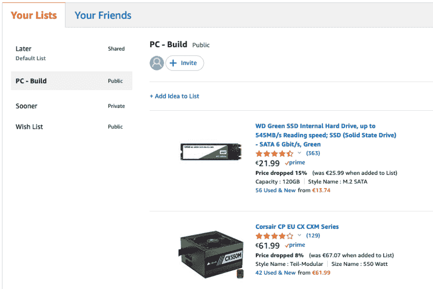

# 不喜欢就换。

> 原文:[https://dev.to/realvorl/if-you-don-t-like-it-change-it-ag5](https://dev.to/realvorl/if-you-don-t-like-it-change-it-ag5)

你会爱上我们现在生活的时代(我当然指的是计算)。我们有很多选项和选择，从我们使用的编程语言，我们运行的操作系统，它运行的硬件，在你看的每个方向都有大量的选择。

但是...

有时候，我们有一个经常使用的好产品，但是缺少一个你非常非常需要的功能。如果这是一个网站，你很幸运，因为你可以使用一个软件(Chrome - Extension ),它为任何知道 Javascript 和 T2 CSS 的人打开了奇妙的可能性，基本上，改变你经常使用的网站或网络平台前端的一切。

# [](#my-initial-problem)我最初的问题

我将为自己构建一个工作站，这样我就可以用我的旧 Dell Latitude E6430 做比现在更多的事情。我能说什么呢，我讨厌放弃仍能工作的硬件，我喜欢升级这些硬件并延长它们的预期寿命(当然，在这个过程中还能节省一些成本)。

所以我去了亚马逊(如果你还没有使用的话，总是使用 [Smile](https://smile.amazon.com/gp/chpf/about) )来编译一个组件列表。我不知道你怎么样，但是我不太擅长在脑子里做计算，尤其是当数字有小数的时候。所以我开始创建一个清单，希望我能有一个**总数**，显示我的新电脑的价格。我不知道为什么，但这不是愿望清单的一个特征。

# [](#my-first-solution-make-it-work-)我的第一个解决方案(让它起作用)

嗯，这是我想起了成为本文标题的那句话的地方，所以我打开了 Chrome 中的开发者工具，开始写这个简短的脚本:

```
var majorSpans = document.getElementsByClassName("a-price-whole");
var minorSpans = document.getElementsByClassName("a-price-fraction");
var currencySymbol = document.getElementsByClassName("a-price-symbol")[0];

major=[];
minor=[];

sum = 0;

for(var i=0; i < majorSpans.length; i++) {
    major.push (majorSpans[i].innerText.substring(0, majorSpans[i].innerText.indexOf(".")));
    minor.push (minorSpans[i].innerText);
}

for(var i=0; i < major.length; i++) {
    sum += parseInt(major[i]);
    sum += (parseInt(minor[i]) / 100);
}

console.log("your wishlist costs: " + sum + "  " + currencySymbol.innerText);
var listTitle = document.getElementById("profile-list-name");
var oldHtml = listTitle.innerHTML;
listTitle.innerHTML = oldHtml 
+ "<span style='color: #008400; text-weight: bolder;'> ( " 
+ sum.toFixed(2) + "  " 
+ currencySymbol.innerText 
+ " ) </span>"; 
```

这样做，我就可以去:

### [](#from-this)由此而来

> [T2】](https://res.cloudinary.com/practicaldev/image/fetch/s--gYrzoxYE--/c_limit%2Cf_auto%2Cfl_progressive%2Cq_auto%2Cw_880/https://thepracticaldev.s3.amazonaws.com/i/nxg98m0fgrks881buh7v.png)

### [](#to-this)到此

> [T2】](https://res.cloudinary.com/practicaldev/image/fetch/s--vmWxHwvR--/c_limit%2Cf_auto%2Cfl_progressive%2Cq_auto%2Cw_880/https://thepracticaldev.s3.amazonaws.com/i/bihd2gh5a2cus5jexfh0.png)

不错吧，嗯？

# [](#the-good-solution-making-it-right-)善解人意(使其正确)

一旦你有了可以工作的东西，你就需要把它做好，谁愿意每次都在开发者工具中粘贴一堆代码来实现这一点呢？输入我自己发现的最酷最有用的 chrome 扩展: **[Javascript 和 CSS](https://chrome.google.com/webstore/detail/user-javascript-and-css/nbhcbdghjpllgmfilhnhkllmkecfmpld)**

这东西太棒了。它允许你连接到网站并注入你自己的`Javascript`和`CSS`来执行你可能需要的任何事件。

你甚至可以引入其他库，如`JQuery`和`Angular`，没有限制。

想象一下可能性吧！

到目前为止，我使用这个扩展进行以下定制:

*   总结亚马逊上的愿望清单
*   删除讨厌的广告和内容
*   自动喜欢 youtube 视频
*   突出新闻网站上的特定关键词
*   彻底改变网站的导航/菜单

你会想到什么？如果你有很酷的想法想分享，发推文 [@veo_twitt](https://twitter.com/Veo_twit) 。

快乐定制！