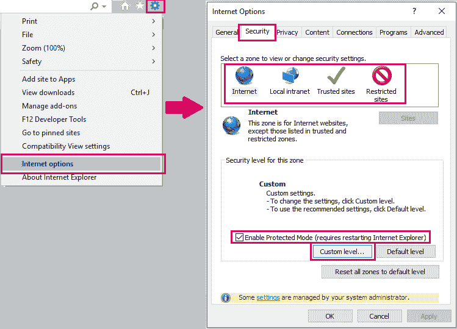
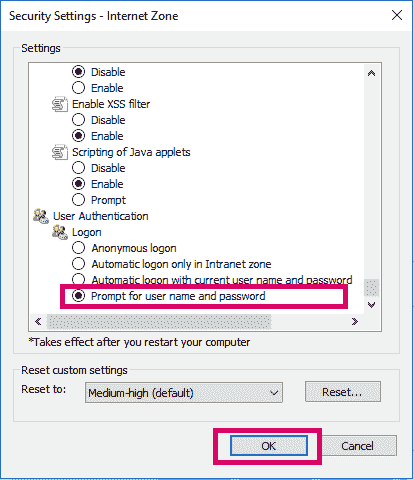

# 使用 Selenium + AutoIt 在 Internet Explorer 中处理操作系统级认证对话

> 原文：<https://dev.to/sebhani/handling-os-level-authentication-dialogues-in-internet-explorer-using-selenium-autoit-4mhk>

几个星期以来，我一直在从事一个 Selenium 项目，我想找出一种方法来处理 Internet Explorer (IE)中的认证对话。困难在于 IE 对话是非浏览器对话，即基于 Windows 的对话。因此，不能使用 Selenium 来处理它们，因为 Selenium 不能识别操作系统级别的对话。我将向您介绍我的解决方案，它由两部分组成。

我用的是 Selenium C# WebDriver。对于其他编程语言用户，本文中的概念仍然适用。您可能需要以不同的方式导入或使用 AutoIt 包，但没有什么是真正困难的。

1- IE 设置:

我想让 IE 在用户每次打开浏览器时提示他们输入凭证，因为我想对不同的用户运行我的测试。

在你的 IE 浏览器中，点击设置>互联网选项>安全标签>勾选启用保护模式>点击自定义级别…>勾选用户名和密码提示。在所有四个区域(internet、本地 Internet、可信站点、受限站点)上重复最后三个步骤。

[](https://res.cloudinary.com/practicaldev/image/fetch/s--l9VgX3XA--/c_limit%2Cf_auto%2Cfl_progressive%2Cq_auto%2Cw_880/https://thepracticaldev.s3.amazonaws.com/i/6fkhtr536xgbnj2tah4c.png)

[](https://res.cloudinary.com/practicaldev/image/fetch/s--p1LoB3Tc--/c_limit%2Cf_auto%2Cfl_progressive%2Cq_auto%2Cw_880/https://thepracticaldev.s3.amazonaws.com/i/7xqdy8eyfhei8mu3cj8m.png)

在应用了前面的步骤之后，IE 应该在用户每次打开它的时候提示用户输入他们的凭证。

2- C#代码

为了解决基于 Windows 的对话问题，我使用了一种叫做 AutoIt 的脚本语言。通过将 AutoIt 与 Selenium 集成，我能够流畅地处理基于 Windows 的对话。让我们深入研究 C#代码。

第一步是在 Visual Studio 中添加 AutoIt NuGet 包。[参考微软文档](https://docs.microsoft.com/en-us/nuget/quickstart/install-and-use-a-package-in-visual-studio)。在引用 AutoIt NuGet 包(`using AutoIt;`)之后，您将获得一个名为 AutoItX 的类，其中包含可以使用的静态方法。

我创建了一个方法，它接受用户凭证并处理基于 windows 的对话。

```
public static void SetAuthenticationCredentials(string UserName, string Pws)
        {
            AutoItX.WinWaitActive("Windows Security");
            AutoItX.Send(UserName);
            AutoItX.Send("{TAB}");
            AutoItX.Send(Pws);
            AutoItX.Send("{ENTER}");
        } 
```

在这一步之后，许多人遇到了异常，所以这里有一种方法可以正确地使用前面的方法。

```
Parallel.Invoke(() => driver.Navigate().GoToUrl("https://YourWebsite.com"), () => SetAuthenticationCredentials("usertest2", "password2")); 
```

这样，您将导航到您的网站并同时调用 SetAuthenticationCredentials 方法。

恭喜你！！！现在你应该能够轻松处理基于 Windows 的对话。如果你有任何问题，请不要犹豫问我。