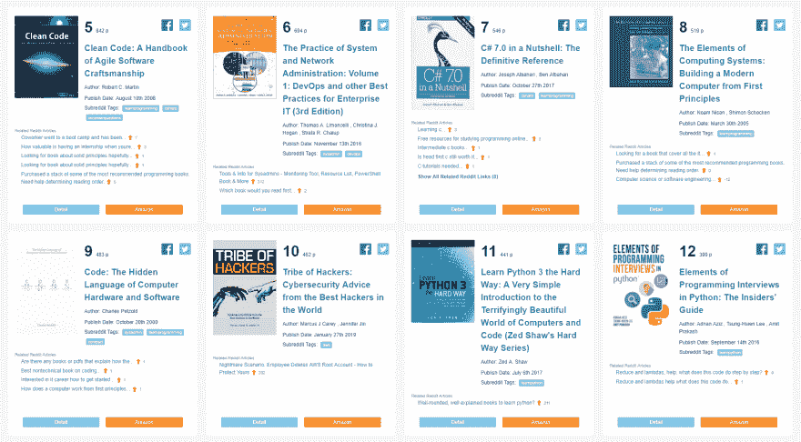

# 我做了一个基于 Reddit 讨论的图书排名网站

> 原文：<https://dev.to/webdevbadger/i-made-a-book-ranking-site-based-on-reddit-discussion-18oc>

大家好，

Reddit 是一个寻找真实书评的好地方。我喜欢花时间阅读推荐和读书俱乐部的讨论。然而，有时搜索数百个帖子和子 reddits 会变得相当忙乱。

所以我决定自动化这个过程。[热门趋势书籍](https://toptrendbooks.com/)每天扫描+100，000 条 Reddit 帖子和评论，总计超过 15，000 本书籍。每本书都有标签、分类和排名，以促进发现。

排名系统是基于向上投票，参考总数和参考日期。每个 Reddit 引用的用户 ID 都被跟踪，以防止自我提升。基于日期的过滤器非常有用，允许周，月，年，所有范围的搜索。

如果你找到一本适合你的酷书，那将是超级令人兴奋的。如果您能分享您的反馈和改进想法，我将不胜感激:)

📚**推荐收藏**📖

**[每周 Top10 博客](https://toptrendbooks.com/blog)**
**[学习编程](https://toptrendbooks.com/all/learnprogramming/tag/)**
**[有声读物](https://toptrendbooks.com/all/audiobooks/tag/)**
**[免费电子书](https://toptrendbooks.com/all/FreeEBOOKS/tag/)**
**[IfYouLikeBlank](https://toptrendbooks.com/all/ifyoulikeblank/tag/)**
**[未来学](https://toptrendbooks.com/all/Futurology/tag/)**
**[wrote Book](https://toptrendbooks.com/all/wroteabook/tag/)**

[T6】](https://res.cloudinary.com/practicaldev/image/fetch/s--wn8ivVQE--/c_limit%2Cf_auto%2Cfl_progressive%2Cq_auto%2Cw_880/https://thepracticaldev.s3.amazonaws.com/i/iphlh6wo63tm5ko0upx0.png)