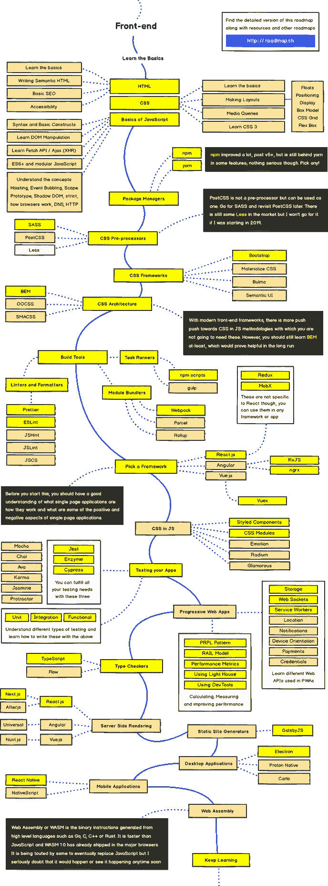
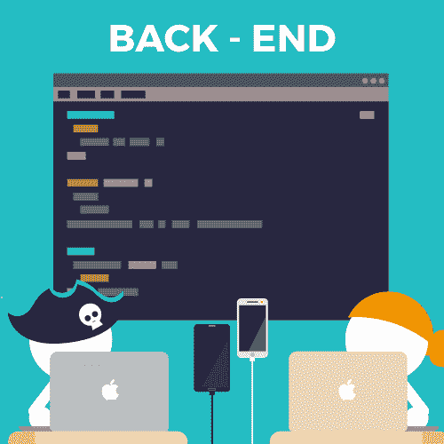
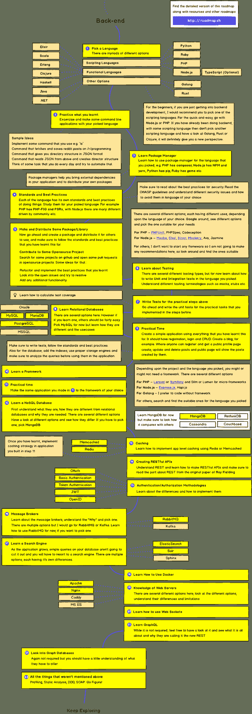
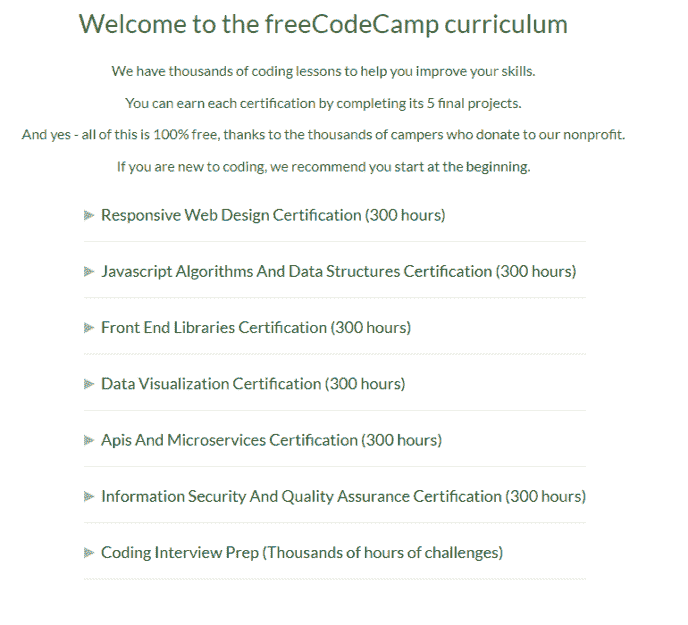

# 面向程序员的免费学习资源

> 原文:[https://dev . to/David mm 1707/free-learning-resources-for-programmers-p9d](https://dev.to/davidmm1707/free-learning-resources-for-programmers-p9d)

原帖:[程序员免费学习资源](https://letslearnabout.net/blog/free-learning-resources-for-programmers/)

# 程序员免费学习资源

你在为程序员寻找免费的学习资源吗？互联网上有很多学习如何编码的资源，但是谁是其中的佼佼者呢？

这是一个免费资源列表，你可以从中学习任何你想学的与编码相关的知识。

* * *

## **前端**

[T2】](https://res.cloudinary.com/practicaldev/image/fetch/s--K8f8Quxu--/c_limit%2Cf_auto%2Cfl_progressive%2Cq_auto%2Cw_880/https://i2.wp.com/letslearnabout.net/wp-content/uploads/2019/08/frontend.jpg%3Ffit%3D688%252C387%26ssl%3D1)

#### [网络忍者](https://www.youtube.com/channel/UCW5YeuERMmlnqo4oq8vwUpg)——Javascript 和框架

网络忍者是我在 Youtube 上最喜欢的频道之一。即使我更倾向于后端，他的教学方式也促使我学习 Vue。几乎没有(但非常准确)理论的实践教程。你将在创纪录的时间内学会你想要的。

如果你想学习任何 Javascript 框架和普通 Javascript，这是个理想的选择。你也可以在 D3 和网页设计中找到信息。

#### [Academind](https://www.youtube.com/channel/UCSJbGtTlrDami-tDGPUV9-w)–Javascript…还有别的

我很想把 Academind 放在常规部分，因为他们做任何事情，但他们的大多数视频都是关于 Javascript 的。

你会发现关于 Vue，Angular，React 的视频，还有 Bootstrap，Flutter，HTML 和 CSS，Node，Webpack 等基础知识的视频。

很好的视频和高度详细。

#### [设计课程](https://www.youtube.com/channel/UCVyRiMvfUNMA1UPlDPzG5Ow)–设计

如果你想学习更多关于网页开发的设计和视觉方面的知识，请查看设计课程。

不仅有关于影响视觉效果的 HTML、CSS 和 Javascript 模块的视频，而且您还将学习如何使用 Illustrator、Adobe XD、Photoshop 等。

#### –Javascript，重在反应

专注于(但不限于)Javascript 及其框架的高质量教程，尤其是 React。

#### [韦斯博斯](https://www.youtube.com/user/wesbos/featured)——你的 Javascript-CSS 英雄

我对他的了解要归功于他的 Javascript30 系列，在那里我学到了普通 Javascript 的力量。他对 Javascript 了如指掌。

想学 Javascript，React，Flexbox 或者 CSS Grid，都不能错过他。

#### [塔尼亚拉西亚](https://www.taniarascia.com/blog/)——Javascript 及其宇宙

Tania 的博客有很多关于 Javascript 及其宇宙的高质量、实用的内容:Vanilla Javascript、 [React](https://www.taniarascia.com/getting-started-with-react/) 、Vue、用 Mocha 测试、Jest 等等。

如果你对前端领域感兴趣，你不能错过它。

#### [史蒂夫·格里菲斯](https://www.youtube.com/channel/UCTBGXCJHORQjivtgtMsmkAQ/featured)—前端所需的一切

Steve Griffith 是一名经验丰富的开发人员，他有很多关于 web 开发和 web 设计的精彩视频，可以证明这一点。

从 HTML 和 CSS 到 React，Bootstrap 甚至 Node。无论是 JS、Firebase 还是 Github，Steve 都有一个关于每个主题的视频，他在视频中很好地解释了一切，甚至连最复杂的概念都显得很简单。

#### [凯文·鲍威尔](https://www.youtube.com/user/KepowOb/videos)–HTML 和 CSS

你不应该忘记基本的东西，凯文·鲍威尔会处理好的。

你不知道的 HTML 和 CSS 小话题每周视频。Kevin 采用 CSS 属性，并解释每个角落和缝隙。他也很有趣！

#### [学习 JavaScript](https://www.youtube.com/watch?v=PkZNo7MFNFg)——初学者全程课程

令人敬畏的，免费的，3 个多小时的教训，由 FreeCodeCamp 值得自己的一节。对于任何对 Javascript 感兴趣的人来说，这是一个很好的介绍。

* * *

如果你需要帮助来决定学什么，为什么不查一下 [Frontend Developer road](https://roadmap.sh/frontend) ？

[T2】](https://res.cloudinary.com/practicaldev/image/fetch/s--5WPcwS-I--/c_limit%2Cf_auto%2Cfl_progressive%2Cq_auto%2Cw_880/https://i1.wp.com/roadmap.sh/assets/img/roadmaps/frontend-transparent.png%3Fw%3D688%26ssl%3D1)

* * *

## **后端**

[T2】](https://res.cloudinary.com/practicaldev/image/fetch/s--zNcD2DYp--/c_limit%2Cf_auto%2Cfl_progressive%2Cq_auto%2Cw_880/https://i0.wp.com/blog.siliconstraits.vn/wp-content/uploads/2015/05/Internship-hiring-03.png%3Fw%3D688)

#### [让我们来了解一下](https://www.youtube.com/channel/UC9OLm6YFRzr4yjlw4xNWYvg?sub_confirmation=1)——Python、Django、DRF 等等

让我先坦白:这是我自己的 Youtube 频道。

在这里，我有 Python 和 Python 相关的东西:Python 基础、Beautiful Soup、Scrapy 等，还有更多，如 Flask、Django、DRF 和更多非 Python 的东西(Vue.js、Node.js、Docker 等)。如果你不想错过即将到来的任何事情，[在这里订阅](https://www.youtube.com/channel/UC9OLm6YFRzr4yjlw4xNWYvg?sub_confirmation=1)。

#### [Tech with Tim](https://www.youtube.com/channel/UC4JX40jDee_tINbkjycV4Sg/)——关于 Python 你需要的一切

Python，Python，Python。Tim 专注于 Python，它展示了。不仅有初级和中级 Python 教程，还有 PyGame、机器学习等教程。

如果你想学习 Python，也想创作像俄罗斯方块或贪吃蛇这样的电子游戏，可以去看看他。

#### [只是姜戈](https://www.youtube.com/channel/UCRM1gWNTDx0SHIqUJygD-kQ/)——纯粹的姜戈

没错。你猜对了。这是关于姜戈的。

与 Django 上创建普通博客的强制教程不同，在这里你会发现 Django 的创造性使用，例如如何创建购物车，如何构建聊天应用程序，Django Rest 框架等等。

#### [科里斯查费](https://www.youtube.com/channel/UCCezIgC97PvUuR4_gbFUs5g)——Python 和 Django/Flask

如果你喜欢(或想要喜欢)Python，并且想在 web 开发中使用它作为你的后端语言，Corey 就是你要找的人。

对我来说，他是 Python 方面最好的老师之一，他从事这项工作已经很多年了。Python、Django、Flask、Python OOP 的教程…否则，你在哪里可以找到免费的包含 Python 的 93 个视频的播放列表？

#### [笨蛋](https://www.youtube.com/channel/UC33uwXXDrI5TxG4IXnjS28g)——姜戈

另一个 Youtube 频道关注 Django。

我已经厌倦了没完没了的 Django 教程，在这些教程中，你只是建立一个博客(或一份报纸)，我发现 Dumbfounds 令人耳目一新，因为它们触及了你很少看到的主题，如 Django 安全性、Django 测试、如何创建 REST API、部署等等。

#### [姜戈女孩](https://tutorial.djangogirls.org/en/)–姜戈

Django Girls 在 Django 社区很有名气，拥有最好的 Django 教程之一(是的，比官方的要好)。

当我开始做 Django 的时候，我做了他们的教程，给了我很多帮助。

#### [pretty printed](https://www.youtube.com/channel/UC-QDfvrRIDB6F0bIO4I4HkQ)——Python、Flask 和 Django

更多关于使用 Python 的后端栈，重点是 Flask。

如果你对使用 Python 作为网站的后端语言感兴趣，用一个小的，精简的微框架，这是最好的学习 Flask 之一。

#### [活蟒](https://www.youtube.com/channel/UCRwRIpYnYiiXbwE7wChJ6SQ)——超越中级蟒

Youtube 和网络上有很多关于学习 Python 的内容。但是如何超越初学者的东西呢？如何从初级 Python 程序员过渡到高级 Python 程序员？

通过他们每天 5-10 分钟的视频，你将增加你作为 Python 程序员的深度和经验。打开视频和边上的终端，几分钟就能学到新东西。

#### [用 Python 构建](https://www.youtube.com/channel/UCirPbvoHzD78Lnyll6YYUpg/playlists)–Python

如果你想深入了解 Python，你需要 BuildWithPython。

他没有制作视频，而是制作了关于任何 Python 相关主题的系列:PyGame、Django、TCP/IP 连接、OOP。期待几十个中肯、直接、短的视频。

我在关注他的 [Scrapy](https://www.youtube.com/watch?v=ve_0h4Y8nuI&list=PLhTjy8cBISEqkN-5Ku_kXG4QW33sxQo0t) 系列，我很喜欢。

#### [辣椒面](https://www.youtube.com/channel/UCsyHonfwHi4fLb2lkq0DEAA)–c++

专注于 C++，附带一点 C++游戏。

为初级、中级和高级程序员提供了 C++系列。如果你想学习 C++，ChilliTomatoNoodle 可以覆盖你从新手到专家的学习。

* * *

如果你需要帮助来决定学什么，为什么不去看看[后端开发者之路](https://roadmap.sh/backend)？

[T2】](https://res.cloudinary.com/practicaldev/image/fetch/s--CF0v3pJk--/c_limit%2Cf_auto%2Cfl_progressive%2Cq_auto%2Cw_880/https://i1.wp.com/roadmap.sh/assets/img/roadmaps/backend-transparent.png%3Fw%3D688%26ssl%3D1)

* * *

## **移动**

[T2】](https://res.cloudinary.com/practicaldev/image/fetch/s--NpgPSXEV--/c_limit%2Cf_auto%2Cfl_progressive%2Cq_auto%2Cw_880/https://i2.wp.com/live.staticflickr.com/8029/7910370882_39d180fb66_b.jpg%3Fw%3D688%26ssl%3D1)

#### [让我们建立那个应用](https://www.youtube.com/channel/UCuP2vJ6kRutQBfRmdcI92mA/featured)——iOs 和 Android

重点关注 iOs Swift 的优秀频道，但也有关于 Kotlin、Android Java、React Native 甚至 Node 的优秀内容。Js 后端 API。

#### [王公瑜伽士](https://www.youtube.com/channel/UCjBxAm226XZvgrkO-JyjJgQ/featured)–飘起

Raja 是一头蠢蠢欲动的野兽。

Flutter 是一个新的混合框架，使用 Dart 作为语言来创建混合移动应用程序。尽管 Raja 有很多关于 Ionic，Angular 和更多的视频，但他在第一个公开版本之前就已经承诺 Flutter，并从一年多前开始制作视频。

如果你想做漂亮的摆动，他的频道是最好的。

* * *

### **将军**

[T2】](https://res.cloudinary.com/practicaldev/image/fetch/s--wYEd4UpP--/c_limit%2Cf_auto%2Cfl_progressive%2Cq_auto%2Cw_880/https://i0.wp.com/miro.medium.com/max/998/1%2A9npNPVH7iNJ64Koq7EcW5A.jpeg%3Fw%3D688%26ssl%3D1)

#### [旅行媒体](https://www.youtube.com/channel/UC29ju8bIPH5as8OGnQzwJyA)–Javascript 和框架

如果你需要学习任何与 Javascript 相关的东西，他就是你要找的人。

棱角、Vue、React、香草、离子、节点……这家伙什么都有。你还可以找到关于 PHP 框架、Python、Flask、Django、GraphQL 的教程。

如果你需要任何关于网络开发的东西，他都有。

#### [泰卢斯科](https://www.youtube.com/user/javaboynavin)——Java 和 Python

我喜欢 Telusko 的视频和他的冷静。期待他几乎每天发一个视频。如果你想用 Java 学习如何使用 Java，Maven，Spring MVC，REST API，完全推荐，还有 C，Android，Kotlin 等几十个免费视频给你。

最近，他还拓展了 Javascript 和 Python 的视频。

#### [send ex](https://www.youtube.com/user/sentdex)——Python 和 ML

一只巨蟒。也很有趣！

他使用 Python 做任何事情。从 PyGame 到 Django，还有财务，数据可视化等。最近，他在做许多关于人工智能/人工智能的视频

他还在教一个 IA 怎么玩 GTA。我不是在开玩笑。

#### [德里克·巴纳斯](https://www.youtube.com/user/derekbanas/playlists)——一切皆有可能

我没开玩笑。他有关于任何事情的教程。任何事。

C++，Qt，Angular，Arduino，React，Django，Node.js，CSS，Ruby on Rails，C，Java，低热量食谱和 Psicology。

如果你想找一些关于编程的东西，他有相关的教程。

毫不奇怪，他的订户将达到 100 万。

#### –Javascript 和 ML

我知道这是一种奇怪的混合。一个优秀的老师，会教你前所未见的机器学习和 Javascript。

期待 Javascript 中疯狂、酷的东西。他也很有趣。

#### [FreeCodeCamp](https://learn.freecodecamp.org/)–一切

他们应该得到一个完整的职位。名字很准确。免费。代码。营地。一个免费的在线训练营听起来怎么样？他们就是这样。

一旦你注册了，你就有机会学习网络开发的每一个细节。从“响应式网页设计认证”开始，学习 HTML5、CSS3 和使用 Node。JS 做后端，还要 Javascript，React，用 D3 做数据可视化，API，编码面试准备。他们拥有你成为一名网页开发者所需要的一切，甚至更多。

我已经数不清有多少走不同道路的人开始学习 webdev，并以 web 开发人员的身份结束工作。查一下他们的课程表就知道了！

[T2】](https://res.cloudinary.com/practicaldev/image/fetch/s--AhpdDVKV--/c_limit%2Cf_auto%2Cfl_progressive%2Cq_auto%2Cw_880/https://i0.wp.com/letslearnabout.net/wp-content/uploads/2019/01/image-1.png%3Fw%3D688%26ssl%3D1)

挑一个认证(不要被 300 小时吓到)，继续磨。学习你的东西，感谢他们集成到浏览器 IDE，你可以边读理论边学习。每节课结束时，你有 5 个项目可以帮助你将信息植入大脑。

你可以把这些项目作为你的个人作品集，这多酷啊？

如果你是一个新手，不知道从哪里开始，什么是 HTML，在哪里使用 CSS 或者如何进行 for 循环，加入 freeCodeCamp 是一个好主意。这个社区也很棒。

* * *

## **边玩边学**

能边玩边学吗？可以边学边玩吗？是的，您可以:

代码战-用武士刀提高你的技能

[EDA bit](https://edabit.com)–选择一种语言并解决挑战

[Flexbox 僵尸](https://mastery.games/p/flexbox-zombies)–用你 CSS 技能的力量杀死僵尸！

* * *

## **【阅读材料(博客和书籍)**

#### 通用

DevDocs 在一个快速、有序、可搜索的界面中结合了多个 API 文档。

#### 巨蟒

[真正的 Python](https://realpython.com/)——名字不是 clickbait。他们有 Python 中所有内容的教程。

#### 姜戈

Agiliq–免费的 Django 电子书

[简单胜于复杂](https://simpleisbetterthancomplex.com/)–提升你的 Django 知识

[William s . Vincent](https://wsvincent.com/)——Django 初学者和 and REST APIs 的创建者

#### [T2](#javascript)Javascript

[每个 JavaScript 开发者都应该知道的 33 个概念](https://github.com/leonardomso/33-js-concepts#1-call-stack)

[现代 Javascript 教程](http://javascript.info/)——从基础到高级

[雄辩的 Javascript](https://eloquentjavascript.net/)——带练习的高级材料

[你不知道 Javascript](https://github.com/getify/You-Dont-Know-JS)——深入探究 JS 语言的核心机制

#### CSS

关于 CSS 的所有你需要的

* * *

*免责声明:这是一个“实时”帖子。它只会增长，因为我会增加更多的 youtube 频道，有趣的网站和博客。如果你知道这里没有列出的好资源，请留下评论。*