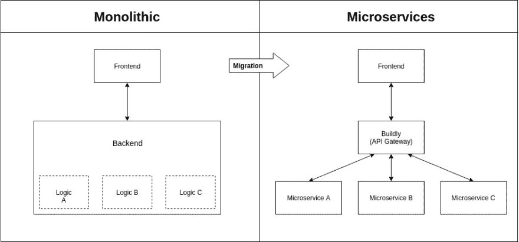

# 概括地说，微服务架构

> 原文：<https://dev.to/buildly/microservice-architecture-in-a-nutshell-38o0>

多年来，我们一直在构建应用程序，并在这方面做得越来越好，在此期间，各种技术、架构模式和最佳实践都得到了发展。微服务是那些年出现的一种架构模式，尤其是因为容器。Docker 是所有这些变化的主角，因为它普及了容器，并帮助我们将应用程序容器化。

## 概念

微服务架构是面向服务架构的一种变体，它将应用程序组织为松散耦合的服务集合。这些服务负责特定的任务，并可以通过简单的 API 相互通信，以解决更大的复杂业务问题。总的来说，微服务是一种开发软件系统的特殊技术，这种技术试图专注于构建具有明确定义的接口和操作的单一功能模块。

## 优点&缺点

微服务用于加速开发、功能发布、缓解可扩展性；它们提供改进的故障隔离等。如果您正在开发一个应用程序，它必须支持各种不同的客户端，包括桌面、移动浏览器和本地移动应用程序，您必须考虑使用微服务架构来实现您的应用程序。

微服务也给网络、测试、部署、监控等带来了复杂性。不使用自动化和敏捷方法，团队沟通可能会很困难。您可能还需要引入 CI/CD 工具、配置管理和应用程序部署工具、服务网格和 API 网关来帮助您测试、构建、发布、发现和连接所有服务。

## 结论

这些年来，我们已经改进了我们开发系统的方式，我们将继续这样做。如果你自动化并以正确的方式做每件事，你可能不会面临问题，并且会喜欢微服务。所有的软件架构模式和风格都有其优缺点，微服务架构也不例外，但它帮助我们变得更加敏捷。