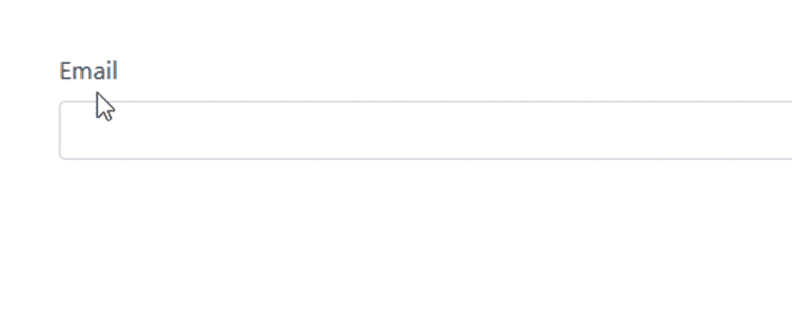

# 角度动态表单中的自定义验证

> 原文：<https://dev.to/ushmidave/custom-validation-in-angular-dynamic-forms-3la1>

当涉及到验证一个反应式动态表单时，通常是通过使用内置的验证器并根据各自的字段设置它们的属性来完成的，但是复杂的表单有一些用例，在这些用例中，您可能需要设计自定义的验证规则。

因此，让我们创建一个反应式动态表单，看看如何在其中创建自定义验证。

(1)在项目中安装两个包，这两个包的安装命令如下所述:

> NPM install @ rx web/reactive-dynamic-forms

这个包用于构建模型驱动的动态表单。关于反应式动态表单的更多信息，请参考这篇关于构建角度动态表单的新方法的文章。

> npm 安装@ rx web/反应式表单验证器

(2)现在我们要在根模块中注册`RxReactiveDynamicFormsModule`和`RxReactiveFormsModule`模块。

```
import { NgModule } from '@angular/core';
import { BrowserModule } from '@angular/platform-browser';

import { FormsModule,ReactiveFormsModule } from '@angular/forms'; 

import { RxReactiveDynamicFormsModule } from "@rxweb/reactive-dynamic-forms"
import { RxReactiveFormsModule } from "@rxweb/reactive-form-validators"

@NgModule({
  imports:      [ BrowserModule, 
                    FormsModule,ReactiveFormsModule,
                    RxReactiveFormsModule,RxReactiveDynamicFormsModule 
                ],
  declarations: [  ],
  bootstrap:    [  ]
})
export class AppModule { } 
```

<svg width="20px" height="20px" viewBox="0 0 24 24" class="highlight-action crayons-icon highlight-action--fullscreen-on"><title>Enter fullscreen mode</title></svg> <svg width="20px" height="20px" viewBox="0 0 24 24" class="highlight-action crayons-icon highlight-action--fullscreen-off"><title>Exit fullscreen mode</title></svg>

(3)现在，我们有一个场景，其中我们有一个电子邮件字段，我们希望在其中检查电子邮件是否已经存在，所以让我们创建一个模型类，并在其中定义自定义规则

```
import { FormControlConfig } from "@rxweb/reactive-dynamic-forms";
import { AbstractControl } from "@angular/forms"
export class CustomEmailValidation extends FormControlConfig {

    validator = (control: AbstractControl) => {
        return control.value != "john@gmail.com" ? null : {
            custom: { message: 'Email already exists' }
        }
    }

} 
```

<svg width="20px" height="20px" viewBox="0 0 24 24" class="highlight-action crayons-icon highlight-action--fullscreen-on"><title>Enter fullscreen mode</title></svg> <svg width="20px" height="20px" viewBox="0 0 24 24" class="highlight-action crayons-icon highlight-action--fullscreen-off"><title>Exit fullscreen mode</title></svg>

有关动态验证的更多信息，请参考[角度动态表单中的动态验证](https://medium.com/@oojhaajay/dynamic-validation-in-angular-dynamic-forms-aca8df20ece0)

(4)下一步是创建一个组件，创建具有电子邮件控件的动态表单，并在其上应用我们的自定义`CustomEmailValidation`验证，我们必须在`modelName`
中指定它

```
import { Component, OnInit } from "@angular/core";
import { DynamicFormBuildConfig, DynamicFormConfiguration, RxDynamicFormBuilder } from "@rxweb/reactive-dynamic-forms";
import { CustomEmailValidation } from './custom-validation.model'

@Component({
    selector: 'app-customvalidation-complete',
    templateUrl: './customvalidation-complete.component.html'
})

export class CustomvalidationCompleteComponent implements OnInit {

    serverData: Array<{ [key: string]: any }> = [
        {
            name: "email",
            type: "text",
            modelName:'customEmailValidation',
            ui: {
                label: 'Email'
            }
        }
    ]

    uiBindings: string[] = ["email"];

    dynamicFormBuildConfig: DynamicFormBuildConfig;

    dynamicFormConfiguration: DynamicFormConfiguration;

    constructor(private formBuilder: RxDynamicFormBuilder) { }

    ngOnInit() {
        this.dynamicFormConfiguration = {
            controlConfigModels: [{ modelName: 'customEmailValidation', model: CustomEmailValidation }],
          }
        this.dynamicFormBuildConfig = this.formBuilder.formGroup(this.serverData, this.dynamicFormConfiguration);
    }

} 
```

<svg width="20px" height="20px" viewBox="0 0 24 24" class="highlight-action crayons-icon highlight-action--fullscreen-on"><title>Enter fullscreen mode</title></svg> <svg width="20px" height="20px" viewBox="0 0 24 24" class="highlight-action crayons-icon highlight-action--fullscreen-off"><title>Exit fullscreen mode</title></svg>

(5)最后一步是 html 实现

```
<form [formGroup]="dynamicFormBuildConfig.formGroup">
    <div viewMode="basic" [rxwebDynamicForm]="dynamicFormBuildConfig" [uiBindings]="uiBindings"></div> </form> 
```

<svg width="20px" height="20px" viewBox="0 0 24 24" class="highlight-action crayons-icon highlight-action--fullscreen-on"><title>Enter fullscreen mode</title></svg> <svg width="20px" height="20px" viewBox="0 0 24 24" class="highlight-action crayons-icon highlight-action--fullscreen-off"><title>Exit fullscreen mode</title></svg>

[](https://res.cloudinary.com/practicaldev/image/fetch/s--0nSxo5rm--/c_limit%2Cf_auto%2Cfl_progressive%2Cq_66%2Cw_880/https://res.cloudinary.com/practicaldev/image/fetch/s--PXrQUsRi--/c_imagga_scale%2Cf_auto%2Cfl_progressive%2Ch_420%2Cq_auto%2Cw_1000/https://thepracticaldev.s3.amazonaws.com/i/332taovucavo7oka6fdu.gif)

下面是工作示例