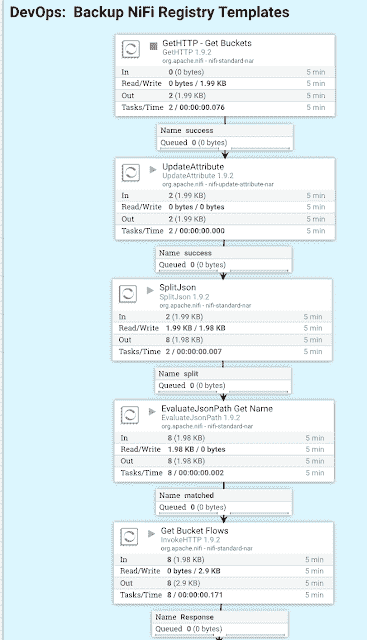
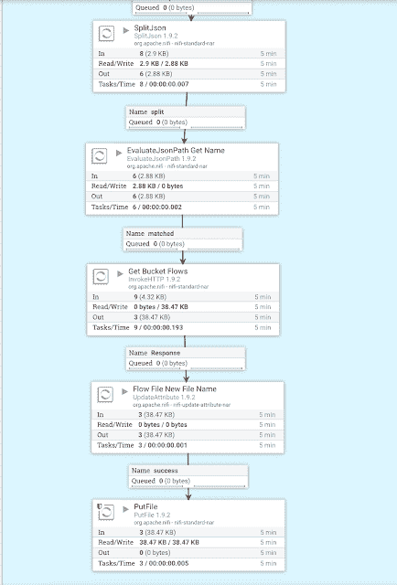
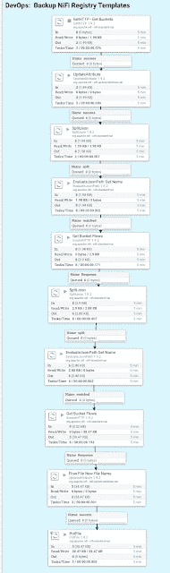

# 备份和恢复 NiFi 注册表模板

> 原文:[https://dev . to/tspannhw/backup-and-restore-nifi-registry-templates-14m](https://dev.to/tspannhw/backup-and-restore-nifi-registry-templates-14m)

### 备份和恢复 NiFi 注册表模板

[T2】](https://1.bp.blogspot.com/-No9qw2C_Ygg/XXUTR1AkewI/AAAAAAAAYWE/yJlNYWmB-5QaWrj7tuBnUJLrNRikGTWNgCLcBGAs/s1600/NiFiFlow1.png)

[T2】](https://1.bp.blogspot.com/-6Oaj9sfX_e4/XXUTR_p6lvI/AAAAAAAAYWA/FbHCfvrK2GwOQ-4HzRv7UHESNZ9t9msPQCLcBGAs/s1600/nifiFlow2.png)

[T2】](https://1.bp.blogspot.com/-H7_or27_JcM/XXUTRyxmckI/AAAAAAAAYV8/Li5Ou9Bz_aEgFxVGpiQpO0ayB33vc6Z1QCLcBGAs/s1600/NiFiFlowOverview.png)

#### 示例备份了 NiFi 流摘录

> {
> 
> " bucket ":{
> 
> " createdTimestamp ":1566430253392，
> 
> " identifier ":" AAA 50 be 8-b994-46 b5-a0bb-be 245 c 34 b 928 "，
> 
> " link ":{
> 
> " href ":" buckets/AAA 50 be 8-b994-46 b5-a0bb-be 245 c 34 b
> 
> 【Flow】:{
> 
> 【bucket identifier】:“AAA 50 be 8-b994-46 b5-a0bb-be 245 c 34 b 928”，
> 
> 【bucket name】:“IoT”，
> 
> 【createdTimestamp】:1566430269976，
> 
> 【描述】:“由 MiNiFi C2 流量设计师创建”，

#### 恢复备份的 NiFi 流

[http://nifi . Apache . org/docs/nifi-registry-docs/rest-API/index . html](http://nifi.apache.org/docs/nifi-registry-docs/rest-api/index.html)

恢复 Apache NiFi 注册表流文件。

**创建流程**

邮政

/buckets/{ bucket id }/flow

创建一个流

使用 bucket id，通过 POST 上传一个流，并获得一个新的流 id

创建流程的版本

用桶 id 和流 id 发布

/buckets/{ bucket id }/flows/{ flowId }/versions

创建流程的下一个版本

#### 脚本化 NiFi 注册表备份，用于 DevOps 处理

您还可以直接使用 NiFi Python API 或 REST API 来备份和恢复 NiFi 注册表。

*   [https://github.com/tspannhw/BackupRegistry](https://github.com/tspannhw/BackupRegistry)
*   [https://nipyapi.readthedocs.io/en/latest/](https://www.blogger.com/%C2%A0https://nipyapi.readthedocs.io/en/latest/)