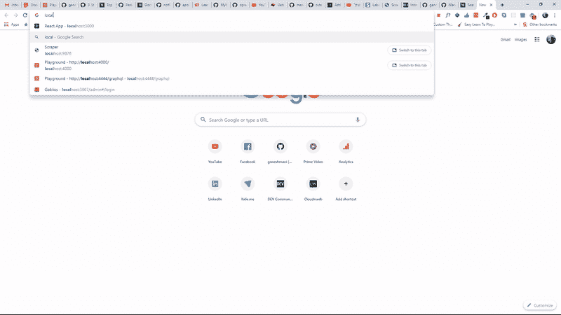
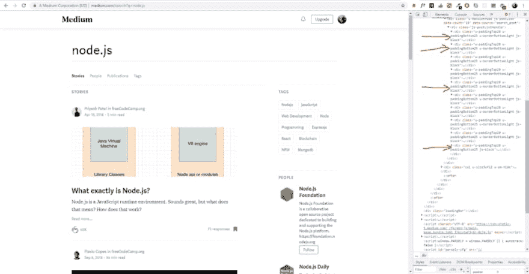

# 使用 Node.js 的网络抓取博客帖子

> 原文：<https://dev.to/ganeshmani/web-scraping-blogs-posts-using-node-js-40pf>

在本文中，我们将看到如何使用 node.js 抓取中型博客

最近的 Node.js 文章

[使用 webRTC 和 Node.js 构建 P2P 视频聊天应用](https://cloudnweb.dev/2019/09/building-p2p-video-chat-application-using-webrtc-and-node-js/)

[面向 Node.js 开发者的 Apache Kafka】](https://cloudnweb.dev/2019/08/apache-kafka-for-node-js-developers/)

### 建立

*   **Express** -我们将使用 Express 在浏览器中显示废料结果。
*   **Request** -它用于对媒体博客进行 API 调用以获取数据。
*   **Cheerio**——它用于操作来自 URL 的响应数据中的 DOM。就像 JQuery 一样。
*   **手柄** -查看引擎，在 express 应用程序中呈现网页。

让我们设置项目刮中型博客。创建项目目录。

```
$ mkdir nodescraper
$ cd nodescraper
$ npm init --yes
```

安装上面提到的所有依赖项。

```
$ npm install express request cheerio express-handlebars
```

### 从媒体获取博客文章

我们将根据博客的标签来抓取博客文章。Medium 提供了一个搜索栏，我们可以在这里根据标签搜索博客。

我们将使用它来收集特定标签的所有博客帖子。

[](https://res.cloudinary.com/practicaldev/image/fetch/s--mPo0QbD0--/c_limit%2Cf_auto%2Cfl_progressive%2Cq_66%2Cw_880/https://cloudnweb.dev/wp-content/uploads/2019/09/node-scraperdemo.gif)

例如，如果你要在 medium 中抓取 node.js 博客文章，你可以通过 URL[https://medium.com/search?q=node.js](https://medium.com/search?q=node.js)进行搜索。

之后，在 chrom dev tools 中打开检查器，查看它的 DOM 元素。

[](https://res.cloudinary.com/practicaldev/image/fetch/s--tqISH68s--/c_limit%2Cf_auto%2Cfl_progressive%2Cq_auto%2Cw_880/https://cloudnweb.dev/wp-content/uploads/2019/09/nodescraper-1024x532.png)

如果你仔细看，它有一个模式。我们可以使用元素类名来废弃它。

首先，使用**请求**包获取网页元素。

```
request(`https://medium.com/search?q=${tag}`,(err,response,html) => {
    //returns all elements of the webpage
});
```

一旦获得数据，就将数据加载到 cheerio 中，以删除您需要的数据。

```
const $ = cheerio.load(html);
```

这会将数据加载到美元变量中。如果你以前使用过 JQuery，你就会知道我们在这里使用$的原因(只是为了遵循一些旧的学校命名惯例)。

现在，您可以遍历 DOM 树。

因为我们只需要页面上博客文章的标题和链接。我们将使用元素的类名或父元素的类名来获取 HTML 中的元素。

首先，我们需要获得所有带有**的博客 DOM。js-block** 作为类名。

```
$('.js-block').each((i,el) => {

   //This is the Class name for all blog posts DIV.

 }); 
```

最重要的是，每个关键字循环遍历类名为 **js-block** 的所有元素。

其次，我们删除每篇博文的标题和链接。

```
$('.js-block').each((i,el) => {

            const title = $(el).find('h3').text();
            const article = $(el).find('.postArticle-content').find('a').attr('href');

            let data = {
                title,
                article
            }

            console.log(data);

        }) 
```

这将废弃给定标签的博客帖子。

同时，我们将使用 express 应用程序来包装此功能，该应用程序将标签名称作为输入，并返回特定标签的博客。

完整的源代码可以在[这里](https://github.com/ganeshmani/nodescraper)找到