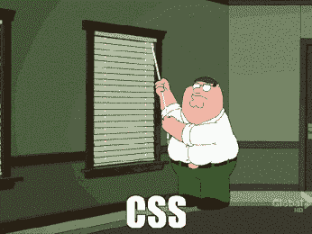

# 新开发者学习 CSS 最大的错误是什么？

> 原文:[https://dev . to/darthknoppix/what-the-maximum-mission-new-developers-make-when-learning-CSS-5095](https://dev.to/darthknoppix/what-is-the-biggest-mistake-new-developers-make-when-learning-css-5095)

当我和一些开发人员交谈时，他们经常把 CSS 描述成好像在打仗一样。他们设法智胜 CSS，取得了成功。

[T2】](https://i.giphy.com/media/13XW2MJE0XCoM0/giphy.gif)

当你刚开始的时候，CSS 可能是有挑战性的，但是对于资深程序员来说甚至是困难的。阅读以下内容[我认为这里存在一些挑战](https://dev.to/darthknoppix/why-css-is-difficult-to-get-right-5a8e)。

我发现学习时最大的挑战是定位元素。随着 Flexbox 和 Grid 的出现，事情变得简单多了，对此我很高兴。作为初学者，`position: relative`和`float: left`跨越多个元素的混合*非常*难以掌握。

**你认为新开发者学习 CSS 最大的错误是什么？**