# 使用 Node 和 Express 创建 REST 服务以便与 Unity 一起使用——第 2 部分

> 原文:[https://dev . to/ce muka/making-a-rest-service-using-node-and-express-to-use-with-unity-part-2-13ch](https://dev.to/cemuka/making-a-rest-service-using-node-and-express-to-use-with-unity-part-2-13ch)

各位开发者好！感谢所有对第一部有好感的人。我们将再次深入团结。

如果你想了解 blogpost，这里有一个 github 项目。

我已经决定制作另一个系列，[Unity MVC with Scriptable Objects](https://dev.to/cemuka/mvc-in-unity-with-scriptable-objects-part-1-3h86)，在我们的开发中用 Unity 增强我们的 ninja rest 沟通技巧。

最后一部分，我们从小处着手。这部分我们将遇到`JsonUtility`类来解析我们的数据。

首先，让我们提供一个来自我们服务器的 json 数据。当客户要求时，我会制作一个要发送的对象。
因为我们还没有数据库，所以让我们在`app.js`中定义一个 json 对象。然后将其发送回客户端。

从 url 端点开始就足够好了。

```
const express = require('express');
const app = express();

app.get('/', (req, res) => {
    res.send('Hello Unity Developers!');
});

let enemy = {
    "name": "orc",
    "health": 100,
    "attack": 25
}

app.get('/enemy/orc', (req, res) => {
    res.send(enemy);
});

app.listen(3000, () => console.log('started and listening.')); 
```

启动一个本地服务器，抓取一个终端并输入`node app.js`。

在跳到 unity 之前，尝试一下您最喜欢的 api 对`localhost:3000/enemy/orc`的请求。

[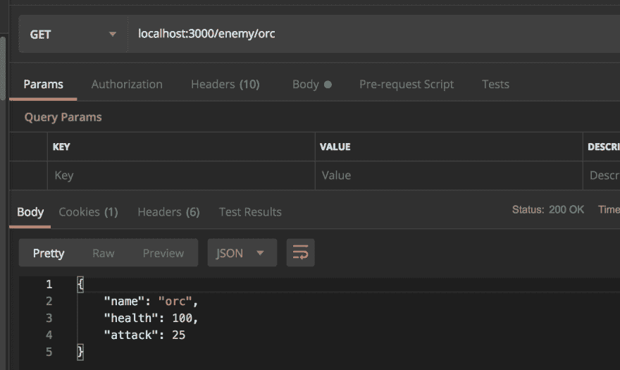T2】](https://res.cloudinary.com/practicaldev/image/fetch/s--gq-BHpKi--/c_limit%2Cf_auto%2Cfl_progressive%2Cq_auto%2Cw_880/https://thepracticaldev.s3.amazonaws.com/i/woc7ecq5pm6l9lhryzew.png)

似乎没有错误。我们将在我们的节点服务器上做更多的工作，使它成为一个合适的 api。但是首先我们需要学习 unity 中 json 解析的基础知识。

现在跳到团结。最后一部分我们已经创建了我们的`ClientApi`类，并附加到层次结构中的一个对象。将我们的端点传递给`url`参数，让我们读取控制台。

[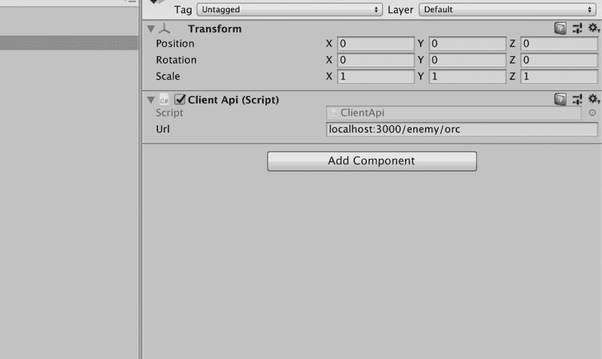T2】](https://res.cloudinary.com/practicaldev/image/fetch/s--z_taZc7I--/c_limit%2Cf_auto%2Cfl_progressive%2Cq_auto%2Cw_880/https://thepracticaldev.s3.amazonaws.com/i/ygtk802i0csgweurcidj.png)

[T2】](https://res.cloudinary.com/practicaldev/image/fetch/s--jlwLitNj--/c_limit%2Cf_auto%2Cfl_progressive%2Cq_auto%2Cw_880/https://thepracticaldev.s3.amazonaws.com/i/fet8pjkqq0wedo2dohty.png)

目前看来一切正常。

我喜欢在 node 中使用 json，它是 javascript 的原生语言，而 web 生活使用 json 通信。在 unity 中，您需要多走几步。

[T2】](https://res.cloudinary.com/practicaldev/image/fetch/s--PwqZ_N2C--/c_limit%2Cf_auto%2Cfl_progressive%2Cq_auto%2Cw_880/https://thepracticaldev.s3.amazonaws.com/i/ifpk9ier8vb12q5m2d0u.jpg)

让我们仔细看看我们的 json 数据。

```
{
    "name": "orc",
    "health": 100,
    "attack": 25
} 
```

我们将创建一个模型(或契约)类来匹配这些值。在项目文件夹中创建一个 c#脚本，命名为`Enemy`。

[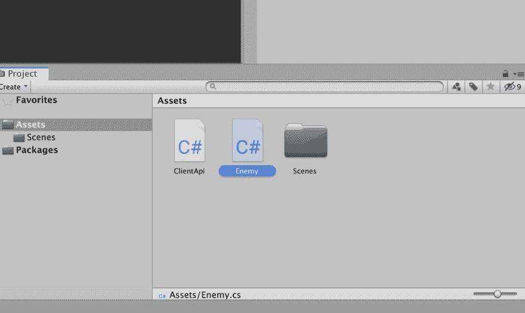](https://res.cloudinary.com/practicaldev/image/fetch/s--073Q1wvt--/c_limit%2Cf_auto%2Cfl_progressive%2Cq_auto%2Cw_880/https://thepracticaldev.s3.amazonaws.com/i/606mvyzm0sa6wigtls1m.png)T3】

```
public class Enemy
{
    public string name;
    public int health;
    public int attack;
} 
```

正如你所注意到的，它没有派生任何东西，只是一个普通的 c#类。
我们的目标是当您从 api 获取数据并注入到`JsonUtility`时，从这个模型类中创建一个实例。

现在是解析涉及的部分。打开`ClientApi`并在收到数据后调用 json boogie magic 的`JsonUtility`类。因为它是一个泛型方法，所以我们也必须指定一个类型，在这个例子中是`Enemy`。

```
var enemy = JsonUtility.FromJson<Enemy>(result); 
```

[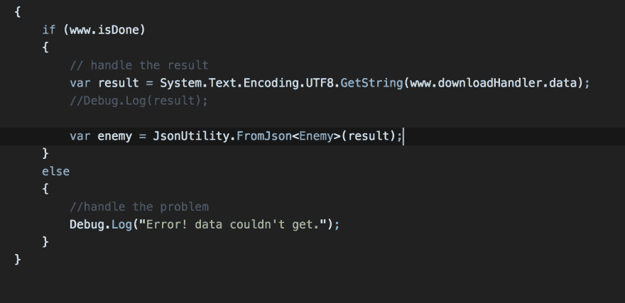T2】](https://res.cloudinary.com/practicaldev/image/fetch/s--n5f-xHOd--/c_limit%2Cf_auto%2Cfl_progressive%2Cq_auto%2Cw_880/https://thepracticaldev.s3.amazonaws.com/i/f5apsumc0c1xcwu8pxlm.png)

在 unity 中，使用 json 时必须小心，因为`JsonUtility`类有一些限制。我们的 json 模式将会工作，因为`JsonUtility`类就是以这种方式创建的。在接下来的部分中，我将解释更多关于你在使用这个类时应该如何构建你的模式。在 unity 中还有其他一些解析 json 的解决方案，但我的意图是让这个系统没有第三方扩展或库，只有普通的 unity。

关于 [JsonUtility](https://docs.unity3d.com/Manual/JSONSerialization.html) 的进一步阅读

接下来，测试我们的`Enemy`事件。在控制台中放置一些`Debug.Log()`进行打印。

[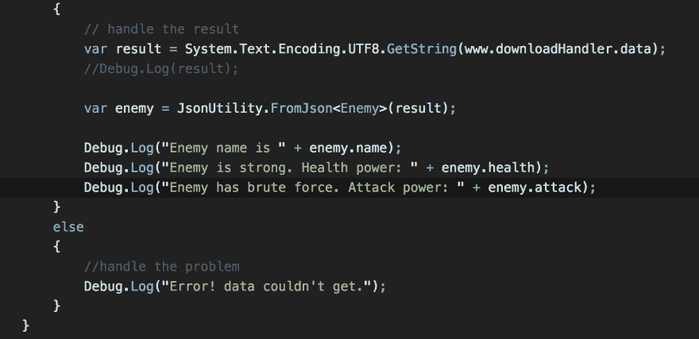T2】](https://res.cloudinary.com/practicaldev/image/fetch/s--w3BJzfOs--/c_limit%2Cf_auto%2Cfl_progressive%2Cq_auto%2Cw_880/https://thepracticaldev.s3.amazonaws.com/i/ibyvs58gpz68g03eiuyl.png)

[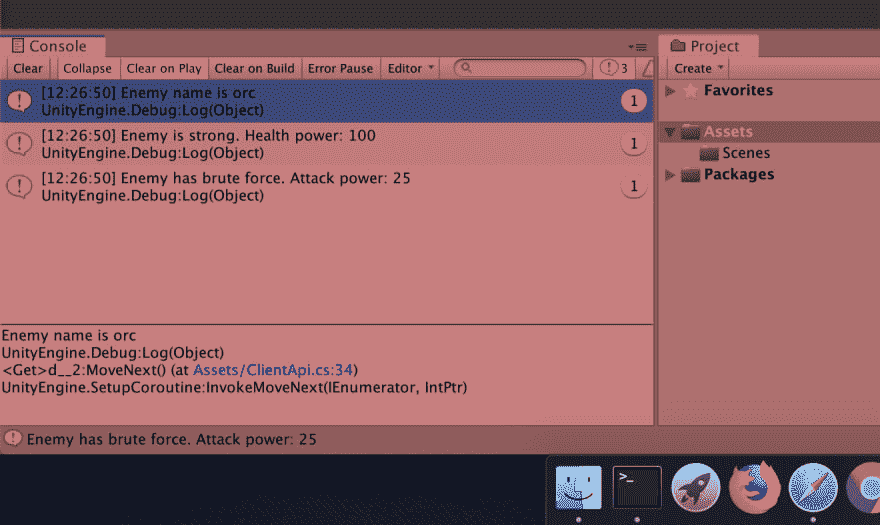T2】](https://res.cloudinary.com/practicaldev/image/fetch/s--YrRYe0uW--/c_limit%2Cf_auto%2Cfl_progressive%2Cq_auto%2Cw_880/https://thepracticaldev.s3.amazonaws.com/i/kh3zrp8lkwbbio9yhvc3.png)

我们的敌人朋友似乎在工作，是时候在我们的场景中添加一些视觉元素了。
在层次结构中创建一些文本元素。

[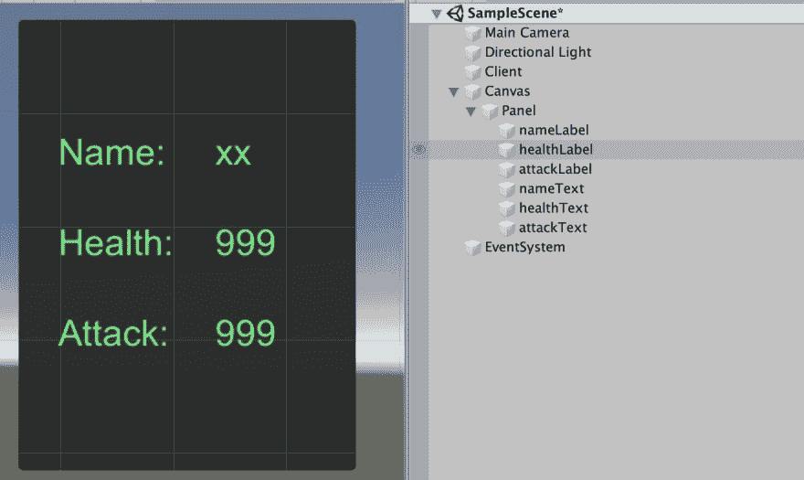T2】](https://res.cloudinary.com/practicaldev/image/fetch/s--0JcZWEsf--/c_limit%2Cf_auto%2Cfl_progressive%2Cq_auto%2Cw_880/https://thepracticaldev.s3.amazonaws.com/i/w9r8al3akxw45643jtmj.png)

我已经添加了一个面板，使它看起来很好。现在，在解析数据时需要控制这些元素。
在项目文件夹中新建一个 c#脚本，命名为`EnemyViewController`。

[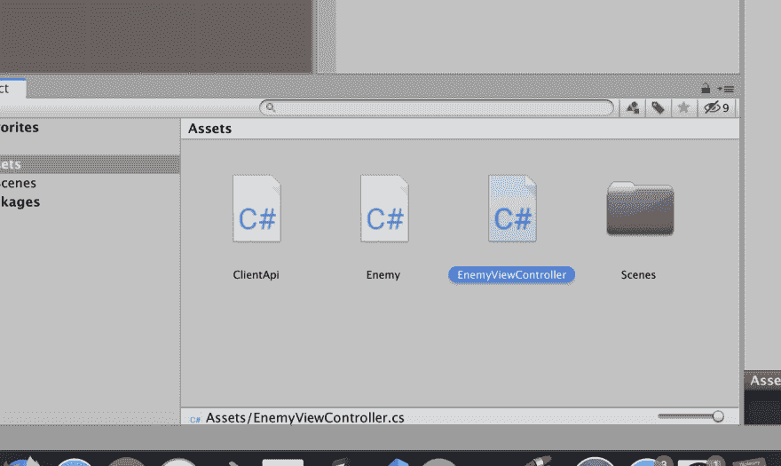T2】](https://res.cloudinary.com/practicaldev/image/fetch/s--NZbwxq90--/c_limit%2Cf_auto%2Cfl_progressive%2Cq_auto%2Cw_880/https://thepracticaldev.s3.amazonaws.com/i/z3lzwpu1xw2fggxw4u1y.png)

打开`EnemyViewController`脚本，我们将这些文本元素定义为对控制器的引用。
由于 ui components 在另一个名称空间中，所以放一个新的 using 语句。

```
using UnityEngine.UI; 
```

接下来定义我们的敌人文本元素。

```
using System.Collections;
using System.Collections.Generic;
using UnityEngine;
using UnityEngine.UI;

public class EnemyViewController : MonoBehaviour
{
    public Text nameText;
    public Text healthText;
    public Text attackText;
} 
```

我将创建一个方法来传递敌方数据并更新我们的文本元素。

```
using System.Collections;
using System.Collections.Generic;
using UnityEngine;
using UnityEngine.UI;

public class EnemyViewController : MonoBehaviour
{
    public Text nameText;
    public Text healthText;
    public Text attackText;

    public void DisplayEnemyData(string name, string health, string attack)
    {
        nameText.text = name;
        healthText.text = health;
        attackText.text = attack;
    }
} 
```

回到`ClientApi`，我们将使用我们的控制器。首先定义它的一个实例。

[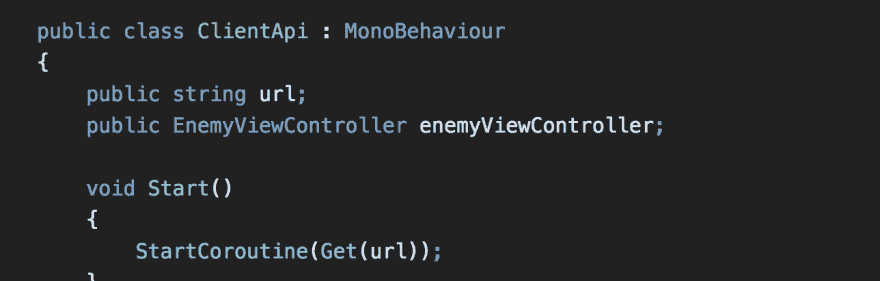T2】](https://res.cloudinary.com/practicaldev/image/fetch/s--cTSVIgw---/c_limit%2Cf_auto%2Cfl_progressive%2Cq_auto%2Cw_880/https://thepracticaldev.s3.amazonaws.com/i/bvg5o0jxhstzsw51a9ws.png)

[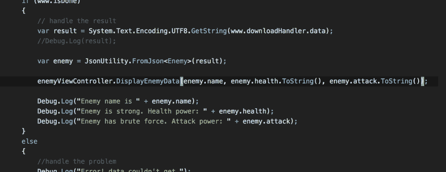](https://res.cloudinary.com/practicaldev/image/fetch/s--mVPE2Mfw--/c_limit%2Cf_auto%2Cfl_progressive%2Cq_auto%2Cw_880/https://thepracticaldev.s3.amazonaws.com/i/rgmpnkgmj3zd3w7v4ifo.png)T3】

```
using System.Collections;
using System.Collections.Generic;
using UnityEngine;
using UnityEngine.Networking;

public class ClientApi : MonoBehaviour
{
    public string url;
    public EnemyViewController enemyViewController;

    void Start()
    {
        StartCoroutine(Get(url));
    }

    public IEnumerator Get(string url)
    {
        using(UnityWebRequest www = UnityWebRequest.Get(url)){
            yield return www.SendWebRequest();

            if (www.isNetworkError)
            {
                Debug.Log(www.error);
            }
            else
            {
                if (www.isDone)
                {
                    // handle the result
                    var result = System.Text.Encoding.UTF8.GetString(www.downloadHandler.data);
                    //Debug.Log(result);

                    var enemy = JsonUtility.FromJson<Enemy>(result);

                    enemyViewController.DisplayEnemyData(enemy.name, enemy.health.ToString(), enemy.attack.ToString());

                    //Debug.Log("Enemy name is " + enemy.name);
                    //Debug.Log("Enemy is strong. Health power: " + enemy.health);
                    //Debug.Log("Enemy has brute force. Attack power: " + enemy.attack);
                }
                else
                {
                    //handle the problem
                    Debug.Log("Error! data couldn't get.");
                }
            }
        }

    }
} 
```

切换回编辑器。创建一个空的游戏对象并放置我们的`EnemyViewController`。我们还必须给自己创建的变量赋值。

[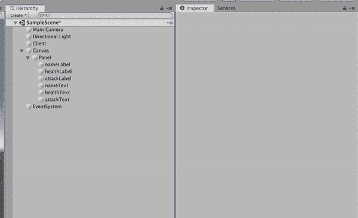T2】](https://res.cloudinary.com/practicaldev/image/fetch/s--KKZxffAq--/c_limit%2Cf_auto%2Cfl_progressive%2Cq_66%2Cw_880/https://thepracticaldev.s3.amazonaws.com/i/lm2tq9ir2sr86hoeiv8h.gif)

[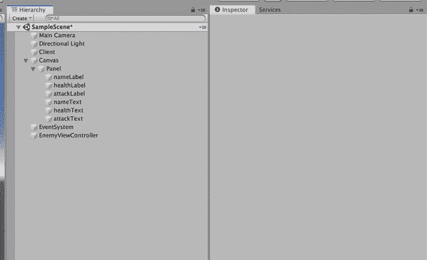T2】](https://res.cloudinary.com/practicaldev/image/fetch/s--mrwTWArn--/c_limit%2Cf_auto%2Cfl_progressive%2Cq_66%2Cw_880/https://thepracticaldev.s3.amazonaws.com/i/pwig4szmmedqm65fmghz.gif)

考验的时候到了！打戏看结果！

[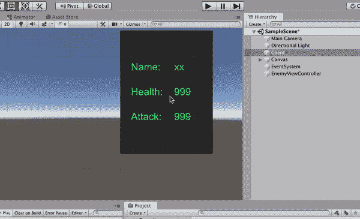T2】](https://res.cloudinary.com/practicaldev/image/fetch/s--nNSDFGBf--/c_limit%2Cf_auto%2Cfl_progressive%2Cq_66%2Cw_880/https://thepracticaldev.s3.amazonaws.com/i/3kinwmqt2s8gro8trqyd.gif)

我们的忍者技能证明了我们已经完成了连接并成功地显示了场景中的数据。
祝贺你！

[T2】](https://i.giphy.com/media/ehhuGD0nByYxO/giphy.gif)

下一部分，我们将了解如何从我们的 unity 客户端向我们的服务器发出 post 请求。

获取 [github 项目](https://github.com/cemuka/unity-node-tutorial)

下次见，干杯！