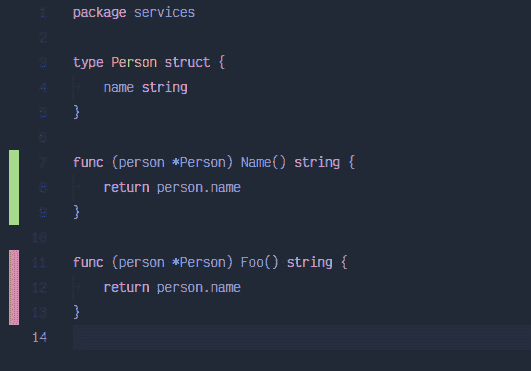

# VSCode:保存代码后显示代码覆盖率

> 原文：<https://dev.to/vuong/golang-in-vscode-show-code-coverage-of-after-saving-test-8g0>

## 必需品

*   Vscode，当然是安装了 Go extesion。
*   安装需要的 go 包:[https://github . com/Microsoft/vs code-Go/wiki/Go-tools-the-Go-extension-depends-on](https://github.com/microsoft/vscode-go/wiki/Go-tools-that-the-Go-extension-depends-on)

注意:你不需要上面 wiki 中的所有包，但是所有的东西对你在 vscode 上的 Golang 开发过程都有好处，除了`gometalinter`,因为它已经在 github 上存档了

## 配置

在*用户设置*中添加一些配置，如下:

```
{  "go.coverOnSave":  true,  "go.coverageDecorator":  {  "type":  "gutter",  "coveredHighlightColor":  "rgba(64,128,128,0.5)",  "uncoveredHighlightColor":  "rgba(128,64,64,0.25)",  "coveredGutterStyle":  "blockgreen",  "uncoveredGutterStyle":  "blockred"  },  "go.coverOnSingleTest":  true  } 
```

Enter fullscreen mode Exit fullscreen mode

在字体上改为“**装订线**，可以尝试用“**突出显示**”。

你可以在这里查看 vscode-go 对 **gutter** style 的可用选项[https://github . com/Microsoft/vs code-go/blob/master/src/go cover . ts # L39](https://github.com/microsoft/vscode-go/blob/master/src/goCover.ts#L39)

## 举例

我有这个文件

```
// filename: services/person.go
package services

type Person struct {
    name string
}

func (person *Person) Name() string {
    return person.name
}

func (person *Person) Foo() string {
    return person.name
} 
```

Enter fullscreen mode Exit fullscreen mode

这是我的测试代码

```
// filename: services/person_test.go
package services

import (
    "testing"
)

func TestPeople_Name(t *testing.T) {
    tests := []struct {
        name   string
        person *Person
        want   string
    }{
        {"should return a name", &Person{"Vuong"}, "Vuong"},
    }
    for _, tt := range tests {
        t.Run(tt.name, func(t *testing.T) {
            if got := tt.person.Name(); got != tt.want {
                t.Errorf("DecisionMaker.Name() = %v, want %v", got, tt.want)
            }
        })
    }
} 
```

Enter fullscreen mode Exit fullscreen mode

每次我保存完代码后，`services/person.go`上的代码覆盖率结果会如下图所示。

[](https://res.cloudinary.com/practicaldev/image/fetch/s--PltBpmc2--/c_limit%2Cf_auto%2Cfl_progressive%2Cq_auto%2Cw_880/https://thepracticaldev.s3.amazonaws.com/i/2m7sv8qbjkan531zwcxn.png)

编码快乐！