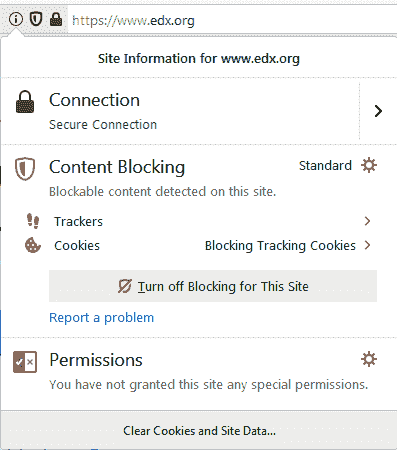
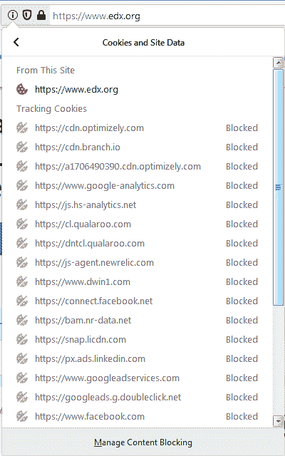
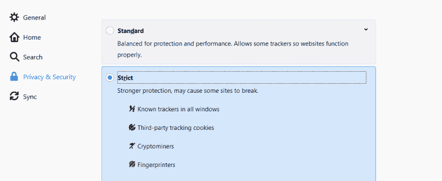

# 在 Firefox69 中，隐私是默认设置

> 原文:[https://dev . to/bluetooth/with-Firefox 69-privacy-is-the-default-4iga](https://dev.to/blueturtle/with-firefox69-privacy-is-the-default-4iga)

在 [Firefox69](https://www.mozilla.org/en-US/firefox/new/) 浏览器版本中，隐私不是一个选项。默认是*默认是*。新版浏览器为用户提供了以下新功能:

1.  [阻止第三方跟踪 Cookies(默认)](#block-third-party-tracking-cookies)。
2.  [屏蔽密码矿工(默认)](#block-cryptominers)。
3.  [阻止指纹识别(在严格模式下，您必须启用它，我将向您展示如何启用)](#block-fingerprinting)。
4.  [阻止自动播放视频的音频(默认)](#block-autoplay-video's-audio)。

* * *

### 阻止第三方跟踪 Cookies

正如在 [mozilla 博客文章](https://blog.mozilla.org/blog/2019/09/03/todays-firefox-blocks-third-party-tracking-cookies-and-cryptomining-by-default/)中提到的，这项新功能在幕后工作，以防止公司根据他们对你在网站上浏览行为的跟踪来建立你的档案——通常是在你不知情或未经你同意的情况下。这些个人资料及其包含的信息可能会被出售并用于您从未知晓或打算使用的目的。

以下是如何查看网站的阻止列表:

<figure>

[T2】](https://res.cloudinary.com/practicaldev/image/fetch/s--IheG7e7K--/c_limit%2Cf_auto%2Cfl_progressive%2Cq_auto%2Cw_880/https://thepracticaldev.s3.amazonaws.com/i/w4ceomvhcwpkby9glnhf.png)

<figcaption>Click on info icon beside address bar.</figcaption>

</figure>

<figure>

[T4】](https://res.cloudinary.com/practicaldev/image/fetch/s--wFf6yxsU--/c_limit%2Cf_auto%2Cfl_progressive%2Cq_auto%2Cw_880/https://thepracticaldev.s3.amazonaws.com/i/kuuixsjtwrpd7st5kysz.png)

<figcaption>Click on Cookies.</figcaption>

</figure>

* * *

### 阻挡隐密者

密码矿工在你不知情的情况下访问你的 CPU，进行过多的计算操作，这会导致你的机器变慢，并耗尽你的电池。所有这些都是为了创造加密货币，不是为了你，而是为了他们。默认情况下，Firefox 会阻止它们。

* * *

### 阻止指纹识别

当您访问网站时，指纹脚本能够拍摄您的机器配置的快照。这张快照可以用来在网上追踪你。Firefox 通过启用*严格模式*来阻止指纹识别。

要打开严格模式，你必须进入**选项**，然后选择**隐私&安全**，并勾选**严格**。

<figure>

[T2】](https://res.cloudinary.com/practicaldev/image/fetch/s--EHjlwuzG--/c_limit%2Cf_auto%2Cfl_progressive%2Cq_auto%2Cw_880/https://thepracticaldev.s3.amazonaws.com/i/ydc0r2tvjivq8lcvhz1f.png)

<figcaption>How to enable strict mode</figcaption>

</figure>

* * *

### 阻止自动播放视频的音频

Firefox 中的视频有三种选择:

1.  允许音频和视频自动播放。
2.  仅阻止音频(默认)。
3.  阻止音频和视频，直到您按下播放按钮。

你可以通过进入**隐私&安全**，然后在**权限**找到**自动播放**设置来轻松更改设置。

* * *

正如你所看到的，新的 Firefox 将用户隐私作为第一优先考虑的事情，这对这个浏览器和它的用户来说确实是一个胜利。