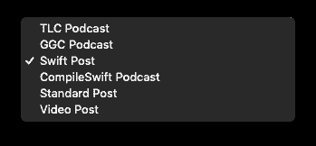
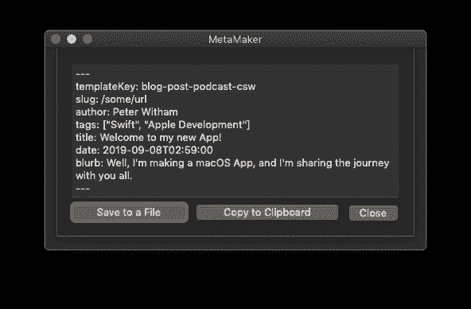

# 挠 macOS 应用痒痒

> 原文:[https://dev . to/Peter witham/scratching-the-MAC OS-app-itch-5bld](https://dev.to/peterwitham/scratching-the-macos-app-itch-5bld)

[最初出现在 PeterWitham.com](https://peterwitham.com/swift-archives/scratching-the-macos-app-itch/)

最初我打算等到 SwiftUI 到来的时候，但是我决定现在就开始开发我需要的 macOS 应用程序。当 iPadOS 和 macOS Catalina 到来时，我肯定会进行重构，使其跨平台，我也需要这样做。

我想我也会公开开发这个应用程序，并分享我的旅程，一部分是对我的记录，一部分是对你的乐趣。

### 那么你问的应用是什么？

每当我做一些重复的事情时，我都希望自动化或者加快工作流程。我有这样一个问题，每次我为我的基于盖茨比的网站开始一个新的博客帖子，我都需要将相同的 frontmatter 添加到 markdown 文件中，并更改相同的字段…每次，我都知道这有多乏味，对吗？

这就是应用程序想法的来源。如果我可以创建一个应用程序来解决问题，同时学习一些东西，那么这就是一个胜利。

所以最小可行的产品很简单，至少只需要做一些事情就可以立即被我使用。

1.  为我提供输入字段以填写元数据。

2.  给我一个我的模板帖子格式的列表，我有几个不同的帖子类型，如播客，Swift 等。

3.  将数据格式化成我需要的规格，以便 Gatsby 可以使用 markdown 文件。

4.  给我一个选项，检查无误后全部复制到剪贴板。

5.  给我一个选项，将它全部保存到一个新文件中，为我填写内容做好准备。

给我们看看你已经做了什么

好了，经过大约 5 个小时的工作，我现在已经轻而易举地完成了上面的列表。这很好，从这里我可以迭代应用程序，如果有兴趣的话，甚至可以让其他人使用它。

### 界面死简单。

这是开始，让我们看看接下来会发生什么。接下来是模板之类的东西的配置，以便其他人可以使用它。