# 重写提交历史

> 原文：<https://dev.to/dzungnguyen179/rewrite-commit-history-45p3>

# 概述

作为一名工程师，我们喜欢让事情井井有条。特别是，当你在项目中工作，团队在扩大的时候。这意味着有很多工程师在同一源代码上工作，并且每天都有大量的提交。保持 git 历史的清晰和线性，让所有工程师更容易理解源代码中发生了什么。这样做需要使用一些高级的 git 特性。在本文中，我们将学习如何执行 4 个 git 任务，我相信在将提交历史与主分支合并之前，这些任务对于保持提交历史的最小化和简洁是必不可少的。

*   挤压和奖励
*   合并基础和重置
*   改进
*   推力

在进入细节之前。让我们看看为什么我们需要干净的提交历史，以及我们应该将哪个场景应用到我们的工作中。

# 为什么要清理提交历史？

拥有干净的提交历史记录给我们带来了 4 个主要好处:

*   **文档**。线性历史通常更容易跟踪。这类似于你希望你的代码被很好地结构化和文档化:无论何时有人需要处理它(代码或历史)，能够快速理解正在发生的事情是非常有价值的。
*   **提高代码审查效率**。如果一个主题分支被分成线性的、逻辑的步骤，那么回顾 PR 和目标分支之间的变化就容易多了。
*   **当您以后需要修改历史记录时**。例如当全部或部分地恢复或精选特征时。
*   **可扩展性**。除非当您的团队变得更大时(例如，数百个贡献者)，您的历史会因为交叉分支合并而变得非常臃肿，并且所有的贡献者都很难跟踪正在发生的事情。

然而，除了好处之外，也有一些缺点:

*   仅当所有成员同意将其应用到他们的工作中时，干净提交历史才有效。
*   要做到这一点，需要一些高级的 git 特性，学习曲线一开始会花费你一些时间。
*   而如果你对它不是很了解，当你把它应用到你的项目中时，它会给你带来一些麻烦。

# 场景

我被分配的任务是开发名为“列表”和“列表项”的 React 组件。所以我是这样做的:

*   创建一个名为“特性/添加-列表-列表-项目”的新分支

```
git checkout -b “features/add-list-list-item” 
```

<svg width="20px" height="20px" viewBox="0 0 24 24" class="highlight-action crayons-icon highlight-action--fullscreen-on"><title>Enter fullscreen mode</title></svg> <svg width="20px" height="20px" viewBox="0 0 24 24" class="highlight-action crayons-icon highlight-action--fullscreen-off"><title>Exit fullscreen mode</title></svg>

*   我提交了添加 ListItem 组件的 UI。

```
git commit -m “add the ui of ListItem” 
```

<svg width="20px" height="20px" viewBox="0 0 24 24" class="highlight-action crayons-icon highlight-action--fullscreen-on"><title>Enter fullscreen mode</title></svg> <svg width="20px" height="20px" viewBox="0 0 24 24" class="highlight-action crayons-icon highlight-action--fullscreen-off"><title>Exit fullscreen mode</title></svg>

*   然后我发现我的代码不是很干净。所以我重构了一下。

```
git commit -m “refactor” 
```

<svg width="20px" height="20px" viewBox="0 0 24 24" class="highlight-action crayons-icon highlight-action--fullscreen-on"><title>Enter fullscreen mode</title></svg> <svg width="20px" height="20px" viewBox="0 0 24 24" class="highlight-action crayons-icon highlight-action--fullscreen-off"><title>Exit fullscreen mode</title></svg>

*   然后，我发现了一些问题并解决了它们。突然，我要回家处理一些私事，于是我决定暂时放下工作。

```
git commit -m “temp” 
```

<svg width="20px" height="20px" viewBox="0 0 24 24" class="highlight-action crayons-icon highlight-action--fullscreen-on"><title>Enter fullscreen mode</title></svg> <svg width="20px" height="20px" viewBox="0 0 24 24" class="highlight-action crayons-icon highlight-action--fullscreen-off"><title>Exit fullscreen mode</title></svg>

*   好吧！我完成了“ListItem”组件。

```
git commit -m “completed the ListItem” 
```

<svg width="20px" height="20px" viewBox="0 0 24 24" class="highlight-action crayons-icon highlight-action--fullscreen-on"><title>Enter fullscreen mode</title></svg> <svg width="20px" height="20px" viewBox="0 0 24 24" class="highlight-action crayons-icon highlight-action--fullscreen-off"><title>Exit fullscreen mode</title></svg>

*   我完成了“列表”组件和上面提交的列表项。现在我可以做最后一次提交来标记我已经完成了我的任务。

```
git commit -m “finished task” 
```

<svg width="20px" height="20px" viewBox="0 0 24 24" class="highlight-action crayons-icon highlight-action--fullscreen-on"><title>Enter fullscreen mode</title></svg> <svg width="20px" height="20px" viewBox="0 0 24 24" class="highlight-action crayons-icon highlight-action--fullscreen-off"><title>Exit fullscreen mode</title></svg>

回顾提交历史，我们看到我们正在处理的特性的历史缺少对变更的有意义的描述，并且通常是混乱的。

# 清除提交历史

## 南瓜&重新措辞

*   **挤压**:将提交合并为一次提交。
*   **改写**:编辑提交消息。

为了做到这一点，以下是步骤:

**1 -打开提交历史**

```
git log --oneline 
```

<svg width="20px" height="20px" viewBox="0 0 24 24" class="highlight-action crayons-icon highlight-action--fullscreen-on"><title>Enter fullscreen mode</title></svg> <svg width="20px" height="20px" viewBox="0 0 24 24" class="highlight-action crayons-icon highlight-action--fullscreen-off"><title>Exit fullscreen mode</title></svg>

[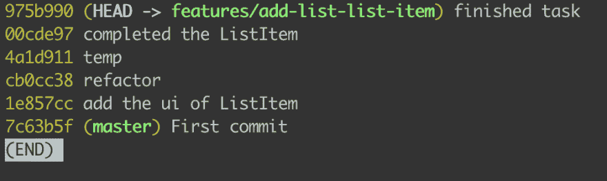](https://res.cloudinary.com/practicaldev/image/fetch/s--nAnN6AoO--/c_limit%2Cf_auto%2Cfl_progressive%2Cq_auto%2Cw_880/https://miro.medium.com/max/1992/1%2AdYl9yK_dGMeCMOLbeJdPgg.png)

**2 -确定我们需要压缩和改写多少提交**

[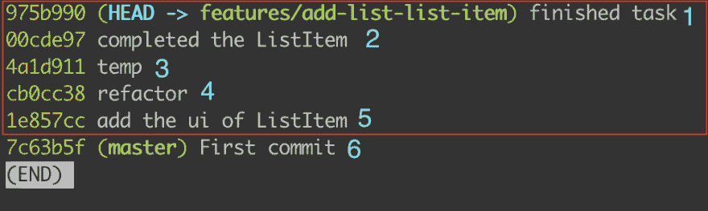](https://res.cloudinary.com/practicaldev/image/fetch/s--zz4lJzdb--/c_limit%2Cf_auto%2Cfl_progressive%2Cq_auto%2Cw_880/https://miro.medium.com/max/1992/1%2A5tnNides06EgXpO_zdg9yA.png)

在这种情况下，我们将挤压“红框”中的 5 个提交，并改写第 5 个提交消息。

**3 -在您想要压缩和改写的提交列表之前重新调整提交的基础**

*3.1 -调整提交基准*

在这种情况下，这是第六次提交。复制哈希字符串“7c63b5f”并重置到第 6 次提交:

```
git rebase -i 7c63b5f 
```

<svg width="20px" height="20px" viewBox="0 0 24 24" class="highlight-action crayons-icon highlight-action--fullscreen-on"><title>Enter fullscreen mode</title></svg> <svg width="20px" height="20px" viewBox="0 0 24 24" class="highlight-action crayons-icon highlight-action--fullscreen-off"><title>Exit fullscreen mode</title></svg>

*3.2 -选择修改提交的选项*

在前面的步骤中运行命令后，它将我们带到 Vim 屏幕。

[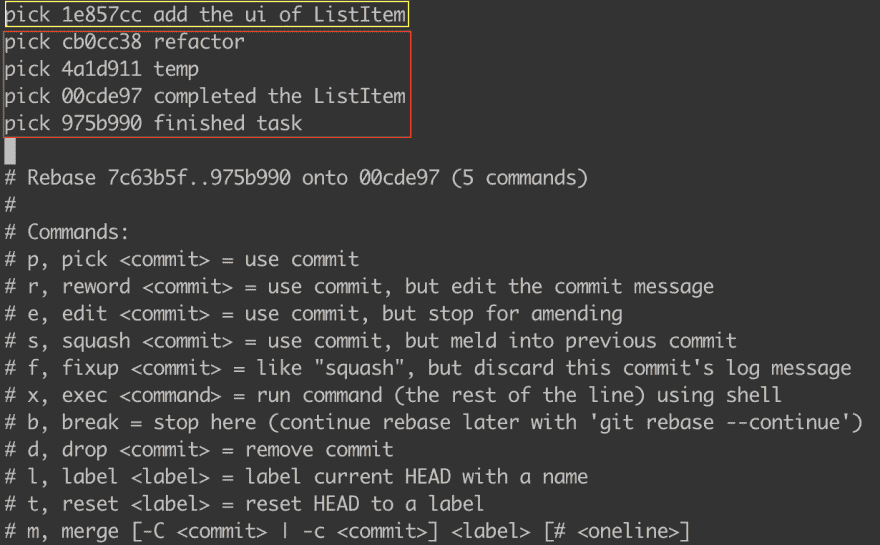](https://res.cloudinary.com/practicaldev/image/fetch/s--Xueg4Jy9--/c_limit%2Cf_auto%2Cfl_progressive%2Cq_auto%2Cw_880/https://miro.medium.com/max/2460/1%2Ak5fc4EY_Tp0g0bb1wjHohA.png)

这就是我们正在做的事情:

*   我们将“pick”替换为“s ”,以提交“红框”中要挤压的内容。
*   我们将“黄色框”中的“pick”替换为“r ”,以改写提交消息。

要修改 Vim 屏幕，您需要做两件事:

*   按“I”进入“插入模式”进行编辑。
*   按“esc”进入“命令模式”，然后按“:wq”保存更改。

```
r 1e857cc add the ui of ListItem
s cb0cc38 refactor
s 4a1d911 temp
s 00cde97 completed the ListItem
s 975b990 finished task 
```

<svg width="20px" height="20px" viewBox="0 0 24 24" class="highlight-action crayons-icon highlight-action--fullscreen-on"><title>Enter fullscreen mode</title></svg> <svg width="20px" height="20px" viewBox="0 0 24 24" class="highlight-action crayons-icon highlight-action--fullscreen-off"><title>Exit fullscreen mode</title></svg>

*3.3 -改写提交消息*

在修改提交之后，它将我们带到 reword 屏幕。

[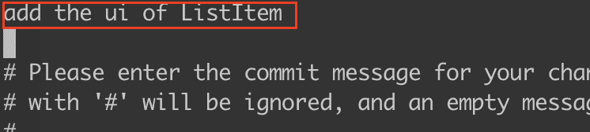](https://res.cloudinary.com/practicaldev/image/fetch/s--Ky6Ky39i--/c_limit%2Cf_auto%2Cfl_progressive%2Cq_auto%2Cw_880/https://miro.medium.com/max/1492/1%2AQ646xpewLzd6jEEECeqa6g.png)

因为我们开发了两个组件“列表”和“列表项”。因此，该消息应该包含两个部分

改变:

> 添加 ListItem 的 ui

收件人:

> 添加列表和列表项组件

[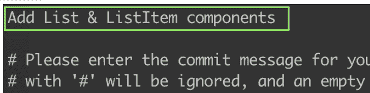](https://res.cloudinary.com/practicaldev/image/fetch/s--sTfH9-cL--/c_limit%2Cf_auto%2Cfl_progressive%2Cq_auto%2Cw_880/https://miro.medium.com/max/1456/1%2A7d_LryazE3vGEj8ncRIbiA.png)

然后“:wq”(写&退出)Vim。

*3.4 -挤压提交*

在我们编辑完提交消息之后。它将我们带到第二个屏幕来粉碎提交。

[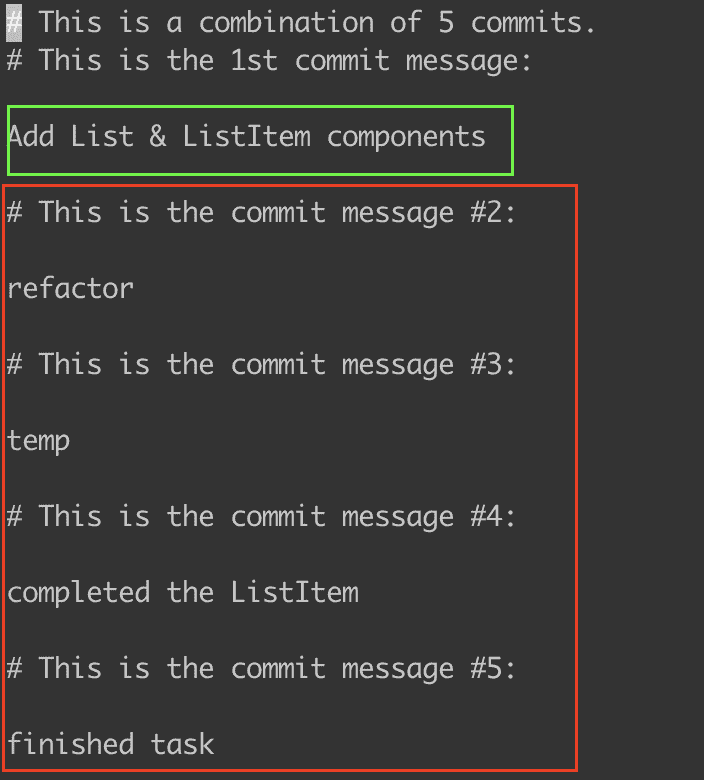](https://res.cloudinary.com/practicaldev/image/fetch/s--OpyfgRbN--/c_limit%2Cf_auto%2Cfl_progressive%2Cq_auto%2Cw_880/https://miro.medium.com/max/1408/1%2AWh_52l6CgfyVVoN8om-Uwg.png)

*   删除“红框”中的所有行。
*   把线放在“绿盒子”里。因为这是反映到我们工作中的最终提交消息。

删除“红框”中的行。

*   将光标移至该行，然后按“dd”。

[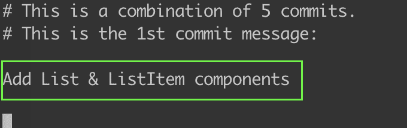](https://res.cloudinary.com/practicaldev/image/fetch/s--t8pKpBtC--/c_limit%2Cf_auto%2Cfl_progressive%2Cq_auto%2Cw_880/https://miro.medium.com/max/1360/1%2AhZZkNKqvRuAHlOHuxIfUcQ.png)

*   然后“:wq”(写&退出)Vim。搞定了。

*3.5 -检查我们的工作是否成功*

```
git log --oneline 
```

<svg width="20px" height="20px" viewBox="0 0 24 24" class="highlight-action crayons-icon highlight-action--fullscreen-on"><title>Enter fullscreen mode</title></svg> <svg width="20px" height="20px" viewBox="0 0 24 24" class="highlight-action crayons-icon highlight-action--fullscreen-off"><title>Exit fullscreen mode</title></svg>

[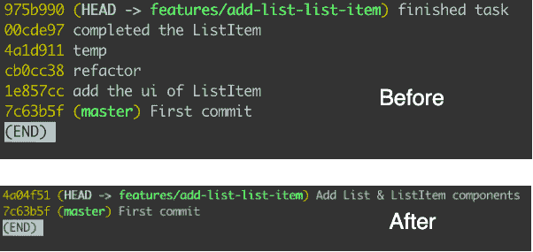](https://res.cloudinary.com/practicaldev/image/fetch/s--0VIsyWkz--/c_limit%2Cf_auto%2Cfl_progressive%2Cq_auto%2Cw_880/https://miro.medium.com/max/1204/1%2Ac5EhxjWsQeOse9MHM6tmBg.png)

正如您所看到的，我们已经将 5 个提交合并为 1 个，并修改了提交消息。

## 合并基数&复位

在压缩提交之后，我创建了一个 PR (Pull Request 或 Merge Request)并添加了评审者。他们给我反馈。

> 你认为把提交分成两次提交怎么样？因为 2 个组件应该对应于 2 个提交。一个用于 ListItem 组件，另一个用于 List 组件。

我们现在的任务是:

*   将压缩的提交分成两个不同的提交。
*   每个提交都需要有自己的提交消息。

因此，本节使用第二种技术进行重新提交，这需要几个步骤:

1.  使用“ **git merge-base** ”获取主分支和特征分支之间的共同祖先。它的输出是一个表示提交的散列字符串。
2.  当我们还没有提交任何与列表& ListItem 组件相关的内容时，使用“ **git reset** 返回。
3.  使用“ **git add** 添加属于“**列表**组件的文件。
4.  用消息“添加列表组件”提交“**列表**”组件。
5.  使用“git add”添加属于“ListItem”组件的文件。
6.  提交“ **ListItem** ”组件，并显示消息“添加 ListItem 组件”。

**使用合并基础**

我们需要做的第一件事是通过运行下面的命令找到主分支和特征分支之间最常见的部分:

```
git merge-base master features/add-list-list-item 
```

<svg width="20px" height="20px" viewBox="0 0 24 24" class="highlight-action crayons-icon highlight-action--fullscreen-on"><title>Enter fullscreen mode</title></svg> <svg width="20px" height="20px" viewBox="0 0 24 24" class="highlight-action crayons-icon highlight-action--fullscreen-off"><title>Exit fullscreen mode</title></svg>

输出是指向提交的散列字符串，在 2 个分支之间有最常见的部分:

```
7c63b5ffc4ba24581b624e298dd15a02d52bf2a7 
```

<svg width="20px" height="20px" viewBox="0 0 24 24" class="highlight-action crayons-icon highlight-action--fullscreen-on"><title>Enter fullscreen mode</title></svg> <svg width="20px" height="20px" viewBox="0 0 24 24" class="highlight-action crayons-icon highlight-action--fullscreen-off"><title>Exit fullscreen mode</title></svg>

在进入下一步之前，请确保复制了这个散列字符串。

**重置提交**

在这一步中，我们使用“git reset”和上一步中的散列字符串返回到提交之前的时刻。

```
git reset 7c63b5ffc4ba24581b624e298dd15a02d52bf2a7 
```

<svg width="20px" height="20px" viewBox="0 0 24 24" class="highlight-action crayons-icon highlight-action--fullscreen-on"><title>Enter fullscreen mode</title></svg> <svg width="20px" height="20px" viewBox="0 0 24 24" class="highlight-action crayons-icon highlight-action--fullscreen-off"><title>Exit fullscreen mode</title></svg>

[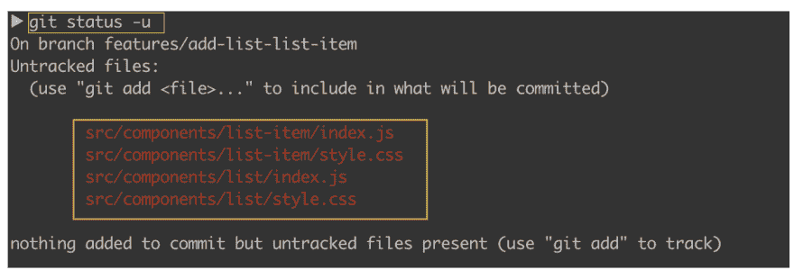](https://res.cloudinary.com/practicaldev/image/fetch/s--HBtsi_km--/c_limit%2Cf_auto%2Cfl_progressive%2Cq_auto%2Cw_880/https://miro.medium.com/max/2844/1%2A6zpUrQynDEv215vv0x1u1Q.png)

正如您在“橙色框”中看到的，我们的文件恢复到了原始状态。现在我们可以使用“git add”来形成我们的提交。

**完成移动**

因此，我们将创建两个提交，分别对应于两个组件“List”和“ListItem”。

*   列表:“添加列表组件”

```
git add src/components/list/index.js
git add src/components/list/style.css
git commit -m "Add List component" 
```

<svg width="20px" height="20px" viewBox="0 0 24 24" class="highlight-action crayons-icon highlight-action--fullscreen-on"><title>Enter fullscreen mode</title></svg> <svg width="20px" height="20px" viewBox="0 0 24 24" class="highlight-action crayons-icon highlight-action--fullscreen-off"><title>Exit fullscreen mode</title></svg>

*   列表项:“添加列表项组件”

```
git add src/components/list-item/index.js
git add src/components/list-item/style.css
git commit -m "Add List Item component" 
```

<svg width="20px" height="20px" viewBox="0 0 24 24" class="highlight-action crayons-icon highlight-action--fullscreen-on"><title>Enter fullscreen mode</title></svg> <svg width="20px" height="20px" viewBox="0 0 24 24" class="highlight-action crayons-icon highlight-action--fullscreen-off"><title>Exit fullscreen mode</title></svg>

搞定了。现在来检查我们是否成功地重新调整了我们的提交。只需打开 git 提交历史。

[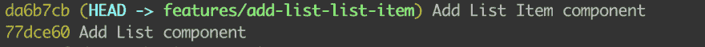](https://res.cloudinary.com/practicaldev/image/fetch/s--Fsdz7zQe--/c_limit%2Cf_auto%2Cfl_progressive%2Cq_auto%2Cw_880/https://miro.medium.com/max/2428/1%2AHsFCCixf0u_3Qba9_bVtBQ.png)

## 修改

在我们形成我们的承诺之后。突然，我们忘记了我们还没有更新文档。所以我们回去更新了文档，这只是一个小改动。你会问自己这个问题？

> 有没有什么方法可以让我提交，而不需要再次修改提交？

是的，我们有。是`git commit --amend`。

什么是 git `commit --amend`？

git commit - amend 命令是修改最近提交的一种便捷方式。

我们如何使用它？

我们更新了源代码文档，并用`--amend`标志提交。

```
git commit --amend 
```

<svg width="20px" height="20px" viewBox="0 0 24 24" class="highlight-action crayons-icon highlight-action--fullscreen-on"><title>Enter fullscreen mode</title></svg> <svg width="20px" height="20px" viewBox="0 0 24 24" class="highlight-action crayons-icon highlight-action--fullscreen-off"><title>Exit fullscreen mode</title></svg>

它像这样把你带到 Vim 屏幕

[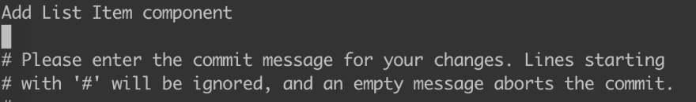](https://res.cloudinary.com/practicaldev/image/fetch/s--N41oUMad--/c_limit%2Cf_auto%2Cfl_progressive%2Cq_auto%2Cw_880/https://miro.medium.com/max/2216/1%2AiPn0JkwoGViG8oQaCI08Ug.png)

然后“:wq”(写&退出)Vim。搞定了。

现在，您的更改已经包含在上次提交的“添加列表项组件”中。

## 推动力量

在我们完成所有事情之后，现在我们有了一个不错的提交结构。我们需要做的最后一件事是将代码“推”到远程分支。

如果您的分支已经在“**远程分支**中，您只需重写提交历史。因此，您需要在“远程分支”中覆盖它。

```
git push -f 
```

<svg width="20px" height="20px" viewBox="0 0 24 24" class="highlight-action crayons-icon highlight-action--fullscreen-on"><title>Enter fullscreen mode</title></svg> <svg width="20px" height="20px" viewBox="0 0 24 24" class="highlight-action crayons-icon highlight-action--fullscreen-off"><title>Exit fullscreen mode</title></svg>

否则

```
git push --set-upstream origin features/add-list-list-item 
```

<svg width="20px" height="20px" viewBox="0 0 24 24" class="highlight-action crayons-icon highlight-action--fullscreen-on"><title>Enter fullscreen mode</title></svg> <svg width="20px" height="20px" viewBox="0 0 24 24" class="highlight-action crayons-icon highlight-action--fullscreen-off"><title>Exit fullscreen mode</title></svg>

# 结论

在您的项目中拥有干净的 git 历史非常重要。特别是，当你在一个大团队(20 个以上的贡献者)中工作时，每天都有大量的提交。它可以帮助您轻松了解正在发生的事情，轻松恢复，让您的生活更加轻松。但是它是有代价的，如果你在实际项目中没有任何经验就应用它，它会给你带来一些麻烦。

> 在将它应用到实际项目之前，请确保您已经在个人项目中多次尝试过它。

# 参考文献

*   [https://www . atlassian . com/git/tutorials/rewriting-history/git-rebase](https://www.atlassian.com/git/tutorials/rewriting-history/git-rebase)
*   [https://www.atlassian.com/git/tutorials/rewriting-history](https://www.atlassian.com/git/tutorials/rewriting-history)