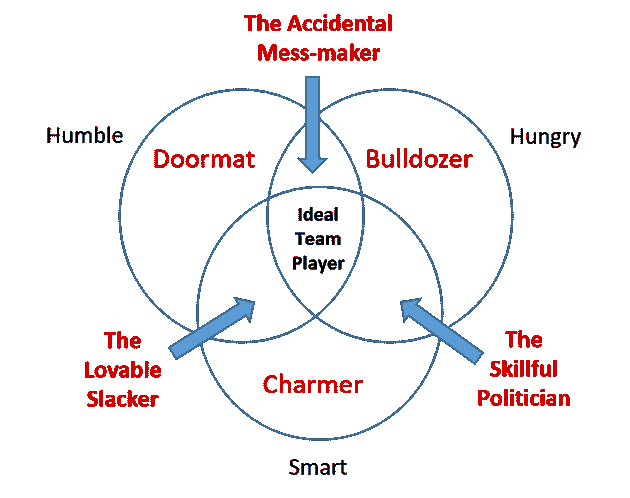

# 你是一个理想的团队成员吗？

> 原文:[https://dev.to/bhavaniravi/are-you-an-ideal-team-player-9d3](https://dev.to/bhavaniravi/are-you-an-ideal-team-player-9d3)

什么使一个人成为理想的团队成员，如何找到一个？

让我们从列出让你成为理想的团队成员的品质开始。热情、谦逊、乐于助人、善于表达、赋权、激励...这个清单可以一直列下去。形容词是不是太多了？。那有什么错呢？越多越好，对吗？

虽然当你用这些形容词给自己贴标签时听起来很酷，但是如果你正在建立一个团队，并且想要雇用这些类型的人呢？你将如何把这些花哨的形容词写进你的简历？你如何将这些价值观插入到工作描述中？我们可以问哪些问题来检查我们拥有的所有项目？。如果你真的想建立伟大的团队，你可能会尝试几次，但很有可能因为太复杂而放弃。一定有更好的方法，对吗？

嗯，我和你在同一个地方。我认为理想的团队球员是稀有品种，很难找到一个。不像其他时候，我什么都没做。直到我在我们的 Orangescape 领导力项目中偶然发现了“理想的团队成员”这个词。发现会议期间讨论的主题来自我最喜欢的作者，我从 Abhishek 那里拿到了这本书，从头到尾读了一遍。原来只有三个，只是描述优秀团队成员的属性。

[T2】](https://res.cloudinary.com/practicaldev/image/fetch/s--xaxrf7M4--/c_limit%2Cf_auto%2Cfl_progressive%2Cq_auto%2Cw_880/http://static.wixstatic.com/media/54d0d9_ef4d57eb51264464b5ca58b2aa15adda%257Emv2.png/v1/fill/w_630%2Ch_498%2Cal_c%2Cq_80%2Cusm_0.66_1.00_0.01/54d0d9_ef4d57eb51264464b5ca58b2aa15adda%257Emv2.webp)

*是的，就是这么简单*

## 理想的团队球员

卑微，饥渴，聪明。三种属性，八种组合。看看他们给球队带来的利弊吧。

> 提醒一句:不要在阅读博客时就开始给你团队中的人贴标签。你不会确定的。如果你很好奇，可以做一个评估。我们将在稍后的博客中讨论它。但不要马上开始判断。

### 一介-卒

谦逊的人是那些做他们的工作，并不期望得到太多关注的人。他们在团队中没有自我，并且会一直支持你。

拥有一个谦逊的人的缺点是他会被其他部门的人所利用。不主动的人永远是一个被动的工作者，“一枚棋子”，容易被取代。谦逊的人可能适合在传送带上工作，但不适合有创造力和积极性的团队。

### 饥饿-推土机

热情、积极、自我驱动通常被用来定义一个饥饿的人。一个饥饿的人会付出额外的努力去完成事情。他们是团队中高产的策划者。不管怎样，他们都能把事情做好。(已经停止标记您的团队。)

缺点是，在完成工作的过程中，这个人忘记了带人一起走。他们是出色的个人贡献者，但是对于一个团队来说，他们会不择手段地按自己的方式做事。

### 耍小聪明

聪明人。那些知道如何与人合作的人。虽然这是一个很好的品质，但当一个聪明人开始利用这一点为自己谋利时，问题就出现了，他们开始通过操纵他人来提升自己。

而卑微和饥饿的人很容易被发现。聪明在战斗中存活的时间更长。直到他们的工作开始为他们说话，慢慢消磨掉他们通过操纵别人获得的魅力。

## 组合

### 饥饿而卑微——意外的混乱制造者

在我们看来，这是一个致命的组合，一个人渴望完成工作，同时又保持谦逊。我们还想要什么？但是他们记得他们缺乏人际交往技能。当试图把工作做好的同时保持自我封闭时，他们最终会弄得一团糟。这本书称他们为“意外的混乱制造者”

### 饥渴而聪明——老练的政治家

饥饿的人想在任何条件下完成工作，想象一下和聪明的人一起工作。他们最终利用身边的每个人在团队中为所欲为。他们只做能给个人带来好处的事情。他们高超的人际交往技巧让团队倾向于他的决定，而且他很有可能把自己描绘成一个谦逊的人。因此变得难以辨认。

### 谦逊而聪明——可爱的懒鬼

虽然谦逊的人不会自我激励去完成事情，但聪明的特质有助于他们成功。他们最终受到团队中每个人的喜爱，一旦团队开始模仿他的方式，绩效就会受到影响。

### 卑微、饥渴、聪明。理想的团队成员

理想的团队成员工作时充满动力、激情和责任感。他们做能给团队带来共同利益的事情。他们做和说正确的事情来帮助队友感受到被欣赏、被理解和被包容，即使是在需要严厉的爱的困难情况下。

现在我们已经了解了团队成员的属性，让我们回到博客开始时提出的问题。

### 你是一个理想的团队成员吗？

如果你的自我马上跳起来，说你是，很有可能你缺乏谦逊和大量的饥饿证明你不是。如果你在这一点上受到了冒犯，并计划退出博客，这证明了同样的:D :D。所以知道我们的立场总是好的，这本书附带了一系列问题供你评估自己。

现在有一个很好的机会，你可能会走极端。这时你的团队进来了。[请你们团队为你们做一个评估](https://www.tablegroup.com/imo/media/doc/IdealTeamPlayerManagerAsssessment(7)NEW.pdf)。

#### 不要气馁

尽管面对现实很难，但当结果不是你所期望的时候，不要灰心丧气。把它作为一个机会，让你的个性更上一层楼。向你的经理和同事询问改进的建议。

### 打造理想团队

当你决定你的团队只需要理想的团队成员时，那么面试就是一个很好的筛选过程。与技术访谈一起，找出他们在维恩图中的位置。这里有一份调查问卷，你可以用它来找出好员工。

* * *

没有人天生就是团队成员。就像走路、骑自行车和画画一样，团队合作也是一种后天的技能。此外，我们中的大多数人几乎都拥有上述两种品质，这种缺乏给了我们成为理想团队成员的不公平优势。