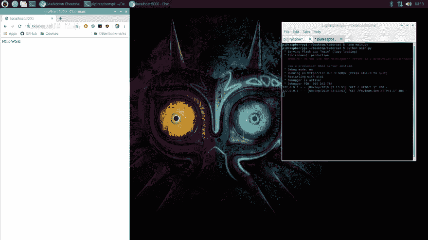
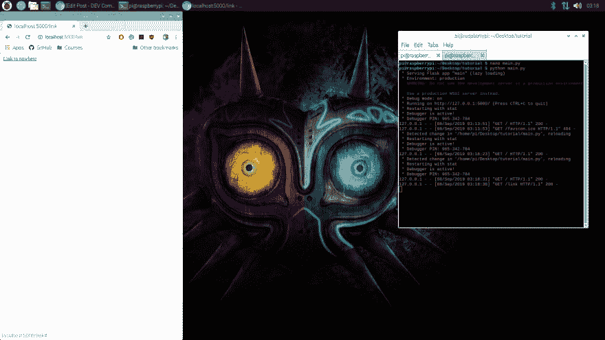

# 开始使用 Flask

> 原文:[https://dev.to/raymag/getting-started-with-flask-29j6](https://dev.to/raymag/getting-started-with-flask-29j6)

你好。今天我们来看看 Flask，它是一个轻量级的 web 应用程序框架，入门非常简单快捷。Flask 真的非常适合构建 API 和 Webapp 的后端。所以，首先，你需要在你的电脑上安装 Python 和 Pip。如果你还没有安装，你可以去官方网站看一看。

现在我们需要安装烧瓶。我们可以用 Pip:
`pip install Flask`安装

现在我们已经安装了 Flask，我们可以创建一个文件夹来保存我们的项目。在这个项目中，我们将创建一个名为`main.py`的文件。这个文件将是我们 flask 应用程序的心脏和主体。

为了构建 flask 应用程序，我们首先要导入我们的依赖项，然后实例化我们的 Flask 应用程序:

```
from flask import Flask, request, jsonify
import time

app = Flask(__name__) 
```

毕竟，我们将开始定义应用程序的路线。在 Flask 中，我们在函数上使用装饰符`@app.route()`并传递两个参数来定义路由:路径和允许的方法。在这个例子中，我们提供了`'/'` (root)作为路径，并且在这个路径中只允许 GET 方法。函数 init 将返回`H3ll0 W0rld`,这正是请求的响应。

```
@app.route('/', methods=['GET'])
def init():
    return 'H3ll0 W0rld' 
```

完成所有路线后，我们现在必须开始运行应用程序。可以用应用实例的`run()`方法来完成。

```
if __name__ == '__main__':
    app.run(debug=True) 
```

现在我们终于可以运行我们的 flask 应用程序并测试路线了。保存文件并运行脚本:`python main.py`。然后，我们可以打开浏览器并访问`localhost:5000`来查看输出。
T3T5】

我们还可以在处理请求时返回 HTML 代码和页面:

```
@app.route('/link', methods=['GET'])
def link():
    return '<a href="#">Link to nowhere</a>' 
```

[T2】](https://res.cloudinary.com/practicaldev/image/fetch/s--nYQyQq23--/c_limit%2Cf_auto%2Cfl_progressive%2Cq_auto%2Cw_880/https://thepracticaldev.s3.amazonaws.com/i/md8i1fqp9vazyo9y56hw.png)

只是今天而已。就像 Python 一样，Flask 很有表现力，很容易上手。你不需要学太多就可以开始在实际问题和解决方案中应用。您可以在 [flask docs](https://flask.palletsprojects.com/en/1.1.x/) 了解更多信息。谢谢你一直读到最后！