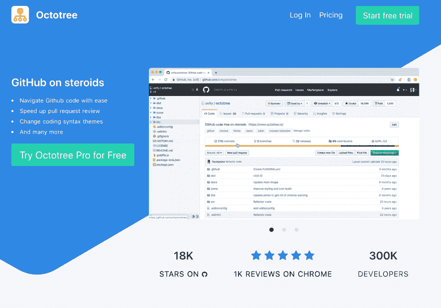
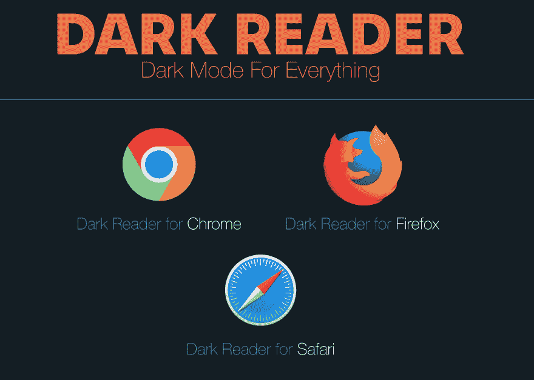
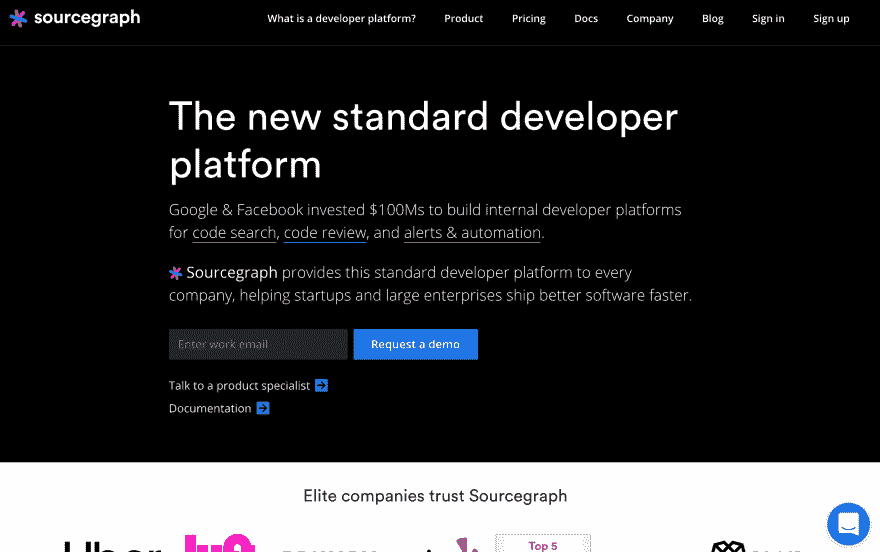
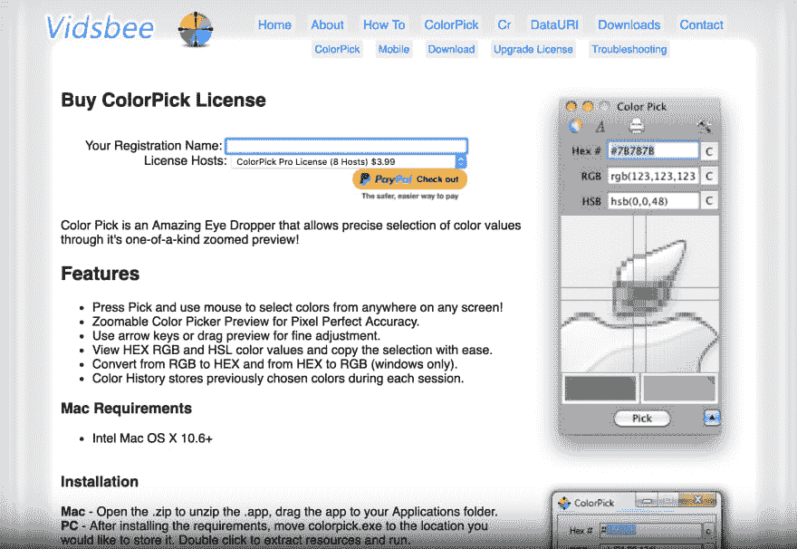
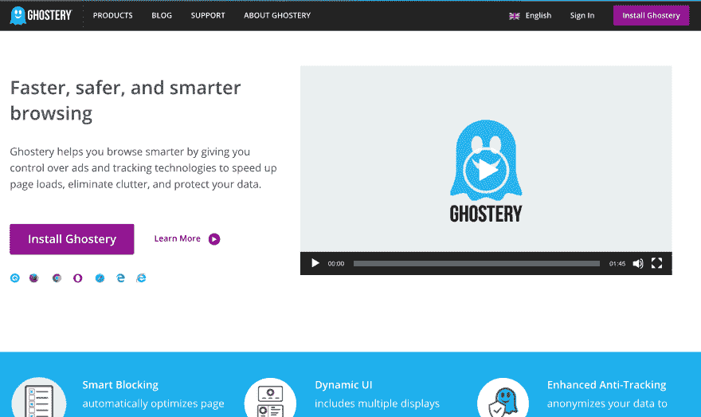
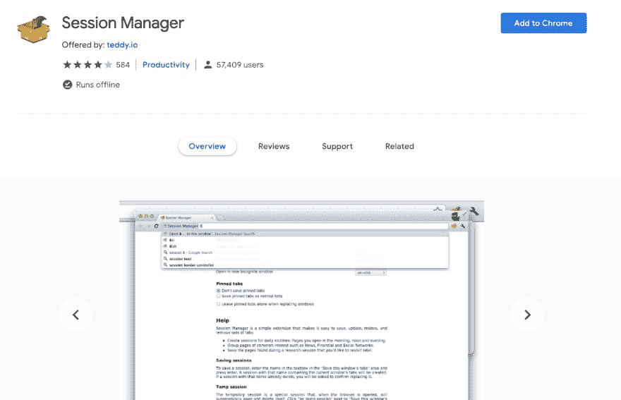
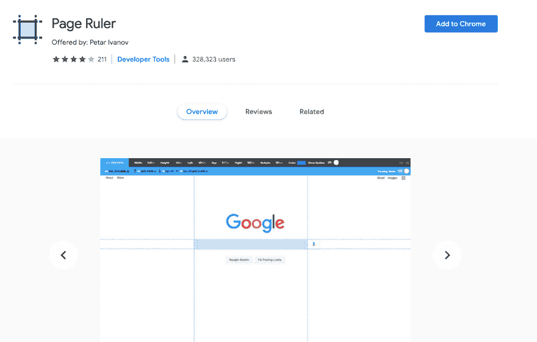
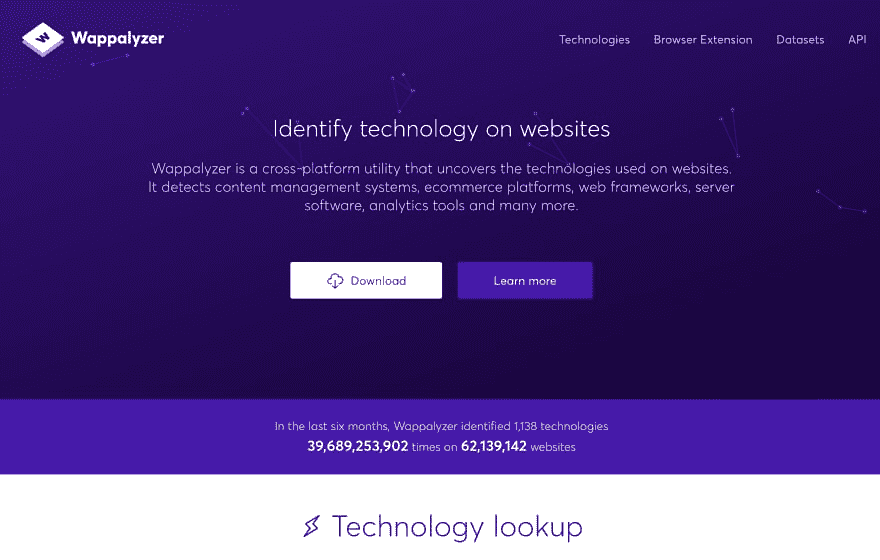

# 每个开发者都喜欢的十大 Chrome 扩展

> 原文：<https://dev.to/shijiezhou/top-10-chrome-extensions-every-developer-likes-3ehk>

# 1。八叉树

Octotree Pro 加载了一些功能，可以让您在 GitHub 上的工作效率更上一层楼！成千上万的开发者每天都在使用 Octotree Pro 来提高他们的工作效率。

只需点击一个按钮，即可随时在线取消。但是你可能永远不会这么做，因为我们的取消率不到 1%。

我们推荐团队计划，每位员工每月仅需 2 美元。您的公司可以邀请任何人加入他们的订阅。

[https://www.octotree.io/](https://www.octotree.io/)

# 2。黑暗读者

每个网站的黑暗模式。照顾好你的眼睛，晚上和日常浏览使用深色主题。
这款护眼扩展支持在夜间模式下为动态网站创建深色主题。深色阅读器反转亮色，使其对比度更高，便于夜间阅读。

你可以调整亮度，对比度，棕褐色过滤器，黑暗模式，字体设置和忽略列表。

[https://darkreader.org/](https://darkreader.org/)

# 3。源图

Sourcegraph 向每家公司提供这种标准的开发者平台，帮助初创公司和大型企业更快地发布更好的软件。

[https://sourcegraph.com](https://sourcegraph.com)

# 4。Web 开发人员

Chrome 的 web developer extension 增加了一个小工具栏，提供了不同的工具。这个 Chrome 开发者扩展的最初概念来自 PNH 开发者工具栏。chrome extension web developers 有很多方便的工具，开发者可以在日常工作中使用它们——对于设计师和程序员都是如此。它允许你做比标准的 Chrome 检查器更多的事情，比如只需点击就可以轻松地给元素添加轮廓，显示标尺，找到页面上所有损坏的图像，等等。

[https://chrispederick.com/](https://chrispederick.com/)

# 5。调色滴管

一个滴管和颜色选择器工具，允许您从网页中选择颜色值。如果你觉得有必要提醒开发者一个错误，使用反馈论坛而不是写评论。

如果您在准确性方面有问题，请使用箭头键，并在鼠标移动到大致位置时输入以选择颜色。

请注意，颜色是从页面的快照中选取的，只有在滚动时才会更新。要拍摄新的快照，请按 r 或使用“重新拍摄”按钮。有时，如果你只是改变标签，你可能会看到一个快照错误-这是一个故意的安全功能。按 R 或滚动来纠正这种情况，或退出颜色选择并重试。

[http://vidsbee.com/](http://vidsbee.com/)

# 6。幽灵

Ghostery 是一个很棒的 Chrome 扩展，它可以检测网站上的跟踪器、像素和任何其他嵌入片段。您可以立即看到哪些插件和追踪器安装在您访问过的网页上。更进一步，Ghostery 让你保护你的隐私。使用这个 Chrome 扩展不需要注册。

[https://www.ghostery.com/](https://www.ghostery.com/)

# 7。会话管理器

简单而强大的标签集管理。快速方便地保存，更新，删除和恢复标签集！会话管理器是一个简单而强大的扩展，可以快速方便地保存、更新、删除和恢复标签集。

[https://chrome . Google . com/Webster/detail/session-manager/mghenlmjcpencongkdpagbcbdpc？hl=en](https://chrome.google.com/webstore/detail/session-manager/mghenlmbmjcpehccoangkdpagbcbkdpc?hl=en)

# 8。JSONView

您可以在选项页面中配置 JSON 解析方法:

*   默认方法(从显示的页面中提取 JSON 内容)更快，但是可能(在极少数情况下)改变或无法解析 JSON 内容。
*   safe 方法需要额外的 XMLHttpRequest 请求(JSON 内容是从 HTTP 响应中提取的),但它是 100%安全的。

[https://chrome . Google . com/web store/detail/JSON view/chklaanheffbnpoihckbnefhakgolnmc？hl=en](https://chrome.google.com/webstore/detail/jsonview/chklaanhfefbnpoihckbnefhakgolnmc?hl=en)

# 9。页面标尺

画一个标尺来获得像素尺寸和位置，并测量任何网页上的元素。
页面标尺让你在任何页面上绘制一个标尺，并显示它的宽度、高度和位置。

[https://chrome . Google . com/Webster/detail/page-ruler/emliamioobfbgcfdchabfibonhkname？hl=en](https://chrome.google.com/webstore/detail/page-ruler/emliamioobfffbgcfdchabfibonehkme?hl=en)

# 10。瓦帕里斯

Wappalyzer 是一个跨平台的工具，它揭示了网站上使用的技术。它可以检测内容管理系统、电子商务平台、web 框架、服务器软件、分析工具等等。

[https://www.wappalyzer.com/](https://www.wappalyzer.com/)

