# 有史以来最好的免费引导用户界面套件

> 原文:[https://dev.to/bootstrap/ui-kits-4ik5](https://dev.to/bootstrap/ui-kits-4ik5)

关于创业和 SaaS 企业最佳免费 Bootstrap 4 UI 套件的博文。你设计的网站和应用程序的质量完全取决于你使用的工具的性质和质量。在一张纸上画出设计，然后回到基础是一个经典的选择。然而，为什么不使用那些能帮助你比平时更快完成工作的资源呢？这正是启动 UI 工具包发挥作用的地方！

免费的 Bootstrap 4 UI 工具包是一个全面的资源，它将使您能够正确地规划您的设计结构，而不必放弃您的原创想法。UI 套件主要由各种不同的图形文件组成，如复选框、按钮、进度条等 UI 组件。来设计一个令人印象深刻的用户界面。这些创业，商业和 SaaS 用户界面套件使设计师能够在体面的时间框架内创造非凡的视觉效果。

> 因此，启动 UI 工具包可以让你将精力集中在你最擅长的事情上，而不是浪费时间去找出正确实现组件的方法，这就是创建优秀的设计。

除此之外，**这些套件还可以通过多种方式帮助您增强设计工作流程**。此外，众所周知，这些工具包的两个最普遍的用途是移动/网站设计和原型制作。

因此，事不宜迟，让我们来看看你应该考虑使用的最好的免费 Bootstrap 4 UI 套件吧！

### [Ayro UI](https://ayroui.com/)

[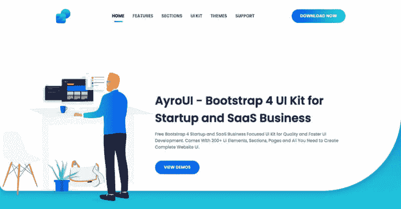](https://res.cloudinary.com/practicaldev/image/fetch/s--4S4deA71--/c_limit%2Cf_auto%2Cfl_progressive%2Cq_auto%2Cw_880/https://uideck.com/wp-content/uploads/2019/09/ayroui.jpg) 它的设计令人耳目一新&新潮，配有构建完整而健壮的网络用户界面所需的一切。每一个基本元素都有独特的变化，AyroUI 专门为创业，商业，SaaS，代理和相关的网络项目制作。

如果你正在为你的初创公司或 SaaS 商业网站寻找一个功能丰富、完整和高质量的 web UI 套件，Ayro UI 将是你的完美选择。

[免费下载 Ayro UI](https://ayroui.com/)

### [平面 UI 免费](http://designmodo.github.io/Flat-UI/)

平板 UI free 是一个优秀的启动 UI 工具包，它附带了几个复杂的基本组件，可以证明对设计师来说非常方便。这些包括输入、按钮、选择、按钮组、单选按钮、复选框等等。这个工具包带有大量的彩色和时尚的图标，您可以在一系列项目中使用。
下载[免费下载平面 UI](http://designmodo.github.io/Flat-UI/)

### [呼唤自举 5 UI 套件](https://uideck.com/templates/lindy-bootstrap-5-ui-kit/)

[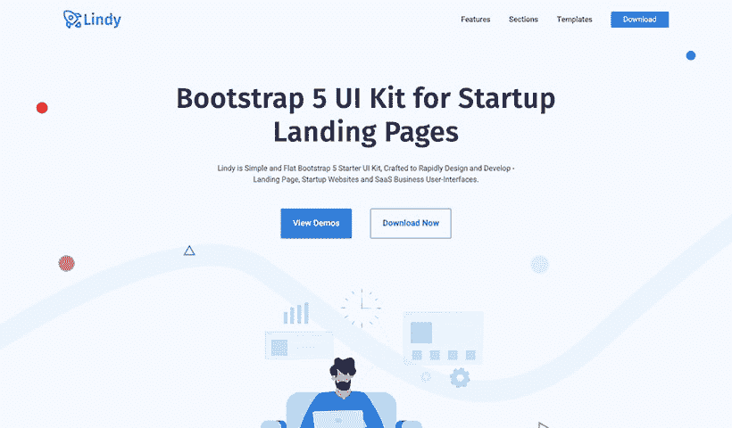](https://res.cloudinary.com/practicaldev/image/fetch/s--tcN8ES4s--/c_limit%2Cf_auto%2Cfl_progressive%2Cq_auto%2Cw_880/https://uideck.com/wp-content/uploads/edd/2020/12/lindy-bootstrap-5-ui-kit.jpg) 
【呼唤】是一款免费的高级 bootstrap 5 UI 套件，专为创业网站、登陆页面和 SaaS 商业网站用户界面打造。这个 UI 工具包是用新版本的 bootstrap 5 构建的。如果你正在寻找一个启动用户界面工具包，呼唤在这里给你。

**用 Bootstrap 5** 建造
呼唤用 Bootstrap 5 的强大版本建造。这个流行的前端框架的新版本响应迅速，拥有呼唤中包含的惊人特性。

100+ UI 元素
呼唤在 15+不同的页面上有 100+ UI 元素和部分。有了这些元素和页面，您可以根据需要创建自己的项目。

**专为创业公司设计**
呼唤是专为创业网站、登陆页面和 SaaS 商业网站用户界面设计的。如果你正在寻找一个启动用户界面工具包，呼唤是一个。

干净、简单、扁平的用户界面
呼唤为你的项目提供了干净、简单、扁平的用户界面组件，用你的创意美化它。

**5 个范例模板**
呼唤还为你即将开始的创业提供了 5 个现成的范例模板，只需一个复制粘贴选项。这对你和你的项目来说很容易。

**成吨的板块**
呼唤为几乎任何类型的项目提供 100 多个板块，毫无疑问，它将是最好的。

**易于定制**
呼唤易于定制，这一点你不用担心。此外，该套件具有基于块的编码结构，带有独立的 SASS 萨斯文件。

全面响应
呼唤的全面响应支持任何种类的浏览器或屏幕。

**免费的未来更新**
有了呼唤，你将终身获得更多选项的免费未来更新。

**设计源文件**
呼唤提供了一个 Figma 源文件，让开发者的生活变得轻松了许多。

免费和高级版本
呼唤提供免费和高级版本来帮助你的项目。
[下载呼唤 UI 套件](https://uideck.com/templates/lindy-bootstrap-5-ui-kit/)

### [用于自举的材料设计](https://mdbootstrap.com/)

[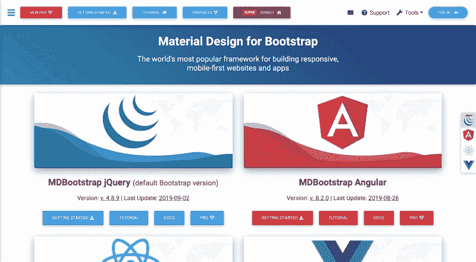](https://res.cloudinary.com/practicaldev/image/fetch/s--pxOqblyD--/c_limit%2Cf_auto%2Cfl_progressive%2Cq_auto%2Cw_880/https://uideck.com/wp-content/uploads/2019/09/mdb.jpg)
Bootstrap 4 工具包的材料设计是另一个绝佳的选择。使用最新技术构建的这个模板，以及 UI 工具包，使网站设计者和开发者制作一个令人惊叹的 web 应用程序或移动应用程序甚至网站变得轻而易举。
T5 下载自举素材设计

### [材料套件](https://www.creative-tim.com/product/material-kit)

[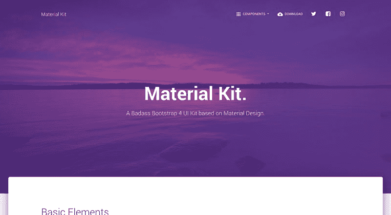](https://res.cloudinary.com/practicaldev/image/fetch/s--wlFIqruq--/c_limit%2Cf_auto%2Cfl_progressive%2Cq_auto%2Cw_880/https://uideck.com/wp-content/uploads/2019/09/material.jpg) 
你也可以去搭配 Material Kit，这是一个非常优秀的免费 Bootstrap 4 UI 套件。在这个工具包的帮助下，您可以在您的网站上创建一个清新的新设计。这个工具包受到了谷歌的材料设计的启发，所以你知道它会很好。它带有 2 个定制插件和 60 个手工制作的元素。
T5 下载素材套件

### [氦 UI 套件](https://uideck.com/templates/helium-ui-kit/)

[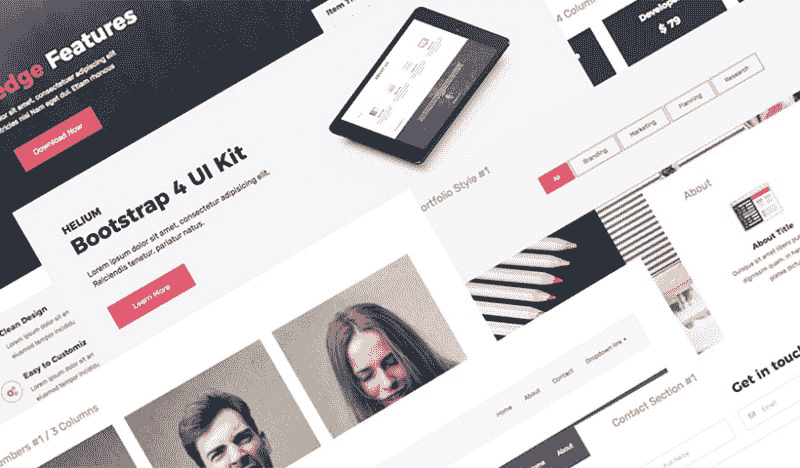](https://res.cloudinary.com/practicaldev/image/fetch/s--hyjJOAOB--/c_limit%2Cf_auto%2Cfl_progressive%2Cq_auto%2Cw_880/https://uideck.com/wp-content/uploads/2019/09/helium.jpg) 
你也可以选择氦 UI 套件，它附带了 100 多种现成的元素和组件。这个工具包是使用最新版本的 Bootstrap 4 以及其他前沿技术(如 CSS3、HTML5 和 SaaS)构建的。这是一个高度可定制和精心设计的 UI 工具包，让您的生活变得轻松。
T5 下载氦 UI 套件

### [电子商务 HTML 套件](https://ecommercehtml.com/)(高级)

[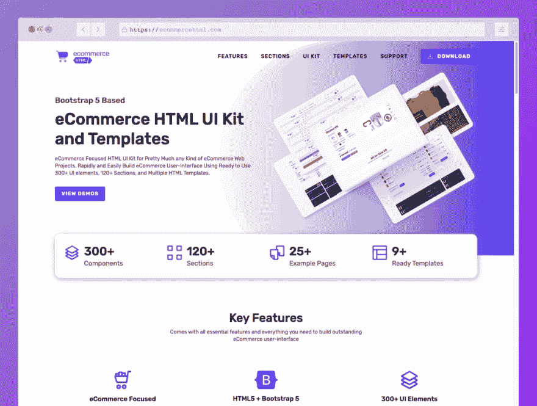](https://res.cloudinary.com/practicaldev/image/fetch/s--Eqsr3sDy--/c_limit%2Cf_auto%2Cfl_progressive%2Cq_auto%2Cw_880/https://cdn.dribbble.com/users/1618938/screenshots/14058976/media/00adfc3da7e91495f80bebf451510c9c.jpeg) 
电子商务 HTML 是专门为电子商务项目设计开发的 UI 套件。不幸的是，它的高级用户界面工具包带有令人惊叹的设计，300 多个用户界面元素，120 多个部分和 9 个电子商务模板示例。如果你正在做一个电子商务网站项目，你会觉得这个 UI 套件已经完成了 80%的工作。
T5】获取电子商务 UI 套件

### [商店网格-电子商务引导 UI 套件](https://graygrids.com/templates/shopgrids-bootstrap-ecommerce/)

[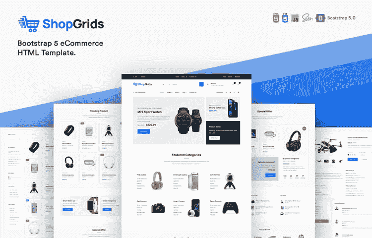](https://res.cloudinary.com/practicaldev/image/fetch/s--OX4SWmk4--/c_limit%2Cf_auto%2Cfl_progressive%2Cq_auto%2Cw_880/https://graygrids.com/wp-content/uploads/edd/shopgrids-ecommece.jpg) 
ShopGrids 是为您的企业设计和开发定制电子商务 web 解决方案的终极前端解决方案。无论你想要一个电子商务，时尚或电子产品商店，ShopGrids 适合任何类型的网上商店。它包括各种现成的模板，布局，页面和元素，使创建电子商务用户界面超级容易。
T5】获取商店网格

### [碎片](https://designrevision.com/downloads/shards/)

[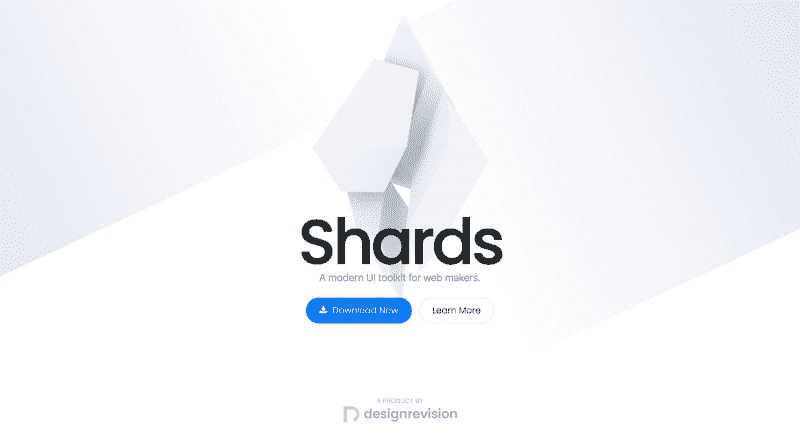](https://res.cloudinary.com/practicaldev/image/fetch/s--7qyHkAj1--/c_limit%2Cf_auto%2Cfl_progressive%2Cq_auto%2Cw_880/https://uideck.com/wp-content/uploads/2019/09/shards.jpg) 
Shards 是一个免费的现代 UI 工具包，可供网页制作者和设计者使用。它基于众所周知的 Bootstrap 4 框架。这个免费的 UI 套件是使用最好的技术构建的，并且考虑到了性能。除此之外，它非常轻便，反应灵敏。
T5 下载碎片 UI 套件

### [t1](#wrapkit-lite)[包裹一点点](https://www.wrappixel.com/templates/wrapkit-lite/)

[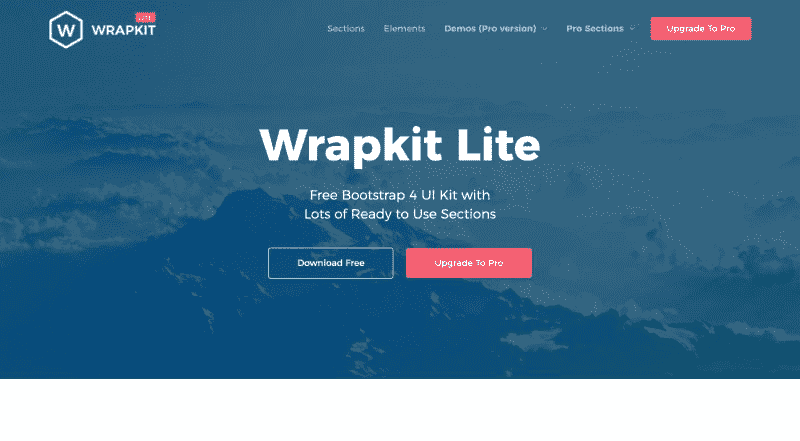T2】](https://res.cloudinary.com/practicaldev/image/fetch/s--cpqCpzAL--/c_limit%2Cf_auto%2Cfl_progressive%2Cq_auto%2Cw_880/https://uideck.com/wp-content/uploads/2019/09/wrap.jpg)

WrapKit Lite 是免费 UI 工具包的另一个很好的选择。这个工具包可以让你创建任何东西，从完整的网站和即将推出的网页到主页，登陆页面等等。此外，它是使用 Bootstrap 4 构建的，因此您拥有合适的技术支持。
[下载包包](https://www.wrappixel.com/templates/wrapkit-lite/)

### [佛罗拉设计积木](https://www.froala.com/design-blocks)

[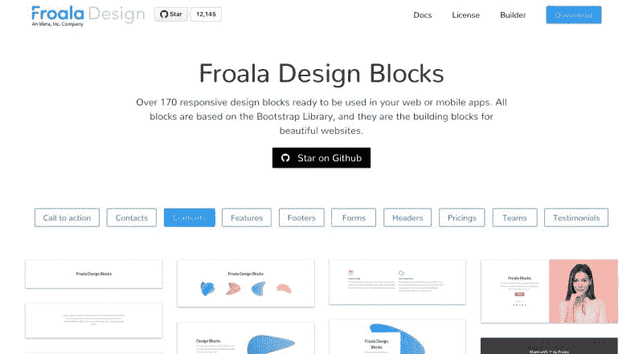](https://res.cloudinary.com/practicaldev/image/fetch/s--OUVRQDRA--/c_limit%2Cf_auto%2Cfl_progressive%2Cq_auto%2Cw_880/https://uideck.com/wp-content/uploads/2019/09/froala.jpg) 
您也可以考虑使用 Froala Design Blocks，它附带了 170 多个响应式设计块。您可以在手机或网络应用中轻松使用这些功能。所有这些模块都基于 Bootstrap 4 框架和 Bootstrap 库。因此，您可以使用这些构建模块来创建漂亮的网站和应用程序。
T5 下载 Froala 设计模块

### [Bootstrap 4 启动 UI 套件](https://medialoot.com/item/free-bootstrap-4-theme-startup-ui-kit/)

[T2】](https://res.cloudinary.com/practicaldev/image/fetch/s--z166HSFA--/c_limit%2Cf_auto%2Cfl_progressive%2Cq_auto%2Cw_880/https://uideck.com/wp-content/uploads/2019/09/startup.jpg)

Bootstrap 4 启动 UI 套件响应全面，旨在让您轻松构建干净的登录页面，或者成功启动自己的启动。它附带了总共 10 个类别的 50 个 UI 卡，您可以使用它们来创建独特的布局。
[下载 Bootstrap 4 启动 UI 套件](https://medialoot.com/item/free-bootstrap-4-theme-startup-ui-kit/)

### [t1](#pixel-lite)[像素一点点](https://graygrids.com/item/pixel-lite-free-bootstrap-4-ui-kit/)

[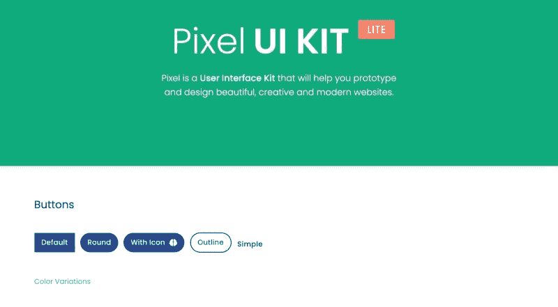](https://res.cloudinary.com/practicaldev/image/fetch/s--nnEOO03n--/c_limit%2Cf_auto%2Cfl_progressive%2Cq_auto%2Cw_880/https://uideck.com/wp-content/uploads/2019/09/pixel.jpg) 
Pixel Lite 可以称得上是一个制作精良的 UI 套件，它基于 Bootstrap 4 框架。它带有超过 100 个组件，三个示例页面以及三个插件。它还附带了所有相关的组件来帮助您建立一个令人印象深刻的网站或应用程序。
T5 下载 Pixel Lite

### [材质](https://uideck.com/templates/free-material-design-bootstrap-4-ui-kit-template/)

 
你可以选择材料，这是启动 UI 套件的另一个很好的选择。这个 UI 工具包最适合机构，企业，创业公司，公司以及投资组合网站。此外，template 以其创新和革命性的设计理念为项目带来了令人惊叹的感觉和外观。
T5 下载素材 UI 套件

### [流 UI 套件](https://htmlstream.com/templates/stream-ui-kit)

[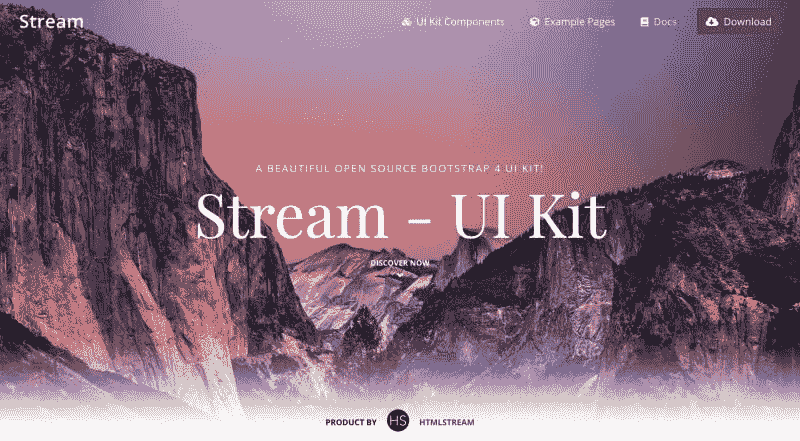](https://res.cloudinary.com/practicaldev/image/fetch/s--UHA16Z5g--/c_limit%2Cf_auto%2Cfl_progressive%2Cq_auto%2Cw_880/https://uideck.com/wp-content/uploads/2019/09/stream.jpg) 
接下来是 Stream UI 套件。这是一个基于 Bootstrap 4 框架的漂亮的开源 UI 工具包。它配备了五个令人惊叹的完整页面以及 20 多个可定制和可重用的 UI 块。此外，它是非常轻量级的，缩小后只有大约 17kb。您也可以使用该工具包的详细文档快速入门。
T5 下载流 UI 套件

### [主播](https://graygrids.com/item/anchor-free-bootstrap-4-saas-ui-kit/)

这是一个免费的 SaaS 商务用户界面套件，任何设计师都会为之自豪。它带有一系列现成的组件。它的一些令人惊叹的功能包括干净和文档记录良好的代码，完全响应以及引人注目的设计。
T5 下载主播 UI 套件

### [Bootstrap 4 创意 UI 套件](https://github.com/NowSquare/Bootstrap-4-UI-Kit)

[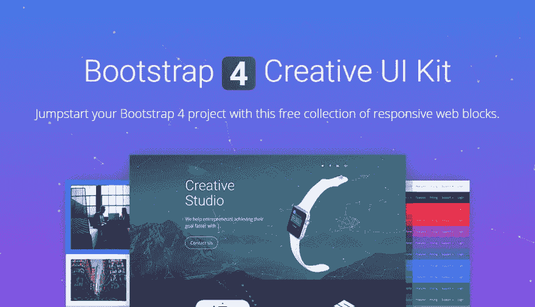](https://res.cloudinary.com/practicaldev/image/fetch/s--mLHxuOc9--/c_limit%2Cf_auto%2Cfl_progressive%2Cq_auto%2Cw_880/https://uideck.com/wp-content/uploads/2019/09/nowsquare.png) 
最后但绝对不是最不重要的是 Bootstrap 4 创意 UI 套件。这个工具包是非常用户友好的，并已建立在 GulpJS，SaaS 和鲍尔。除此之外，它非常容易定制，并且有无限的组合。使用该工具包，您可以立即创建响应迅速的网站和应用程序。
[下载 Bootstrap 4 Now Square 创意 UI 套件](https://github.com/NowSquare/Bootstrap-4-UI-Kit)

## 结论

这就对了。从长远来看，这是 13 个可以为你节省大量金钱和时间的启动 UI 工具包。那么，你打算用哪一个呢？