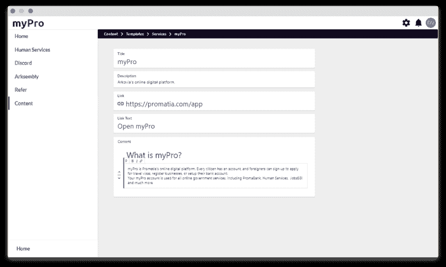

# 构建我们网站的内容管理系统

> 原文：<https://dev.to/promatiagov/building-our-website-s-cms-278n>

我们的国家，[https://promatia.com](https://promatia.com)(之前的[https://arkovia.com](https://arkovia.com))正在建设一个数字政府，我们的网站将使用 myPro 应用程序(公民门户)中的内容编辑器

内容编辑将仅限于政府工作人员。

我们正在使用:

*   NodeJS
*   VueJS
*   内容可编辑
*   MongoDB
*   GraphQL

